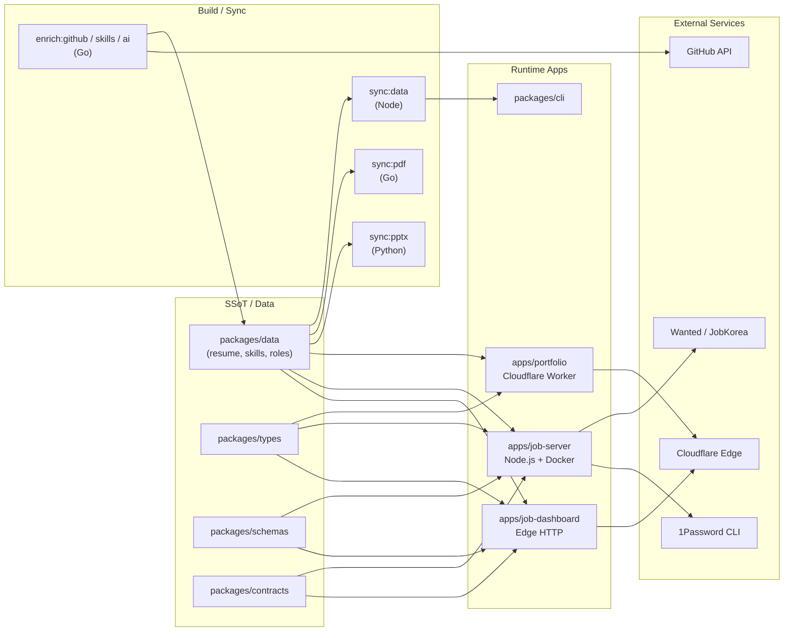

# 레쥬메 모노레포 / Resume Portfolio Monorepo

[](package.json)
[](Dockerfile)
[](docker-compose.yml)
[](wrangler.jsonc)
[](tsconfig.base.json)
[](LICENSE)

> Resume portfolio monorepo: Cloudflare Worker edge site, job automation (Wanted/JobKorea), SSoT data, self-hosted observability

이 저장소는 개인 포트폴리오 사이트, 채용 자동화 워커, 단일 진실 공급원(SSoT) 데이터 레이어, 그리고 운영 대시보드를 하나의 npm 워크스페이스 모노레포로 통합한 사설 저장소입니다.

This repository is a private npm workspaces monorepo that unifies a personal portfolio site, job automation tooling, a Single Source of Truth (SSoT) data layer, and an operations dashboard under a single, versioned codebase.

---

## 목차 / Table of Contents

- [개요 / Overview](#overview--개요)
- [주요 기능 / Features](#주요-기능--features)
- [아키텍처 / Architecture](#아키텍처--architecture)
- [저장소 구조 / Repository Structure](#저장소-구조--repository-structure)
- [빠른 시작 / Quick Start](#빠른-시작--quick-start)
- [설정 / Configuration](#설정--configuration)
- [명령어 레퍼런스 / Commands Reference](#명령어-레퍼런스--commands-reference)
- [로컬 개발 / Local Development](#로컬-개발--local-development)
- [테스트 / Testing](#테스트--testing)
- [배포 / Deployment](#배포--deployment)
- [기여 / Contribution](#기여--contribution)
- [라이선스 / License](#라이선스--license)

---

## Overview / 개요

`package.json`의 `description` 필드는 이 모노레포를 다음과 같이 정의합니다.

> Resume portfolio monorepo: Cloudflare Worker edge site, job automation (Wanted/JobKorea), SSoT data, self-hosted observability

핵심 가치 / Core values:

- **단일 진실 공급원 (SSoT)** — 이력, 프로필, 스킬, 직무 데이터는 `packages/data`에서 한 번 정의되고 포트폴리오, 이력서 PDF, PPTX, 운영 대시보드 등 모든 산출물로 자동 동기화됩니다.
- **엣지 우선 포트폴리오** — `apps/portfolio`는 Cloudflare Worker(`wrangler.jsonc`)로 글로벌 엣지에 배포되어 저지연으로 페이지를 제공합니다.
- **운영 가능한 잡 자동화** — `apps/job-server`는 Docker로 컨테이너화되는 Node.js 서버로, Wanted/JobKorea 같은 한국 채용 플랫폼용 자동화 워크플로를 실행합니다.
- **관측 가능성(Observability)** — 헬스 체크, 메트릭, 구조화 로그를 자체 호스팅하는 대시보드(`apps/job-dashboard`)로 제공합니다.
- **엄격한 타입 안정성** — `tsconfig.base.json`은 strict 모드를 사용하며 공유 타입(`packages/types`), 스키마(`packages/schemas`), 계약(`packages/contracts`)을 워크스페이스 전반에 강제합니다.

---

## 주요 기능 / Features

### 한국어

- **모노레포 통합 빌드**: `npm workspaces`로 10개의 워크스페이스(`apps/*`, `packages/*`)를 단일 의존성 그래프로 관리합니다.
- **Cloudflare Worker 포트폴리오**: `apps/portfolio`가 엣지에서 정적·동적 페이지를 모두 렌더링합니다.
- **잡 자동화 서버**: `apps/job-server`가 큐 컨슈머, 라우터, 미들웨어(CORS/CSRF/레이트 리미트)를 포함하는 Node.js HTTP 서버입니다.
- **운영 대시보드**: `apps/job-dashboard`가 인증, 관리자 라우트, 자동화 상태, 지원 트래킹, 헬스 체크를 제공합니다.
- **데이터 SSoT**: `packages/data`가 정규화된 이력/스킬/직무 데이터를 보유하고 모든 산출물의 입력으로 작동합니다.
- **다중 산출물 생성기**: 동기화 스크립트가 PDF(`sync:pdf`, Go), PPTX(`sync:pptx`, Python), 정적 JSON(`sync:data`, Node)을 한 번의 명령으로 갱신합니다.
- **보안 비공개 저장소**: 자격증명은 1Password CLI 통합 스크립트로 시드/복원되며 저장소에는 평문 비밀을 두지 않습니다.
- **품질 도구 체인**: ESLint(`eslint.config.cjs`), Jest(`jest.config.cjs`), Playwright(`playwright.config.js`), Redocly(`redocly.yaml`), lychee 링크 검사(`lychee.toml`)가 기본 통합되어 있습니다.
- **컨테이너 배포**: 멀티 스테이지 `Dockerfile`과 `docker-compose.yml`로 단일 명령(`docker compose up`)으로 로컬/원격 운영이 가능합니다.
- **지원용 자료 패키지**: `applications/` 하위에 회사별(쿠팡 파이낸테크 SRE, Cloudflare One SE, GitLab APAC InfraSec 등) 커버레터·이력서 PDF·HTML을 보관합니다.

### English

- **Monorepo unified build**: 10 workspaces (`apps/*`, `packages/*`) managed through `npm workspaces` with a single dependency graph.
- **Cloudflare Worker portfolio**: `apps/portfolio` renders both static and dynamic content at the edge.
- **Job automation server**: `apps/job-server` is a Dockerized Node.js HTTP server with queue consumer, router, and middleware (CORS, CSRF, rate limit).
- **Operations dashboard**: `apps/job-dashboard` provides authentication, admin routes, automation status, application tracking, and health checks.
- **SSoT data**: `packages/data` holds normalized resume, skill, and role data that feeds every generated artifact.
- **Multi-format generators**: Sync scripts regenerate PDFs (Go), PPTX (Python), and static JSON (Node) in a single pipeline.
- **Secure private repo**: Credentials are seeded/restored via 1Password CLI integration scripts; no plaintext secrets live in the repo.
- **Quality toolchain**: ESLint, Jest, Playwright, Redocly, and lychee are preconfigured.
- **Container deployment**: Multi-stage `Dockerfile` plus `docker-compose.yml` enable one-command local/remote ops.
- **Application material kits**: Company-specific cover letters, resume PDFs, and HTML live under `applications/`.

---

## 아키텍처 / Architecture

`packages/data`를 중심으로 데이터가 한 번 작성되고, 여러 빌드 스크립트와 런타임이 이를 소비합니다.



핵심 흐름 / Key flows:

- **읽기 경로(Read path)**: `packages/data` → `apps/portfolio` (엣지 SSR) → 최종 방문자.
- **자동화 경로(Automation path)**: `packages/data` → `apps/job-server` → Wanted/JobKorea 어댑터 → 큐 컨슈머(`apps/job-server/src/queue-consumer.js`) → `apps/job-dashboard`에서 관측.
- **동기화 경로(Sync path)**: `packages/data` → `sync:data` (JSON), `sync:pdf` (Go), `sync:pptx` (Python) → `applications/` 및 `ta/` 산출물.

---

## 저장소 구조 / Repository Structure

실제 최상위 디렉터리만 반영합니다. (Subdirectories are truncated to what is visible in the source tree.)

```
.
├── AGENTS.md
├── CHANGELOG.md
├── CONTRIBUTING.md
├── Dockerfile
├── LICENSE
├── OWNERS
├── ProfileView.jpg
├── README.md
├── docker-compose.yml
├── eslint.config.cjs
├── jest.config.cjs
├── lychee.toml
├── package-lock.json
├── package.json
├── playwright.config.js
├── redocly.yaml
├── tsconfig.base.json
├── tsconfig.json
├── wrangler.jsonc
├── ta/                                  # PPTX 빌드/검증 스크립트 (Python)
│   ├── improve_visual.py
│   ├── inspect.py
│   ├── verify.py
│   ├── lee_jaecheol_ta*.pptx
│   ├── ta.pptx
│   └── output/                          # 생성된 PPTX 산출물
├── applications/                        # 회사별 지원 패키지 (PDF/HTML/커버레터)
│   ├── DESIGN.md
│   ├── airpremia-security-2026/
│   ├── infrastructure-architecture-2026/
│   ├── coupang-fintech-sre-2026/
│   ├── cloudflare-one-se-2026/
│   ├── gitlab-apac-security-2026/
│   └── security-ir-2026/
└── apps/
    └── job-dashboard/                   # 운영 대시보드 (Worker + 큐 컨슈머)
        ├── AGENTS.md
        ├── API_REFERENCE.md
        ├── DEPLOYMENT_GUIDE.md
        ├── DEVELOPMENT_GUIDE.md
        ├── DIAGRAMS.md
        ├── OWNERS
        ├── README.md
        ├── SECRETS.md
        ├── migrate-json-to-d1.cjs
        ├── migration-data.sql
        ├── schema.sql
        ├── package.json
        ├── tsconfig.json
        ├── migrations/
        │   ├── 0002_add_approval_metadata.sql
        │   └── 0003_add_auto_apply_application_metadata.sql
        └── src/
            ├── index.js
            ├── queue-consumer.js
            ├── router.js
            ├── middleware/              # cors, csrf, rate-limit
            └── routes/                  # admin, applications, auth, automation, health
```

워크스페이스 멤버(`package.json#workspaces` 기준):

- `apps/portfolio` — Cloudflare Worker 포트폴리오 (메인 엔트리: `worker.js`)
- `apps/job-server` — 잡 자동화 Node.js 서버 (Docker 이미지 대상)
- `apps/job-dashboard` — 운영 대시보드 Worker
- `packages/cli` — 공유 CLI 진입점
- `packages/data` — SSoT 데이터
- `packages/shared` — 공유 유틸리티
- `packages/types` — 공유 타입 정의
- `packages/schemas` — 검증 스키마
- `packages/contracts` — API/DTO 계약
- `packages/env` — 환경 변수 검증

---

## 빠른 시작 / Quick Start

### 사전 요구 사항 / Prerequisites

- Node.js **22.x** (`Dockerfile` 기준)
- npm **10.x** 이상 (workspaces 지원)
- Docker & Docker Compose (컨테이너 실행 시)
- Python 3.x (`sync:pptx`, `ta/*.py` 사용 시)
- Go 1.22+ (`sync:pdf`, enrichment 스크립트 사용 시)
- 1Password CLI (`op` 명령, 자격증명 시드/복원 시)

### 설치 / Install

```bash
# 1) 워크스페이스 의존성 설치
npm ci

# 2) (선택) 1Password 자격증명 시드
npm run op:seed:resume
npm run op:seed:sessions
```

### 로컬 실행 / Run locally

```bash
# (a) Docker로 잡 서버 + 대시보드 실행
docker compose up --build

# (b) Cloudflare Worker 포트폴리오를 로컬에서 미리보기
cd apps/portfolio
npx wrangler dev

# (c) 잡 대시보드 로컬 개발
cd apps/job-dashboard
npm run dev
```

### 데이터 동기화 / Sync artifacts

```bash
# JSON 데이터 → PDF → PPTX를 한 번에
npm run sync:all

# 외부 enrichment 파이프라인
npm run enrich:all
```

---

## 설정 / Configuration

### 환경 변수

루트 `.env` 파일을 사용합니다 (`docker-compose.yml`의 `env_file`). 시크릿은 절대 커밋하지 마세요.

| 변수 / Variable          | 용도 / Purpose                       | 필수 / Required |
| ------------------------ | ------------------------------------ | --------------- |
| `NODE_ENV`               | `production` / `development`         | 권장 / Recommended |
| `PORT`                   | HTTP 리스닝 포트 (기본 3000)         | 아니오 / No     |
| `OP_SERVICE_ACCOUNT_TOKEN` | 1Password 서비스 계정 토큰          | 예 (운영) / Yes (prod) |
| `WANTED_SESSION_*`       | Wanted 자동화 세션 자격증명           | 자동화 시 / For automation |
| `JOBKOREA_SESSION_*`     | JobKorea 자동화 세션 자격증명         | 자동화 시 / For automation |
| `CF_API_TOKEN`           | Cloudflare API 토큰 (배포 시)        | 배포 시 / For deploy |
| `D1_BINDING`             | Cloudflare D1 바인딩 (대시보드)      | 대시보드 운영 시 / For dashboard |

> 자세한 시크릿 목록과 교체 절차는 [`apps/job-dashboard/SECRETS.md`](apps/job-dashboard/SECRETS.md)를 참고하세요.

### TypeScript / Lint 설정

- `tsconfig.base.json` — strict 모드 베이스.
- `eslint.config.cjs` — Flat config 기반 린트 규칙.
- `jest.config.cjs` — Node 및 Worker 테스트.
- `playwright.config.js` — E2E 테스트.
- `redocly.yaml` — OpenAPI 레퍼런스 검증.
- `lychee.toml` — 저장소 내 링크 검사.

---

## 명령어 레퍼런스 / Commands Reference

루트 `package.json` 기준 주요 스크립트:

| 스크립트 / Script             | 설명 / Description                                                |
| ----------------------------- | ----------------------------------------------------------------- |
| `npm run strip-exif`          | 포트폴리오 이미지에서 EXIF 메타데이터 제거 (exiftool 사용).       |
| `npm run sync:data`           | SSoT 데이터 → 정적 JSON 동기화 (Node).                            |
| `npm run sync:pdf`            | 이력서 PDF 생성 (Go).                                             |
| `npm run sync:pptx`           | 회사 프레젠테이션 PPTX 생성 (Python).                             |
| `npm run sync:all`            | 위 세 단계를 순차 실행.                                           |
| `npm run op:run`              | 1Password 래퍼 실행 (Go).                                         |
| `npm run op:native:run`       | 1Password 네이티브 호출 래퍼.                                     |
| `npm run op:seed:resume`      | 이력서용 1Password 항목 시드.                                      |
| `npm run op:seed:sessions`    | 자동화 세션용 1Password 항목 시드.                                |
| `npm run op:restore:sessions` | 세션 자격증명 복원.                                               |
| `npm run sync:proposals`      | 잡 제안 검토 CLI + 적용 파이프라인.                               |
| `npm run enrich:github`       | GitHub 활동 데이터 enrichment (Go).                               |
| `npm run enrich:skills`       | 스킬 enrichment.                                                  |
| `npm run enrich:ai`           | AI 기반 enrichment.                                                |
| `npm run enrich:all`          | 위 세 단계 순차 실행.                                             |
| `npm run automate:ssot`       | SSoT 동기화 + 빌드 + 타입체크 + Node 테스트.                      |
| `npm run automate:full`       | 전체 동기화 + 린트 + 타입체크 + 테스트 (스크립트가 잘린 경우 상세 내용은 `package.json` 참조). |

> 그 외 워크스페이스 단위 스크립트(예: `apps/portfolio`, `apps/job-server`, `packages/*`)는 각 패키지의 `package.json`에서 확인하세요.

---

## 로컬 개발 / Local Development

### 워크플로 / Workflow

1. **데이터 변경**: `packages/data` 내 YAML/JSON/TypeScript 데이터 수정.
2. **동기화**: `npm run sync:data`로 산출 JSON을 생성.
3. **타입·린트**: `npm run typecheck`, `npm run lint` (워크스페이스별 `package.json` 참고).
4. **단위 테스트**: `npm test` (Jest).
5. **E2E 테스트**: `npm run test:e2e` (Playwright).
6. **로컬 미리보기**: 각 앱 디렉터리에서 `npm run dev` 또는 `wrangler dev`.

### 워크스페이스 간 의존성

`@resume/*` 스코프 패키지(`shared`, `schemas`, `types`, `data`, `env`, `contracts`, `cli`)를 사용할 때는 항상 워크스페이스 심볼릭 링크를 통해 의존성을 추가합니다.

```bash
npm install @resume/data --workspace=apps/job-server
```

### 환경 격리

`packages/env`가 환경 변수 검증을 담당합니다. 새 변수를 도입할 때 해당 워크스페이스의 스키마를 함께 업데이트하세요.

---

## 테스트 / Testing

- **단위 테스트**: Jest (`jest.config.cjs`). 일부 모듈은 인-파일 테스트(`*.test.js`)를 포함합니다 (예: `apps/job-dashboard/src/middleware/rate-limit.test.js`).
- **E2E 테스트**: Playwright (`playwright.config.js`). 브라우저 자동화는 포트폴리오 사이트의 시각 회귀 및 사용자 흐름 검증을 다룹니다.
- **링크 검사**: `lychee.toml` 기반의 정기 링크 무결성 검사.
- **API 레퍼런스**: Redocly (`redocly.yaml`)로 OpenAPI 명세 린트.
- **데이터 검증**: `packages/schemas`(Zod 등) — 자동화 입력의 런타임 검증을 담당합니다.

```bash
npm test                 # Jest
npm run test:e2e         # Playwright
npx lychee --config lychee.toml './**/*.md'
npx redocly lint
```

---

## 배포 / Deployment

### Cloudflare Worker (포트폴리오/대시보드)

```bash
cd apps/portfolio
npx wrangler deploy

cd apps/job-dashboard
npx wrangler deploy
```

설정은 `wrangler.jsonc`에서 관리하며, `D1`, KV, R2 등 바인딩은 환경별로 분리합니다.

### Docker (잡 서버)

```bash
docker compose up --build -d
docker compose logs -f mcp-server
```

- 멀티 스테이지 빌드: `deps` 스테이지에서 `npm ci --omit=dev --ignore-scripts`, `runtime` 스테이지에서 프로덕션 노드 모듈 + `apps/job-server` 소스만 복사.
- 헬스 체크: `/health` 엔드포인트 (`HEALTHCHECK` 명령).
- 영속 데이터: `job_automation_data` 볼륨 (`/app/apps/job-server/.data`).

### 회사별 지원 자료

`applications/<company>-<role>-<year>/` 디렉터리에는 다음이 포함됩니다.

- `cover_letter.md` — 회사·직무 맞춤 커버레터.
- `Jaecheol_Lee_Resume_<Company>_<Role>.pdf` — 최종 PDF 이력서.
- `resume-<company>-<role>.html` — 웹 미리보기.
- (선택) `application-guide.md`, `interview-qa-10.md`, `preview.png` 등 보조 자료.

---

## 기여 / Contribution

이 저장소는 사설이며 외부 풀 리퀘스트는 받지 않습니다. 내부 기여 절차는 [`CONTRIBUTING.md`](CONTRIBUTING.md)와 [`AGENTS.md`](AGENTS.md)를 참고하세요.

기여 전 체크리스트:

1. `npm run sync:data`로 SSoT를 최신화했는지 확인.
2. `npm run typecheck && npm run lint && npm test` 통과.
3. 변경 영향이 있는 워크스페이스의 `CHANGELOG.md` 항목 추가.
4. 새 환경 변수는 `packages/env` 스키마와 `SECRETS.md`에 동시 등록.
5. 코드는 사내 OWNERS 파일의 리뷰어 승인을 받아 머지.

---

## 라이선스 / License

이 저장소는 사설이며 [`LICENSE`](LICENSE) 파일에 명시된 조건 하에서만 사용할 수 있습니다. 무단 복제·배포를 금합니다.

This repository is private. See [`LICENSE`](LICENSE) for the terms under which the contents may be used. Unauthorized copying or redistribution is prohibited.

---

### 추가 문서 / Further Reading

- [`apps/job-dashboard/README.md`](apps/job-dashboard/README.md) — 대시보드 운영 가이드.
- [`apps/job-dashboard/API_REFERENCE.md`](apps/job-dashboard/API_REFERENCE.md) — 대시보드 API 레퍼런스.
- [`apps/job-dashboard/DEPLOYMENT_GUIDE.md`](apps/job-dashboard/DEPLOYMENT_GUIDE.md) — 배포 절차.
- [`apps/job-dashboard/DEVELOPMENT_GUIDE.md`](apps/job-dashboard/DEVELOPMENT_GUIDE.md) — 대시보드 개발 환경.
- [`apps/job-dashboard/SECRETS.md`](apps/job-dashboard/SECRETS.md) — 시크릿 관리 정책.
- [`apps/job-dashboard/DIAGRAMS.md`](apps/job-dashboard/DIAGRAMS.md) — 대시보드 시퀀스/플로우 다이어그램.
- [`applications/DESIGN.md`](applications/DESIGN.md) — 지원 패키지 디자인 가이드.
- [`ta/AGENTS.md`](ta/AGENTS.md) — PPTX 생성 에이전트 가이드.
- [`CHANGELOG.md`](CHANGELOG.md) — 버전별 변경 이력.