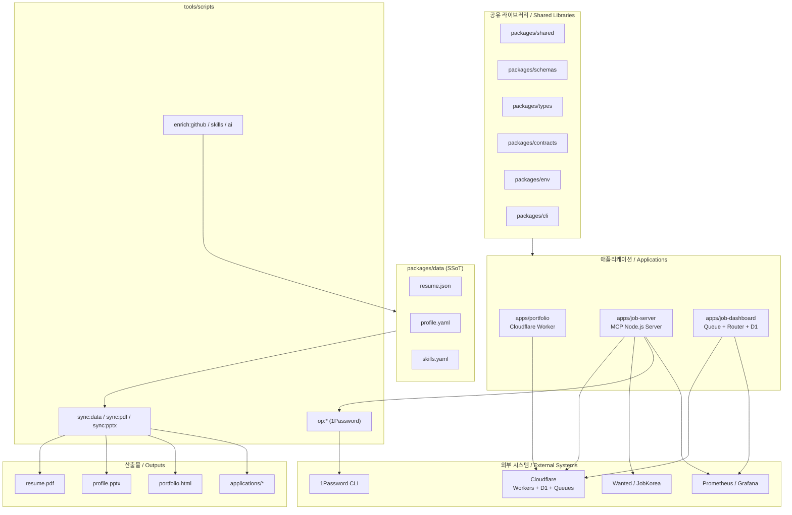

# 레쥬메 모노레포 / Resume Portfolio Monorepo

[](package.json)
[](Dockerfile)
[](docker-compose.yml)
[](wrangler.jsonc)
[](tsconfig.base.json)
[](LICENSE)

이 저장소는 개인 포트폴리오 사이트, 채용 자동화 워커, 단일 진실 공급원(SSoT) 데이터 레이어, 그리고 운영 대시보드를 하나의 npm 워크스페이스 모노레포로 통합한 사설 저장소입니다.

This repository is a private npm workspaces monorepo that unifies a personal portfolio site, job automation tooling, a Single Source of Truth (SSoT) data layer, and an operations dashboard under a single, versioned codebase.

---

## 목차 / Table of Contents

- [개요 / Overview](#overview--개요)
- [주요 기능 / Features](#주요-기능--features)
- [아키텍처 / Architecture](#아키텍처--architecture)
- [저장소 구조 / Repository Structure](#저장소-구조--repository-structure)
- [빠른 시작 / Quick Start](#빠른-시작--quick-start)
- [설정 / Configuration](#설정--configuration)
- [명령어 레퍼런스 / Commands Reference](#명령어-레퍼런스--commands-reference)
- [로컬 개발 / Local Development](#로컬-개발--local-development)
- [테스트 / Testing](#테스트--testing)
- [배포 / Deployment](#배포--deployment)
- [기여 / Contribution](#contribution)
- [라이선스 / License](#라이선스--license)

---

## Overview / 개요

`package.json`의 `description` 필드는 이 모노레포를 다음과 같이 정의합니다.

> Resume portfolio monorepo: Cloudflare Worker edge site, job automation (Wanted/JobKorea), SSoT data, self-hosted observability

핵심 가치 / Core values:

- **단일 진실 공급원 (SSoT)** — 이력, 프로필, 스킬, 직무 데이터는 `packages/data`에서 한 번 정의되고 포트폴리오, 이력서, PDF, PPTX, 대시보드 등 모든 산출물로 자동 동기화됩니다.
- **엣지 우선 포트폴리오** — `apps/portfolio`는 Cloudflare Worker(`wrangler.jsonc`)로 글로벌 엣지에 배포되어 저지연으로 페이지를 제공합니다.
- **운영 가능한 잡 자동화** — `apps/job-server`는 MCP(Model Context Protocol) 호환 Node.js 서버로, 채용 플랫폼(원티드/잡코리아 등)과의 통합을 표준화된 도구 인터페이스로 제공합니다.
- **자가 호스팅 관측 가능성** — 자체 호스팅 Prometheus/Grafana 호환 메트릭과 헬스 체크 엔드포인트로 운영 상태를 외부에서 조회할 수 있습니다.
- **타입 안전성 우선** — `packages/types`, `packages/schemas`, `packages/contracts`로 도메인 경계를 엄격하게 분리하고 `tsconfig.base.json`의 strict 모드로 컴파일합니다.

Who uses it:

- 본 모노레포의 **소유자**(이력서/포트폴리오 작성자) — 자신의 디지털 presence를 단일 위치에서 관리합니다.
- **채용 자동화 에이전트** — `apps/job-dashboard`의 라우터와 큐 컨슈머는 사람 개입 없이 공고 탐색, 지원, 추적을 수행합니다.
- **모집 담당자/인터뷰어** — `apps/portfolio`가 제공하는 정적 페이지와 `applications/` 폴더의 회사별 맞춤 이력서를 열람합니다.

---

## 주요 기능 / Features

| 영역 / Area | 설명 / Description |
|---|---|
| Edge Portfolio | Cloudflare Worker 기반 글로벌 엣지 배포, 자산은 `wrangler.jsonc`로 선언 |
| Job Server | MCP 호환 도구 서버, Wanted/JobKorea 통합, 큐 기반 비동기 작업 처리 |
| Job Dashboard | 관리자/지원/인증/자동화/헬스 라우트를 가진 운영 콘솔, Cloudflare D1 백엔드 |
| SSoT Data | `packages/data`에서 정의한 JSON/YAML 데이터를 모든 산출물로 동기화 |
| PDF / PPTX 빌더 | Go 기반 PDF 생성기와 Python 기반 PPTX 생성기로 회사별 산출물 자동 빌드 |
| 1Password 통합 | 자격 증명/세션 파일을 1Password CLI로 안전하게 시드/복원 |
| Enrichment 파이프라인 | GitHub 프로필, 기술 스킬, AI 메타데이터를 주기적으로 보강 |
| 관측 가능성 | 헬스 엔드포인트(`/health`), 레이트 리미트, CORS/CSRF 미들웨어, 구조화 로깅 |
| 다국어 산출물 | 이력서/커버레터/포트폴리오를 한국어와 영어로 동시 생성 |
| 회사별 맞춤 지원서 | `applications/` 하위에 회사별 커버레터·이력서·인터뷰 Q&A 보관 |

---

## 아키텍처 / Architecture



핵심 데이터 흐름 / Key data flow:

1. `packages/data`의 SSoT 파일을 `tools/scripts`로 읽어 JSON/YAML 정규화
2. Go PDF 생성기 → `applications/<회사>/Jaecheol_Lee_Resume_*.pdf`
3. Python PPTX 생성기 → `ta/output/*.pptx` (TA 자료)
4. `sync:data` 결과를 `apps/portfolio`가 임포트하여 엣지 정적 페이지로 빌드
5. `apps/job-server`는 MCP 도구로 잡 자동화 작업을 큐에 적재하고, `apps/job-dashboard`가 이를 소비하여 상태를 D1에 영속화

---

## 저장소 구조 / Repository Structure

```
.
├── AGENTS.md                # 에이전트/협업 운영 지침
├── CHANGELOG.md             # 릴리스 노트
├── CONTRIBUTING.md          # 기여 가이드
├── Dockerfile               # apps/job-server 멀티스테이지 빌드
├── LICENSE                  # 사설 라이선스
├── OWNERS                   # 코드 오너십
├── ProfileView.jpg          # 포트폴리오용 프로필 이미지
├── README.md                # 본 문서
├── docker-compose.yml       # 로컬 MCP 서버 스택
├── eslint.config.cjs        # ESLint 9 flat config
├── jest.config.cjs          # Jest 설정
├── lychee.toml              # 링크 검사기 설정
├── package.json             # 루트 워크스페이스 매니페스트
├── package-lock.json        # npm 잠금 파일
├── playwright.config.js     # E2E 테스트 설정
├── redocly.yaml             # OpenAPI 레퍼런스 린터
├── tsconfig.base.json       # TypeScript strict 베이스
├── tsconfig.json            # 루트 TS 컴파일러 옵션
├── wrangler.jsonc           # Cloudflare Worker 배포 설정
├── ta/                      # TA(Teaching Assistant) 자료 + Python 빌더
│   ├── *.pptx               # 입력 프레젠테이션
│   ├── inspect.py           # PPTX 메타데이터 점검
│   ├── improve_visual.py    # 비주얼 개선 스크립트
│   ├── verify.py            # 산출물 검증
│   └── output/              # 생성된 PPTX + 검증 리포트
├── applications/            # 회사별 지원 패키지
│   ├── DESIGN.md            # 지원서 디자인 가이드
│   ├── airpremia-security-2026/
│   ├── infrastructure-architecture-2026/
│   ├── coupang-fintech-sre-2026/
│   ├── cloudflare-one-se-2026/
│   ├── gitlab-apac-security-2026/
│   └── security-ir-2026/
└── apps/
  └── job-dashboard/         # 운영 대시보드 워커
      ├── API_REFERENCE.md
      ├── DEPLOYMENT_GUIDE.md
      ├── DEVELOPMENT_GUIDE.md
      ├── DIAGRAMS.md
      ├── SECRETS.md
      ├── migrate-json-to-d1.cjs
      ├── schema.sql
      ├── migrations/        # D1 스키마 마이그레이션
      └── src/
          ├── index.js
          ├── queue-consumer.js
          ├── router.js
          ├── middleware/    # CORS / CSRF / Rate-limit
          └── routes/        # admin / applications / auth / automation / health
```

루트 `package.json`은 다음 워크스페이스를 선언합니다 (이 중 일부는 위 트리에 표시되지 않을 수 있음):
`apps/portfolio`, `apps/job-server`, `apps/job-dashboard`, `packages/cli`, `packages/data`, `packages/shared`, `packages/types`, `packages/schemas`, `packages/contracts`, `packages/env`.

---

## 빠른 시작 / Quick Start

### 사전 요구 사항 / Prerequisites

- Node.js 22 (Dockerfile의 베이스 이미지와 일치)
- npm 10 이상 (워크스페이스 지원)
- Go 1.22+ (PDF 생성기 / 1Password 도구)
- Python 3.11+ (PPTX 생성기, `ta/` 작업용)
- Wrangler CLI (`apps/portfolio` 배포용)
- Docker + Docker Compose (로컬 MCP 서버 구동용)

### 설치 / Install

```bash
# 1. 저장소 클론
git clone <repository-url> resume
cd resume

# 2. 루트 의존성 설치 (워크스페이스 전체)
npm install

# 3. SSoT 데이터 동기화 (포트폴리오, PDF, PPTX 동시 빌드)
npm run sync:all

# 4. 로컬 MCP 서버 기동 (Docker)
docker compose up -d mcp-server

# 5. 헬스 체크
curl http://127.0.0.1:3000/health
```

> 모든 예제 호스트/IP는 `127.0.0.1` 같은 루프백을 사용합니다. 원격 배포 시 실제 호스트로 교체하세요.

---

## 설정 / Configuration

루트는 `.env`를 통해 환경별 변수를 주입합니다. 주요 키:

| 변수 / Variable | 용도 / Purpose | 출처 / Source |
|---|---|---|
| `NODE_ENV` | `production` / `development` 전환 | `docker-compose.yml`, `Dockerfile` |
| `PORT` | HTTP 리슨 포트 (기본 `3000`) | `Dockerfile`, `docker-compose.yml` |
| `CF_API_TOKEN` | Cloudflare API 토큰 (D1/Workers 배포) | 1Password (`op:seed:resume`) |
| `CF_ACCOUNT_ID` | Cloudflare 계정 ID | 1Password |
| `JOB_PLATFORM_CREDS` | Wanted/JobKorea 자격 증명 | 1Password (`op:seed:sessions`) |
| `OP_SERVICE_ACCOUNT_TOKEN` | 1Password 서비스 계정 토큰 | 1Password |
| `GRAFANA_API_KEY` | 자체 호스팅 메트릭 푸시 | 1Password |
| `ALLOWED_ORIGINS` | CORS 허용 출처 화이트리스트 | `apps/job-dashboard/src/middleware/cors.js` |
| `RATE_LIMIT_RPM` | 분당 요청 상한 | `apps/job-dashboard/src/middleware` |

1Password 통합은 `tools/scripts/onepassword`에 Go 모듈로 구현되어 있으며, 자격 증명은 절대 평문으로 커밋되지 않습니다.

---

## 명령어 레퍼런스 / Commands Reference

루트 `package.json`의 주요 스크립트:

### 동기화 / Sync

| 명령 / Command | 설명 / Description |
|---|---|
| `npm run sync:data` | SSoT 데이터를 정규화하여 워크스페이스로 전파 |
| `npm run sync:pdf` | Go PDF 생성기로 마스터 이력서 빌드 |
| `npm run sync:pptx` | Python으로 신한 TA용 PPTX 생성 |
| `npm run sync:all` | 위 세 작업을 차례로 실행 |
| `npm run sync:proposals` | 잡코리아 제안 검토 → 자동 적용 파이프라인 |

### 1Password / Secrets

| 명령 / Command | 설명 / Description |
|---|---|
| `npm run op:run` | 표준 1Password CLI 러너 |
| `npm run op:native:run` | 네이티브 1Password 통합 러너 |
| `npm run op:seed:resume` | 이력서 자격 증명 시드 |
| `npm run op:seed:sessions` | 플랫폼 세션 시드 |
| `npm run op:restore:sessions` | 만료/손실 세션 복원 |

### Enrichment / 보강

| 명령 / Command | 설명 / Description |
|---|---|
| `npm run enrich:github` | GitHub 프로필/통계 보강 |
| `npm run enrich:skills` | 기술 스킬 보강 |
| `npm run enrich:ai` | AI 메타데이터 보강 |
| `npm run enrich:all` | 위 세 작업을 순차 실행 |

### 자동화 파이프라인 / Automation Pipelines

| 명령 / Command | 설명 / Description |
|---|---|
| `npm run automate:ssot` | 동기화 → 빌드 → 타입체크 → Node 테스트 |
| `npm run automate:full` | 전체 동기화 → 린트 → 타입체크 → 테스트 |

### 자산 정리 / Asset Hygiene

| 명령 / Command | 설명 / Description |
|---|---|
| `npm run strip-exif` | `apps/portfolio/src/images/`의 EXIF 메타데이터 제거 (`exiftool` 필요) |

상위 워크스페이스(`apps/portfolio`, `apps/job-server`, `packages/*`)는 자체 `package.json`을 가지며, 각자의 `build`/`dev`/`test` 스크립트를 노출합니다. 자세한 내용은 각 워크스페이스의 `README.md`를 참조하세요.

---

## 로컬 개발 / Local Development

### 포트폴리오 워커 / Portfolio Worker

```bash
cd apps/portfolio
npm install
npx wrangler dev
```

기본 리슨: `http://127.0.0.1:8787`. 환경별 시크릿은 `wrangler.jsonc`의 `vars`/`secrets` 섹션을 사용합니다.

### 잡 서버 / Job Server (Docker)

```bash
docker compose up --build mcp-server
docker compose logs -f mcp-server
```

데이터는 명명 볼륨 `job_automation_data`에 영속화됩니다. 초기화:

```bash
docker compose down -v   # ⚠️ 모든 잡 데이터가 삭제됩니다
```

### 잡 대시보드 / Job Dashboard

```bash
cd apps/job-dashboard
npm install
# D1 로컬 에뮬레이션
npx wrangler d1 execute DB --local --file=schema.sql
npx wrangler d1 execute DB --local --file=migrations/0002_add_approval_metadata.sql
npx wrangler d1 execute DB --local --file=migrations/0003_add_auto_apply_application_metadata.sql
npm run dev
```

JSON→D1 마이그레이션 스크립트: `node migrate-json-to-d1.cjs`.

### TA 자료 / TA Materials

```bash
cd ta
python3 inspect.py lee_jaecheol_ta.pptx
python3 improve_visual.py
python3 verify.py
ls output/
```

`verify.py`는 `output/verify_report_<YYYYMMDD>.txt` 형식의 리포트를 생성합니다.

### 회사별 지원서 작성 / Per-Application Authoring

`applications/<company>-<role>-<year>/` 디렉토리에서 다음 파일을 갱신합니다:

- `cover_letter.md` — 회사 맞춤 자기소개서
- `Jaecheol_Lee_Resume_*.pdf` / `*.html` — 포맷별 이력서
- `interview-qa-10.md` (선택) — 예상 질문 10선
- `application-guide.md` / `greenhouse-application-guide.md` (선택) — 지원 절차 메모

---

## 테스트 / Testing

| 계층 / Layer | 도구 / Tool | 실행 / Run |
|---|---|---|
| 단위 테스트 (Node) | Jest (`jest.config.cjs`) | `npm test` 또는 워크스페이스별 `npm test` |
| 미들웨어 테스트 | Jest | `apps/job-dashboard/src/middleware/rate-limit.test.js` |
| E2E 테스트 | Playwright (`playwright.config.js`) | `npx playwright test` |
| 링크 검사 | lychee (`lychee.toml`) | `lychee ./README.md ./applications/**/*.md` |
| API 레퍼런스 린트 | Redocly CLI (`redocly.yaml`) | `npx redocly lint` |
| 린트 | ESLint 9 (`eslint.config.cjs`) | `npm run lint` |
| 타입 체크 | TypeScript strict | `npx tsc -p tsconfig.json --noEmit` |

권장 검증 파이프라인:

```bash
npm run automate:full
npx playwright test
```

---

## 배포 / Deployment

### 앱별 가이드 / Per-App Guides

| 앱 / App | 배포 대상 / Target | 가이드 / Guide |
|---|---|---|
| `apps/portfolio` | Cloudflare Workers + Pages | `wrangler.jsonc` |
| `apps/job-server` | Docker (fly.io / ECS / bare metal) | `Dockerfile`, `docker-compose.yml` |
| `apps/job-dashboard` | Cloudflare Workers + D1 + Queues | `apps/job-dashboard/DEPLOYMENT_GUIDE.md`, `apps/job-dashboard/SECRETS.md` |

### 사전 점검 / Pre-deploy Checklist

1. `npm run sync:all`로 산출물 최신화
2. `npm run lint && npx tsc --noEmit && npm test` 통과
3. `op:seed:resume` / `op:seed:sessions`로 비밀 주입 확인
4. `docker compose up -d mcp-server`로 스모크 테스트
5. `wrangler deploy` (워크스페이스별) 실행

### CI/CD 참고 / CI/CD Notes

저장소 자체에 CI 워크플로 파일이 노출되어 있지 않으므로, 배포 자동화는 사용자의 GitHub Actions/외부 러너에서 `npm run automate:full`을 호출하는 형태로 구성하는 것을 권장합니다.

---

## 기여 / Contribution

기여 절차는 [`CONTRIBUTING.md`](CONTRIBUTING.md)를 참조하세요. 핵심 규칙:

- 모든 데이터 변경은 `packages/data` SSoT에서 시작해야 합니다 (직접 HTML/PDF 편집 금지).
- 새 워크스페이스를 추가할 때는 루트 `package.json`의 `workspaces` 배열과 `Dockerfile`의 `COPY` 목록을 동시에 갱신합니다.
- 코드 오너십은 [`OWNERS`](OWNERS) 파일을 따릅니다.
- 릴리스 노트는 [`CHANGELOG.md`](CHANGELOG.md)에 누적합니다.
- AI 협업 운영 지침은 [`AGENTS.md`](AGENTS.md)에 정리되어 있습니다.

PR 체크리스트:

- [ ] `npm run lint && npx tsc --noEmit && npm test` 통과
- [ ] 영향받은 `applications/<회사>/` 산출물 재생성
- [ ] 새 환경변수가 `SECRETS.md` 및 1Password 항목에 반영됨
- [ ] `CHANGELOG.md` 갱신

---

## 라이선스 / License

이 저장소는 **사설(private)** 입니다. [`LICENSE`](LICENSE) 파일의 조건에 따라 소유자의 명시적 허가 없이 복제, 배포, 2차 저작물을 작성할 수 없습니다.

---

## 부록 / Appendix

### 연관 문서 / Related Documents

- `apps/job-dashboard/API_REFERENCE.md` — 대시보드 HTTP API 명세
- `apps/job-dashboard/DEPLOYMENT_GUIDE.md` — D1/Queues 배포 절차
- `apps/job-dashboard/DEVELOPMENT_GUIDE.md` — 대시보드 개발 규약
- `apps/job-dashboard/DIAGRAMS.md` — 대시보드 시퀀스/ER 다이어그램
- `apps/job-dashboard/SECRETS.md` — 비밀/환경변수 카탈로그
- `applications/DESIGN.md` — 회사별 지원서 디자인 가이드
- `ta/AGENTS.md` — TA 자료 협업 지침
- `apps/job-dashboard/AGENTS.md` — 대시보드 에이전트 지침
- `apps/job-dashboard/src/middleware/AGENTS.md` — 미들웨어 규약
- `apps/job-dashboard/src/routes/AGENTS.md` — 라우트 규약

### 버전 / Version

현재 버전은 `package.json` 기준으로 `1.40.11` 입니다. Node 런타임은 `22-alpine`으로 고정되어 있습니다.