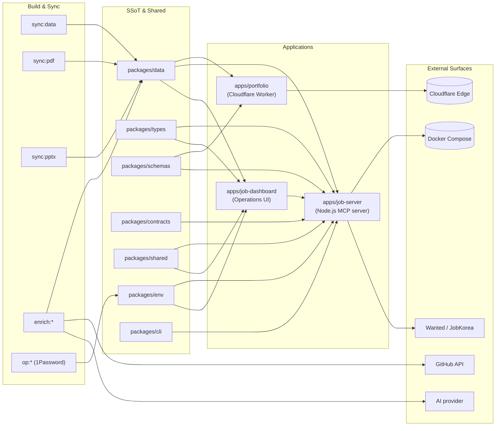

# 레쥬메 모노레포 / Resume Portfolio Monorepo

[](package.json)
[](Dockerfile)
[](docker-compose.yml)
[](wrangler.jsonc)
[](tsconfig.base.json)
[](LICENSE)

이 저장소는 개인 포트폴리오 사이트, 채용 자동화 워커, 단일 진실 공급원(SSoT) 데이터 레이어, 그리고 운영 대시보드를 하나의 npm 워크스페이스 모노레포로 통합한 사설 저장소입니다.

This repository is a private npm workspaces monorepo that unifies a personal portfolio site, job automation tooling, a Single Source of Truth (SSoT) data layer, and an operations dashboard under a single, versioned codebase.

---

## 목차 / Table of Contents

- [개요 / Overview](#overview--개요)
- [주요 기능 / Features](#주요-기능--features)
- [아키텍처 / Architecture](#아키텍처--architecture)
- [저장소 구조 / Repository Structure](#저장소-구조--repository-structure)
- [빠른 시작 / Quick Start](#빠른-시작--quick-start)
- [설정 / Configuration](#설정--configuration)
- [명령어 레퍼런스 / Commands Reference](#명령어-레퍼런스--commands-reference)
- [로컬 개발 / Local Development](#로컬-개발--local-development)
- [테스트 / Testing](#테스트--testing)
- [배포 / Deployment](#배포--deployment)
- [기여 / Contribution](#기여--contribution)
- [라이선스 / License](#라이선스--license)

---

## Overview / 개요

`package.json`의 `description` 필드는 이 모노레포를 다음과 같이 정의합니다.

> Resume portfolio monorepo: Cloudflare Worker edge site, job automation (Wanted/JobKorea), SSoT data, self-hosted observability

핵심 가치 / Core values:

- **단일 진실 공급원 (SSoT)** — 이력, 프로필, 스킬, 직무 데이터는 `packages/data`에서 한 번 정의되고 포트폴리오, 이력서 PDF, PPTX, 운영 대시보드 등 모든 산출물로 자동 동기화됩니다.
- **엣지 우선 포트폴리오** — `apps/portfolio`는 Cloudflare Worker(`wrangler.jsonc`)로 글로벌 엣지에 배포되어 저지연으로 페이지를 제공합니다.
- **운영 가능한 잡 자동화** — `apps/job-server`는 Docker로 컨테이너화되는 Node.js 서버로, 1Password CLI 연동, Wanted/JobKorea 등 채용 플랫폼 자동화, 제안서 동기화 파이프라인을 포함합니다.
- **셀프 호스팅 옵저버빌리티** — `apps/job-dashboard`는 인증, CSRF, 레이트 리밋 미들웨어와 관리/자동화/지원 라우트를 갖춘 운영 대시보드입니다.

---

## 주요 기능 / Features

- **SSoT 데이터 동기화 파이프라인** — `sync:data` → `sync:pdf` → `sync:pptx` 순으로 단일 데이터에서 PDF 이력서와 발표용 PPTX까지 자동 생성합니다.
- **1Password 기반 시크릿 관리** — `op:run`, `op:native:run`, `op:seed:resume`, `op:seed:sessions`, `op:restore:sessions` 명령어로 시크릿과 세션 파일을 안전하게 주입합니다.
- **GitHub/스킬/AI 강화(enrichment)** — `enrich:github`, `enrich:skills`, `enrich:ai`로 외부 소스에서 프로필 데이터를 보강합니다.
- **지원서 패키지** — `applications/` 디렉터리에 회사별 이력서(PDF/HTML)와 자기소개서가 버전 관리되어 있습니다(Airpremia, Coupang Fintech SRE, Cloudflare One SE, GitLab APAC Security, Security IR 등).
- **다층 보안** — `apps/job-dashboard`는 CORS, CSRF, 레이트 리밋 미들웨어로 보호되며, RBAC 기반 인증 라우트(`routes/auth.js`)와 관리자 라우트(`routes/admin.js`)를 제공합니다.
- **헬스체크와 자동화 라우트** — `routes/health.js`는 Docker `HEALTHCHECK`에서 호출되며, `routes/automation.js`와 `routes/applications.js`는 워커 큐와 연동됩니다.
- **도큐멘테이션 우선** — 각 앱은 자체 `README.md`, `DEPLOYMENT_GUIDE.md`, `DEVELOPMENT_GUIDE.md`, `API_REFERENCE.md`, `DIAGRAMS.md`, `SECRETS.md`를 갖추고 있습니다.
- **계약 중심 패키지** — `packages/contracts`가 외부 API 계약을, `packages/schemas`가 런타임 검증을, `packages/types`가 타입 안정성을 담당합니다.

---

## 아키텍처 / Architecture

이 모노레포는 데이터(SSoT), 표현(엣지 포트폴리오), 자동화(MCP/잡 서버), 운영(대시보드)의 4개 책임 영역으로 나뉘며, 공유 패키지를 통해 결합도를 낮춥니다.

The monorepo is split into four responsibility areas — data (SSoT), presentation (edge portfolio), automation (job server), and operations (dashboard) — connected through shared packages.



### 데이터 플로우 / Data flow

1. `packages/data`에 정의된 마스터 레쥬메 JSON이 모든 산출물의 소스입니다.
2. `sync:data`가 JSON을 검증·정규화하고, `sync:pdf`(Go)·`sync:pptx`(Python)가 회사별 PDF 이력서와 발표용 PPTX를 생성합니다.
3. `apps/portfolio` 워커는 빌드 시점에 SSoT를 임베드해 엣지에서 정적으로 서빙합니다.
4. `apps/job-server`는 런타임에 SSoT를 읽어 채용 플랫폼 자동화와 MCP 엔드포인트를 제공합니다.
5. `apps/job-dashboard`는 같은 SSoT를 공유하며 잡 자동화 상태를 시각화합니다.

---

## 저장소 구조 / Repository Structure

저장소 최상위 구조는 다음과 같습니다(생성된 디렉터리만 표시).

The top-level layout of this repository is as follows (generated directories only):

```
.
├── AGENTS.md
├── CHANGELOG.md
├── CONTRIBUTING.md
├── Dockerfile
├── LICENSE
├── OWNERS
├── ProfileView.jpg
├── README.md
├── docker-compose.yml
├── eslint.config.cjs
├── jest.config.cjs
├── lychee.toml
├── package-lock.json
├── package.json
├── playwright.config.js
├── redocly.yaml
├── tsconfig.base.json
├── tsconfig.json
├── wrangler.jsonc
├── ta/                                # 발표용 PPTX 산출물 디렉터리
│   ├── *.pptx
│   ├── improve_visual.py
│   ├── inspect.py
│   ├── verify.py
│   └── output/                        # 검증된 PPTX와 리포트
├── applications/                      # 회사별 지원 패키지
│   ├── airpremia-security-2026/
│   ├── infrastructure-architecture-2026/
│   ├── coupang-fintech-sre-2026/
│   ├── cloudflare-one-se-2026/
│   ├── gitlab-apac-security-2026/
│   └── security-ir-2026/
└── apps/
    ├── portfolio/                     # Cloudflare Worker 포트폴리오 (main 진입점)
    ├── job-server/                    # MCP 호환 잡 자동화 서버 (Docker 타깃)
    └── job-dashboard/                 # 운영 대시보드 (auth/admin/automation)
        ├── API_REFERENCE.md
        ├── DEPLOYMENT_GUIDE.md
        ├── DEVELOPMENT_GUIDE.md
        ├── DIAGRAMS.md
        ├── OWNERS
        ├── README.md
        ├── SECRETS.md
        ├── schema.sql
        ├── migrate-json-to-d1.cjs
        ├── migration-data.sql
        ├── migrations/                # SQL 마이그레이션 시퀀스
        └── src/
            ├── index.js
            ├── queue-consumer.js
            ├── router.js
            ├── middleware/            # cors, csrf, rate-limit
            └── routes/                # admin, applications, auth, automation, health
```

워크스페이스로 선언된 패키지(요약):

| 경로 / Path            | 역할 / Role                                                |
| ---------------------- | ---------------------------------------------------------- |
| `apps/portfolio`       | Cloudflare Worker 엣지 포트폴리오 (`main: worker.js`)       |
| `apps/job-server`      | Docker로 컨테이너화되는 MCP 호환 잡 자동화 서버            |
| `apps/job-dashboard`   | 인증·관리·자동화 라우트를 갖춘 운영 대시보드               |
| `packages/cli`         | 잡 서버가 사용하는 CLI 도구                                |
| `packages/data`        | SSoT 레쥬메 데이터                                         |
| `packages/shared`      | 워커/서버/대시보드 공용 유틸                               |
| `packages/types`       | TypeScript 타입 정의                                       |
| `packages/schemas`     | 런타임 스키마 (Zod 등)                                     |
| `packages/contracts`   | 외부 API 계약 정의                                         |
| `packages/env`         | 환경변수/시크릿 래퍼 (1Password 연동)                       |

---

## 빠른 시작 / Quick Start

요구 사항 / Prerequisites:

- **Node.js 22 이상** (Dockerfile 베이스 이미지와 일치)
- **npm 10 이상** (워크스페이스와 `package-lock.json` 사용)
- **Wrangler** — Cloudflare Worker 로컬 실행/배포용
- **Docker + Docker Compose** — `job-server` 컨테이너 실행용
- (선택) **Go 1.22+**, **Python 3.11+**, **exiftool** — 동기화/빌드 스크립트 실행 시

설치와 첫 동기화 / Install and first sync:

```bash
# 1) 의존성 설치 (워크스페이스 전체)
npm ci

# 2) 환경 변수 템플릿 복사 후 1Password 또는 .env로 시크릿 주입
cp .env.example .env   # (필요한 키에 한해)

# 3) SSoT에서 PDF/PPTX까지 한 번에 동기화
npm run sync:all

# 4) 포트폴리오 워커 로컬 실행
npm run dev --workspace apps/portfolio

# 5) 잡 서버를 Docker로 기동
docker compose up -d --build

# 6) 운영 대시보드 로컬 실행
npm run dev --workspace apps/job-dashboard
```

> 첫 부팅 시 `routes/health.js`의 `/health` 엔드포인트가 `200 OK`를 반환하면 정상입니다. Docker `HEALTHCHECK`도 동일 엔드포인트를 사용합니다.

---

## 설정 / Configuration

설정은 다음 네 계층으로 분리됩니다.

| 계층 / Layer       | 위치                                       | 용도                                              |
| ------------------ | ------------------------------------------ | ------------------------------------------------- |
| 루트 환경 변수     | `.env` (env_file), `docker-compose.yml`    | `NODE_ENV`, `PORT`, 컨테이너 마운트               |
| Cloudflare Worker  | `wrangler.jsonc`                           | 컴플라인, 바인딩, 환경 변수, 크론 트리거          |
| 1Password 시크릿   | `packages/env` 래퍼 + `op:*` 스크립트       | API 토큰, 세션 쿠키, 자격증명                    |
| SQL 스키마         | `apps/job-dashboard/schema.sql`, `migrations/` | 대시보드 데이터 모델 및 점진적 마이그레이션   |

자주 사용하는 환경 변수 / Common variables:

- `NODE_ENV` — `production` (Docker) / `development` (로컬)
- `PORT` — `job-server`가 노출할 포트 (기본 `3000`)
- Cloudflare Worker 바인딩 — `wrangler.jsonc`에서 KV, D1, R2, Queue, Secret을 선언합니다.

`apps/job-dashboard`는 자체 `SECRETS.md`에 시크릿 명세를, `DEPLOYMENT_GUIDE.md`에 배포 환경별 키 매핑을 문서화합니다.

---

## 명령어 레퍼런스 / Commands Reference

루트 `package.json`에서 노출되는 주요 스크립트:

### 동기화 / Sync

| 명령어 / Command        | 설명 / Description                                                       |
| ----------------------- | ------------------------------------------------------------------------ |
| `npm run sync:data`     | SSoT JSON 정규화 및 워크스페이스 전파 (`sync-resume-data.js`)            |
| `npm run sync:pdf`      | Go로 회사별 PDF 이력서 생성 (`pdf-generator.go master`)                  |
| `npm run sync:pptx`     | Python으로 발표용 PPTX 생성 (`generate_shinhan_pptx.py`)                 |
| `npm run sync:all`      | `sync:data` → `sync:pdf` → `sync:pptx` 순차 실행                         |
| `npm run sync:proposals`| 제안서 검토 CLI 실행 후 `apply-proposals.go`로 적용                      |

### 1Password 시크릿 / Secrets

| 명령어 / Command              | 설명 / Description                                       |
| ----------------------------- | -------------------------------------------------------- |
| `npm run op:run`              | 1Password 래퍼 실행 (`onepassword/run`)                  |
| `npm run op:native:run`       | 네이티브 1Password 바이너리 실행 (`onepassword/native-run`) |
| `npm run op:seed:resume`      | 레쥬메 SSoT용 시크릿 시드                                 |
| `npm run op:seed:sessions`    | 잡 자동화 세션 파일 시드                                  |
| `npm run op:restore:sessions` | 세션 파일 복원                                            |

### 데이터 보강 / Enrichment

| 명령어 / Command       | 설명 / Description                                     |
| ---------------------- | ------------------------------------------------------ |
| `npm run enrich:github`| GitHub API로 프로필/기여도 보강 (`enrichment/github`)  |
| `npm run enrich:skills`| 외부 스킬 분류 소스 동기화 (`enrichment/skills`)       |
| `npm run enrich:ai`    | AI 제공자로 자기소개서·요약 보강 (`enrichment/ai`)      |
| `npm run enrich:all`   | 세 보강 작업 순차 실행                                  |

### 자동화 파이프라인 / Automation pipelines

| 명령어 / Command         | 설명 / Description                                                       |
| ------------------------ | ------------------------------------------------------------------------ |
| `npm run automate:ssot`  | 데이터 동기화 → 빌드 → 타입체크 → Node 테스트                             |
| `npm run automate:full`  | 전체 동기화 + 린트 + 타입체크                                              |
| `npm run strip-exif`     | `exiftool`로 PNG/WebP의 EXIF 메타데이터 제거 (없으면 경고만 출력)        |

> 그 외 `lint`, `test`, `test:node`, `typecheck`, `build` 등은 각 워크스페이스의 `package.json`에 정의되어 있습니다.

---

## 로컬 개발 / Local Development

### 포트폴리오 워커 / Portfolio worker

```bash
npm run dev --workspace apps/portfolio      # wrangler dev
npm run deploy --workspace apps/portfolio   # wrangler deploy
```

### 잡 서버 / Job server

```bash
# 옵션 A: Docker Compose (권장)
docker compose up --build

# 옵션 B: 워크스페이스에서 직접 실행
npm run dev --workspace apps/job-server
```

- 데이터 볼륨 `job_automation_data`가 `apps/job-server/.data`에 마운트됩니다.
- 헬스체크: `GET /health` → `200 OK`.

### 잡 대시보드 / Job dashboard

```bash
npm run dev --workspace apps/job-dashboard   # 로컬 서버
npm run build --workspace apps/job-dashboard  # 프로덕션 빌드
npm run migrate --workspace apps/job-dashboard # migrate-json-to-d1.cjs
```

- 라우트 구성: `admin`, `applications`, `auth`, `automation`, `health`.
- 미들웨어: `cors`, `csrf`, `rate-limit` (단위 테스트 포함).
- SQL 마이그레이션: `apps/job-dashboard/migrations/*.sql`을 순서대로 적용합니다.

### 공통 / Shared

- 타입 안정성: `tsconfig.base.json`을 모든 워크스페이스가 확장합니다.
- 린트: `eslint.config.cjs` (flat config).
- 링크 검사: `lychee.toml`.
- API 문서: `redocly.yaml`로 OpenAPI 산출물을 린트합니다.

---

## 테스트 / Testing

루트에서 사용 가능한 테스트 도구:

| 도구 / Tool         | 설정 파일                  | 용도                                       |
| ------------------- | -------------------------- | ------------------------------------------ |
| Jest                | `jest.config.cjs`          | Node 단위/통합 테스트 (`rate-limit.test.js` 등) |
| Playwright          | `playwright.config.js`     | 포트폴리오/대시보드 E2E                    |
| ESLint              | `eslint.config.cjs`        | 정적 분석                                  |
| TypeScript          | `tsconfig.base.json`       | 타입체크                                   |
| Redocly CLI         | `redocly.yaml`             | OpenAPI 린트                               |
| lychee              | `lychee.toml`              | 마크다운 링크 검사                         |

실행 예시 / Example invocations:

```bash
npm test                              # Jest 전체
npx playwright test                   # E2E
npm run lint                          # ESLint
npm run typecheck                     # TypeScript
npx redocly lint                      # OpenAPI
npx lychee --config lychee.toml '**/*.md'
```

---

## 배포 / Deployment

### Cloudflare Worker (`apps/portfolio`)

```bash
npm run deploy --workspace apps/portfolio
```

- 설정은 `wrangler.jsonc`로 관리되며, 환경/바인딩은 동일 파일에서 선언합니다.
- 크론 트리거, KV, D1, R2, Queue 등 Worker 자원은 Wrangler 바인딩으로 주입됩니다.

### `apps/job-server` (Docker)

```bash
docker compose up -d --build
docker compose logs -f mcp-server
docker compose ps                     # HEALTHCHECK 상태 확인
```

- `Dockerfile`은 멀티 스테이지(`deps`, `runtime`)로 프로덕션 의존성만 이미지에 포함합니다.
- `docker-compose.yml`은 `.env`를 `env_file`로 읽고, 데이터 볼륨을 호스트에 영속화합니다.

### `apps/job-dashboard`

- 데이터 마이그레이션: `migrate-json-to-d1.cjs` 또는 `migration-data.sql` + `migrations/0002_*`, `migrations/0003_*`를 순서대로 적용합니다.
- 자세한 절차는 `apps/job-dashboard/DEPLOYMENT_GUIDE.md`와 `apps/job-dashboard/SECRETS.md`를 참조하세요.

---

## 기여 / Contribution

기여 절차는 [`CONTRIBUTING.md`](CONTRIBUTING.md)와 [`AGENTS.md`](AGENTS.md)에 정의되어 있습니다. 일반적으로 다음 흐름을 따릅니다.

1. 이슈 또는 작업을 생성합니다 (`OWNERS` 참고).
2. 해당 워크스페이스(`apps/*` 또는 `packages/*`)에 변경을 추가합니다.
3. `npm run lint && npm run typecheck && npm test && npx playwright test`를 로컬에서 통과시킵니다.
4. SSoT 변경 시 `npm run sync:data`로 동기화 후 산출물 차이를 검토합니다.
5. PR을 열고 자동 리뷰/체크가 통과하면 리뷰어에게 알립니다.

> `applications/` 디렉터리는 회사별 지원 패키지이므로 새로운 지원이 진행될 때만 변경됩니다.

---

## 라이선스 / License

이 저장소는 **사설(private)** 라이선스입니다. 자세한 내용은 [`LICENSE`](LICENSE)를 참조하세요.

This repository is distributed under a **private** license. See [`LICENSE`](LICENSE) for full terms.