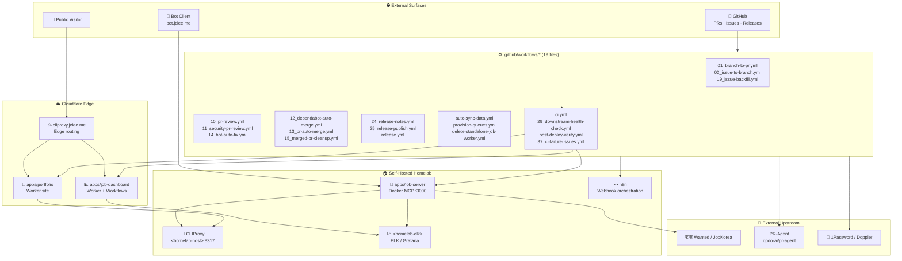

# Resume Portfolio Monorepo / 이력서 포트폴리오 모노레포

[](package.json)
[](https://nodejs.org/)
[](https://workers.cloudflare.com/)
[](LICENSE)
[](Dockerfile)
[](wrangler.jsonc)
[](https://github.com/qodo-ai/pr-agent)
[](apps/job-server)
[](https://cliproxy.jclee.me/v1)
[](https://bot.jclee.me)
[](README.md)
[](https://cliproxy.jclee.me/v1)

> **Bilingual documentation** / **이중 언어 문서**: Every section header is duplicated in English and Korean. English text appears first, followed by the Korean (한국어) translation under the same heading.
> 본 README는 모든 섹션을 영어와 한국어로 병기합니다. 같은 제목 아래에 영어 본문이 먼저, 한국어 번역이 이어집니다.

> **Primary README generator model:** `gpt-5.5` (fallback: `minimax-m3` routed via the [cliproxy.jclee.me](https://cliproxy.jclee.me/v1) edge proxy).
> **README 생성 기본 모델:** `gpt-5.5` (대체: [cliproxy.jclee.me](https://cliproxy.jclee.me/v1) 엣지 프록시 경유 `minimax-m3`).

---

## Overview / 개요

`resume` (v1.40.11) is a private, opinionated **resume portfolio monorepo** that fuses five surfaces into a single workspace:

1. A **Cloudflare Worker edge portfolio** served from the `apps/portfolio` workspace.
2. A **job-automation HTTP runtime** (`apps/job-server`) containerized as a Docker image, exposing an MCP-style API for Wanted / JobKorea crawlers and sync flows.
3. A **dashboard Worker** (`apps/job-dashboard`) with handlers, middleware, queues, and Cloudflare Workflows that orchestrate the application lifecycle.
4. A **single source of truth (SSoT)** for resume content living in `packages/data/`, mirrored into PDF / PPTX / JSON via `tools/scripts/`.
5. **Self-hosted observability and automation** wired into n8n / ELK / 1Password on a private homelab host (`<homelab-host>`, `<homelab-elk>` placeholders).

`resume` (v1.40.11)는 다섯 가지 표면을 단일 워크스페이스로 융합한 사설·주관적 **이력서 포트폴리오 모노레포**입니다.

1. `apps/portfolio` 워크스페이스에서 서빙되는 **Cloudflare Worker 엣지 포트폴리오**.
2. Docker 이미지로 컨테이너화된 **잡 자동화 HTTP 런타임** (`apps/job-server`)으로, Wanted / JobKorea 크롤러와 동기화 흐름을 위한 MCP 스타일 API를 제공합니다.
3. 핸들러, 미들웨어, 큐, 그리고 애플리케이션 라이프사이클을 오케스트레이션하는 Cloudflare Workflows로 구성된 **대시보드 Worker** (`apps/job-dashboard`).
4. `packages/data/`에 상주하는 이력서 콘텐츠의 **단일 진실 공급원(SSoT)**을 `tools/scripts/`를 통해 PDF / PPTX / JSON으로 미러링합니다.
5. 사설 홈랩 호스트(`<homelab-host>`, `<homelab-elk>` 자리표시자)에 배치된 n8n / ELK / 1Password 기반의 **셀프 호스팅 옵저버빌리티 및 자동화**.

---

## Features / 주요 기능

### English

- **Polyglot monorepo** with npm workspaces (`apps/*`, `packages/*`) and a Dockerfile that bakes only the runtime slices `apps/job-server` needs.
- **Edge-first portfolio** built with Wrangler, gated behind `wrangler.jsonc`, and reachable through the `https://cliproxy.jclee.me/v1` reverse proxy.
- **MCP-style job server** exposing crawlers, sync endpoints, and auth helpers, with a compose-managed Docker image and a healthcheck that probes `/health`.
- **Dashboard worker** with CSRF / CORS / rate-limit middleware, Cloudflare Workflows bindings, and a queue consumer for asynchronous jobs.
- **SSoT data plane** with `sync:data`, `sync:pdf`, `sync:pptx`, and the umbrella `sync:all` operator.
- **Secrets and identity** managed through 1Password (`op:run`, `op:seed:resume`, `op:seed:sessions`) and Doppler.
- **GitHub-only CI/CD**: 19 workflow files in `.github/workflows/` covering review, security, auto-merge, release, and post-deploy verification. No GitLab CI.
- **PR-Agent integration** powered by [`qodo-ai/pr-agent`](https://github.com/qodo-ai/pr-agent) for AI-assisted code review.
- **Self-hosted automation** wired through n8n / ELK on `<homelab-host>` and `<homelab-elk>`.

### 한국어

- npm 워크스페이스(`apps/*`, `packages/*`) 기반 **다국어 모노레포**, 런타임에 필요한 `apps/job-server` 슬라이스만 굽는 Dockerfile 제공.
- `wrangler.jsonc`로 게이팅되는 **엣지 우선 포트폴리오**, `https://cliproxy.jclee.me/v1` 리버스 프록시를 통해 도달 가능.
- 크롤러, 동기화 엔드포인트, 인증 헬퍼를 노출하는 **MCP 스타일 잡 서버**, Compose 기반 Docker 이미지와 `/health` 프로빙 헬스체크 포함.
- CSRF / CORS / 레이트 리밋 미들웨어, Cloudflare Workflows 바인딩, 비동기 잡을 위한 큐 컨슈머를 갖춘 **대시보드 워커**.
- `sync:data`, `sync:pdf`, `sync:pptx`, 그리고 통합 오퍼레이터 `sync:all`로 구성된 **SSoT 데이터 플레인**.
- 1Password(`op:run`, `op:seed:resume`, `op:seed:sessions`)와 Doppler를 통한 **시크릿 및 신원 관리**.
- **GitHub 전용 CI/CD**: `.github/workflows/`의 19개 워크플로우가 리뷰, 보안, 자동 머지, 릴리스, 배포 후 검증을 포괄. GitLab CI는 없음.
- [`qodo-ai/pr-agent`](https://github.com/qodo-ai/pr-agent)로 구동되는 **PR-Agent 통합**으로 AI 코드 리뷰 지원.
- `<homelab-host>` 및 `<homelab-elk>`에서 n8n / ELK로 연결된 **셀프 호스팅 자동화**.

---

## Architecture / 아키텍처



> All homelab endpoints are placeholders (`<homelab-host>`, `<homelab-elk>`); replace them with your own private DNS / IPs. The public edge lives at `https://cliproxy.jclee.me/v1`.
> 모든 홈랩 엔드포인트는 자리표시자(`<homelab-host>`, `<homelab-elk>`)이므로 자체 사설 DNS / IP로 교체하세요. 공개 엣지는 `https://cliproxy.jclee.me/v1` 입니다.

---

## Repository Structure / 저장소 구조

```text
./
├── AGENTS.md                 # Project knowledge base (machine-readable overview)
├── CHANGELOG.md              # Release history
├── CONTRIBUTING.md           # Contribution guidelines
├── Dockerfile                # Multi-stage build for apps/job-server
├── LICENSE                   # MIT license
├── OWNERS                    # CODEOWNERS-style ownership
├── README.md                 # This file
├── docker-compose.yml        # MCP server compose stack
├── eslint.config.cjs         # Workspace linting config
├── jest.config.cjs           # Workspace test runner config
├── lychee.toml               # Link-checker config
├── package.json              # Workspace root + operator scripts
├── package-lock.json         # Locked dependency graph
├── playwright.config.js      # E2E browser test config
├── redocly.yaml              # OpenAPI lint config
├── tsconfig.base.json        # Shared TS compiler options
├── tsconfig.json             # Root TS project references
├── wrangler.jsonc            # Cloudflare Worker configuration
├── ta/                       # TA profile generation (Python + PPTX)
├── applications/             # Targeted job-application packets
│   ├── airpremia-security-2026/
│   ├── infrastructure-architecture-2026/
│   ├── coupang-fintech-sre-2026/
│   ├── cloudflare-one-se-2026/
│   └── gitlab-apac-security-2026/
└── apps/
    ├── portfolio/            # Public worker + generated edge bundle
    ├── job-server/           # MCP / job automation runtime
    └── job-dashboard/        # Dashboard worker + workflows
        ├── AGENTS.md
        ├── API_REFERENCE.md
        ├── DEPLOYMENT_GUIDE.md
        ├── DEVELOPMENT_GUIDE.md
        ├── DIAGRAMS.md
        ├── OWNERS
        ├── README.md
        ├── SECRETS.md
        ├── migrate-json-to-d1.cjs
        ├── migration-data.sql
        ├── schema.sql
        ├── migrations/
        │   └── 0002_add_approval_metadata.sql
        └── src/
            ├── index.js
            ├── queue-consumer.js
            ├── router.js
            ├── middleware/
            ├── routes/
            └── handlers/
```

> The full workspace tree (`packages/*`, `tools/`, `tests/`, `infrastructure/`, `docs/`, `supabase/`, `third_party/`) is documented in [`AGENTS.md`](AGENTS.md) at the repository root. The block above shows only the **on-disk top-level layout**; no directories such as `_bot-scripts/` exist.
> 전체 워크스페이스 트리(`packages/*`, `tools/`, `tests/`, `infrastructure/`, `docs/`, `supabase/`, `third_party/`)는 저장소 루트의 [`AGENTS.md`](AGENTS.md)에 문서화되어 있습니다. 위 블록은 **디스크 상의 최상위 레이아웃**만 보여주며 `_bot-scripts/` 같은 디렉터리는 존재하지 않습니다.

---

## Automation Inventory / 자동화 인벤토리

### CI/CD Workflows (`.github/workflows/`) / CI/CD 워크플로우

All 19 workflow files live under `.github/workflows/` and use the numeric prefix convention (`NN_*.yml`). The full on-disk list is preserved verbatim below.

| # | File / 파일 | Purpose / 용도 |
|---|---|---|
| 01 | `01_branch-to-pr.yml` | Open a PR from a working branch automatically. |
| 02 | `02_issue-to-branch.yml` | Create a branch for a new issue. |
| 10 | `10_pr-review.yml` | Run [qodo-ai/pr-agent](https://github.com/qodo-ai/pr-agent) review on PRs. |
| 11 | `11_security-pr-review.yml` | Security-focused PR review pass. |
| 12 | `12_dependabot-auto-merge.yml` | Auto-merge eligible Dependabot PRs. |
| 13 | `13_pr-auto-merge.yml` | Auto-merge qualified PRs. |
| 14 | `14_bot-auto-fix.yml` | Bot applies safe fixes from review feedback. |
| 15 | `15_merged-pr-cleanup.yml` | Clean up branches and refs after merge. |
| 19 | `19_issue-backfill.yml` | Backfill missing issue metadata. |
| 24 | `24_release-notes.yml` | Generate release notes from merged PRs. |
| 25 | `25_release-publish.yml` | Publish the release artifacts. |
| 29 | `29_downstream-health-check.yml` | Probe downstream services after deploy. |
| 37 | `37_ci-failure-issues.yml` | Open an issue when CI fails on `master`. |
| — | `auto-sync-data.yml` | Trigger SSoT data sync on schedule. |
| — | `ci.yml` | Main CI pipeline (lint, typecheck, test, build). |
| — | `delete-standalone-job-worker.yml` | Tear down standalone job workers. |
| — | `post-deploy-verify.yml` | Smoke test the live deployment. |
| — | `provision-queues.yml` | Provision Cloudflare Queue bindings. |
| — | `release.yml` | End-to-end release orchestration. |

### Workflow Groups / 워크플로우 그룹

#### English

- **Branch & PR plumbing** — `01_branch-to-pr.yml`, `02_issue-to-branch.yml`, `15_merged-pr-cleanup.yml`, `19_issue-backfill.yml`.
- **Review & quality gates** — `10_pr-review.yml`, `11_security-pr-review.yml`, `14_bot-auto-fix.yml`, `ci.yml`.
- **Auto-merge lane** — `12_dependabot-auto-merge.yml`, `13_pr-auto-merge.yml`.
- **Release engineering** — `24_release-notes.yml`, `25_release-publish.yml`, `release.yml`.
- **Sync & provisioning** — `auto-sync-data.yml`, `provision-queues.yml`, `delete-standalone-job-worker.yml`.
- **Reliability & feedback** — `29_downstream-health-check.yml`, `post-deploy-verify.yml`, `37_ci-failure-issues.yml`.

#### 한국어

- **브랜치 & PR 배관** — `01_branch-to-pr.yml`, `02_issue-to-branch.yml`, `15_merged-pr-cleanup.yml`, `19_issue-backfill.yml`.
- **리뷰 & 품질 게이트** — `10_pr-review.yml`, `11_security-pr-review.yml`, `14_bot-auto-fix.yml`, `ci.yml`.
- **자동 머지 레인** — `12_dependabot-auto-merge.yml`, `13_pr-auto-merge.yml`.
- **릴리스 엔지니어링** — `24_release-notes.yml`, `25_release-publish.yml`, `release.yml`.
- **동기화 & 프로비저닝** — `auto-sync-data.yml`, `provision-queues.yml`, `delete-standalone-job-worker.yml`.
- **신뢰성 & 피드백** — `29_downstream-health-check.yml`, `post-deploy-verify.yml`, `37_ci-failure-issues.yml`.

### Operator Tooling (Go & JS) / 운영 도구 (Go & JS)

Operator scripts are invoked from the root `package.json`. The Go binaries themselves live under `tools/scripts/` and are referenced by `go run` paths.

#### English

- **SSoT sync** — `sync:data` (Node), `sync:pdf` (Go: `tools/scripts/build/pdf-generator.go`), `sync:pptx` (Python: `tools/scripts/build/generate_shinhan_pptx.py`), umbrella `sync:all`.
- **OnePassword** — `op:run`, `op:native:run`, `op:seed:resume`, `op:seed:sessions`, `op:restore:sessions`.
- **Enrichment** — `enrich:github`, `enrich:skills`, `enrich:ai`, `enrich:all` (Go binaries under `tools/scripts/enrichment/`).
- **Proposal sync** — `sync:proposals` chains a Node CLI with `tools/scripts/sync/apply-proposals.go`.
- **Full automation** — `automate:ssot` runs sync → build → typecheck → test; `automate:full` adds lint and the rest of the pipeline.
- **Hygiene** — `strip-exif` removes metadata from portfolio images.

#### 한국어

- **SSoT 동기화** — `sync:data` (Node), `sync:pdf` (Go: `tools/scripts/build/pdf-generator.go`), `sync:pptx` (Python: `tools/scripts/build/generate_shinhan_pptx.py`), 통합 명령 `sync:all`.
- **OnePassword** — `op:run`, `op:native:run`, `op:seed:resume`, `op:seed:sessions`, `op:restore:sessions`.
- **인리치먼트** — `enrich:github`, `enrich:skills`, `enrich:ai`, `enrich:all` (`tools/scripts/enrichment/` 아래의 Go 바이너리).
- **제안 동기화** — `sync:proposals`는 Node CLI와 `tools/scripts/sync/apply-proposals.go`를 연쇄 실행합니다.
- **풀 자동화** — `automate:ssot`는 sync → build → typecheck → test를 실행하며, `automate:full`은 lint 및 나머지 파이프라인을 추가합니다.
- **정리** — `strip-exif`는 포트폴리오 이미지의 메타데이터를 제거합니다.

---

## Quick Start / 빠른 시작

### English

1. Clone the repo and install workspace deps with the root lockfile:
   ```bash
   npm ci
   ```
2. Copy `.env.example` (if present) to `.env` and fill in secrets through `op:run` or Doppler.
3. Run the umbrella data sync:
   ```bash
   npm run sync:all
   ```
4. Start the job server via Docker Compose:
   ```bash
   docker compose up -d mcp-server
   curl -fsS http://127.0.0.1:3000/health
   ```
5. Build and preview the Cloudflare portfolio:
   ```bash
   cd apps/portfolio
   npx wrangler dev
   ```
6. Open the dashboard worker locally:
   ```bash
   cd apps/job-dashboard
   npx wrangler dev
   ```
7. Browse the public edge at `https://cliproxy.jclee.me/v1` and the bot at `https://bot.jclee.me`.

### 한국어

1. 저장소를 클론하고 루트 lockfile로 워크스페이스 의존성을 설치합니다:
   ```bash
   npm ci
   ```
2. `.env.example`(있다면)을 `.env`로 복사하고 `op:run` 또는 Doppler로 시크릿을 채워 넣습니다.
3. 통합 데이터 동기화를 실행합니다:
   ```bash
   npm run sync:all
   ```
4. Docker Compose로 잡 서버를 기동합니다:
   ```bash
   docker compose up -d mcp-server
   curl -fsS http://127.0.0.1:3000/health
   ```
5. Cloudflare 포트폴리오를 빌드하고 미리 봅니다:
   ```bash
   cd apps/portfolio
   npx wrangler dev
   ```
6. 대시보드 워커를 로컬에서 엽니다:
   ```bash
   cd apps/job-dashboard
   npx wrangler dev
   ```
7. `https://cliproxy.jclee.me/v1`에서 공개 엣지를, `https://bot.jclee.me`에서 봇을 확인합니다.

---

## Local Development / 로컬 개발

### English

- **Node engine**: `>=22` (matches the `node:22-alpine` Dockerfile base).
- **Required CLIs**: `node`, `npm`, `npx`, `docker`, `docker compose`, `wrangler`, optional `go` and `python3` for sync scripts.
- **Lint & format**: ESLint (`eslint.config.cjs`) is the single source of truth; Prettier is not configured separately.
- **Testing layers**:
  - Unit → `npm run test` (Jest via `jest.config.cjs`).
  - E2E → Playwright via `playwright.config.js`.
  - API contract → `redocly.yaml` against `packages/contracts/openapi.yaml`.
- **TS** uses project references from `tsconfig.base.json`; `npm run typecheck` validates the graph.
- **Wrangler** lives in `wrangler.jsonc`; each app under `apps/*` carries its own bindings.
- **Self-hosted stack**: replace the `<homelab-host>` / `<homelab-elk>` placeholders with your own private DNS and update `infrastructure/` configs. Never commit real RFC1918 addresses.
- **PR review locally**: invoke the bot's `/review` style commands by running `qodo-ai/pr-agent` against the current branch before pushing.

### 한국어

- **Node 엔진**: `>=22` (`node:22-alpine` Dockerfile 베이스와 일치).
- **필수 CLI**: `node`, `npm`, `npx`, `docker`, `docker compose`, `wrangler`, 동기화 스크립트를 위한 선택적 `go`, `python3`.
- **린트 & 포맷**: ESLint(`eslint.config.cjs`)가 단일 진실 공급원이며 Prettier는 별도로 구성되지 않습니다.
- **테스트 계층**:
  - 단위 → `npm run test` (`jest.config.cjs` 기반 Jest).
  - E2E → `playwright.config.js` 기반 Playwright.
  - API 계약 → `packages/contracts/openapi.yaml`에 대한 `redocly.yaml`.
- **TypeScript**는 `tsconfig.base.json`의 프로젝트 레퍼런스를 사용하며 `npm run typecheck`가 그래프를 검증합니다.
- **Wrangler**은 `wrangler.jsonc`에 정의되어 있고 `apps/*` 하위 앱이 각자의 바인딩을 가집니다.
- **셀프 호스팅 스택**: `<homelab-host>` / `<homelab-elk>` 자리표시자를 사설 DNS로 교체하고 `infrastructure/` 설정을 업데이트하세요. 실제 RFC1918 주소를 커밋하지 마세요.
- **로컬 PR 리뷰**: 푸시 전에 현재 브랜치에 대해 `qodo-ai/pr-agent`를 실행해 봇의 `/review` 스타일 명령을 호출합니다.

---

## Commands Reference / 명령어 레퍼런스

All commands are run from the repository root unless otherwise noted.

### English

| Command | Description |
|---|---|
| `npm run strip-exif` | Strip EXIF metadata from `apps/portfolio/src/images/*.{png,webp}`. |
| `npm run sync:data` | Re-emit JSON SSoT data via `tools/scripts/utils/sync-resume-data.js`. |
| `npm run sync:pptx` | Regenerate PPTX via `tools/scripts/build/generate_shinhan_pptx.py`. |
| `npm run sync:pdf` | Regenerate master PDF via `go run ./tools/scripts/build/pdf-generator.go master`. |
| `npm run sync:all` | Run `sync:data` → `sync:pdf` → `sync:pptx` in order. |
| `npm run op:run` | Run `tools/scripts/onepassword/run` (Go). |
| `npm run op:native:run` | Run `tools/scripts/onepassword/native-run` (Go). |
| `npm run op:seed:resume` | Seed resume secrets into 1Password. |
| `npm run op:seed:sessions` | Seed session files into 1Password. |
| `npm run op:restore:sessions` | Restore sessions from 1Password. |
| `npm run sync:proposals` | Apply proposal-review diffs (Node CLI + Go apply). |
| `npm run enrich:github` | Enrich SSoT with GitHub data (Go). |
| `npm run enrich:skills` | Enrich SSoT with skills data (Go). |
| `npm run enrich:ai` | Enrich SSoT with AI-generated metadata (Go). |
| `npm run enrich:all` | Run all enrichment stages. |
| `npm run automate:ssot` | Full SSoT loop: sync → build → typecheck → node tests. |
| `npm run automate:full` | Full pipeline including lint and remaining checks. |
| `docker compose up -d mcp-server` | Start the MCP server (apps/job-server in Docker). |
| `npx wrangler dev` | Local Worker preview (run inside `apps/portfolio` or `apps/job-dashboard`). |

### 한국어

| 명령어 | 설명 |
|---|---|
| `npm run strip-exif` | `apps/portfolio/src/images/*.{png,webp}`의 EXIF 메타데이터를 제거합니다. |
| `npm run sync:data` | `tools/scripts/utils/sync-resume-data.js`로 JSON SSoT 데이터를 재생성합니다. |
| `npm run sync:pptx` | `tools/scripts/build/generate_shinhan_pptx.py`로 PPTX를 재생성합니다. |
| `npm run sync:pdf` | `go run ./tools/scripts/build/pdf-generator.go master`로 마스터 PDF를 재생성합니다. |
| `npm run sync:all` | `sync:data` → `sync:pdf` → `sync:pptx` 순서로 실행합니다. |
| `npm run op:run` | `tools/scripts/onepassword/run` (Go) 실행. |
| `npm run op:native:run` | `tools/scripts/onepassword/native-run` (Go) 실행. |
| `npm run op:seed:resume` | 이력서 시크릿을 1Password에 시드합니다. |
| `npm run op:seed:sessions` | 세션 파일을 1Password에 시드합니다. |
| `npm run op:restore:sessions` | 1Password에서 세션을 복원합니다. |
| `npm run sync:proposals` | 제안 리뷰 차이(노드 CLI + Go apply)를 적용합니다. |
| `npm run enrich:github` | GitHub 데이터로 SSoT를 인리치합니다 (Go). |
| `npm run enrich:skills` | 스킬 데이터로 SSoT를 인리치합니다 (Go). |
| `npm run enrich:ai` | AI 생성 메타데이터로 SSoT를 인리치합니다 (Go). |
| `npm run enrich:all` | 모든 인리치먼트 단계를 실행합니다. |
| `npm run automate:ssot` | 동기화 → 빌드 → 타입체크 → Node 테스트의 전체 SSoT 루프. |
| `npm run automate:full` | lint 및 나머지 검사를 포함한 전체 파이프라인. |
| `docker compose up -d mcp-server` | MCP 서버(apps/job-server Docker)를 시작합니다. |
| `npx wrangler dev` | 로컬 Worker 미리 보기(`apps/portfolio` 또는 `apps/job-dashboard` 내부에서 실행). |

---

## Contribution Guide / 기여 가이드

### English

1. **Read first**: [`AGENTS.md`](AGENTS.md) is the canonical project knowledge base and lists every code owner via [`OWNERS`](OWNERS).
2. **Pick a workspace**: respect the boundaries in `apps/*` and `packages/*`; do not cross-import between `apps/` siblings.
3. **Branch naming**: follow the convention enforced by `02_issue-to-branch.yml` (`issue/<id>-<slug>`).
4. **Commits & PRs**: use Conventional Commits; the auto-generated release notes (`24_release-notes.yml`) and changelog depend on it.
5. **Reviewers**: PR-Agent (powered by [qodo-ai/pr-agent](https://github.com/qodo-ai/pr-agent)) is invoked automatically by `10_pr-review.yml`; address its comments before requesting human review.
6. **Auto-merge**: eligible PRs are merged by `13_pr-auto-merge.yml` after green CI and approvals.
7. **Secrets**: never commit `.env`; use `op:run` / Doppler. CI uses `SecretStore` (`1Password / Doppler`).
8. **SSoT changes**: edit `packages/data/resumes/master/resume_data.json`, then run `npm run sync:all` and `npm run automate:ssot`.
9. **Workflow changes**: any edit under `.github/workflows/` should be verified against `29_downstream-health-check.yml` and `post-deploy-verify.yml` on a fork before merging.
10. **Observability**: ensure new endpoints emit logs / metrics compatible with the ELK pipeline on `<homelab-elk>`.

### 한국어

1. **먼저 읽기**: [`AGENTS.md`](AGENTS.md)는 표준 프로젝트 지식 베이스이며 [`OWNERS`](OWNERS)을 통해 모든 코드 오너를 나열합니다.
2. **워크스페이스 선택**: `apps/*`와 `packages/*`의 경계를 존중하고 `apps/` 형제 간 교차 임포트를 하지 마세요.
3. **브랜치 명명**: `02_issue-to-branch.yml`이 강제하는 규칙(`issue/<id>-<slug>`)을 따르세요.
4. **커밋 & PR**: Conventional Commits를 사용하세요. 자동 생성되는 릴리스 노트(`24_release-notes.yml`)와 변경 로그가 이를 사용합니다.
5. **리뷰어**: PR-Agent([qodo-ai/pr-agent](https://github.com/qodo-ai/pr-agent))는 `10_pr-review.yml`에 의해 자동 호출됩니다. 사람 리뷰를 요청하기 전에 그 코멘트를 처리하세요.
6. **자동 머지**: 자격이 충족된 PR은 CI 통과 및 승인 후 `13_pr-auto-merge.yml`이 머지합니다.
7. **시크릿**: `.env`를 커밋하지 마세요. `op:run` / Doppler를 사용하세요. CI는 `SecretStore` (`1Password / Doppler`)를 사용합니다.
8. **SSoT 변경**: `packages/data/resumes/master/resume_data.json`을 수정한 뒤 `npm run sync:all`과 `npm run automate:ssot`을 실행하세요.
9. **워크플로우 변경**: `.github/workflows/` 하위 변경은 머지 전 포크에서 `29_downstream-health-check.yml` 및 `post-deploy-verify.yml`로 검증해야 합니다.
10. **옵저버빌리티**: 신규 엔드포인트가 `<homelab-elk>`의 ELK 파이프라인과 호환되는 로그 / 메트릭을 방출하는지 확인하세요.

---

## License / 라이선스

MIT — see [`LICENSE`](LICENSE).

본 프로젝트는 MIT 라이선스를 따릅니다. 자세한 내용은 [`LICENSE`](LICENSE)를 참조하세요.