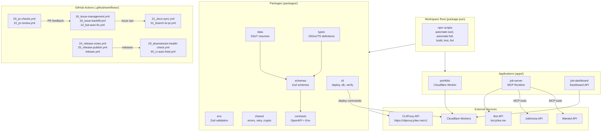

# Resume Portfolio Monorepo

# 이력서 포트폴리오 모노레포

---

[](https://github.com/qodo-ai/pr-agent/actions/workflows/ci.yml)
[](https://github.com/qodo-ai/pr-agent/actions/workflows/release.yml)
[](LICENSE)
[](https://nodejs.org/)
[](https://workers.cloudflare.com/)
[](https://github.com/qodo-ai/pr-agent/blob/master/CHANGELOG.md)

**Version:** 1.40.11

---

## Overview

**Resume** is a monorepo encompassing a Cloudflare Worker-powered portfolio site, Wanted/JobKorea recruitment automation, single source of truth (SSoT) resume data, and self-hosted observability infrastructure. It consolidates edge computing, job application workflows, and data management into a unified development platform.

**Key Capabilities:**

- Edge-deployed portfolio worker with sub-ms latency
- MCP-based job automation for Wanted and JobKorea platforms
- Canonical SSoT resume data with Zod runtime validation
- Self-hosted monitoring with Cloudflare dashboard integration

---

## 개요

**Resume**는 Cloudflare Worker 기반 포트폴리오 사이트, Wanted/JobKorea 채용 자동화, 단일 진실 공급원(SSoT) 이력서 데이터, 자체 호스팅 감시 인프라를 통합한 모노레포입니다. 이 프로젝트는 엣지 컴퓨팅, 채용 워크플로우, 데이터 관리를 통합 개발 플랫폼으로 결합합니다.

## 기술 스택

| 계층            | 기술                                          |
| --------------- | --------------------------------------------- |
| **런타임**      | Node.js ≥22, Cloudflare Workers               |
| **언어**        | JavaScript/TypeScript, Go, Python             |
| **패키지 관리** | npm workspaces (monorepo)                     |
| **검증**        | Zod (스키마), Jest (테스트), Playwright (E2E) |
| **API**         | OpenAPI 3.0, Cloudflare Worker Env            |
| **자동화**      | GitHub Actions, n8n workflows                 |
| **인프라**      | Cloudflare, self-hosted monitoring            |

---

## Features / 주요 기능

### Core Applications / 핵심 애플리케이션

| 애플리케이션         | 설명                                                           |
| -------------------- | -------------------------------------------------------------- |
| `apps/portfolio`     | Cloudflare Workers 기반 공개 포트폴리오 사이트 (엣지-deployed) |
| `apps/job-server`    | Wanted/JobKorea 플랫폼용 MCP 작업 자동화 런타임                |
| `apps/job-dashboard` | 대시보드 Worker + Cloudflare workflows + API 핸들러            |

### Packages / 패키지

| 패키지               | 목적                                                  |
| -------------------- | ----------------------------------------------------- |
| `packages/cli`       | resume CLI 도구 ( deploy, db, verify 커맨드)          |
| `packages/env`       | 환경 변수 검증 + 타입 안전 시크릿 관리                |
| `packages/data`      | SSoT 이력서 데이터 + JSON 스키마                      |
| `packages/shared`    | 교차 패키지 유틸리티 (errors, retry, crypto, clients) |
| `packages/types`     | 정적 JSDoc/TS 타입 정의 (런타임 의존성 없음)          |
| `packages/schemas`   | Zod 런타임 유효성 검사 스키마                         |
| `packages/contracts` | OpenAPI 스펙 + Cloudflare Worker Env 인터페이스       |

---

## Architecture / 아키텍처



---

## Automation Inventory / 자동화 목록

### GitHub Actions Workflows / GitHub Actions 워크플로우

#### Pull Request & Code Quality / 풀 리퀘스트 및 코드 품질

| 워크플로우 파일            | 목적                            |
| -------------------------- | ------------------------------- |
| `01_branch-to-pr.yml`      | 브랜치 → PR 자동 생성           |
| `03_pr-checks.yml`         | PR 검사 (lint, typecheck, test) |
| `04_actionlint.yml`        | GitHub Actions YAML 문법 검사   |
| `05_gitleaks.yml`          | Secrets 스캔 (gitleaks)         |
| `06_codeql.yml`            | CodeQL 정적 분석                |
| `07_dependency-review.yml` | 의존성 보안 리뷰                |
| `08_scorecard.yml`         | OpenSSF Scorecard 평가          |
| `09_semantic-pr.yml`       | Conventional Commits 검증       |
| `10_pr-review.yml`         | AI 기반 PR 리뷰 (PR-Agent)      |
| `13_pr-auto-merge.yml`     | 자동 병합 (조건 충족 시)        |
| `14_bot-auto-fix.yml`      | 봇 자동 수정 실행               |

**Security Subdirectory:** `.github/workflows/security/11_pr-review.yml`

#### Release & Version Management / Releases 및 버전 관리

| 워크플로우 파일          | 목적                   |
| ------------------------ | ---------------------- |
| `24_release-notes.yml`   | 자동 릴리스 노트 생성  |
| `25_release-publish.yml` | 릴리스 게시 및 배포    |
| `release.yml`            | 메인 릴리스 워크플로우 |
| `auto-merge.yml`         | 자동 병합 핸들러       |

#### Issue & Project Management / 이슈 및 프로젝트 관리

| 워크플로우 파일                | 목적                             |
| ------------------------------ | -------------------------------- |
| `02_issue-to-branch.yml`       | 이슈 → 브랜치 자동 생성          |
| `12_dependabot-auto-merge.yml` | Dependabot PR 자동 병합          |
| `15_merged-pr-cleanup.yml`     | 병합 후 브랜치 정리              |
| `18_issue-management.yml`      | 이슈 관리 및 라벨링              |
| `19_issue-backfill.yml`        | 이슈 백필 작업을 위한 워크플로우 |

#### Documentation & Sync / 문서 및 동기화

| 워크플로우 파일             | 목적                      |
| --------------------------- | ------------------------- |
| `20_readme-gen.yml`         | README 자동 생성          |
| `21_docs-sync.yml`          | 문서 동기화               |
| `42_reusable-docs-sync.yml` | 재사용 가능한 문서 동기화 |

#### Health, Monitoring & Healing / 헬스, 모니터링 및 복구

| 워크플로우 파일                  | 목적                      |
| -------------------------------- | ------------------------- |
| `29_downstream-health-check.yml` | 하위 서비스 상태 확인     |
| `37_ci-failure-issues.yml`       | CI 실패 시 이슈 자동 생성 |
| `60_ci-auto-heal.yml`            | CI 자동 복구              |

#### Utility & Support / 유틸리티 및 지원

| 워크플로우 파일                    | 목적                |
| ---------------------------------- | ------------------- |
| `auto-sync-data.yml`               | 데이터 자동 동기화  |
| `ci.yml`                           | 기본 CI 워크플로우  |
| `delete-standalone-job-worker.yml` | 독립형 Worker 삭제  |
| `labeler.yml`                      | PR/이슈 자동 라벨링 |
| `post-deploy-verify.yml`           | 배포 후 검증        |
| `provision-queues.yml`             | 큐 프로비저닝       |
| `welcome.yml`                      | 새로 온 기여자 환영 |

#### Reusable Workflows / 재사용 가능한 워크플로우

| 워크플로우 파일                    | 목적                         |
| ---------------------------------- | ---------------------------- |
| `43_reusable-issue-management.yml` | 이슈 관리 재사용ワークフロー |
| `44_reusable-pr-checks.yml`        | PR 검사 재사용ワークフロー   |
| `45_reusable-gitleaks.yml`         | Gitleaks 재사용 워크플로우   |

---

## Quick Start / 빠르게 시작하기

### Prerequisites /要先

- Node.js ≥22
- npm ≥10
- Docker & Docker Compose (for `job-server` containerized runtime)
- Go ≥1.21 (for build tools)
- Python ≥3.11 (for PPTX generation)

### Installation / 설치

```bash
# Clone repository
git clone https://github.com/qodo-ai/pr-agent.git
cd pr-agent

# Install all workspace dependencies
npm ci
```

### Basic Build / 기본 빌드

```bash
# Build portfolio and sync data
npm run build

# Run full SSoT automation pipeline
npm run automate:ssot
```

### Containerized Runtime / 컨테이너 기반 런타임

```bash
# Start job-server in Docker
docker compose up -d

# Verify health
curl http://127.0.0.1:3000/health
```

---

## Local Development / 로컬 개발

### Workspace Structure / 워크스페이스 구조

```text
pr-agent/
├── apps/
│   ├── portfolio/           # Cloudflare Worker portfolio
│   ├── job-server/         # MCP job automation runtime
│   └── job-dashboard/      # Dashboard API
├── packages/
│   ├── cli/                # resume CLI (deploy, db, verify)
│   ├── env/                # Environment validation
│   ├── data/               # SSoT resume data
│   ├── shared/             # Cross-package utilities
│   ├── types/              # Canonical type definitions
│   ├── schemas/             # Zod validation schemas
│   └── contracts/          # OpenAPI spec + Env interface
├── tools/
│   ├── scripts/            # Build, deploy, sync utilities
│   └── ci/                 # CI validation scripts (Go)
├── tests/                  # Jest + Playwright E2E
├── infrastructure/          # Cloudflare, monitoring, n8n
└── docs/                   # ADRs, architecture, guides
```

### Development Commands / 개발 명령어

```bash
# Data synchronization
npm run sync:data           # Sync SSoT resume data
npm run sync:pdf           # Generate PDF (Go)
npm run sync:pptx           # Generate PPTX (Python)
npm run sync:all            # Run all sync scripts

# Enrichment
npm run enrich:github       # GitHub data enrichment
npm run enrich:skills       # Skills enrichment
npm run enrich:ai          # AI-based enrichment
npm run enrich:all          # Run all enrichment

# Testing
npm run test                # Run all tests (Jest + Playwright)
npm run test:node           # Node.js environment tests

# Linting and Type Checking
npm run lint                # ESLint
npm run typecheck           # TypeScript type checking

# Full automation pipeline
npm run automate:ssot      # Data sync + build + typecheck + test:node
npm run automate:full      # Full pipeline with lint and Cloudflare validation
```

---

## Commands Reference / 명령어 참조

### Workspace Root Scripts / 워크스페이스 루트 스크립트

| 명령어 | 설명 |
| \------------------------ | ------------------------------------------------- |
| `npm run build` | SSoT 데이터 동기화 후 portfolio 빌드 |
| `npm run build:full` | full build (portfolio + CLI) |
| `npm run sync:data` | 이력서 SSoT 데이터 동기화 |
| `npm run sync:pdf` | Go 기반 PDF 생성 |
| `npm run sync:pptx` | Python 기반 PPTX 생성 |
| `npm run sync:all` | 모든 동기화 스크립트 실행 |
| `npm run enrich:github` | GitHub 데이터 Enrichment |
| `npm run enrich:skills` | 스킬 데이터 Enrichment |
| `npm run enrich:ai` | AI 기반 Enrichment |
| `npm run enrich:all` | 모든 Enrichment 실행 |
| `npm run lint` | ESLint 실행 |
| `npm run typecheck` | TypeScript 타입 검사 |
| `npm run test` | 전체 테스트 실행 (Jest + Playwright) |
| `npm run test:node` | Node.js 환경 테스트 |
| `npm run automate:ssot` | SSoT 자동화 파이프라인 |
| `npm run automate:full` | 전체 자동화 파이프라인 |
| `npm run strip-exif` | 이미지 EXIF 데이터 제거 (exiftool) |

### CLI Commands (packages/cli) / CLI 명령어

| 명령어 | 설명 |
| \------------------------ | ------------------------------------------------- |
| `npm run cli:build` | CLI 빌드 (oclif 기반) |

### Docker Commands / Docker 명령어

```bash
# Build job-server image
docker build -t resume-mcp-server .

# Start with docker-compose
docker compose up -d

# Check logs
docker compose logs -f

# Stop
docker compose down
```

---

## Contribution Guide / 기여 가이드

### Getting Started / 시작하기

1. **Fork** the repository
2. **Clone** your fork:

   ```bash
   git clone https://github.com/<your-username>/pr-agent.git
   cd pr-agent
   ```

3. **Install** dependencies:

   ```bash
   npm ci
   ```

4. **Create** a feature branch:

   ```bash
   git checkout -b feat/your-feature-name
   ```

### Development Workflow / 개발 워크플로우

1. Make your changes following the existing code style
2. Run lint and typecheck:

   ```bash
   npm run lint
   npm run typecheck
   ```

3. Run tests:

   ```bash
   npm run test
   ```

4. Commit using [Conventional Commits](https://www.conventionalcommits.org/):

   ```bash
   git commit -m "feat: add new feature"
   ```

5. Push and open a Pull Request

### Automated Checks / 자동화된 검사

Your PR will automatically be checked by:

- `03_pr-checks.yml` — lint, typecheck, unit tests
- `05_gitleaks.yml` — secrets detection
- `06_codeql.yml` — code quality analysis
- `09_semantic-pr.yml` — commit message format
- `10_pr-review.yml` — AI-powered PR review

### Package Dependencies / 패키지 의존성

| 패키지               | 의존하는 패키지                                    |
| -------------------- | -------------------------------------------------- |
| `packages/env`       | `@resume/types`                                    |
| `packages/data`      | `@resume/schemas`, `@resume/types`                 |
| `packages/shared`    | `@resume/types`, `@resume/schemas`                 |
| `packages/schemas`   | `@resume/types`                                    |
| `packages/cli`       | `@resume/shared`, `@resume/schemas`, `@resume/env` |
| `apps/job-server`    | `@resume/{shared,schemas,types,data,env}`          |
| `apps/job-dashboard` | `@resume/{shared,schemas,types}`                   |
| `apps/portfolio`     | `@resume/{shared,types,env}`                       |

---

## Repository Structure / 저장소 구조

```
pr-agent/
├── AGENTS.md                  # AI agent knowledge base
├── CHANGELOG.md               # Release history
├── CONTRIBUTING.md            # Contribution guidelines
├── Dockerfile                 # Multi-stage job-server image
├── LICENSE                    # MIT License
├── OWNERS                     # Repository maintainers
├── README.md                  # This file
├── docker-compose.yml         # job-server container setup
├── eslint.config.cjs         # ESLint configuration
├── jest.config.cjs           # Jest test configuration
├── lychee.toml               # Link checker configuration
├── package.json              # Workspace root + scripts
├── playwright.config.js      # Playwright E2E configuration
├── redocly.yaml              # OpenAPI documentation
├── tsconfig.base.json        # Base TypeScript config
├── tsconfig.json             # TypeScript configuration
├── wrangler.jsonc            # Cloudflare Workers config
├── apps/
│   ├── portfolio/            # Public edge portfolio site
│   ├── job-server/           # MCP automation runtime
│   └── job-dashboard/        # Dashboard worker + API
├── packages/
│   ├── cli/                  # Resume CLI tools
│   ├── contracts/            # OpenAPI + Env interface
│   ├── env/                  # Environment validation
│   ├── schemas/             # Zod validation schemas
│   ├── shared/              # Cross-package utilities
│   └── types/               # Canonical JSDoc/TS types
├── tools/
│   ├── scripts/             # Build, deploy, sync scripts
│   └── ci/                  # CI validation tools (Go)
├── tests/                   # Test suites (Jest + Playwright)
├── infrastructure/          # Cloudflare, monitoring, n8n
└── docs/                    # ADRs, guides, conventions
```

---

## External Integrations / 외부 통합

| 서비스/도구            | 용도                         | 엔드포인트                     |
| ---------------------- | ---------------------------- | ------------------------------ |
| **CLIProxy API**       | CLI 프록시 및 AI 기반 작업   | `https://cliproxy.jclee.me/v1` |
| **Bot API**            | Bot 자동화 및 알림           | `bot.jclee.me`                 |
| **Wanted API**         | Wanted 채용 정보 Automated   | Platform MCP tools             |
| **JobKorea API**       | 잡코리아 채용 정보 Automated | Platform MCP tools             |
| **Cloudflare Workers** | 엣지 배포 및 서버리스 런타임 | `*.workers.dev`                |

---

## License / 라이선스

MIT License — see [LICENSE](LICENSE) file for details.

---

## Badges / 배지

| 배지                                                                                    | 설명                   |
| --------------------------------------------------------------------------------------- | ---------------------- |
|            | CI Pipeline Status     |
|  | Release Status         |
|                          | MIT License            |
|                      | Node.js ≥22 Required   |
|                | Cloudflare Workers     |
|              | Biweekly Release Train |

---

_Generated automatically from repository metadata. Last updated: see `AGENTS.md`._
