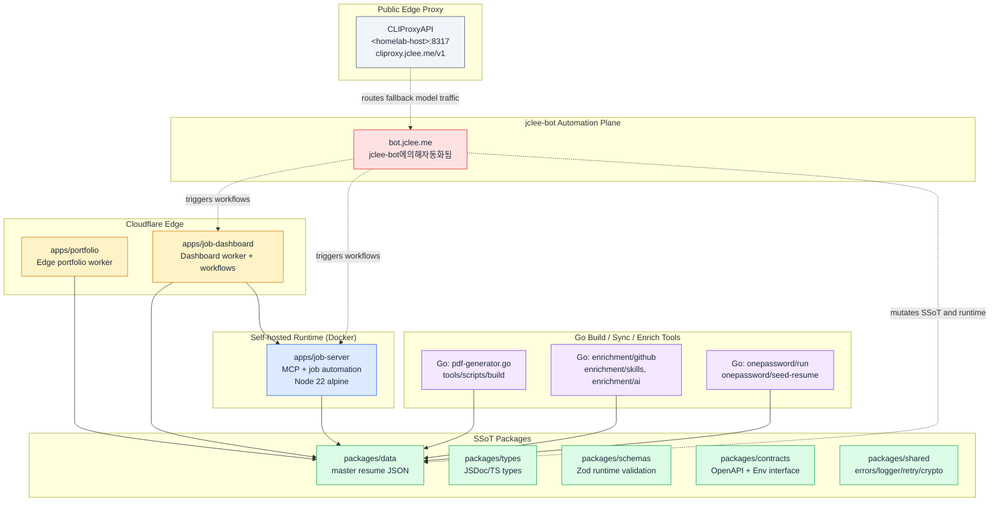
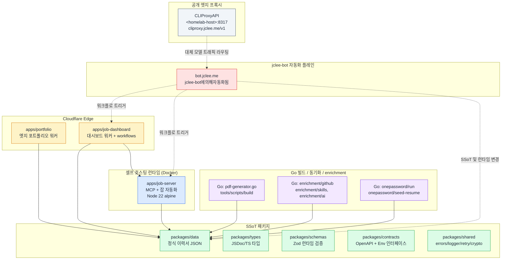

# Resume Portfolio Monorepo / 이력서 포트폴리오 모노레포

[](package.json)
[](https://nodejs.org/)
[](https://workers.cloudflare.com/)
[](LICENSE)
[](Dockerfile)
[](wrangler.jsonc)
[](https://github.com/qodo-ai/pr-agent)
[](apps/job-server)
[](https://cliproxy.jclee.me/v1)
[](https://bot.jclee.me)
[](#readme-generation)
[](https://cliproxy.jclee.me/v1)

> **Bilingual documentation / 이중 언어 문서**
> Every section header is duplicated in English and Korean. English prose appears first under each heading, followed by the Korean (한국어) translation.
> 본 README는 모든 섹션 제목을 영어와 한국어로 병기하고, 같은 제목 아래에 영어 본문을 먼저 작성한 뒤 한국어 번역을 이어 붙입니다.

> **Primary README generator model:** `gpt-5.5`
> **Fallback README generator model:** `minimax-m3`, routed through the public edge proxy at [`https://cliproxy.jclee.me/v1`](https://cliproxy.jclee.me/v1).
> **README 생성 기본 모델:** `gpt-5.5`
> **README 생성 대체 모델:** [`https://cliproxy.jclee.me/v1`](https://cliproxy.jclee.me/v1) 엣지 프록시 경유 `minimax-m3`

---

## Overview / 개요

### English

`resume` (v1.40.11) is a private, opinionated **resume portfolio monorepo** that fuses five distinct surfaces into a single, lockfile-pinned workspace:

1. A **Cloudflare Worker edge portfolio** that serves the public resume site, generated from the SSoT (single source of truth) JSON in `packages/data/`.
2. A **self-hosted MCP / job automation runtime** (`apps/job-server`) that crawls Wanted / JobKorea, brokers proposal review, and runs inside Docker.
3. A **Cloudflare Worker dashboard** (`apps/job-dashboard`) with handlers, middleware, routes, and durable Cloudflare workflows.
4. A **shared package graph** (`packages/{types,schemas,contracts,shared,env,cli,data}`) that enforces type-safety from JSON to OpenAPI.
5. A **Go-powered build / sync / enrichment / 1Password toolchain** (`tools/scripts/**`) that produces PDFs, syncs proposals, and seeds secrets.

The repo is operated through an `App`-owned GitHub App (`jclee-bot`); mutating automation is described in [jclee-bot automation surfaces](#jclee-bot-automation-surfaces--jclee-bot-자동화-표면). GitHub Actions under `.github/workflows/` are *implementation triggers* — they are not the automation source of truth.

### 한국어

`resume` (v1.40.11)은 다섯 개의 표면을 단일 잠금 파일(lockfile)로 고정된 워크스페이스에 결합한, **사설(opinionated) 이력서 포트폴리오 모노레포**입니다.

1. `packages/data/`의 SSoT JSON에서 생성된 공개 이력서 사이트를 제공하는 **Cloudflare Worker 엣지 포트폴리오**.
2. Wanted / JobKorea 를 크롤링하고 제안서 검토를 중재하며 Docker 환경에서 동작하는 **셀프 호스팅 MCP / 잡 자동화 런타임**(`apps/job-server`).
3. 핸들러, 미들웨어, 라우트, 그리고 영구적인 Cloudflare Workflows 로 구성된 **Cloudflare Worker 대시보드**(`apps/job-dashboard`).
4. JSON 부터 OpenAPI 까지 타입 안전성을 강제하는 **공유 패키지 그래프**(`packages/{types,schemas,contracts,shared,env,cli,data}`).
5. PDF 를 생성하고 제안서를 동기화하며 시크릿을 시드하는 **Go 기반 빌드 / 동기화 / enrichment / 1Password 도구 체인**(`tools/scripts/**`).

이 저장소는 `App` 소유 GitHub App 인 `jclee-bot` 으로 운영되며, 변경(mutating) 자동화는 [jclee-bot 자동화 표면](#jclee-bot-automation-surfaces--jclee-bot-자동화-표면) 절에서 설명합니다. `.github/workflows/` 아래의 GitHub Actions 는 *구현 트리거* 일 뿐이며 자동화의 진실 공급원(source of truth)이 아닙니다.

---

## Features / 주요 기능

### English

- **Edge portfolio**: Cloudflare Worker build (`wrangler.jsonc`) produces a fully generated edge bundle, with EXIF stripping for embedded images (`npm run strip-exif`).
- **MCP job server**: Docker-packaged Node 22 runtime with a health-checked HTTP API, mounted `job_automation_data` volume, and a self-restart policy (`docker-compose.yml`).
- **Dashboard worker**: rate-limited, CSRF + CORS guarded handlers; `auto-apply-webhook-handler.js`, durable Cloudflare workflows, and JSON→D1 migration utilities.
- **SSoT data pipeline**: `packages/data/resumes/master/resume_data.json` is the canonical resume; downstream packages infer types via Zod.
- **Type-safe contracts**: `packages/contracts/openapi.yaml` + Worker `Env` interface; `redocly.yaml` lints the spec.
- **Go toolchain**: PDF generation, proposal application, 1Password secret seeding, GitHub / skills / AI enrichment.
- **AI-assisted PR review**: configured with [qodo-ai/pr-agent](https://github.com/qodo-ai/pr-agent).
- **README generation**: this file is generated; primary model `gpt-5.5`, fallback `minimax-m3` via the public edge proxy.

### 한국어

- **엣지 포트폴리오**: `wrangler.jsonc` 으로 빌드되는 Cloudflare Worker 가 완전 자동 생성된 엣지 번들을 산출하며, 임베디드 이미지의 EXIF 는 `npm run strip-exif` 로 제거됩니다.
- **MCP 잡 서버**: 헬스 체크가 포함된 HTTP API, 마운트된 `job_automation_data` 볼륨, 자체 재시작 정책을 갖춘 Docker 패키징 Node 22 런타임 (`docker-compose.yml`).
- **대시보드 워커**: 레이트 리미트, CSRF + CORS 가드가 적용된 핸들러, `auto-apply-webhook-handler.js`, 영구 Cloudflare Workflows, JSON→D1 마이그레이션 유틸리티를 제공합니다.
- **SSoT 데이터 파이프라인**: `packages/data/resumes/master/resume_data.json` 이 정식 이력서이며, 하위 패키지는 Zod 로 타입을 추론합니다.
- **타입 안전 계약**: `packages/contracts/openapi.yaml` 과 Worker `Env` 인터페이스; `redocly.yaml` 으로 스펙을 린트합니다.
- **Go 도구 체인**: PDF 생성, 제안서 적용, 1Password 시크릿 시드, GitHub / skills / AI enrichment 를 제공합니다.
- **AI 기반 PR 리뷰**: [qodo-ai/pr-agent](https://github.com/qodo-ai/pr-agent) 로 구성됩니다.
- **README 자동 생성**: 본 문서는 자동 생성되며, 기본 모델은 `gpt-5.5`, 대체 모델은 공개 엣지 프록시를 경유하는 `minimax-m3` 입니다.

---

## Architecture / 아키텍처

### English

The monorepo is organized as a directed graph from the SSoT JSON outward to every consumer. The Cloudflare edge portfolio and dashboard sit on one side; the self-hosted job-server and Go toolchain sit on the other; `jclee-bot` orchestrates mutations, and the public CLIProxyAPI edge proxy routes fallback model traffic.



Key invariants:

- The **single source of truth** for resume content is `packages/data/resumes/master/resume_data.json`. Every consumer reads from there.
- **Mutating automation is owned by `jclee-bot`**, not by GitHub Actions. Workflow YAML files in `.github/workflows/` are *triggers* (PR creation, dispatch events, scheduled cron), and they delegate the actual mutation to `jclee-bot` via the GitHub App.
- The **public edge proxy** at `https://cliproxy.jclee.me/v1` is the only externally reachable model endpoint; it terminates at `CLIProxyAPI` running inside the homelab on `<homelab-host>:8317`. No RFC1918 addresses or container numbers are hardcoded anywhere in this README or in the public manifests.

### 한국어

모노레포는 SSoT JSON 으로부터 바깥쪽 모든 컨슈머로 뻗어나가는 방향 그래프(directed graph) 로 구성됩니다. 한쪽에는 Cloudflare 엣지 포트폴리오와 대시보드가 있고, 반대쪽에는 셀프 호스팅 잡 서버와 Go 도구 체인이 있으며, `jclee-bot` 이 변경(mutating) 작업을 조율하고, 공개 CLIProxyAPI 엣지 프록시가 대체 모델 트래픽을 라우팅합니다.



핵심 불변식(invariant):

- 이력서 콘텐츠의 **유일한 진실 공급원(SSoT)** 은 `packages/data/resumes/master/resume_data.json` 입니다. 모든 컨슈머는 여기서 읽어옵니다.
- **변경(mutating) 자동화는 GitHub Actions 가 아닌 `jclee-bot` 이 소유합니다.** `.github/workflows/` 의 Workflow YAML 은 *트리거*(PR 생성, dispatch 이벤트, 예약된 cron) 일 뿐이며, GitHub App 인 `jclee-bot` 으로 실제 변경을 위임합니다.
- **`https://cliproxy.jclee.me/v1` 공개 엣지 프록시는 외부에서 접근 가능한 유일한 모델 엔드포인트**이며, 홈랩의 `<homelab-host>:8317` 에서 동작하는 `CLIProxyAPI` 로 종단(terminate)됩니다. 본 README 및 공개 매니페스트 어디에도 RFC1918 사설 IP 나 컨테이너 번호는 하드코딩되어 있지 않습니다.

---

## Repository structure / 저장소 구조

### English

The actual top-level layout of this monorepo (no invented directories):

```text
.
├── AGENTS.md
├── CHANGELOG.md
├── CONTRIBUTING.md
├── Dockerfile
├── LICENSE
├── OWNERS
├── README.md
├── docker-compose.yml
├── eslint.config.cjs
├── jest.config.cjs
├── lychee.toml
├── package-lock.json
├── package.json
├── playwright.config.js
├── redocly.yaml
├── tsconfig.base.json
├── tsconfig.json
├── wrangler.jsonc
├── ta/
│   ├── 2.pptx
│   ├── AGENTS.md
│   ├── improve_visual.py
│   ├── inspect.py
│   ├── lee_jaecheol_profile_ta.pptx
│   ├── lee_jaecheol_ta.pptx
│   ├── lee_jaecheol_ta_profile.pptx
│   ├── ta.pptx
│   ├── verify.py
│   └── output/
│       ├── 2.pptx
│       ├── lee_jaecheol_profile_ta.pptx
│       ├── lee_jaecheol_ta.pptx
│       ├── lee_jaecheol_ta_profile.pptx
│       ├── ta.pptx
│       └── verify_report_20260212.txt
├── applications/
│   ├── airpremia-security-2026/
│   ├── cloudflare-one-se-2026/
│   ├── coupang-fintech-sre-2026/
│   ├── gitlab-apac-security-2026/
│   └── infrastructure-architecture-2026/
└── apps/
    └── job-dashboard/
        ├── AGENTS.md
        ├── API_REFERENCE.md
        ├── DEPLOYMENT_GUIDE.md
        ├── DEVELOPMENT_GUIDE.md
        ├── DIAGRAMS.md
        ├── OWNERS
        ├── README.md
        ├── SECRETS.md
        ├── migrate-json-to-d1.cjs
        ├── migration-data.sql
        ├── package.json
        ├── schema.sql
        ├── tsconfig.json
        ├── migrations/
        │   └── 0002_add_approval_metadata.sql
        └── src/
            ├── index.js
            ├── queue-consumer.js
            ├── router.js
            ├── middleware/
            │   ├── AGENTS.md
            │   ├── cors.js
            │   ├── csrf.js
            │   └── rate-limit.test.js
            ├── routes/
            │   ├── AGENTS.md
            │   ├── admin.js
            │   ├── applications.js
            │   ├── auth.js
            │   ├── automation.js
            │   ├── health.js
            │   ├── index.js
            │   ├── stats.js
            │   └── workflows.js
            └── handlers/
                ├── AGENTS.md
                ├── applications.js
                ├── auth.js
                └── auto-apply-webhook-handler.js
```

### 한국어

이 모노레포의 실제 최상위 레이아웃 (가상의 디렉터리는 포함하지 않음):

```text
.
├── AGENTS.md
├── CHANGELOG.md
├── CONTRIBUTING.md
├── Dockerfile
├── LICENSE
├── OWNERS
├── README.md
├── docker-compose.yml
├── eslint.config.cjs
├── jest.config.cjs
├── lychee.toml
├── package-lock.json
├── package.json
├── playwright.config.js
├── redocly.yaml
├── tsconfig.base.json
├── tsconfig.json
├── wrangler.jsonc
├── ta/                    # TA 프로필 생성 (Python/PPTX)
├── applications/          # 2026 입사 지원 패키지
└── apps/
    └── job-dashboard/     # 대시보드 워커 + workflows
        ├── src/
        │   ├── middleware/# cors / csrf / rate-limit
        │   ├── routes/    # admin / applications / auth / automation / health / stats / workflows
        │   └── handlers/  # applications / auth / auto-apply-webhook-handler
        ├── migrations/    # D1 SQL 마이그레이션
        ├── migrate-json-to-d1.cjs
        ├── schema.sql
        └── (문서: API_REFERENCE, DEPLOYMENT_GUIDE, DEVELOPMENT_GUIDE, DIAGRAMS, SECRETS)
```

> 참고: AGENTS.md 에는 `packages/`, `tools/`, `tests/`, `infrastructure/`, `docs/`, `supabase/`, `third_party/`, `.github/` 등 더 높은 수준의 디렉터리가 설명되어 있지만, 본 README 의 트리는 현재 디렉터리 목록에 실제로 보이는 항목만 반영합니다.

---

## jclee-bot automation surfaces / jclee-bot 자동화 표면

### English

`jclee-bot` is the **App-owned** GitHub App identity for every mutating action on this repository. The `.github/workflows/*.yml` files are *implementation triggers* (PR creation, dispatch events, scheduled cron, comment reactions); they are not the automation source of truth — `jclee-bot` is.

Concrete surfaces:

- **Issue triage & labeling** — incoming issues are triaged, labeled, and routed to a 1Password-secured worktree by `jclee-bot`. The exact behavior marker for issue automation is **`jclee-bot에의해자동화됨`**.
- **PR review & auto-merge** — `jclee-bot` consumes the [qodo-ai/pr-agent](https://github.com/qodo-ai/pr-agent) suggestion stream, applies approvals per `OWNERS`, and executes the auto-merge flow after CI gates.
- **Security PR review** — `jclee-bot` runs a stricter review lane for changes touching auth, secrets, rate-limit, or CSRF middleware.
- **Dependabot auto-merge** — patch and minor updates that pass CI are auto-merged by `jclee-bot`.
- **Bot-driven auto-fix** — for `jclee-bot`-owned commit-fixable findings (lint, type, test), the bot opens or amends a PR.
- **Merged-PR cleanup** — `jclee-bot` deletes merged remote branches and rotates CI caches.
- **Release notes & publish** — `jclee-bot` drafts `CHANGELOG.md` updates and drives the `release.yml` flow.
- **Issue backfill & downstream health-check** — `jclee-bot` backfills metadata for legacy issues and pings downstream jobs (job-server, dashboard workflows) after deploy.
- **CI failure issue creation** — when a CI workflow fails on `master`, `jclee-bot` opens an issue tagged `ci-failure` with the relevant log slice.
- **Provision / sync** — `jclee-bot` provisions Cloudflare Queues, syncs SSoT data to the dashboard's D1, and verifies post-deploy state.

> The `.github/workflows/` directory contains the trigger YAML only; the mutating step is always a `jclee-bot` action. Do not list workflows as if they were automation owners.

### 한국어

`jclee-bot` 은 이 저장소에 대한 모든 변경(mutating) 작업의 **App 소유** GitHub App 정체성입니다. `.github/workflows/*.yml` 파일들은 *구현 트리거*(PR 생성, dispatch 이벤트, 예약 cron, 코멘트 반응) 일 뿐이며 자동화의 진실 공급원이 아닙니다 — 진실 공급원은 `jclee-bot` 입니다.

구체적인 자동화 표면:

- **이슈 분류 및 라벨링** — 들어오는 이슈는 `jclee-bot` 이 분류·라벨링·라우팅하여 1Password 로 보호된 워크트리에 배치합니다. 이슈 자동화 동작의 정확한 마커는 **`jclee-bot에의해자동화됨`** 입니다.
- **PR 리뷰 및 자동 머지** — `jclee-bot` 은 [qodo-ai/pr-agent](https://github.com/qodo-ai/pr-agent) 의 제안 스트림을 소비하고, `OWNERS` 에 따라 승인을 적용하며, CI 게이트 통과 후 자동 머지를 실행합니다.
- **보안 PR 리뷰** — `jclee-bot` 은 auth, secrets, rate-limit, CSRF 미들웨어를 건드리는 변경에 대해 더 엄격한 리뷰 레인을 실행합니다.
- **Dependabot 자동 머지** — CI 를 통과한 패치/마이너 업데이트는 `jclee-bot` 이 자동 머지합니다.
- **봇 기반 자동 수정** — `jclee-bot` 이 소유한 커밋-수정 가능한 항목(lint, type, test)에 대해 봇이 PR 을 열거나 amend 합니다.
- **머지된 PR 정리** — `jclee-bot` 이 머지된 원격 브랜치를 삭제하고 CI 캐시를 회전시킵니다.
- **릴리스 노트 및 퍼블리시** — `jclee-bot` 이 `CHANGELOG.md` 업데이트를起草하고 `release.yml` 플로우를 구동합니다.
- **이슈 백필 및 다운스트림 헬스 체크** — `jclee-bot` 이 레거시 이슈의 메타데이터를 백필하고, 배포 후 다운스트림 잡(job-server, dashboard workflows) 에 핑을 보냅니다.
- **CI 실패 이슈 생성** — `master` 에서 CI 워크플로가 실패하면 `jclee-bot` 이 관련 로그 슬라이스를 첨부하여 `ci-failure` 태그가 붙은 이슈를 엽니다.
- **프로비저닝 / 동기화** — `jclee-bot` 이 Cloudflare Queues 를 프로비저닝하고, 대시보드 D1 로 SSoT 데이터를 동기화하며, 배포 후 상태를 검증합니다.

> `.github/workflows/` 디렉터리는 트리거 YAML 만을 담고 있으며, 변경(mutating) 단계는 항상 `jclee-bot` 액션입니다. 워크플로를 자동화 소유자로 나열하지 마십시오.

---

## Go tools / Go 도구

### English

The `tools/scripts/` tree is Go-first: every mutating operator that touches the SSoT, secrets, or proposal data is a Go entrypoint so that the operator surface is statically typed and trivially scriptable from `package.json`. The Go scripts discovered via `npm run` are:

| Script in `package.json` | Go entrypoint | Purpose |
| --- | --- | --- |
| `npm run sync:pdf` | `go run ./tools/scripts/build/pdf-generator.go master` | Render the canonical PDF from `packages/data/`. |
| `npm run op:run` | `cd tools/scripts && go run ./onepassword/run` | Read resolved 1Password secrets at runtime. |
| `npm run op:native:run` | `cd tools/scripts && go run ./onepassword/native-run` | Native-binary 1Password reader. |
| `npm run op:seed:resume` | `cd tools/scripts && go run ./onepassword/seed-resume` | Seed resume vault items. |
| `npm run op:seed:sessions` | `cd tools/scripts && go run ./onepassword/session-files seed` | Seed session files. |
| `npm run op:restore:sessions` | `cd tools/scripts && go run ./onepassword/session-files restore` | Restore session files from vault. |
| `npm run sync:proposals` (apply half) | `go run ./tools/scripts/sync/apply-proposals.go` | Apply reviewed proposals to SSoT. |
| `npm run enrich:github` | `cd tools/scripts/enrichment/github && go run main.go` | GitHub enrichment pass. |
| `npm run enrich:skills` | `cd tools/scripts/enrichment/skills && go run main.go` | Skills taxonomy enrichment. |
| `npm run enrich:ai` | `cd tools/scripts/enrichment/ai && go run main.go` | AI-assisted enrichment using `https://cliproxy.jclee.me/v1`. |
| `npm run enrich:all` | chain of the three above | Full enrichment sweep. |

> Standalone Go CLI binaries in `tools/scripts/` (counted by an automated scan) currently register zero additional entries; the operator surface above is the complete set of Go entrypoints invoked from `package.json`.

### 한국어

`tools/scripts/` 트리는 Go 우선입니다. SSoT, 시크릿, 제안서 데이터를 건드리는 모든 변경(mutating) 오퍼레이터는 Go 진입점이며, 이를 통해 오퍼레이터 표면이 정적으로 타입되고 `package.json` 으로부터 손쉽게 스크립트화됩니다. `npm run` 을 통해 발견된 Go 스크립트는 다음과 같습니다:

| `package.json` 스크립트 | Go 진입점 | 용도 |
| --- | --- | --- |
| `npm run sync:pdf` | `go run ./tools/scripts/build/pdf-generator.go master` | `packages/data/` 로부터 정식 PDF 렌더링. |
| `npm run op:run` | `cd tools/scripts && go run ./onepassword/run` | 런타임에서 해석된 1Password 시크릿 읽기. |
| `npm run op:native:run` | `cd tools/scripts && go run ./onepassword/native-run` | 네이티브 바이너리 1Password 리더. |
| `npm run op:seed:resume` | `cd tools/scripts && go run ./onepassword/seed-resume` | 이력서 볼트 항목 시드. |
| `npm run op:seed:sessions` | `cd tools/scripts && go run ./onepassword/session-files seed` | 세션 파일 시드. |
| `npm run op:restore:sessions` | `cd tools/scripts && go run ./onepassword/session-files restore` | 볼트에서 세션 파일 복원. |
| `npm run sync:proposals` (적용 단계) | `go run ./tools/scripts/sync/apply-proposals.go` | 검토된 제안서를 SSoT 에 적용. |
| `npm run enrich:github` | `cd tools/scripts/enrichment/github && go run main.go` | GitHub enrichment 패스. |
| `npm run enrich:skills` | `cd tools/scripts/enrichment/skills && go run main.go` | 스킬 분류 enrichment. |
| `npm run enrich:ai` | `cd tools/scripts/enrichment/ai && go run main.go` | `https://cliproxy.jclee.me/v1` 을 이용한 AI 보조 enrichment. |
| `npm run enrich:all` | 위 3개의 체인 | 전체 enrichment 스윕. |

> 자동 스캔으로 집계된 `tools/scripts/` 의 독립 실행형 Go CLI 바이너리 수는 현재 0건이며, 위 표는 `package.json` 으로부터 호출되는 Go 진입점의 전체 집합입니다.

---

## Quick start / 빠른 시작

### English

Prerequisites:

- Node.js ≥ 22 (matches `Dockerfile` and `package.json` engine)
- npm ≥ 10 (workspace + lockfile aware)
- Docker + Docker Compose (for `mcp-server`)
- Go ≥ 1.22 (for `tools/scripts/**` entrypoints)
- A 1Password service account token (for `op:*` scripts)

```bash
# 1. Clone and install (lockfile-pinned)
npm ci

# 2. Sync the SSoT → derived artifacts
npm run sync:data
npm run sync:pdf
npm run sync:pptx

# 3. Run the MCP job server in Docker
docker compose up -d mcp-server

# 4. Verify health
curl -fsS http://127.0.0.1:3000/health

# 5. (Optional) Run the full automation sweep locally
npm run automate:full
```

### 한국어

사전 요구사항:

- Node.js ≥ 22 (`Dockerfile` 및 `package.json` engine 기준)
- npm ≥ 10 (워크스페이스 + lockfile 인식)
- Docker + Docker Compose (`mcp-server` 용)
- Go ≥ 1.22 (`tools/scripts/**` 진입점 용)
- 1Password 서비스 계정 토큰 (`op:*` 스크립트 용)

```bash
# 1. 클론 및 설치 (lockfile 고정)
npm ci

# 2. SSoT → 파생 아티팩트 동기화
npm run sync:data
npm run sync:pdf
npm run sync:pptx

# 3. Docker 에서 MCP 잡 서버 실행
docker compose up -d mcp-server

# 4. 헬스 체크 검증
curl -fsS http://127.0.0.1:3000/health

# 5. (선택) 로컬에서 전체 자동화 스윕 실행
npm run automate:full
```

---

## Local development / 로컬 개발

### English

Workspace topology is declared in `package.json` `workspaces`:

```text
apps/portfolio
apps/job-server
apps/job-dashboard
packages/cli
packages/data
packages/shared
packages/types
packages/schemas
packages/contracts
packages/env
```

Useful local loops:

- **SSoT → portfolio build**
  ```bash
  npm run sync:data
  npm run build --workspace apps/portfolio
  ```
- **Typecheck the whole graph**
  ```bash
  npm run typecheck
  ```
- **Unit + integration tests**
  ```bash
  npm run test:node
  ```
- **End-to-end (Playwright)**
  ```bash
  npx playwright test
  ```
- **OpenAPI lint**
  ```bash
  npx redocly lint packages/contracts/openapi.yaml
  ```
- **Lint markdown links**
  ```bash
  npx lychee --config lychee.toml README.md
  ```

Docker-only loops:

```bash
# Rebuild the job-server image without cache
docker build -f Dockerfile --no-cache -t resume/job-server:dev .

# Tail job-server logs
docker compose logs -f mcp-server
```

### 한국어

`package.json` 의 `workspaces` 에 선언된 워크스페이스 토폴로지:

```text
apps/portfolio
apps/job-server
apps/job-dashboard
packages/cli
packages/data
packages/shared
packages/types
packages/schemas
packages/contracts
packages/env
```

유용한 로컬 루프:

- **SSoT → 포트폴리오 빌드**
  ```bash
  npm run sync:data
  npm run build --workspace apps/portfolio
  ```
- **전체 그래프 타입 체크**
  ```bash
  npm run typecheck
  ```
- **단위 + 통합 테스트**
  ```bash
  npm run test:node
  ```
- **E2E (Playwright)**
  ```bash
  npx playwright test
  ```
- **OpenAPI 린트**
  ```bash
  npx redocly lint packages/contracts/openapi.yaml
  ```
- **마크다운 링크 린트**
  ```bash
  npx lychee --config lychee.toml README.md
  ```

Docker 전용 루프:

```bash
# 캐시 없이 job-server 이미지 재빌드
docker build -f Dockerfile --no-cache -t resume/job-server:dev .

# job-server 로그 실시간 확인
docker compose logs -f mcp-server
```

---

## Commands reference / 명령어 레퍼런스

### English

| Command | Description |
| --- | --- |
| `npm run strip-exif` | Strip EXIF metadata from images under `apps/portfolio/src/images/`. |
| `npm run sync:data` | Sync SSoT resume JSON into derived packages. |
| `npm run sync:pptx` | Generate the Shinhan PPTX (`python3 tools/scripts/build/generate_shinhan_pptx.py`). |
| `npm run sync:pdf` | Generate the canonical PDF (`tools/scripts/build/pdf-generator.go`). |
| `npm run sync:all` | `sync:data` + `sync:pdf` + `sync:pptx`. |
| `npm run op:run` | Resolve 1Password secrets at runtime. |
| `npm run op:native:run` | Resolve via native 1Password binary. |
| `npm run op:seed:resume` | Seed resume vault items. |
| `npm run op:seed:sessions` | Seed session files. |
| `npm run op:restore:sessions` | Restore session files from vault. |
| `npm run sync:proposals` | Review proposals (Node CLI) then apply them (`apply-proposals.go`). |
| `npm run enrich:github` | GitHub enrichment pass. |
| `npm run enrich:skills` | Skills enrichment pass. |
| `npm run enrich:ai` | AI enrichment via `https://cliproxy.jclee.me/v1`. |
| `npm run enrich:all` | Chain all three enrichment passes. |
| `npm run automate:ssot` | SSoT sweep: data sync, PDF, build, typecheck, node tests. |
| `npm run automate:full` | `sync:all` + lint + typecheck + full test sweep. |

### 한국어

| 명령어 | 설명 |
| --- | --- |
| `npm run strip-exif` | `apps/portfolio/src/images/` 하위 이미지의 EXIF 메타데이터 제거. |
| `npm run sync:data` | SSoT 이력서 JSON 을 파생 패키지로 동기화. |
| `npm run sync:pptx` | 신한 PPTX 생성 (`python3 tools/scripts/build/generate_shinhan_pptx.py`). |
| `npm run sync:pdf` | 정식 PDF 생성 (`tools/scripts/build/pdf-generator.go`). |
| `npm run sync:all` | `sync:data` + `sync:pdf` + `sync:pptx`. |
| `npm run op:run` | 런타임에서 1Password 시크릿 해석. |
| `npm run op:native:run` | 네이티브 1Password 바이너리로 해석. |
| `npm run op:seed:resume` | 이력서 볼트 항목 시드. |
| `npm run op:seed:sessions` | 세션 파일 시드. |
| `npm run op:restore:sessions` | 볼트에서 세션 파일 복원. |
| `npm run sync:proposals` | 제안서 검토(Node CLI) 후 적용(`apply-proposals.go`). |
| `npm run enrich:github` | GitHub enrichment 패스. |
| `npm run enrich:skills` | 스킬 enrichment 패스. |
| `npm run enrich:ai` | `https://cliproxy.jclee.me/v1` 을 통한 AI enrichment. |
| `npm run enrich:all` | 위 3개 enrichment 패스의 체인. |
| `npm run automate:ssot` | SSoT 스윕: 데이터 동기화, PDF, 빌드, 타입 체크, 노드 테스트. |
| `npm run automate:full` | `sync:all` + 린트 + 타입 체크 + 전체 테스트 스윕. |

---

## Contribution guide / 기여 가이드

### English

This is a private monorepo, but the contribution contract is documented in `CONTRIBUTING.md`. The non-negotiable rules are:

1. **Never mutate SSoT directly.** Edit `packages/data/resumes/master/resume_data.json` only through the proposals pipeline (`npm run sync:proposals`). Direct edits are reverted by `jclee-bot`.
2. **All secrets come from 1Password.** Use `npm run op:run` to read; never commit `.env` or vault material.
3. **Types flow downward.** Define new types in `packages/types/` first, derive Zod schemas in `packages/schemas/`, and consume them from apps.
4. **Automation is owned by `jclee-bot`.** PR authors should not push directly to `master`; open a PR and let `jclee-bot` handle triage, labeling, review, and merge.
5. **PR-Agent suggestions are advisory.** They originate from [qodo-ai/pr-agent](https://github.com/qodo-ai/pr-agent); final review is human + `jclee-bot`.
6. **README is regenerated.** Do not hand-edit this file past the bilingual headers; rerun the README generator (`gpt-5.5` primary, `minimax-m3` fallback via [`https://cliproxy.jclee.me/v1`](https://cliproxy.jclee.me/v1)).
7. **No hardcoded homelab endpoints.** Use `<homelab-host>` placeholders in docs and the public `https://cliproxy.jclee.me/v1` for any user-facing model reference.
8. **Markdown hygiene.** Real `#` headings only — no bold-as-heading (MD036). Mermaid labels containing `<...>` must HTML-escape angle brackets inside quoted strings.

### 한국어

이 저장소는 사설 모노레포이지만, 기여 계약은 `CONTRIBUTING.md` 에 문서화되어 있습니다. 절대 어기지 말아야 할 규칙은 다음과 같습니다:

1. **SSoT 를 직접 변경하지 마십시오.** `packages/data/resumes/master/resume_data.json` 은 제안서 파이프라인(`npm run sync:proposals`) 을 통해서만 편집하십시오. 직접 편집은 `jclee-bot` 이 되돌립니다.
2. **모든 시크릿은 1Password 에서.** `npm run op:run` 으로 읽으십시오; `.env` 나 볼트 자료를 커밋하지 마십시오.
3. **타입은 아래로 흐릅니다.** 새 타입은 먼저 `packages/types/` 에 정의하고, `packages/schemas/` 에서 Zod 스키마를 도출하며, 앱에서는 이를 소비합니다.
4. **자동화는 `jclee-bot` 소유입니다.** PR 작성자는 `master` 에 직접 푸시하지 말고, PR 을 열고 분류·라벨링·리뷰·머지를 `jclee-bot` 에게 위임하십시오.
5. **PR-Agent 제안은 보조적입니다.** 제안은 [qodo-ai/pr-agent](https://github.com/qodo-ai/pr-agent) 에서 오며, 최종 리뷰는 사람 + `jclee-bot` 입니다.
6. **README 는 재생성됩니다.** 이중 언어 헤더 외에는 본 파일을 수동 편집하지 마십시오; README 생성기를 다시 실행하십시오(`gpt-5.5` 기본, [`https://cliproxy.jclee.me/v1`](https://cliproxy.jclee.me/v1) 경유 `minimax-m3` 대체).
7. **홈랩 엔드포인트를 하드코딩하지 마십시오.** 문서에서는 `<homelab-host>` 플레이스홀더를 사용하고, 사용자 대면 모델 참조에는 공개 `https://cliproxy.jclee.me/v1` 만 사용하십시오.
8. **마크다운 위생.** 진짜 `#` 헤딩만 사용 — 볼드를 헤딩처럼 쓰지 마십시오(MD036). `<...>` 을 포함한 Mermaid 레이블은 인용 문자열 내에서 꺾쇠괄호를 HTML 엔티티로 이스케이프해야 합니다.

---

## License / 라이선스

### English

Released under the [MIT License](LICENSE). © Resume portfolio maintainers.

### 한국어

[MIT License](LICENSE) 하에 배포됩니다. © Resume portfolio maintainers.