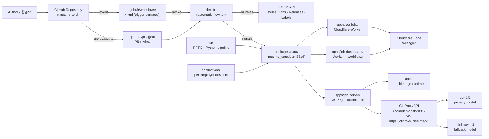

# Resume Portfolio Monorepo / 이력서 포트폴리오 모노레포

`version: 1.40.11` · `Node.js: >=22` · `Docker: enabled` · `Cloudflare Workers: configured` · `Wrangler: configured` · `License: MIT` · `PR-Agent: qodo-ai/pr-agent` · `Bot: jclee-bot` · `README-gen primary: gpt-5.5` · `fallback: minimax-m3 via CLIProxyAPI`

[](#license)
[](https://nodejs.org)
[](#quick-start)
[](#architecture)
[](https://github.com/qodo-ai/pr-agent)
[](#jclee-bot-automation-surfaces)

External surfaces:

- PR-Agent upstream: [qodo-ai/pr-agent](https://github.com/qodo-ai/pr-agent)
- CLIProxyAPI endpoint: [https://cliproxy.jclee.me/v1](https://cliproxy.jclee.me/v1)
- Bot surface: [https://bot.jclee.me](https://bot.jclee.me)

---

## Overview / 개요

### English

This repository is a private resume and job-application automation monorepo. It consolidates bilingual resume artifacts, per-employer application packages, a Cloudflare Worker edge portfolio, a Dockerized MCP/job-automation runtime, a dashboard worker with workflows, and a bot-driven GitHub control plane.

The monorepo is organized around three operational concerns:

1. **Career material management** — author-authored resume content, employer-specific application packages, and TA presentation assets.
   - `applications/` — per-employer dossiers (cover letter, HTML/PDF resume, interview prep, profile assets).
   - `ta/` — Python/PPTX pipeline for generated TA decks, profiles, and verification reports.
2. **Edge runtime and automation** — Cloudflare Worker portfolio, dashboard worker, and the Node.js MCP/job-server runtime.
   - `apps/portfolio/` — public edge site (Wrangler-managed).
   - `apps/job-dashboard/` — dashboard worker, routes, handlers, middleware, migrations, schema, queue consumer.
   - `apps/job-server/` — MCP/job automation runtime (Dockerized via `Dockerfile` / `docker-compose.yml`).
3. **Repository automation** — mutating GitHub operations are owned by the `jclee-bot` application, not by the workflow YAML files themselves. The YAML files in `.github/workflows/` are implementation triggers that invoke bot-owned surfaces; they are not the source of truth for automation behavior.

### 한국어

이 저장소는 비공개 이력서 및 채용 지원 자동화 모노레포입니다. 이중 언어 이력서 자료, 채용처별 지원 패키지, Cloudflare Worker 엣지 포트폴리오, Docker 기반 MCP/잡 자동화 런타임, 워크플로가 포함된 대시보드 워커, 그리고 봇 기반 GitHub 제어 평면을 통합합니다.

모노레포는 다음 세 가지 운영 관심사를 중심으로 구성됩니다.

1. **커리어 자료 관리** — 작성자가 직접 작성한 이력서 콘텐츠, 채용처별 지원 패키지, TA 발표 자료.
   - `applications/` — 채용처별 도시에르(자기소개서, HTML/PDF 이력서, 면접 준비, 프로필 자산).
   - `ta/` — TA 덱·프로필·검증 리포트 생성을 위한 Python/PPTX 파이프라인.
2. **엣지 런타임 및 자동화** — Cloudflare Worker 포트폴리오, 대시보드 워커, Node.js MCP/job-server 런타임.
   - `apps/portfolio/` — 공개 엣지 사이트 (Wrangler 관리).
   - `apps/job-dashboard/` — 대시보드 워커, 라우트, 핸들러, 미들웨어, 마이그레이션, 스키마, 큐 컨슈머.
   - `apps/job-server/` — MCP/잡 자동화 런타임 (`Dockerfile` / `docker-compose.yml` 기반 컨테이너화).
3. **저장소 자동화** — 변이(mutating) GitHub 작업은 워크플로 YAML 파일이 아니라 `jclee-bot` 애플리케이션이 소유합니다. `.github/workflows/`의 YAML 파일은 봇 소유 서페이스를 호출하는 구현 트리거이며, 자동화 동작의 진실의 소스가 아닙니다.

---

## Features / 기능

### English

- Bilingual (Korean / English) resume artifacts with a single source of truth.
- Per-employer application dossiers: cover letter, HTML/PDF resume, interview prep, profile assets.
- Cloudflare Worker edge portfolio (Wrangler-managed) with generated bundle.
- Dockerized MCP / job-automation runtime via multi-stage `Dockerfile` and `docker-compose.yml`.
- Dashboard worker with routes, handlers, middleware, queue consumer, and SQL migrations.
- jclee-bot-owned GitHub control plane for issue, PR, and release automation.
- qodo-ai/pr-agent integration for AI-assisted PR review.
- CLIProxyAPI-backed model access with gpt-5.5 primary and minimax-m3 fallback.
- Shared workspace packages: types, Zod schemas, contracts (OpenAPI), env, data, CLI, shared utilities.
- TA presentation generation pipeline (Python + PPTX) with verification reports.
- Self-hosted observability and n8n automation configs.

### 한국어

- 이중 언어 (한/영) 이력서 자료와 단일 진실의 소스(SSOT).
- 채용처별 도시에르: 자기소개서, HTML/PDF 이력서, 면접 준비, 프로필 자산.
- Wrangler로 관리되는 Cloudflare Worker 엣지 포트폴리오 (생성된 번들).
- 다단계 `Dockerfile`과 `docker-compose.yml`을 통한 Docker 기반 MCP/잡 자동화 런타임.
- 라우트, 핸들러, 미들웨어, 큐 컨슈머, SQL 마이그레이션을 갖춘 대시보드 워커.
- 이슈·PR·릴리스 자동화를 위한 jclee-bot 소유 GitHub 제어 평면.
- AI 지원 PR 리뷰를 위한 qodo-ai/pr-agent 통합.
- gpt-5.5 프라이머리 및 minimax-m3 폴백을 지원하는 CLIProxyAPI 기반 모델 액세스.
- 공유 워크스페이스 패키지: types, Zod 스키마, contracts (OpenAPI), env, data, CLI, shared 유틸리티.
- 검증 리포트를 포함하는 TA 프레젠테이션 생성 파이프라인 (Python + PPTX).
- 자체 호스팅 옵저버빌리티 및 n8n 자동화 구성.

---

## Architecture / 아키텍처

The control plane is bot-owned. Workflow YAML files in `.github/workflows/` are trigger surfaces that invoke `jclee-bot`; mutating behavior is defined inside the bot application itself, not in the YAML.

제어 평면은 봇 소유입니다. `.github/workflows/`의 워크플로 YAML 파일은 `jclee-bot`을 호출하는 트리거 서페이스이며, 변이 동작은 YAML이 아니라 봇 애플리케이션 내부에 정의됩니다.



### Architectural principles / 아키텍처 원칙

- **Single source of truth** — `packages/data/resumes/master/resume_data.json` is the authoritative resume content. Edge site, dashboard, and job-server consume derived artifacts from this file.
- **Bot-owned mutation** — The bot is the only writer of GitHub state for issues, PRs, and releases. Workflows are invocation channels.
- **Typed contracts** — Types live in `packages/types/`, Zod validation in `packages/schemas/`, OpenAPI in `packages/contracts/`.
- **Edge-first delivery** — Public surfaces ship from Cloudflare Workers; long-running automation runs in Docker on the homelab host.
- **Verified README generation** — The README itself is rendered with a documented model pair (gpt-5.5 primary, minimax-m3 fallback via CLIProxyAPI) to keep generation reproducible.

---

## jclee-bot Automation Surfaces / jclee-bot 자동화 서피스

`jclee-bot` is the owner of mutating GitHub operations in this repository. The YAML files under `.github/workflows/` are *trigger surfaces only*; they do not encode the automation policy. Policy and side effects live in the bot application.

`jclee-bot`은 이 저장소에서 변이(mutating) GitHub 작업의 소유자입니다. `.github/workflows/` 아래의 YAML 파일은 *트리거 서페이스일 뿐*이며, 자동화 정책을 인코딩하지 않습니다. 정책과 부수 효과는 봇 애플리케이션 내부에 존재합니다.

### Bot-owned behaviors / 봇 소유 동작

- **Issue triage and labeling** — Issues are triaged, labeled, routed, and closed by the bot. `jclee-bot에의해자동화됨`
- **PR automation** — Branch-to-PR, auto-merge, bot auto-fix, merged-PR cleanup, and dependabot auto-merge are all driven by bot-owned logic.
- **Release automation** — Release notes, release publish, and post-deploy verification are bot-owned; workflows only call into them.
- **Backfill and sync** — Issue backfill, auto-sync-data, and downstream health checks are bot-owned periodic jobs.
- **CI failure handling** — CI-failure issues are opened and managed by the bot.
- **Security PR review** — Security-tagged PRs are reviewed through the bot's policy layer.

### Operator endpoints / 운영자 엔드포인트

- Bot UI / surface: [https://bot.jclee.me](https://bot.jclee.me)
- Model routing via CLIProxyAPI: [https://cliproxy.jclee.me/v1](https://cliproxy.jclee.me/v1)
- PR review upstream: [qodo-ai/pr-agent](https://github.com/qodo-ai/pr-agent)

> Note: workflow file names are intentionally not listed as a feature inventory. They are implementation triggers, not the source of truth for automation behavior. To inspect what a workflow does, read the bot policy that the workflow invokes.

---

## Go Tools / Go 도구

This monorepo embeds Go-based scripts alongside Node.js workspace commands. The Go tools live under `tools/scripts/` and `tools/scripts/onepassword/` and are executed through `npm run` wrappers defined in the root `package.json`. The standalone Go automation-tooling count tracked at the repo level is 0; the items below are *Go-powered workspace scripts* invoked from npm.

이 모노레포는 Node.js 워크스페이스 명령과 함께 Go 기반 스크립트를 포함합니다. Go 도구는 `tools/scripts/` 및 `tools/scripts/onepassword/` 아래에 있으며, 루트 `package.json`에 정의된 `npm run` 래퍼를 통해 실행됩니다. 저장소 차원에서 추적되는 독립형 Go 자동화 도구 수는 0이며, 아래 항목은 npm에서 호출되는 *Go 기반 워크스페이스 스크립트*입니다.

### Build and sync / 빌드 및 동기화

- `npm run sync:pdf` — `go run ./tools/scripts/build/pdf-generator.go master`
- `npm run sync:proposals` — applies proposals via `go run ./tools/scripts/sync/apply-proposals.go`

### 1Password-backed session tooling / 1Password 기반 세션 도구

- `npm run op:run` — `go run ./onepassword/run`
- `npm run op:native:run` — `go run ./onepassword/native-run`
- `npm run op:seed:resume` — `go run ./onepassword/seed-resume`
- `npm run op:seed:sessions` — `go run ./onepassword/session-files seed`
- `npm run op:restore:sessions` — `go run ./onepassword/session-files restore`

### Enrichment jobs / Enrichment 작업

- `npm run enrich:github` — `go run main.go` in `tools/scripts/enrichment/github`
- `npm run enrich:skills` — `go run main.go` in `tools/scripts/enrichment/skills`
- `npm run enrich:ai` — `go run main.go` in `tools/scripts/enrichment/ai`
- `npm run enrich:all` — runs all three enrichment jobs in sequence

---

## Repository Structure / 저장소 구조

The top-level layout below reflects the authoritative layout as documented in `AGENTS.md` and the workspace list in `package.json`. Some leaf directories are summarized; consult `AGENTS.md` for the canonical map.

아래 최상위 레이아웃은 `AGENTS.md` 및 `package.json`의 워크스페이스 목록에 문서화된 권위 있는 레이아웃을 반영합니다. 일부 리프 디렉토리는 요약되어 있으며, 정식 지도는 `AGENTS.md`를 참조하세요.

```text
.
├── AGENTS.md
├── CHANGELOG.md
├── CONTRIBUTING.md
├── Dockerfile
├── LICENSE
├── OWNERS
├── README.md
├── docker-compose.yml
├── eslint.config.cjs
├── jest.config.cjs
├── lychee.toml
├── package.json
├── package-lock.json
├── playwright.config.js
├── redocly.yaml
├── tsconfig.base.json
├── tsconfig.json
├── wrangler.jsonc
├── applications/                # Per-employer application dossiers
│   ├── airpremia-security-2026/
│   ├── cloudflare-one-se-2026/
│   ├── coupang-fintech-sre-2026/
│   ├── gitlab-apac-security-2026/
│   └── infrastructure-architecture-2026/
├── apps/                        # Cloudflare Workers + Node.js runtimes
│   ├── portfolio/               # Public edge site (Wrangler-managed)
│   ├── job-server/              # MCP / job automation runtime (Docker)
│   └── job-dashboard/           # Dashboard worker + workflows
│       ├── src/
│       │   ├── middleware/      # cors, csrf, rate-limit
│       │   ├── routes/          # admin, applications, auth, automation, health, stats, workflows
│       │   └── handlers/        # applications, auth, auto-apply-webhook-handler
│       ├── migrations/          # SQL migrations
│       ├── migrate-json-to-d1.cjs
│       ├── migration-data.sql
│       └── schema.sql
├── packages/                    # Shared workspace packages
│   ├── cli/                     # Resume CLI
│   ├── contracts/               # OpenAPI spec + Worker Env interface
│   ├── data/                    # SSoT resume JSON
│   ├── env/                     # Type-safe env validation
│   ├── schemas/                 # Zod validation
│   ├── shared/                  # errors, logger, retry, crypto, rate-limit, auth, browser, clients
│   └── types/                   # Canonical JSDoc/TS types
├── tools/                       # CI, build, deploy, verification scripts (Go + JS)
├── tests/                       # Jest unit/integration, Playwright E2E
├── infrastructure/              # Cloudflare, monitoring, n8n, DB configs
├── docs/                        # ADRs, guides, architecture, conventions, security
├── ta/                          # TA PPTX generation (Python)
│   ├── improve_visual.py
│   ├── inspect.py
│   ├── verify.py
│   └── output/                  # Generated decks + verify_report_*.txt
├── supabase/                    # Supabase edge functions (Deno)
├── third_party/                 # Vendored external dependencies (npm-managed)
└── .github/                     # CI/release/maintenance control plane (triggers only)
```

---

## Quick Start / 빠른 시작

### Prerequisites / 사전 요구사항

- Node.js `>=22`
- Docker + Docker Compose
- Wrangler CLI (`npx wrangler`)
- A configured CLIProxyAPI reachability at [https://cliproxy.jclee.me/v1](https://cliproxy.jclee.me/v1)

### Bootstrap / 부트스트랩

```bash
# 1. Clone and enter
git clone <repo-url> resume
cd resume

# 2. Install workspace dependencies
npm ci

# 3. Verify SSoT regeneration pipeline
npm run automate:ssot

# 4. (Optional) Run the MCP / job-server runtime in Docker
docker compose up -d mcp-server
curl -sS http://127.0.0.1:3000/health
```

### Where to start reading / 어디서부터 읽기

- `AGENTS.md` — project knowledge base and authoritative structure map.
- `apps/portfolio/` — public edge site.
- `apps/job-dashboard/README.md` — dashboard worker quick reference.
- `apps/job-dashboard/API_REFERENCE.md` and `DEPLOYMENT_GUIDE.md`.
- `packages/data/` — single source of truth for resume content.
- `docs/` — ADRs, architecture, conventions, security.

---

## Local Development / 로컬 개발

### Worker development / 워커 개발

```bash
# Portfolio worker
cd apps/portfolio
npx wrangler dev

# Dashboard worker
cd apps/job-dashboard
npx wrangler dev
```

### Node runtime (job-server) / Node 런타임 (job-server)

```bash
# Without Docker
node apps/job-server/src/server/index.js

# With Docker (matches CI)
docker compose up --build mcp-server
```

### SSoT and derived artifacts / SSoT 및 파생 아티팩트

```bash
# Regenerate JSON data, PDF, and PPTX from the SSoT
npm run sync:all

# Full automation: SSoT -> build -> typecheck -> tests
npm run automate:ssot
```

### Linting, type-checking, testing / 린트, 타입 체크, 테스트

```bash
npm run lint
npm run typecheck
npm run test:node
```

### End-to-end testing / E2E 테스트

```bash
# Playwright
npx playwright test
```

### Self-hosted observability / 자체 호스팅 옵저버빌리티

Long-running automation and observability run on the homelab host. Do not hardcode private IPs into commits; reference placeholders such as `<homelab-host>` and `<homelab-elk>` in documentation and route model traffic through the public CLIProxyAPI endpoint at [https://cliproxy.jclee.me/v1](https://cliproxy.jclee.me/v1).

장기 실행 자동화와 옵저버빌리티는 홈랩 호스트에서 실행됩니다. 비공개 IP를 커밋에 하드코딩하지 마세요. 문서에서는 `<homelab-host>` 및 `<homelab-elk>` 같은 플레이스홀더를 사용하고, 모델 트래픽은 공개 CLIProxyAPI 엔드포인트 [https://cliproxy.jclee.me/v1](https://cliproxy.jclee.me/v1)로 라우팅하세요.

---

## Commands Reference / 명령어 레퍼런스

The root `package.json` defines the operator-facing scripts. The bot invokes many of these from the jclee-bot control plane; the same scripts are also runnable locally.

루트 `package.json`은 운영자용 스크립트를 정의합니다. 봇은 jclee-bot 제어 평면에서 이 중 다수를 호출하며, 동일한 스크립트를 로컬에서도 실행할 수 있습니다.

### Data and content sync / 데이터 및 콘텐츠 동기화

- `npm run sync:data` — regenerate `packages/data` JSON from SSoT.
- `npm run sync:pdf` — generate the master PDF via `go run ./tools/scripts/build/pdf-generator.go master`.
- `npm run sync:pptx` — generate the Shinhan PPTX via the Python pipeline.
- `npm run sync:all` — run `sync:data` → `sync:pdf` → `sync:pptx`.
- `npm run sync:proposals` — apply review proposals (`proposal-review-cli.js` + `go run ./tools/scripts/sync/apply-proposals.go`).
- `npm run strip-exif` — strip EXIF metadata from portfolio images.

### 1Password session tooling / 1Password 세션 도구

- `npm run op:run` / `npm run op:native:run`
- `npm run op:seed:resume`
- `npm run op:seed:sessions` / `npm run op:restore:sessions`

### Enrichment / Enrichment

- `npm run enrich:github` / `npm run enrich:skills` / `npm run enrich:ai`
- `npm run enrich:all`

### Automation pipelines / 자동화 파이프라인

- `npm run automate:ssot` — SSoT → build → typecheck → Node tests.
- `npm run automate:full` — full pipeline (data, PDF, PPTX, lint, typecheck, tests).

### Build, lint, test / 빌드, 린트, 테스트

- `npm run build`
- `npm run lint`
- `npm run typecheck`
- `npm run test:node`
- `npx playwright test`

### Docker / Docker

- `docker compose up -d mcp-server` — start the MCP / job-server runtime.
- `docker compose logs -f mcp-server` — tail runtime logs.

---

## Contribution Guide / 기여 가이드

### English

1. Read `AGENTS.md` first. It is the canonical project knowledge base.
2. Read `CONTRIBUTING.md` for process and policy details.
3. Branch from `master` using the convention enforced by jclee-bot.
4. Keep resume content changes inside `packages/data/resumes/master/resume_data.json` and run `npm run sync:all` to regenerate derived artifacts.
5. Do not hardcode private/internal IP addresses or container numbers in commits; use placeholders such as `<homelab-host>` and `<homelab-elk>`, and route model traffic through [https://cliproxy.jclee.me/v1](https://cliproxy.jclee.me/v1).
6. Do not edit `apps/portfolio/worker.js` directly — it is generated. Edit the source / build pipeline instead.
7. Run the local gate before pushing:
   ```bash
   npm run automate:ssot
   npm run lint
   npm run typecheck
   ```
8. Open a PR. The bot will triage it, request review, and route it through qodo-ai/pr-agent.
9. Automation ownership: any mutating GitHub action (labeling, merging, release, backfill) is owned by `jclee-bot`. Workflows are triggers.

### 한국어

1. 먼저 `AGENTS.md`를 읽으세요. 이 문서가 정식 프로젝트 지식 베이스입니다.
2. 절차 및 정책은 `CONTRIBUTING.md`를 참조하세요.
3. jclee-bot이 강제하는 컨벤션에 따라 `master`에서 브랜치를 생성하세요.
4. 이력서 콘텐츠 변경은 `packages/data/resumes/master/resume_data.json` 안에서 수행하고, `npm run sync:all`을 실행해 파생 아티팩트를 재생성하세요.
5. 비공개/내부 IP 주소나 컨테이너 번호를 커밋에 하드코딩하지 마세요. `<homelab-host>`, `<homelab-elk>` 같은 플레이스홀더를 사용하고, 모델 트래픽은 [https://cliproxy.jclee.me/v1](https://cliproxy.jclee.me/v1)로 라우팅하세요.
6. `apps/portfolio/worker.js`는 생성된 파일이므로 직접 수정하지 마세요. 소스/빌드 파이프라인을 수정하세요.
7. 푸시 전 로컬 게이트를 실행하세요:
   ```bash
   npm run automate:ssot
   npm run lint
   npm run typecheck
   ```
8. PR을 열면 봇이 트리아지, 리뷰 요청, qodo-ai/pr-agent 라우팅을 수행합니다.
9. 자동화 소유권: 라벨링·머지·릴리스·백필 등 변이(mutating) GitHub 작업은 `jclee-bot`이 소유합니다. 워크플로는 트리거일 뿐입니다.

---

## License / 라이선스

MIT — see `LICENSE`.

MIT — 자세한 내용은 `LICENSE`를 참조하세요.