# 레쥬메 모노레포 / Resume Portfolio Monorepo

[](package.json)
[](Dockerfile)
[](docker-compose.yml)
[](wrangler.jsonc)
[](tsconfig.base.json)
[](LICENSE)

이 저장소는 개인 포트폴리오 사이트, 채용 자동화 워커, 단일 진실 공급원(SSoT) 데이터 레이어, 그리고 운영 대시보드를 하나의 npm 워크스페이스 모노레포로 통합한 사설 저장소입니다.

This repository is a private npm workspaces monorepo that unifies a personal portfolio site, job automation tooling, a Single Source of Truth (SSoT) data layer, and an operations dashboard under a single, versioned codebase.

---

## 목차 / Table of Contents

- [개요 / Overview](#overview--개요)
- [주요 기능 / Features](#주요-기능--features)
- [아키텍처 / Architecture](#아키텍처--architecture)
- [저장소 구조 / Repository Structure](#저장소-구조--repository-structure)
- [빠른 시작 / Quick Start](#빠른-시작--quick-start)
- [설정 / Configuration](#설정--configuration)
- [명령어 레퍼런스 / Commands Reference](#명령어-레퍼런스--commands-reference)
- [로컬 개발 / Local Development](#로컬-개발--local-development)
- [테스트 / Testing](#테스트--testing)
- [배포 / Deployment](#배포--deployment)
- [기여 / 기여](#기여--기여)
- [라이선스 / License](#라이선스--license)

---

## Overview / 개요

`package.json`의 `description` 필드는 이 모노레포를 다음과 같이 정의합니다.

> Resume portfolio monorepo: Cloudflare Worker edge site, job automation (Wanted/JobKorea), SSoT data, self-hosted observability

핵심 가치 / Core values:

- **단일 진실 공급원 (SSoT)** — 이력, 프로필, 스킬, 직무 데이터는 `packages/data`에서 한 번 정의되고 포트폴리오, 이력서, PDF, PPTX, 대시보드 등 모든 산출물로 자동 동기화됩니다.
- **엣지 우선 포트폴리오** — `apps/portfolio`는 Cloudflare Worker(`wrangler.jsonc`)로 글로벌 엣지에 배포되어 저지연으로 페이지를 제공합니다.
- **운영 가능한 잡 자동화** — `apps/job-server`(MCP 서버)는 채용 플랫폼(원티드/잡코리아 등)과의 연동, 워크플로우, 통계 집계를 단일 Node.js 프로세스로 처리합니다.
- **운영 대시보드** — `apps/job-dashboard`는 신청, 워크플로우, 통계, 자동화 이벤트를 한 화면에서 운영할 수 있는 UI를 제공합니다.
- **자가 호스팅 옵저버빌리티** — Docker Compose로 띄우는 단일 컨테이너 기반으로, 외부 SaaS 의존 없이 운영 지표를 수집합니다.
- **재현 가능한 산출물** — `tools/scripts`의 동기화 스크립트는 Go와 Python으로 작성되어 PDF, PPTX, JSON 산출물을 결정론적으로 생성합니다.

---

## 주요 기능 / Features

### 1. SSoT 데이터 레이어 / Single Source of Truth Data Layer

- `packages/data`에 정규화된 이력/프로필/스킬/직무 정의를 보관합니다.
- `npm run sync:data`로 모든 산출물(포트폴리오, PDF, PPTX, 대시보드 입력)을 재생성합니다.
- `packages/schemas`, `packages/types`, `packages/contracts`, `packages/env`가 스키마·타입·환경변수 계약을 단일화합니다.

### 2. 엣지 포트폴리오 사이트 / Edge Portfolio Site (`apps/portfolio`)

- Cloudflare Worker 기반의 정적·동적 자산 제공.
- `wrangler.jsonc`로 환경별(development, preview, production) 배포 정의.
- `redocly.yaml`로 OpenAPI/Redoc 문서 산출물 검증.
- EXIF 메타데이터 제거(`npm run strip-exif`)로 개인정보 노출 최소화.

### 3. 잡 자동화 서버 / Job Automation Server (`apps/job-server`)

- Node.js 22 기반 MCP(Model Context Protocol) 호환 서버.
- 원티드, 잡코리아 등 채용 플랫폼 연동 어댑터.
- 워크플로우 라우팅, 통계 집계, 신청 이벤트 핸들링.
- Dockerfile의 멀티 스테이지 빌드와 Docker Compose로 단일 컨테이너 배포.
- `HEALTHCHECK` 엔드포인트로 컨테이너 헬스 모니터링.

### 4. 운영 대시보드 / Operations Dashboard (`apps/job-dashboard`)

- Cloudflare Workers + D1(SQLite) 기반.
- 신청(Applications), 워크플로우(Workflows), 통계(Stats), 자동화(Automation), 어드민(Admin) 라우트 분리.
- CORS, CSRF, Rate Limit 미들웨어 내장.
- JSON → D1 마이그레이션 스크립트(`migrate-json-to-d1.cjs`) 제공.
- SQL 마이그레이션(`migrations/*.sql`)로 스키마 진화 추적.

### 5. 동기화 및 보강 도구 / Sync and Enrichment Tooling

- `tools/scripts/build`의 Python/Go 스크립트로 PDF, PPTX 산출물 빌드.
- `tools/scripts/enrichment/{github,skills,ai}` 모듈로 GitHub 활동, 스킬 인벤토리, AI 보강 데이터를 동기화.
- `tools/scripts/sync`의 제안 적용 도구로 데이터 변경을 안전하게 반영.
- `tools/scripts/onepassword` 도구군으로 시크릿/세션을 안전하게 시드/복원.

### 6. 보조 산출물 / Supporting Artifacts

- `applications/` — 기업별 맞춤 이력서, 커버레터, 지원 가이드(PDF/HTML/MD).
- `ta/` — TA(Teaching Assistant) 관련 PPTX 템플릿과 Python 검증/개선 스크립트.

---

## 아키텍처 / Architecture

```mermaid
flowchart TB
  subgraph SSOT["SSoT Data Layer"]
    DATA["packages/data<br/>(Canonical resume,<br/>skills, profiles)"]
  end

  subgraph SHARED["Shared Packages (npm workspaces)"]
    SHARED_PKG["packages/shared"]
    SCHEMAS["packages/schemas"]
    TYPES["packages/types"]
    CONTRACTS["packages/contracts"]
    ENV["packages/env"]
    CLI["packages/cli"]
  end

  subgraph APPS["Applications"]
    PORTFOLIO["apps/portfolio<br/>Cloudflare Worker<br/>edge portfolio site"]
    JOBSERVER["apps/job-server<br/>MCP server<br/>job automation"]
    JOBDASH["apps/job-dashboard<br/>Operations dashboard<br/>Workers + D1"]
  end

  subgraph TOOLS["Build and Sync Tooling"]
    SYNC["tools/scripts/build<br/>(Python, Go)"]
    ENRICH["tools/scripts/enrichment<br/>(github, skills, ai)"]
    OPSCRIPTS["tools/scripts/onepassword<br/>(secret &amp; session utils)"]
  end

  subgraph ARTIFACTS["Generated Artifacts"]
    PDFOUT["applications/*&#47;*.pdf"]
    PPTOUT["ta&#47;*.pptx"]
    HTMLOUT["applications/*&#47;*.html"]
  end

  subgraph EXTERNAL["External Surfaces"]
    CF["Cloudflare Edge<br/>(Workers, D1, KV)"]
    PLATFORMS["Wanted &#47; JobKorea<br/>(and more)"]
    OBS["Self-hosted<br/>observability"]
  end

  DATA --> PORTFOLIO
  DATA --> JOBSERVER
  DATA --> JOBDASH
  SHARED_PKG --> PORTFOLIO
  SHARED_PKG --> JOBSERVER
  SHARED_PKG --> JOBDASH
  SCHEMAS --> JOBSERVER
  SCHEMAS --> JOBDASH
  TYPES --> PORTFOLIO
  TYPES --> JOBSERVER
  TYPES --> JOBDASH
  CONTRACTS --> JOBDASH
  ENV --> JOBSERVER
  CLI --> JOBSERVER

  DATA --> SYNC
  SYNC -->|"PDF"| PDFOUT
  SYNC -->|"PPTX"| PPTOUT
  SYNC -->|"HTML"| HTMLOUT
  DATA --> ENRICH
  OPSCRIPTS --> JOBSERVER

  PORTFOLIO --> CF
  JOBDASH --> CF
  JOBSERVER --> PLATFORMS
  JOBSERVER --> OBS
```



핵심 의존 방향 / Key dependency directions:

- `packages/data` → 모든 앱과 도구가 단방향으로 소비합니다.
- `apps/*`는 `packages/*`의 공통 코드를 사용하며, 워크스페이스 심볼릭 링크로 공유됩니다.
- `tools/scripts`는 빌드 타임 전용이며 런타임 의존성에는 포함되지 않습니다(Dockerfile의 멀티 스테이지가 검증).

---

## 저장소 구조 / Repository Structure

```
.
├── AGENTS.md                # 에이전트/협업 가이드
├── CHANGELOG.md             # 릴리스 노트
├── CONTRIBUTING.md          # 기여 가이드
├── Dockerfile               # job-server 멀티 스테이지 빌드
├── LICENSE                  # 사설 라이선스
├── OWNERS                   # 코드 오너십
├── README.md                # 이 문서
├── docker-compose.yml       # MCP 서버 컨테이너 정의
├── eslint.config.cjs        # ESLint 설정
├── jest.config.cjs          # Jest 설정
├── lychee.toml              # 링크 체커 설정
├── package.json             # 루트 워크스페이스 매니페스트
├── package-lock.json        # 의존성 잠금 파일
├── playwright.config.js     # Playwright E2E 설정
├── redocly.yaml             # Redocly OpenAPI 린트 설정
├── tsconfig.base.json       # 공통 TypeScript 설정
├── tsconfig.json            # 루트 TypeScript 설정
├── wrangler.jsonc           # Cloudflare Workers 설정
├── ta/                      # TA 관련 PPTX 템플릿 및 Python 스크립트
├── applications/            # 기업별 지원 패키지(cover letter, resume 등)
└── apps/                    # 런타임 애플리케이션 (npm workspaces)
    ├── portfolio/           # Cloudflare Worker 포트폴리오 사이트
    ├── job-server/          # 잡 자동화 MCP 서버
    └── job-dashboard/       # 운영 대시보드 (Workers + D1)
```

워크스페이스 패키지 / Workspace packages (`package.json`의 `workspaces`):

```
apps/
├── portfolio/        # Cloudflare Worker 포트폴리오
├── job-server/       # Node.js MCP 서버
└── job-dashboard/    # 운영 대시보드 Workers 앱

packages/
├── cli/              # 공통 CLI 도구
├── data/             # SSoT 데이터 정의
├── shared/           # 공통 유틸리티
├── types/            # 공통 타입
├── schemas/          # 검증 스키마 (Zod 등)
├── contracts/        # API/DTO 계약
└── env/              # 환경 변수 정의/검증
```

---

## 빠른 시작 / Quick Start

### 요구 사항 / Prerequisites

- Node.js 22 (Dockerfile 기준)
- npm 10+
- Docker 및 Docker Compose v2 (`apps/job-server` 로컬 실행 시)
- Wrangler (`apps/portfolio`, `apps/job-dashboard` 배포 시)
- Python 3 (PPTX 동기화 시)
- Go 1.22+ (Go 기반 동기화/보강 스크립트 실행 시)

### 설치 / Install

```bash
# 1. 의존성 설치 (루트 워크스페이스 + 모든 packages/*, apps/*)
npm ci

# 2. (선택) 1Password 시크릿 시드
npm run op:seed:resume

# 3. SSoT 데이터 동기화
npm run sync:data

# 4. PDF / PPTX 산출물 빌드
npm run sync:all
```

### 첫 실행 / First Run

```bash
# 잡 자동화 MCP 서버를 Docker로 띄우기
docker compose up -d mcp-server

# 헬스 체크
curl -fsS http://127.0.0.1:3000/health
```

```bash
# 포트폴리오 로컬 개발 서버 (Wrangler)
cd apps/portfolio
npx wrangler dev

# 대시보드 로컬 개발 서버 (Wrangler)
cd apps/job-dashboard
npx wrangler dev
```

---

## 설정 / Configuration

### 환경 변수 / Environment Variables

루트에 `.env` 파일을 생성합니다. `docker-compose.yml`은 `env_file: .env`를 사용합니다.

| 변수 | 설명 | 필수 여부 |
| --- | --- | --- |
| `NODE_ENV` | 런타임 모드 (`development`/`production`) | 권장 |
| `PORT` | `job-server`가 수신할 포트 (기본 3000) | 선택 |
| `CLOUDFLARE_ACCOUNT_ID` | Cloudflare Workers 배포용 | 배포 시 |
| `CLOUDFLARE_API_TOKEN` | Cloudflare API 토큰 | 배포 시 |
| `D1_DATABASE_ID` | `job-dashboard`의 D1 DB ID | 배포 시 |
| `JOB_PLATFORM_*` | 채용 플랫폼 어댑터 자격 증명 | 연동 시 |
| `OP_SERVICE_ACCOUNT_TOKEN` | 1Password 서비스 계정 토큰 | `op:*` 스크립트 사용 시 |

`packages/env`가 환경 변수 스키마와 검증을 제공하므로, 누락된 값은 부트스트랩 시점에 명시적으로 실패합니다.

### Cloudflare 설정 / Cloudflare Configuration

- `wrangler.jsonc`는 환경별(예: `dev`, `preview`, `production`) 바인딩(KV, D1, Durable Object, Queue)을 정의합니다.
- `apps/job-dashboard`의 라우터는 `src/router.js`에서 환경별 미들웨어를 조립합니다.

### 1Password 통합 / 1Password Integration

`tools/scripts/onepassword`는 다음과 같은 시크릿 라이프사이클을 제공합니다.

- `run` — 필요 시크릿을 1Password에서 안전하게 가져와 환경에 주입.
- `native-run` — 1Password 네이티브 CLI 통합.
- `seed-resume` — 신규 환경에서 SSoT 시크릿 시드.
- `session-files seed|restore` — 세션 파일 백업 및 복원.

---

## 명령어 레퍼런스 / Commands Reference

루트 `package.json`의 스크립트(발췌, 전체 목록은 `package.json` 참조):

### 데이터 동기화 / Data Synchronization

| 명령어 | 설명 |
| --- | --- |
| `npm run sync:data` | `packages/data` → `apps/*` 및 보조 산출물로 JSON 동기화 |
| `npm run sync:pdf` | Go 기반 PDF 생성기 실행 |
| `npm run sync:pptx` | Python 기반 PPTX 생성기 실행 |
| `npm run sync:all` | `sync:data` + `sync:pdf` + `sync:pptx` 일괄 실행 |
| `npm run sync:proposals` | 제안 검토 CLI + Go 적용 스크립트 실행 |
| `npm run strip-exif` | 포트폴리오 이미지의 EXIF 메타데이터 제거 |

### 보강 / Enrichment

| 명령어 | 설명 |
| --- | --- |
| `npm run enrich:github` | GitHub 활동 기반 프로필 보강 |
| `npm run enrich:skills` | 스킬 인벤토리 보강 |
| `npm run enrich:ai` | AI 보조 메타데이터 보강 |
| `npm run enrich:all` | 위 보강 작업 일괄 실행 |

### 1Password / 운영

| 명령어 | 설명 |
| --- | --- |
| `npm run op:run` | 1Password 시크릿으로 환경 채워서 명령 실행 |
| `npm run op:native:run` | 1Password 네이티브 CLI로 실행 |
| `npm run op:seed:resume` | SSoT 시크릿 시드 |
| `npm run op:seed:sessions` | 세션 파일 시드 |
| `npm run op:restore:sessions` | 세션 파일 복원 |

### 자동화 파이프라인 / Automation Pipelines

| 명령어 | 설명 |
| --- | --- |
| `npm run automate:ssot` | 데이터 동기화 → 빌드 → 타입체크 → 노드 테스트 |
| `npm run automate:full` | 전체 동기화 + 린트 + 타입체크(정의는 `package.json` 참조) |

### 표준 워크플로우 / Standard Workflows

루트에서 일반적인 워크플로우:

```bash
npm run lint          # ESLint (eslint.config.cjs)
npm run typecheck     # TypeScript (tsconfig.base.json)
npm run test:node     # Jest (jest.config.cjs)
npm run test:e2e      # Playwright (playwright.config.js)
npm run build         # 프로덕션 빌드
```

---

## 로컬 개발 / Local Development

### 워크스페이스 심볼릭 링크

npm workspaces는 `packages/*` ↔ `apps/*`를 자동으로 심볼릭 링크합니다. 별도 `npm link` 없이 로컬 변경이 즉시 반영됩니다.

### 포트폴리오 / Portfolio

```bash
cd apps/portfolio
npx wrangler dev                # 로컬 Workers 런타임
npx wrangler tail               # 실시간 로그
npx wrangler deploy             # Cloudflare 엣지 배포
```

### 잡 서버 / Job Server

```bash
# 개발 모드 (호스트에서 직접 실행)
cd apps/job-server
npm run dev                     # nodemon 또는 동등한 개발 스크립트

# 컨테이너 실행
docker compose up --build mcp-server
docker compose logs -f mcp-server
```

### 대시보드 / Dashboard

```bash
cd apps/job-dashboard

# 로컬 D1 마이그레이션 적용
npx wrangler d1 migrations apply DB --local

# 원격 D1 마이그레이션 적용
npx wrangler d1 migrations apply DB --remote

# JSON → D1 일회성 마이그레이션
node migrate-json-to-d1.cjs

# 로컬 개발
npx wrangler dev
```

### 코드 품질 / Code Quality

- ESLint: `eslint.config.cjs` (flat config)
- TypeScript: `tsconfig.base.json`에서 strict 모드 기본값 제공
- Pre-commit 훅은 저장소 정책에 따라 CONTRIBUTING.md를 따릅니다.

---

## 테스트 / Testing

### 단위 테스트 / Unit Tests (Jest)

```bash
npm run test:node
# 또는 워크스페이스 단위
npx jest apps/job-dashboard/src/middleware/rate-limit.test.js
```

- `jest.config.cjs`가 워크스페이스 전반의 테스트를 수집합니다.
- `apps/job-dashboard`에는 미들웨어/라우트 단위 테스트가 포함되어 있습니다.

### E2E 테스트 (Playwright)

```bash
npm run test:e2e
```

- `playwright.config.js`로 대시보드/포트폴리오의 사용자 시나리오를 검증합니다.
- 첫 실행 전 `npx playwright install`로 브라우저 바이너리를 설치합니다.

### 링크 검증 (Lychee)

```bash
# lychee.toml 구성에 따라 마크다운/문서 링크의 유효성 검증
npx lychee '**/*.md'
```

### OpenAPI 검증 (Redocly)

```bash
npx redocly lint path/to/openapi.yaml
```

- `redocly.yaml`로 린트 규칙과 데코레이터를 정의합니다.

### TA 산출물 검증 (Python)

```bash
# ta/ 디렉터리의 PPTX 무결성/시각적 개선 스크립트
python3 ta/verify.py
python3 ta/improve_visual.py
```

---

## 배포 / Deployment

### Cloudflare Workers

- **포트폴리오** — `wrangler.jsonc`의 기본 환경으로 `apps/portfolio`를 배포.
- **대시보드** — `apps/job-dashboard`의 D1 마이그레이션을 적용한 뒤 Workers로 배포.
- D1 마이그레이션은 `migrations/*.sql`로 추적되며, 배포 파이프라인에서 `wrangler d1 migrations apply`가 호출됩니다.

### Docker (MCP Server)

```bash
docker compose build mcp-server
docker compose up -d mcp-server
```

- `Dockerfile`은 `deps` → `runtime` 두 단계로 구성되어, `apps/job-server`와 그 워크스페이스 의존성만 최종 이미지에 포함합니다.
- `docker-compose.yml`의 `volumes.job_automation_data`는 호스트에 영속화됩니다.
- `HEALTHCHECK`가 `/health` 엔드포인트를 30초 주기로 폴링합니다.

### 데이터 마이그레이션 / Data Migration

```bash
# JSON → D1 일회성 이관
node apps/job-dashboard/migrate-json-to-d1.cjs

# SQL 스키마 진화
npx wrangler d1 migrations apply <DB_NAME> --remote
```

---

## 기여 / 기여

기여 절차는 [`CONTRIBUTING.md`](CONTRIBUTING.md)를 따릅니다. 요약:

1. 이슈 등록 또는 기존 이슈에 코멘트로 변경 의도 공유.
2. 기능 브랜치 생성(`feature/`, `fix/`, `chore/` 등 컨벤션 준수).
3. 커밋 전 `npm run lint && npm run typecheck && npm run test:node` 통과 확인.
4. Pull Request 제출 시 체크리스트와 관련 이슈 번호 명시.
5. 코드 오너십은 [`OWNERS`](OWNERS) 파일을 참조합니다.

기여 시 비밀 키, 자격 증명, 1Password 토큰 등 민감 정보를 커밋에 포함하지 마세요. 시크릿은 `tools/scripts/onepassword` 도구를 통해 안전하게 주입됩니다.

---

## 라이선스 / License

이 저장소는 사설(private) 저장소이며 [`LICENSE`](LICENSE)에 명시된 조건에 따라 운영됩니다. 외부 배포나 재사용은 허용되지 않습니다.

This repository is private and governed by the terms in [`LICENSE`](LICENSE). External redistribution or reuse is not permitted.