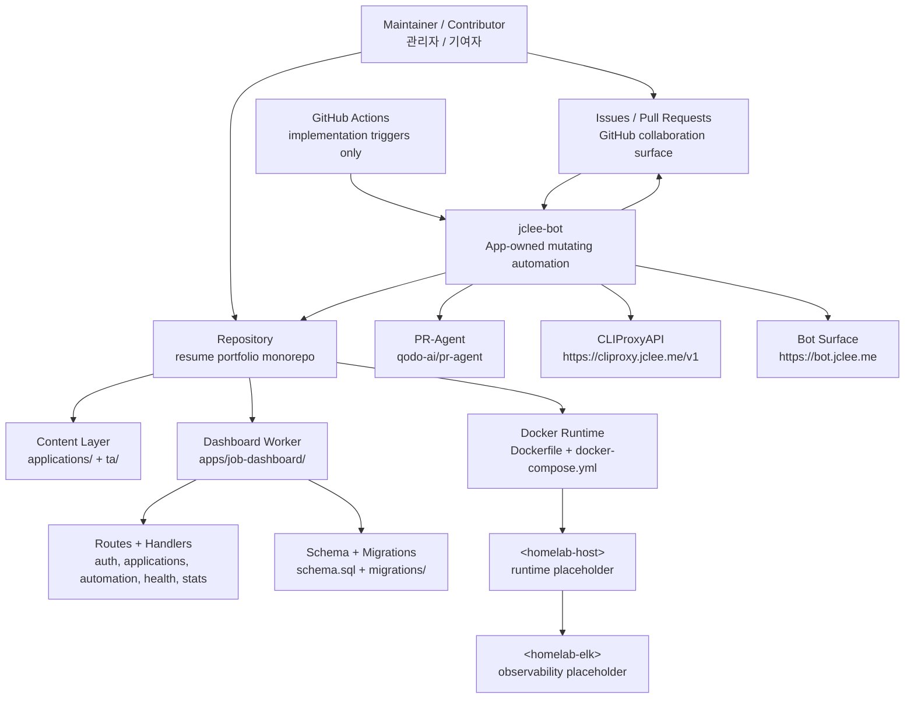

# Resume Portfolio Monorepo / 이력서 포트폴리오 모노레포

`version: 1.40.11` `Node.js: >=22` `Docker: enabled` `Cloudflare Workers: configured` `Wrangler: configured` `License: MIT` `PR-Agent: qodo-ai/pr-agent` `Bot: jclee-bot` `README-gen: gpt-5.5` `fallback: minimax-m3 via CLIProxyAPI`

- PR-Agent: [qodo-ai/pr-agent](https://github.com/qodo-ai/pr-agent)
- CLIProxyAPI endpoint: [https://cliproxy.jclee.me/v1](https://cliproxy.jclee.me/v1)
- Bot surface: [https://bot.jclee.me](https://bot.jclee.me)

---

## Overview / 개요

### English

This repository is a private resume and job-application automation monorepo. It combines resume artifacts, application packages, Cloudflare Worker dashboard code, Dockerized runtime configuration, CI/release automation, and bot-owned GitHub operations.

The repository is centered around three operational concerns:

1. Resume and career material management
   - Resume/application documents under `applications/`
   - TA presentation assets under `ta/`
   - Generated and reviewed candidate-facing files such as PDFs, HTML resumes, cover letters, and profile decks

2. Job dashboard and automation APIs
   - Cloudflare Worker-oriented dashboard code under `apps/job-dashboard/`
   - Routes, handlers, middleware, migrations, and schema files for application tracking and automation metadata

3. Repository automation
   - Mutating GitHub automation is owned by `jclee-bot`
   - GitHub workflow files are implementation triggers only, not the automation source of truth
   - Bot behavior is described by App-owned automation surfaces and repository policy, not by treating workflow YAML files as product features

The root `package.json` identifies the project as:

> Resume portfolio monorepo: Cloudflare Worker edge site, job automation, SSoT data, self-hosted observability

Current README generation metadata:

- Primary model: `gpt-5.5`
- Fallback model: `minimax-m3` via [https://cliproxy.jclee.me/v1](https://cliproxy.jclee.me/v1)

### 한국어

이 저장소는 이력서 및 채용 지원 자동화를 위한 비공개 모노레포입니다. 이력서 산출물, 지원서 패키지, Cloudflare Worker 기반 대시보드 코드, Docker 런타임 설정, CI/릴리스 자동화, 봇 소유 GitHub 운영을 하나의 저장소에서 관리합니다.

저장소의 핵심 운영 영역은 다음 세 가지입니다.

1. 이력서 및 커리어 자료 관리
   - `applications/` 아래의 이력서/지원서 문서
   - `ta/` 아래의 TA 발표 자료
   - PDF, HTML 이력서, 자기소개서, 프로필 덱 등 지원자용 산출물

2. 채용 대시보드 및 자동화 API
   - `apps/job-dashboard/` 아래의 Cloudflare Worker 지향 대시보드 코드
   - 지원 현황, 자동화 메타데이터, 인증, 관리자 기능을 위한 라우트/핸들러/미들웨어/마이그레이션/스키마

3. 저장소 자동화
   - 변경을 수행하는 GitHub 자동화는 `jclee-bot`이 소유합니다.
   - GitHub workflow 파일은 구현 트리거일 뿐이며 자동화의 원천 정보가 아닙니다.
   - 봇 동작은 workflow YAML 목록이 아니라 App 소유 자동화 표면과 저장소 정책으로 설명합니다.

루트 `package.json` 기준 프로젝트 설명은 다음과 같습니다.

> Resume portfolio monorepo: Cloudflare Worker edge site, job automation, SSoT data, self-hosted observability

README 생성 메타데이터:

- 기본 모델: `gpt-5.5`
- 대체 모델: [https://cliproxy.jclee.me/v1](https://cliproxy.jclee.me/v1)을 경유하는 `minimax-m3`

---

## Features / 주요 기능

### English

- Resume portfolio monorepo
  - Centralized repository for resumes, cover letters, job-specific application packs, TA profile slides, and related generated artifacts.

- Cloudflare Worker dashboard
  - `apps/job-dashboard/` contains Worker-oriented dashboard code with routes for applications, authentication, automation, health checks, stats, and workflow-related API surfaces.

- Job application tracking
  - Application-specific directories under `applications/` preserve role-specific resumes, cover letters, previews, guides, and interview preparation notes.

- Automation-aware API layout
  - Dashboard handlers and routes separate concerns for admin operations, applications, authentication, automation webhooks, health, stats, and workflow state.

- Dockerized runtime
  - `Dockerfile` and `docker-compose.yml` define a Node.js 22 Alpine runtime intended for a job automation server process.
  - The Compose service exposes port `3000` and includes a persistent volume for runtime data.

- Bot-owned GitHub mutation
  - Mutating automation is owned by `jclee-bot`.
  - Pull request, issue, dependency, release, cleanup, failure-reporting, and synchronization behavior is triggered through GitHub Actions but should be reasoned about as bot-owned automation surfaces.

- PR review integration
  - Repository documentation references PR-Agent through [qodo-ai/pr-agent](https://github.com/qodo-ai/pr-agent).

- Edge model fallback
  - README generation and other model-backed automation may fall back through [https://cliproxy.jclee.me/v1](https://cliproxy.jclee.me/v1).

### 한국어

- 이력서 포트폴리오 모노레포
  - 이력서, 자기소개서, 직무별 지원 패키지, TA 프로필 슬라이드, 관련 생성 산출물을 중앙 저장소에서 관리합니다.

- Cloudflare Worker 대시보드
  - `apps/job-dashboard/`에는 지원서, 인증, 자동화, 헬스 체크, 통계, 워크플로 상태 API를 위한 Worker 지향 대시보드 코드가 포함되어 있습니다.

- 채용 지원 이력 관리
  - `applications/` 아래의 직무별 디렉터리에 역할별 이력서, 자기소개서, 미리보기, 지원 가이드, 인터뷰 준비 자료를 보관합니다.

- 자동화 친화적 API 구조
  - 대시보드 핸들러와 라우트는 관리자 기능, 지원서, 인증, 자동화 웹훅, 헬스 체크, 통계, 워크플로 상태를 역할별로 분리합니다.

- Docker 런타임
  - `Dockerfile`과 `docker-compose.yml`은 Node.js 22 Alpine 기반의 잡 자동화 서버 런타임을 정의합니다.
  - Compose 서비스는 `3000` 포트를 노출하고 런타임 데이터 보존을 위한 볼륨을 사용합니다.

- 봇 소유 GitHub 변경 자동화
  - 변경을 수행하는 자동화는 `jclee-bot`이 소유합니다.
  - PR, 이슈, 의존성, 릴리스, 정리, 실패 보고, 동기화 동작은 GitHub Actions를 통해 트리거되지만, 자동화의 개념적 소유자는 봇입니다.

- PR 리뷰 연동
  - 저장소 문서는 [qodo-ai/pr-agent](https://github.com/qodo-ai/pr-agent)를 통한 PR-Agent 연동을 참조합니다.

- 엣지 모델 대체 경로
  - README 생성 및 모델 기반 자동화는 [https://cliproxy.jclee.me/v1](https://cliproxy.jclee.me/v1)을 통해 대체 모델로 전환될 수 있습니다.

---

## Architecture / 아키텍처

### English

The repository has three layers:

1. Content layer
   - Resume/application artifacts in `applications/`
   - TA presentation and verification artifacts in `ta/`

2. Application/API layer
   - `apps/job-dashboard/` Worker dashboard
   - Routes, handlers, middleware, SQL schema, and migrations

3. Automation/control layer
   - GitHub Actions as trigger implementation
   - `jclee-bot` as mutating automation owner
   - CLIProxyAPI as model fallback edge surface
   - Docker Compose as local/runtime packaging surface



### 한국어

이 저장소는 세 계층으로 볼 수 있습니다.

1. 콘텐츠 계층
   - `applications/`의 이력서/지원서 산출물
   - `ta/`의 발표 및 검증 산출물

2. 애플리케이션/API 계층
   - `apps/job-dashboard/` Worker 대시보드
   - 라우트, 핸들러, 미들웨어, SQL 스키마, 마이그레이션

3. 자동화/제어 계층
   - GitHub Actions는 구현 트리거 역할
   - `jclee-bot`은 변경 자동화의 소유자
   - CLIProxyAPI는 모델 대체 엣지 표면
   - Docker Compose는 로컬/런타임 패키징 표면

주의: 다이어그램의 `<homelab-host>` 및 `<homelab-elk>`는 실제 내부 주소가 아니라 런타임/관측성 대상을 표현하는 플레이스홀더입니다.

---

## Repository Structure / 저장소 구조

### English

The current top-level layout provided for this repository is:

```text
/
├── AGENTS.md
├── CHANGELOG.md
├── CONTRIBUTING.md
├── Dockerfile
├── LICENSE
├── OWNERS
├── README.md
├── docker-compose.yml
├── eslint.config.cjs
├── jest.config.cjs
├── lychee.toml
├── package-lock.json
├── package.json
├── playwright.config.js
├── redocly.yaml
├── tsconfig.base.json
├── tsconfig.json
├── wrangler.jsonc
├── ta/
├── applications/
└── apps/
    └── job-dashboard/
```

Important visible subtrees:

```text
ta/
├── AGENTS.md
├── improve_visual.py
├── inspect.py
├── verify.py
├── *.pptx
└── output/
    ├── *.pptx
    └── verify_report_20260212.txt

applications/
├── airpremia-security-2026/
├── infrastructure-architecture-2026/
├── coupang-fintech-sre-2026/
├── cloudflare-one-se-2026/
└── gitlab-apac-security-2026/

apps/job-dashboard/
├── AGENTS.md
├── API_REFERENCE.md
├── DEPLOYMENT_GUIDE.md
├── DEVELOPMENT_GUIDE.md
├── DIAGRAMS.md
├── OWNERS
├── README.md
├── SECRETS.md
├── migrate-json-to-d1.cjs
├── migration-data.sql
├── package.json
├── schema.sql
├── tsconfig.json
├── migrations/
└── src/
    ├── index.js
    ├── queue-consumer.js
    ├── router.js
    ├── middleware/
    ├── routes/
    └── handlers/
```

The root `package.json` references additional workspaces and runtime paths. When running workspace-level commands, ensure the checked-out repository contains the referenced workspace sources required by that command.

### 한국어

이 저장소에 제공된 현재 최상위 구조는 다음과 같습니다.

```text
/
├── AGENTS.md
├── CHANGELOG.md
├── CONTRIBUTING.md
├── Dockerfile
├── LICENSE
├── OWNERS
├── README.md
├── docker-compose.yml
├── eslint.config.cjs
├── jest.config.cjs
├── lychee.toml
├── package-lock.json
├── package.json
├── playwright.config.js
├── redocly.yaml
├── tsconfig.base.json
├── tsconfig.json
├── wrangler.jsonc
├── ta/
├── applications/
└── apps/
    └── job-dashboard/
```

주요 하위 구조는 다음과 같습니다.

```text
ta/
├── AGENTS.md
├── improve_visual.py
├── inspect.py
├── verify.py
├── *.pptx
└── output/
    ├── *.pptx
    └── verify_report_20260212.txt

applications/
├── airpremia-security-2026/
├── infrastructure-architecture-2026/
├── coupang-fintech-sre-2026/
├── cloudflare-one-se-2026/
└── gitlab-apac-security-2026/

apps/job-dashboard/
├── AGENTS.md
├── API_REFERENCE.md
├── DEPLOYMENT_GUIDE.md
├── DEVELOPMENT_GUIDE.md
├── DIAGRAMS.md
├── OWNERS
├── README.md
├── SECRETS.md
├── migrate-json-to-d1.cjs
├── migration-data.sql
├── package.json
├── schema.sql
├── tsconfig.json
├── migrations/
└── src/
    ├── index.js
    ├── queue-consumer.js
    ├── router.js
    ├── middleware/
    ├── routes/
    └── handlers/
```

루트 `package.json`은 추가 workspace 및 런타임 경로를 참조합니다. workspace 단위 명령을 실행할 때는 해당 명령이 필요로 하는 소스가 체크아웃에 포함되어 있는지 확인하십시오.

---

## jclee-bot Automation Surfaces / jclee-bot 자동화 표면

### English

Mutating automation in this repository is owned by `jclee-bot`.

GitHub workflow files exist as implementation triggers. They should not be treated as the durable source of truth for automation ownership. The durable automation model is App-owned behavior performed by `jclee-bot`.

Primary automation surfaces:

- Issue automation
  - Converts eligible issues into implementation branches or PR work.
  - Backfills or normalizes issue metadata where required.
  - May create follow-up issues for CI failures, deployment verification failures, or maintenance tasks.
  - Issue automation behavior must include the marker: `jclee-bot에의해자동화됨`

- Pull request automation
  - Opens, updates, reviews, fixes, merges, or cleans up PRs according to repository policy.
  - Applies automated review or repair behavior through bot-owned execution.
  - PR-Agent integration is represented by [qodo-ai/pr-agent](https://github.com/qodo-ai/pr-agent).

- Dependency automation
  - Handles dependency update review and merge paths when policy allows.
  - Automated mutation remains `jclee-bot` owned even when the trigger originates from dependency events.

- Release automation
  - Generates release notes and publishes release artifacts according to repository policy.
  - Release workflow triggers are implementation details; release mutation is bot-owned.

- CI failure and health automation
  - Converts relevant CI/deployment failures into actionable records.
  - Performs downstream health checks and post-deploy verification as bot-owned operational behavior.

- Data synchronization automation
  - Synchronizes generated data, resume artifacts, dashboards, or application metadata where configured.
  - Treat generated outputs as bot-managed unless a human maintainer explicitly owns the change.

- Cleanup automation
  - Removes merged branches or stale automation artifacts according to policy.
  - Cleanup that mutates repository state is owned by `jclee-bot`.

Operational principles:

- Do not describe workflow YAML files as the source of truth.
- Do not rely on workflow filenames to define product behavior.
- Do describe what the App-owned automation does.
- Do preserve human review boundaries where OWNERS, branch protection, or contribution policy requires approval.
- Do mark issue automation behavior with `jclee-bot에의해자동화됨`.

### 한국어

이 저장소에서 변경을 수행하는 자동화는 `jclee-bot`이 소유합니다.

GitHub workflow 파일은 구현 트리거입니다. 자동화 소유권의 지속적인 원천 정보로 간주하지 않습니다. 지속적인 자동화 모델은 `jclee-bot`이 수행하는 App 소유 동작입니다.

주요 자동화 표면은 다음과 같습니다.

- 이슈 자동화
  - 조건을 만족하는 이슈를 구현 브랜치 또는 PR 작업으로 전환합니다.
  - 필요한 경우 이슈 메타데이터를 보강하거나 정규화합니다.
  - CI 실패, 배포 검증 실패, 유지보수 작업에 대한 후속 이슈를 생성할 수 있습니다.
  - 이슈 자동화 동작에는 반드시 다음 마커가 포함되어야 합니다: `jclee-bot에의해자동화됨`

- Pull Request 자동화
  - 저장소 정책에 따라 PR을 생성, 업데이트, 리뷰, 수정, 병합 또는 정리합니다.
  - 자동 리뷰 또는 자동 수정 동작은 봇 소유 실행으로 수행됩니다.
  - PR-Agent 연동은 [qodo-ai/pr-agent](https://github.com/qodo-ai/pr-agent)로 표현됩니다.

- 의존성 자동화
  - 정책이 허용하는 경우 의존성 업데이트 리뷰 및 병합 경로를 처리합니다.
  - 트리거가 의존성 이벤트에서 시작되더라도 변경 자동화는 `jclee-bot` 소유입니다.

- 릴리스 자동화
  - 저장소 정책에 따라 릴리스 노트를 생성하고 릴리스 산출물을 게시합니다.
  - 릴리스 workflow 트리거는 구현 세부사항이며, 릴리스 변경은 봇 소유입니다.

- CI 실패 및 헬스 체크 자동화
  - 관련 CI/배포 실패를 실행 가능한 기록으로 전환합니다.
  - 다운스트림 헬스 체크 및 배포 후 검증을 봇 소유 운영 동작으로 수행합니다.

- 데이터 동기화 자동화
  - 구성된 경우 생성 데이터, 이력서 산출물, 대시보드, 지원서 메타데이터를 동기화합니다.
  - 사람이 명시적으로 소유하지 않은 생성 산출물은 봇 관리 변경으로 취급합니다.

- 정리 자동화
  - 정책에 따라 병합된 브랜치 또는 오래된 자동화 산출물을 제거합니다.
  - 저장소 상태를 변경하는 정리 작업은 `jclee-bot`이 소유합니다.

운영 원칙:

- workflow YAML 파일을 원천 정보로 설명하지 않습니다.
- workflow 파일명을 제품 동작 정의로 사용하지 않습니다.
- App 소유 자동화가 무엇을 수행하는지 설명합니다.
- OWNERS, 브랜치 보호, 기여 정책이 승인을 요구하는 경우 사람의 리뷰 경계를 유지합니다.
- 이슈 자동화 동작에는 `jclee-bot에의해자동화됨` 마커를 보존합니다.

---

## Go Tools / Go 도구

### English

Discovered Go automation tools in the provided automation inventory: `0`.

No concrete Go automation tool directories were provided in the current repository structure. Therefore this README does not claim any active repository-local Go automation binaries as source-of-truth tools.

However, the root `package.json` contains script references to Go-based commands and paths. Treat these as command declarations that require the corresponding source paths to exist in the checkout before execution:

- `pdf-generator.go`
- `onepassword/run`
- `onepassword/native-run`
- `onepassword/seed-resume`
- `onepassword/session-files`
- `apply-proposals.go`
- `enrichment/github`
- `enrichment/skills`
- `enrichment/ai`

If these paths are absent in a minimal checkout, do not run the associated npm scripts until the required source tree is restored.

### 한국어

제공된 자동화 인벤토리 기준으로 발견된 Go 자동화 도구 수는 `0`개입니다.

현재 제공된 저장소 구조에는 구체적인 Go 자동화 도구 디렉터리가 포함되어 있지 않습니다. 따라서 이 README는 저장소 로컬의 활성 Go 자동화 바이너리를 원천 도구로 주장하지 않습니다.

다만 루트 `package.json`에는 Go 기반 명령 및 경로 참조가 포함되어 있습니다. 다음 항목은 실행 전에 해당 소스 경로가 체크아웃에 존재해야 하는 명령 선언으로 취급하십시오.

- `pdf-generator.go`
- `onepassword/run`
- `onepassword/native-run`
- `onepassword/seed-resume`
- `onepassword/session-files`
- `apply-proposals.go`
- `enrichment/github`
- `enrichment/skills`
- `enrichment/ai`

최소 체크아웃에 해당 경로가 없다면 필요한 소스 트리가 복원될 때까지 관련 npm 스크립트를 실행하지 마십시오.

---

## Quick Start / 빠른 시작

### English

Prerequisites:

- Node.js 22 or newer
- npm with lockfile support
- Docker and Docker Compose, if running the containerized runtime
- Wrangler-compatible Cloudflare environment, if deploying Worker surfaces
- Python 3, if working with `ta/` scripts
- Go, only if the Go-referenced package scripts are available in the checkout

Install dependencies:

```bash
npm ci
```

Inspect available scripts:

```bash
npm run
```

Run dashboard workspace commands, if available:

```bash
npm --workspace apps/job-dashboard run
```

Run the Dockerized runtime:

```bash
docker compose up --build
```

Check the local health endpoint exposed by the Compose service:

```bash
curl -fsS http://127.0.0.1:3000/health
```

Work with TA verification scripts:

```bash
python3 ta/inspect.py
python3 ta/verify.py
```

Before running generation or sync scripts, confirm their referenced paths exist in the local checkout.

### 한국어

필수 조건:

- Node.js 22 이상
- lockfile을 지원하는 npm
- 컨테이너 런타임 실행 시 Docker 및 Docker Compose
- Worker 배포 시 Wrangler 호환 Cloudflare 환경
- `ta/` 스크립트 작업 시 Python 3
- Go 참조 npm 스크립트가 체크아웃에 존재하는 경우에만 Go

의존성 설치:

```bash
npm ci
```

사용 가능한 스크립트 확인:

```bash
npm run
```

대시보드 workspace 명령 확인:

```bash
npm --workspace apps/job-dashboard run
```

Docker 런타임 실행:

```bash
docker compose up --build
```

Compose 서비스가 노출하는 로컬 헬스 엔드포인트 확인:

```bash
curl -fsS http://127.0.0.1:3000/health
```

TA 검증 스크립트 실행:

```bash
python3 ta/inspect.py
python3 ta/verify.py
```

생성 또는 동기화 스크립트를 실행하기 전에는 해당 스크립트가 참조하는 경로가 로컬 체크아웃에 존재하는지 확인하십시오.

---

## Local Development / 로컬 개발

### English

Recommended workflow:

1. Install dependencies with `npm ci`.
2. Read the root `AGENTS.md` and any nested `AGENTS.md` file before editing a subtree.
3. For dashboard work, start with:
   - `apps/job-dashboard/README.md`
   - `apps/job-dashboard/DEVELOPMENT_GUIDE.md`
   - `apps/job-dashboard/API_REFERENCE.md`
   - `apps/job-dashboard/SECRETS.md`
4. Make changes in the smallest relevant subtree.
5. Run lint, typecheck, and tests supported by the local checkout.
6. Do not commit secrets, internal host addresses, private IPs, or machine-specific runtime identifiers.
7. Treat generated artifacts as generated. If editing generated files, document why the generated source could not be used.

Dashboard development areas:

- `apps/job-dashboard/src/index.js`
  - Worker/application entrypoint

- `apps/job-dashboard/src/router.js`
  - Request routing composition

- `apps/job-dashboard/src/routes/`
  - Route definitions for admin, applications, auth, automation, health, stats, and workflow-related API surfaces

- `apps/job-dashboard/src/handlers/`
  - Business logic for applications, auth, and automation webhook handling

- `apps/job-dashboard/src/middleware/`
  - CORS, CSRF, rate limiting, and related request middleware

- `apps/job-dashboard/schema.sql`
  - Database schema

- `apps/job-dashboard/migrations/`
  - Incremental database migrations

Docker local runtime:

```bash
docker compose up --build
```

Stop services:

```bash
docker compose down
```

Remove the named data volume only when intentionally resetting local runtime data:

```bash
docker compose down -v
```

### 한국어

권장 개발 흐름:

1. `npm ci`로 의존성을 설치합니다.
2. 수정 전에 루트 `AGENTS.md`와 하위 디렉터리의 `AGENTS.md`를 읽습니다.
3. 대시보드 작업은 다음 문서부터 확인합니다.
   - `apps/job-dashboard/README.md`
   - `apps/job-dashboard/DEVELOPMENT_GUIDE.md`
   - `apps/job-dashboard/API_REFERENCE.md`
   - `apps/job-dashboard/SECRETS.md`
4. 가장 작은 관련 하위 트리에서 변경합니다.
5. 로컬 체크아웃이 지원하는 lint, typecheck, test를 실행합니다.
6. secrets, 내부 호스트 주소, 사설 IP, 머신 고유 런타임 식별자를 커밋하지 않습니다.
7. 생성 산출물은 생성 산출물로 취급합니다. 생성 파일을 직접 수정하는 경우 생성 원본을 사용할 수 없었던 이유를 문서화합니다.

대시보드 개발 영역:

- `apps/job-dashboard/src/index.js`
  - Worker/애플리케이션 진입점

- `apps/job-dashboard/src/router.js`
  - 요청 라우팅 구성

- `apps/job-dashboard/src/routes/`
  - admin, applications, auth, automation, health, stats, workflow 관련 API 표면의 라우트 정의

- `apps/job-dashboard/src/handlers/`
  - applications, auth, automation webhook 처리를 위한 비즈니스 로직

- `apps/job-dashboard/src/middleware/`
  - CORS, CSRF, rate limiting 및 관련 요청 미들웨어

- `apps/job-dashboard/schema.sql`
  - 데이터베이스 스키마

- `apps/job-dashboard/migrations/`
  - 점진적 데이터베이스 마이그레이션

Docker 로컬 런타임:

```bash
docker compose up --build
```

서비스 중지:

```bash
docker compose down
```

로컬 런타임 데이터를 의도적으로 초기화할 때만 named volume을 함께 제거합니다.

```bash
docker compose down -v
```

---

## Commands Reference / 명령어 참조

### English

The following commands are declared in the visible root `package.json` excerpt.

#### Install and inspect

```bash
npm ci
npm run
```

#### Data and artifact synchronization

```bash
npm run sync:data
npm run sync:pptx
npm run sync:pdf
npm run sync:all
```

Notes:

- `sync:data` runs a Node.js data synchronization script.
- `sync:pptx` runs a Python PPTX generation script.
- `sync:pdf` references a Go PDF generator.
- Ensure the referenced source paths exist before running these commands.

#### 1Password helper scripts

```bash
npm run op:run
npm run op:native:run
npm run op:seed:resume
npm run op:seed:sessions
npm run op:restore:sessions
```

Notes:

- These commands reference Go-based helper paths.
- They may require local authentication, environment configuration, and source paths not present in a minimal checkout.
- Do not print or commit secret values.

#### Proposal synchronization

```bash
npm run sync:proposals
```

This command combines a Node.js proposal review CLI with a Go proposal application script. Run it only when the referenced application server and script paths exist.

#### Enrichment

```bash
npm run enrich:github
npm run enrich:skills
npm run enrich:ai
npm run enrich:all
```

These commands reference Go enrichment tools for GitHub, skills, and AI enrichment. They require the corresponding source tree and credentials/configuration.

#### Automation bundles

```bash
npm run automate:ssot
npm run automate:full
```

`automate:ssot` is intended to run data sync, PDF generation, build, typecheck, and Node tests.

`automate:full` begins with full sync and quality gates. Because the provided `package.json` excerpt is truncated after the command prefix, inspect the local `package.json` before relying on the complete behavior.

#### Docker

```bash
docker compose up --build
docker compose down
```

The Compose service is named `mcp-server` and uses the image built from `Dockerfile`.

#### TA scripts

```bash
python3 ta/inspect.py
python3 ta/improve_visual.py
python3 ta/verify.py
```

Use these scripts for inspecting, improving, and verifying TA presentation artifacts.

### 한국어

다음 명령어는 제공된 루트 `package.json` 발췌에 선언된 항목입니다.

#### 설치 및 확인

```bash
npm ci
npm run
```

#### 데이터 및 산출물 동기화

```bash
npm run sync:data
npm run sync:pptx
npm run sync:pdf
npm run sync:all
```

참고:

- `sync:data`는 Node.js 데이터 동기화 스크립트를 실행합니다.
- `sync:pptx`는 Python PPTX 생성 스크립트를 실행합니다.
- `sync:pdf`는 Go PDF 생성기를 참조합니다.
- 실행 전에 참조 경로가 실제로 존재하는지 확인하십시오.

#### 1Password 보조 스크립트

```bash
npm run op:run
npm run op:native:run
npm run op:seed:resume
npm run op:seed:sessions
npm run op:restore:sessions
```

참고:

- 이 명령들은 Go 기반 보조 경로를 참조합니다.
- 로컬 인증, 환경 설정, 최소 체크아웃에 없는 소스 경로가 필요할 수 있습니다.
- secret 값을 출력하거나 커밋하지 마십시오.

#### 제안 동기화

```bash
npm run sync:proposals
```

이 명령은 Node.js 제안 리뷰 CLI와 Go 제안 적용 스크립트를 결합합니다. 참조되는 애플리케이션 서버 및 스크립트 경로가 존재할 때만 실행하십시오.

#### 보강 작업

```bash
npm run enrich:github
npm run enrich:skills
npm run enrich:ai
npm run enrich:all
```

이 명령들은 GitHub, skills, AI 보강을 위한 Go 도구를 참조합니다. 해당 소스 트리와 인증/설정이 필요합니다.

#### 자동화 묶음

```bash
npm run automate:ssot
npm run automate:full
```

`automate:ssot`는 데이터 동기화, PDF 생성, build, typecheck, Node 테스트를 실행하는 용도입니다.

`automate:full`은 전체 동기화 및 품질 게이트로 시작합니다. 제공된 `package.json` 발췌가 명령 중간에서 잘려 있으므로 전체 동작에 의존하기 전에 로컬 `package.json`을 확인하십시오.

#### Docker

```bash
docker compose up --build
docker compose down
```

Compose 서비스 이름은 `mcp-server`이며 `Dockerfile`에서 빌드된 이미지를 사용합니다.

#### TA 스크립트

```bash
python3 ta/inspect.py
python3 ta/improve_visual.py
python3 ta/verify.py
```

TA 발표 산출물의 검사, 시각 개선, 검증에 사용합니다.

---

## Configuration and Secrets / 설정 및 시크릿

### English

Configuration files visible at the repository root include:

- `wrangler.jsonc`
  - Cloudflare Worker/Wrangler configuration

- `redocly.yaml`
  - API documentation/OpenAPI tooling configuration

- `eslint.config.cjs`
  - ESLint configuration

- `jest.config.cjs`
  - Jest configuration

- `playwright.config.js`
  - Playwright configuration

- `tsconfig.json` and `tsconfig.base.json`
  - TypeScript configuration

- `lychee.toml`
  - Link checking configuration

- `docker-compose.yml`
  - Local/runtime service composition

- `Dockerfile`
  - Node.js 22 Alpine runtime image definition

Secrets policy:

- Do not commit `.env` files.
- Do not commit API tokens, session files, generated credentials, or private key material.
- Do not hardcode internal host addresses, private network addresses, container numbers, or machine-local identifiers.
- Use placeholders such as `<homelab-host>` and `<homelab-elk>` in documentation.
- Prefer documented secret names over secret values.

### 한국어

저장소 루트에서 확인되는 설정 파일은 다음과 같습니다.

- `wrangler.jsonc`
  - Cloudflare Worker/Wrangler 설정

- `redocly.yaml`
  - API 문서/OpenAPI 도구 설정

- `eslint.config.cjs`
  - ESLint 설정

- `jest.config.cjs`
  - Jest 설정

- `playwright.config.js`
  - Playwright 설정

- `tsconfig.json` 및 `tsconfig.base.json`
  - TypeScript 설정

- `lychee.toml`
  - 링크 검사 설정

- `docker-compose.yml`
  - 로컬/런타임 서비스 구성

- `Dockerfile`
  - Node.js 22 Alpine 런타임 이미지 정의

시크릿 정책:

- `.env` 파일을 커밋하지 않습니다.
- API 토큰, 세션 파일, 생성된 인증 정보, 개인 키 자료를 커밋하지 않습니다.
- 내부 호스트 주소, 사설 네트워크 주소, 컨테이너 번호, 머신 로컬 식별자를 하드코딩하지 않습니다.
- 문서에서는 `<homelab-host>`, `<homelab-elk>` 같은 플레이스홀더를 사용합니다.
- secret 값 대신 문서화된 secret 이름을 사용합니다.

---

## Testing and Quality Gates / 테스트 및 품질 게이트

### English

Use the commands available in the local checkout. The repository includes configuration for multiple quality layers:

- ESLint for JavaScript/TypeScript linting
- Jest for unit or Node-oriented tests
- Playwright for browser/end-to-end testing
- Lychee for link checking
- TypeScript configuration for type-aware checks
- Redocly for API documentation validation
- Worker/Dashboard-specific tests under `apps/job-dashboard/`, including middleware tests

Suggested local quality sequence:

```bash
npm ci
npm run
```

Then run the relevant scripts exposed by your checkout, such as linting, typechecking, testing, or build commands.

For dashboard-specific changes, inspect `apps/job-dashboard/package.json` and run its workspace-level scripts.

### 한국어

로컬 체크아웃에서 사용 가능한 명령을 기준으로 실행하십시오. 저장소에는 여러 품질 계층을 위한 설정이 포함되어 있습니다.

- JavaScript/TypeScript linting을 위한 ESLint
- 단위 또는 Node 지향 테스트를 위한 Jest
- 브라우저/E2E 테스트를 위한 Playwright
- 링크 검사를 위한 Lychee
- 타입 인지 검사를 위한 TypeScript 설정
- API 문서 검증을 위한 Redocly
- 미들웨어 테스트를 포함한 `apps/job-dashboard/` 전용 테스트

권장 로컬 품질 확인 순서:

```bash
npm ci
npm run
```

그다음 로컬 체크아웃이 제공하는 lint, typecheck, test, build 명령을 실행하십시오.

대시보드 관련 변경은 `apps/job-dashboard/package.json`을 확인하고 workspace 단위 스크립트를 실행하십시오.

---

## Deployment / 배포

### English

Deployment surfaces visible in this repository:

- Cloudflare Worker configuration through `wrangler.jsonc`
- Dashboard Worker code under `apps/job-dashboard/`
- Dockerized Node.js runtime through `Dockerfile`
- Compose service named `mcp-server`
- Bot and automation surfaces represented through [https://bot.jclee.me](https://bot.jclee.me)
- Model fallback through [https://cliproxy.jclee.me/v1](https://cliproxy.jclee.me/v1)

Docker runtime characteristics:

- Base image: `node:22-alpine`
- Runtime working directory: `/app/apps/job-server`
- Exposed port: `3000`
- Health endpoint: `/health`
- Compose volume: `job_automation_data`

Before deployment:

1. Confirm required workspace source paths exist.
2. Confirm secrets are provided through the deployment secret manager or `.env` for local Compose only.
3. Run relevant quality gates.
4. Confirm no generated file contains private/internal host data.
5. Confirm bot-owned automation changes are clearly attributed to `jclee-bot`.

### 한국어

이 저장소에서 확인되는 배포 표면은 다음과 같습니다.

- `wrangler.jsonc`를 통한 Cloudflare Worker 설정
- `apps/job-dashboard/` 아래의 대시보드 Worker 코드
- `Dockerfile`을 통한 Docker 기반 Node.js 런타임
- `mcp-server`라는 Compose 서비스
- [https://bot.jclee.me](https://bot.jclee.me)로 표현되는 봇 및 자동화 표면
- [https://cliproxy.jclee.me/v1](https://cliproxy.jclee.me/v1)을 통한 모델 대체 경로

Docker 런타임 특성:

- Base image: `node:22-alpine`
- Runtime working directory: `/app/apps/job-server`
- Exposed port: `3000`
- Health endpoint: `/health`
- Compose volume: `job_automation_data`

배포 전 확인 사항:

1. 필요한 workspace 소스 경로가 존재하는지 확인합니다.
2. secret이 배포 secret manager 또는 로컬 Compose 전용 `.env`로 제공되는지 확인합니다.
3. 관련 품질 게이트를 실행합니다.
4. 생성 파일에 사설/내부 호스트 데이터가 포함되어 있지 않은지 확인합니다.
5. 봇 소유 자동화 변경이 `jclee-bot`으로 명확히 귀속되는지 확인합니다.

---

## Contribution Guide / 기여 가이드

### English

Before contributing:

1. Read `CONTRIBUTING.md`.
2. Read `OWNERS`.
3. Read the nearest `AGENTS.md` for the files you plan to edit.
4. Check existing application, dashboard, or TA documentation in the target subtree.
5. Keep changes focused and reviewable.

Contribution rules:

- Use branches and pull requests for non-trivial changes.
- Do not commit secrets or machine-local configuration.
- Do not hardcode private/internal addresses.
- Use placeholders such as `<homelab-host>` and `<homelab-elk>` in docs.
- Keep generated files reproducible where possible.
- If changing generated artifacts manually, explain why.
- Preserve bilingual documentation where a section is already bilingual.
- Update command references when scripts change.
- Update dashboard docs when API behavior changes.
- Respect App-owned automation boundaries:
  - Mutating automation belongs to `jclee-bot`.
  - Workflow files are triggers, not the automation source of truth.
  - Issue automation must preserve `jclee-bot에의해자동화됨`.

Pull request expectations:

- Describe the problem and solution.
- List affected areas.
- Include test or verification evidence.
- Identify generated artifacts.
- Note any required secret/configuration changes without exposing values.
- Request review from the appropriate owner.

### 한국어

기여 전 확인 사항:

1. `CONTRIBUTING.md`를 읽습니다.
2. `OWNERS`를 읽습니다.
3. 수정하려는 파일에 가장 가까운 `AGENTS.md`를 읽습니다.
4. 대상 하위 트리의 application, dashboard, TA 관련 문서를 확인합니다.
5. 변경 범위를 작고 리뷰 가능하게 유지합니다.

기여 규칙:

- 중요 변경은 브랜치와 Pull Request를 사용합니다.
- secret 또는 머신 로컬 설정을 커밋하지 않습니다.
- 사설/내부 주소를 하드코딩하지 않습니다.
- 문서에서는 `<homelab-host>`, `<homelab-elk>` 같은 플레이스홀더를 사용합니다.
- 가능한 경우 생성 파일은 재현 가능하게 유지합니다.
- 생성 산출물을 수동 수정하는 경우 이유를 설명합니다.
- 이미 이중 언어로 작성된 섹션은 이중 언어 구조를 유지합니다.
- 스크립트가 변경되면 명령어 참조를 업데이트합니다.
- API 동작이 변경되면 대시보드 문서를 업데이트합니다.
- App 소유 자동화 경계를 존중합니다.
  - 변경 자동화는 `jclee-bot` 소유입니다.
  - workflow 파일은 트리거이며 자동화의 원천 정보가 아닙니다.
  - 이슈 자동화는 `jclee-bot에의해자동화됨`을 보존해야 합니다.

Pull Request 기대 사항:

- 문제와 해결책을 설명합니다.
- 영향 범위를 나열합니다.
- 테스트 또는 검증 근거를 포함합니다.
- 생성 산출물을 식별합니다.
- 필요한 secret/configuration 변경 사항을 값 노출 없이 설명합니다.
- 적절한 owner에게 리뷰를 요청합니다.

---

## License / 라이선스

### English

This repository is licensed under the terms provided in `LICENSE`.

### 한국어

이 저장소는 `LICENSE` 파일에 명시된 조건에 따라 라이선스가 부여됩니다.