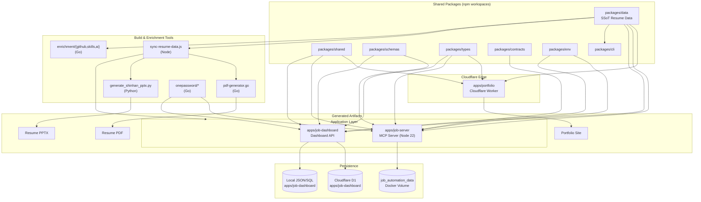

# 레쥬메 모노레포 / Resume Portfolio Monorepo

[](package.json)
[](Dockerfile)
[](docker-compose.yml)
[](wrangler.jsonc)
[](tsconfig.base.json)
[](LICENSE)

이 저장소는 개인 포트폴리오 사이트, 채용 자동화 워커, 단일 진실 공급원(SSoT) 데이터 레이어, 그리고 운영 대시보드를 하나의 npm 워크스페이스 모노레포로 통합한 사설 저장소입니다.

This repository is a private npm workspaces monorepo that unifies a personal portfolio site, job automation tooling, a Single Source of Truth (SSoT) data layer, and an operations dashboard under a single, versioned codebase.

---

## 목차 / Table of Contents

- [개요 / Overview](#overview--개요)
- [주요 기능 / Features](#주요-기능--features)
- [아키텍처 / Architecture](#아키텍처--architecture)
- [저장소 구조 / Repository Structure](#저장소-구조--repository-structure)
- [빠른 시작 / Quick Start](#빠른-시작--quick-start)
- [설정 / Configuration](#설정--configuration)
- [명령어 레퍼런스 / Commands Reference](#명령어-레퍼런스--commands-reference)
- [로컬 개발 / Local Development](#로컬-개발--local-development)
- [테스트 / Testing](#테스트--testing)
- [배포 / Deployment](#배포--deployment)
- [기여 / 기여](#contribution)
- [라이선스 / License](#라이선스--license)

---

## Overview / 개요

`package.json`의 `description` 필드는 이 모노레포를 다음과 같이 정의합니다.

> Resume portfolio monorepo: Cloudflare Worker edge site, job automation (Wanted/JobKorea), SSoT data, self-hosted observability

핵심 가치 / Core values:

- **단일 진실 공급원 (SSoT)** — 이력, 프로필, 스킬, 직무 데이터는 `packages/data`에서 한 번 정의되고 포트폴리오, 이력서, PDF, PPTX, 대시보드 등 모든 산출물로 자동 동기화됩니다.
- **엣지 우선 포트폴리오** — `apps/portfolio`는 Cloudflare Worker(`wrangler.jsonc`)로 글로벌 엣지에 배포되어 저지연으로 페이지를 제공합니다.
- **운영 가능한 잡 자동화** — `apps/job-server`는 MCP(Model Context Protocol) 호환 Node.js 서버로, 채용 플랫폼(원티드/잡코리아 등)과의 연동, 워크플로우, 통계 집계를 단일 프로세스로 제공합니다. Docker 이미지로도 실행 가능합니다.
- **셀프 호스팅 옵저버빌리티** — `apps/job-dashboard`는 인증, CORS/CSRF 미들웨어, 레이트 리미팅을 갖춘 대시보드 백엔드를 제공하며, 라우트 단위 헬스 체크와 워크플로우 통계 API를 노출합니다.
- **자동화된 산출물 빌드** — 1Password 시드, GitHub/스킬/AI 인리치먼트, PDF/PPTX 동기화 스크립트가 `package.json` 스크립트로 일원화되어 있습니다.

---

## 주요 기능 / Features

- **모노레포 워크스페이스** — 1개의 루트 `package.json` 아래 8개 워크스페이스(`apps/portfolio`, `apps/job-server`, `apps/job-dashboard`, `packages/{cli,data,shared,types,schemas,contracts,env}`)를 통합 관리합니다.
- **엣지 포트폴리오** — Cloudflare Workers 기반의 정적/동적 페이지 렌더링, `wrangler.jsonc`로 환경별 배포 구성을 관리합니다.
- **잡 자동화 서버** — Node.js 기반 MCP 서버, Express 스타일 라우터(`src/router.js`), 미들웨어 체인(CORS, CSRF, 레이트 리미팅), 큐 컨슈머(`queue-consumer.js`)를 포함합니다.
- **대시보드 백엔드** — 인증, 어드민, 통계, 워크플로우, 자동화, 헬스 체크 라우트를 분리하여 운영 가시성을 제공합니다.
- **SSoT 데이터 동기화** — `tools/scripts/utils/sync-resume-data.js`로 단일 JSON을 모든 산출물(웹, PDF, PPTX)에 반영합니다.
- **1Password 통합** — 시드, 세션 파일 백업/복원, 네이티브 실행 래퍼를 통해 자격증명을 안전하게 관리합니다.
- **인리치먼트 파이프라인** — GitHub 활동, 스킬, AI 분석을 통한 데이터 강화(`enrich:github`, `enrich:skills`, `enrich:ai`).
- **산출물 자동화** — PDF, PPTX 빌더를 Go(`tools/scripts/build/pdf-generator.go`)와 Python(`tools/scripts/build/generate_shinhan_pptx.py`)으로 제공합니다.
- **컨테이너 배포** — 멀티 스테이지 `Dockerfile`과 `docker-compose.yml`로 잡 서버를 단일 컨테이너로 실행하고 데이터 볼륨을 영구화합니다.
- **엄격한 품질 게이트** — TypeScript strict 모드(`tsconfig.base.json`), ESLint(`eslint.config.cjs`), Jest(`jest.config.cjs`), Playwright(`playwright.config.js`)로 다층 테스트합니다.

---

## 아키텍처 / Architecture



각 컴포넌트 요약 / Component summary:

- **Cloudflare Worker (`apps/portfolio`)** — 글로벌 엣지에서 정적/동적 페이지를 렌더링하고 `packages/data`의 SSoT를 읽어 페이지를 생성합니다.
- **MCP Server (`apps/job-server`)** — Node 22에서 실행되는 잡 자동화 서버. 라우터, 미들웨어, 큐 컨슈머, 통계 모듈로 구성됩니다.
- **Dashboard (`apps/job-dashboard`)** — D1 마이그레이션(`schema.sql`, `migrations/*`)을 가진 대시보드 백엔드. 어드민, 워크플로우, 자동화, 헬스 라우트를 제공합니다.
- **Shared packages** — `packages/{shared,schemas,types,contracts,env,data,cli}`는 워크스페이스 전반에서 타입·스키마·환경변수·CLI 명령을 공유합니다.
- **Tools & scripts** — 동기화, 인리치먼트, 1Password 통합, PDF/PPTX 빌더는 다언어(Go/Python/Node)로 작성되어 빌드 파이프라인을 구성합니다.

---

## 저장소 구조 / Repository Structure

루트 레이아웃은 다음과 같습니다. 디렉토리는 실제 저장소 구조를 그대로 반영합니다.

```
.
├── AGENTS.md                 # 에이전트 운영 가이드
├── CHANGELOG.md              # 릴리스 노트
├── CONTRIBUTING.md           # 기여 가이드
├── Dockerfile                # 멀티 스테이지 (deps, runtime)
├── LICENSE
├── OWNERS                    # 코드 오너십 정의
├── README.md                 # 본 문서
├── docker-compose.yml        # job-server 컨테이너 오케스트레이션
├── eslint.config.cjs         # ESLint 9 flat config
├── jest.config.cjs           # Jest 테스트 러너 설정
├── lychee.toml               # 링크 체커 설정
├── package.json              # 루트 매니페스트 (npm workspaces)
├── package-lock.json
├── playwright.config.js      # Playwright E2E 설정
├── redocly.yaml              # OpenAPI 린트 설정
├── tsconfig.base.json        # TypeScript strict 베이스
├── tsconfig.json             # 루트 tsconfig
├── wrangler.jsonc            # Cloudflare Workers 설정
│
├── ta/                       # PPTX 산출물 및 빌드 스크립트
│   ├── *.pptx                # 입력 프레젠테이션
│   ├── inspect.py            # PPTX 점검
│   ├── improve_visual.py     # 시각 자료 개선
│   ├── verify.py             # 검증 스크립트
│   └── output/               # 생성된 PPTX 및 검증 리포트
│
├── applications/             # 회사별 지원 패키지
│   ├── airpremia-security-2026/
│   ├── infrastructure-architecture-2026/
│   ├── coupang-fintech-sre-2026/
│   ├── cloudflare-one-se-2026/
│   └── gitlab-apac-security-2026/
│
└── apps/
    └── job-dashboard/        # 대시보드 백엔드 (Node, D1)
        ├── API_REFERENCE.md
        ├── DEPLOYMENT_GUIDE.md
        ├── DEVELOPMENT_GUIDE.md
        ├── DIAGRAMS.md
        ├── OWNERS
        ├── README.md
        ├── SECRETS.md
        ├── migrate-json-to-d1.cjs
        ├── migration-data.sql
        ├── schema.sql
        ├── tsconfig.json
        ├── migrations/
        └── src/
            ├── index.js
            ├── queue-consumer.js
            ├── router.js
            ├── middleware/
            ├── routes/
            └── handlers/
```

> 참고 / Note — `apps/portfolio`, `apps/job-server`, `packages/*`는 워크스페이스로 선언되어 있으나 현재 스냅샷에는 일부만 보일 수 있습니다. `package.json`의 `workspaces` 필드가 전체 목록의 진실 공급원입니다.

---

## 빠른 시작 / Quick Start

### 사전 요구 사항 / Prerequisites

- **Node.js 22** 이상 (`Dockerfile` 기준)
- **npm 10+** (워크스페이스 지원)
- **Go 1.22+** (PDF/인리치먼트 빌더용)
- **Python 3.11+** (PPTX 생성용)
- **Wrangler** (Cloudflare Workers 로컬/배포)
- **Docker / Docker Compose** (컨테이너 실행 시)
- 선택 / Optional: **exiftool** (이미지 메타데이터 정리), **1Password CLI** (`op`)

### 설치 / Install

```bash
git clone <your-fork-url> resume
cd resume
npm ci
```

### 로컬 실행 / Run locally

```bash
# 포트폴리오 워커 (Wrangler)
npm --workspace apps/portfolio run dev

# 잡 서버 (Node)
npm --workspace apps/job-server run dev

# 대시보드 백엔드
npm --workspace apps/job-dashboard run dev
```

Docker로 잡 서버만 실행:

```bash
docker compose up --build mcp-server
# http://127.0.0.1:3000/health
```

### SSoT 동기화 / Sync SSoT

```bash
# 데이터 → PDF → PPTX 체인
npm run sync:all
```

---

## 설정 / Configuration

### 환경 변수 / Environment variables

루트의 `.env`는 `docker-compose.yml`에서 자동 로드됩니다. 주요 항목:

| 변수           | 용도                      | 예시         |
| -------------- | ------------------------- | ------------ |
| `NODE_ENV`     | 런타임 모드               | `production` |
| `PORT`         | job-server 리스닝 포트    | `3000`       |
| `OP_*`         | 1Password CLI 통합 토큰   | (시크릿)     |
| `CLOUDFLARE_*` | Wrangler/Workers 자격증명 | (시크릿)     |

자세한 시크릿 카탈로그는 `apps/job-dashboard/SECRETS.md`를 참고하세요.

### Wrangler / Cloudflare

`wrangler.jsonc`는 `apps/portfolio`의 환경별(예: `production`, `preview`) 바인딩을 정의합니다. 환경 추가 시 `wrangler env` 명령을 사용하세요.

### TypeScript

`tsconfig.base.json`은 strict 모드를 강제합니다. 워크스페이스별 `tsconfig.json`은 베이스를 상속합니다.

### ESLint / Prettier

`eslint.config.cjs`(ESLint 9 flat config)를 루트에서 사용합니다.

---

## 명령어 레퍼런스 / Commands Reference

루트 `package.json`에서 노출되는 주요 스크립트:

| 스크립트                      | 설명                                                            |
| ----------------------------- | --------------------------------------------------------------- |
| `npm run strip-exif`          | `apps/portfolio`의 PNG/WebP에서 EXIF 제거 (exiftool 사용)       |
| `npm run sync:data`           | SSoT 데이터 동기화 (`tools/scripts/utils/sync-resume-data.js`)  |
| `npm run sync:pptx`           | 신한 PPTX 생성 (`tools/scripts/build/generate_shinhan_pptx.py`) |
| `npm run sync:pdf`            | 마스터 PDF 생성 (`tools/scripts/build/pdf-generator.go`)        |
| `npm run sync:all`            | `sync:data` → `sync:pdf` → `sync:pptx` 체인 실행                |
| `npm run op:run`              | 1Password 시크릿을 환경변수로 주입하여 명령 실행                |
| `npm run op:native:run`       | 1Password 네이티브 런처로 명령 실행                             |
| `npm run op:seed:resume`      | 1Password에 이력서 시크릿 시드                                  |
| `npm run op:seed:sessions`    | 세션 파일 시드                                                  |
| `npm run op:restore:sessions` | 세션 파일 복원                                                  |
| `npm run sync:proposals`      | 제안서 동기화 CLI + Go 어플라이어                               |
| `npm run enrich:github`       | GitHub 활동 기반 인리치먼트 (Go)                                |
| `npm run enrich:skills`       | 스킬 인리치먼트 (Go)                                            |
| `npm run enrich:ai`           | AI 인리치먼트 (Go)                                              |
| `npm run enrich:all`          | 3개 인리치먼트 직렬 실행                                        |
| `npm run automate:ssot`       | 동기화 + 빌드 + 타입체크 + Node 테스트                          |
| `npm run automate:full`       | 동기화 + 린트 + 타입체크 + 전체 테스트                          |

> 참고 / Note — `package.json`의 스크립트 본문이 길어 잘릴 수 있습니다. 전체 목록은 루트 매니페스트를 직접 확인하세요.

---

## 로컬 개발 / Local Development

### 워크스페이스 의존성 추가 / Add workspace dependency

```bash
npm install <pkg> -w apps/job-server
npm install <pkg> -w packages/shared --save-peer
```

루트에 dev 도구를 추가하려면:

```bash
npm install -D <pkg> -w .
```

### 데이터 편집 워크플로우 / Data editing workflow

1. `packages/data`의 SSoT 파일을 수정합니다.
2. `npm run sync:data`로 모든 산출물에 전파합니다.
3. `npm run sync:pdf`, `npm run sync:pptx`로 PDF/PPTX를 재생성합니다.
4. `npm run typecheck`, `npm run test:node`로 회귀를 확인합니다.

### 새 잡 지원 패키지 추가 / Add new job application

`applications/<company>-<role>-<year>/` 디렉토리를 만들고 다음 파일을 채웁니다:

- `cover_letter.md` — 자기소개서
- 이력서 본문 (HTML, PDF 등)
- `application-guide.md` 또는 동급의 운영 가이드 (선택)

SSoT와 일관성을 유지하려면 `packages/data`의 데이터만 단일 진실로 사용하세요.

### 대시보드 마이그레이션 / Dashboard migrations

`apps/job-dashboard/migrations/`에 순차 SQL 파일을 추가합니다(예: `0004_*.sql`). 적용:

```bash
# 로컬 D1 또는 sqlite 호환 스토리지에 적용
node apps/job-dashboard/migrate-json-to-d1.cjs
```

---

## 테스트 / Testing

| 영역               | 러너       | 설정                   |
| ------------------ | ---------- | ---------------------- |
| 단위 / 통합 (Node) | Jest       | `jest.config.cjs`      |
| E2E (브라우저)     | Playwright | `playwright.config.js` |
| 타입 검사          | TypeScript | `tsconfig.base.json`   |
| 링크 무결성        | lychee     | `lychee.toml`          |
| API 스펙 린트      | Redocly    | `redocly.yaml`         |

자주 쓰는 명령:

```bash
npm run test:node           # Jest
npm run test:e2e            # Playwright
npm run typecheck           # tsc --noEmit
npm run lint                # ESLint
npm run lint:links          # lychee (있다면)
npm run lint:openapi        # redocly (있다면)
```

대시보드 미들웨어는 인라인 단위 테스트(`middleware/rate-limit.test.js` 등)를 포함합니다.

---

## 배포 / Deployment

### Cloudflare Workers (portfolio)

```bash
npm --workspace apps/portfolio run deploy
# 환경 지정:
npx wrangler deploy -c wrangler.jsonc --env production
```

### job-server (Docker)

`docker-compose.yml`은 `mcp-server` 단일 서비스를 정의합니다. `Dockerfile`은 2단계 빌드(deps, runtime)이며, 프로덕션 의존성만 포함합니다.

```bash
docker compose up -d --build
docker compose logs -f mcp-server
```

헬스 체크는 컨테이너 내부에서 `http://127.0.0.1:3000/health`를 폴링합니다(`interval=30s`, `timeout=5s`, `retries=3`, `start_period=20s`).

### 데이터 영속화 / Data persistence

`docker-compose.yml`은 `job_automation_data` 볼륨을 `/app/apps/job-server/.data`에 마운트합니다. 컨테이너 재생성 시 잡 자동화 상태가 보존됩니다.

### 대시보드 배포

자세한 절차는 `apps/job-dashboard/DEPLOYMENT_GUIDE.md`와 `apps/job-dashboard/API_REFERENCE.md`를 참고하세요.

---

## 기여 / Contribution

이 사설 저장소는 개인 워크플로우에 최적화되어 있습니다. 외부 협업 시 다음 문서를 우선 검토하세요.

- [`CONTRIBUTING.md`](CONTRIBUTING.md) — 기여 절차 및 코드 리뷰 규약
- [`AGENTS.md`](AGENTS.md) — 자동화/에이전트 운영 정책
- [`OWNERS`](OWNERS) — 영역별 코드 오너
- [`CHANGELOG.md`](CHANGELOG.md) — 릴리스 히스토리
- [`applications/*/application-guide.md`](applications/) — 회사별 지원 운영 노트

PR 전 권장 체크리스트:

1. `npm run typecheck` 통과
2. `npm run lint` 통과
3. `npm run test:node` 통과
4. 데이터 변경 시 `npm run sync:all`로 산출물 재생성
5. 마이그레이션 추가 시 `apps/job-dashboard/migrations/`에 순번대로 SQL 추가

---

## 라이선스 / License

사설 라이선스 / Private license. 자세한 내용은 [`LICENSE`](LICENSE) 파일을 참고하세요. 외부 배포/재배포는 금지됩니다.
