# 레쥬메 모노레포 / Resume Portfolio Monorepo

[](package.json)
[](Dockerfile)
[](docker-compose.yml)
[](wrangler.jsonc)
[](tsconfig.base.json)
[](docker-compose.yml)
[](redocly.yaml)

> Resume portfolio monorepo: Cloudflare Worker edge site, job automation (Wanted/JobKorea), SSoT data, self-hosted observability

이 저장소는 개인 포트폴리오 사이트, 채용 자동화 워커, 단일 진실 공급원(SSoT) 데이터 레이어, 운영 대시보드를 하나의 npm 워크스페이스 모노레포로 통합한 사설 저장소입니다.

This repository is a private npm workspaces monorepo that unifies a personal portfolio site, job automation tooling, a Single Source of Truth (SSoT) data layer, and an operations dashboard under a single, versioned codebase.

---

## 목차 / Table of Contents

- [개요 / Overview](#overview--개요)
- [주요 기능 / Features](#주요-기능--features)
- [아키텍처 / Architecture](#아키텍처--architecture)
- [저장소 구조 / Repository Structure](#저장소-구조--repository-structure)
- [빠른 시작 / Quick Start](#빠른-시작--quick-start)
- [설정 / Configuration](#설정--configuration)
- [명령어 레퍼런스 / Commands Reference](#명령어-레퍼런스--commands-reference)
- [로컬 개발 / Local Development](#로컬-개발--local-development)
- [테스트 / Testing](#테스트--testing)
- [배포 / Deployment](#배포--deployment)
- [기여 가이드 / Contribution Guide](#기여-가이드--contribution-guide)
- [라이선스 / License](#라이선스--license)

---

## Overview / 개요

`package.json`의 `description` 필드는 이 모노레포를 다음과 같이 정의합니다.

> Resume portfolio monorepo: Cloudflare Worker edge site, job automation (Wanted/JobKorea), SSoT data, self-hosted observability

핵심 가치 / Core values:

- **단일 진실 공급원 (SSoT)** — 이력, 프로필, 스킬, 직무 데이터는 `packages/data`의 `resumes/master/resume_data.json`에서 한 번 정의되고 포트폴리오, 이력서 PDF, PPTX, 운영 대시보드 등 모든 산출물로 자동 동기화됩니다.
- **엣지 우선 포트폴리오** — `apps/portfolio`는 Cloudflare Worker에서 동작하며, HTML/모듈/데이터로부터 `worker.js`가 자동 생성됩니다 (직접 수정 금지).
- **자동화 워커** — `apps/job-server`는 Wanted/JobKorea 등 채용 플랫폼 크롤러와 자동 지원 런타임을 포함합니다. Node/Fastify MCP 서버와 Docker 컴포즈로 패키징됩니다.
- **운영 대시보드** — `apps/job-dashboard`는 Worker `fetch`/`queue`/`scheduled` 핸들러를 통해 대시보드 API, 큐 컨슈머, 워크플로를 오케스트레이션합니다.
- **타입·스키마·계약의 단일화** — `packages/types`, `packages/schemas` (Zod), `packages/contracts` (OpenAPI, Worker env)에서 도메인 타입과 런타임 검증을 한 번 정의합니다.
- **관측 가능성** — 셀프호스트 observability과 Cloudflare 대시보드를 결합해 워커·큐·자동화 런타임을 모니터링합니다.

대상 사용자 / Audience:

- 본인(레쥬메 작성자)이 후보자용 포트폴리오와 채용 자동화 시스템을 운영하기 위한 1인용 사설 워크스페이스입니다.
- 사전 동의 하에 동료가 일시적으로 환경 변수를 받아 빌드/검증에 참여할 수 있으나, 기본적으로 비공개입니다.

---

## 주요 기능 / Features

| 영역 / Area | 기능 / Feature |
| --- | --- |
| Portfolio | Cloudflare Worker 정적/동적 포트폴리오, `wrangler.jsonc` 기반 배포, EXIF 스트립, 자동 생성된 `worker.js` |
| Job automation | MCP 서버, Wanted/JobKorea 크롤러, 자동 지원 스크립트, 제안 동기화 (`sync:proposals`) |
| SSoT data | `packages/data/resumes/master/resume_data.json` 단일 출처에서 PDF·PPTX·대시보드·HTML 산출물 동시 생성 |
| Dashboard | Worker API (`fetch`/`queue`/`scheduled`), CORS/CSRF/레이트 리밋 미들웨어, D1 마이그레이션 |
| Contracts | `redocly.yaml` 기반 OpenAPI 린트, Zod 스키마와 도메인 타입 일치 |
| Types | `tsconfig.base.json` strict 모드, 워크스페이스 전역 공유 타입 |
| Observability | 자체 호스트 측정 스크립트, 에러/리트라이/레이트 리밋이 내장된 공유 유틸 |
| Tools/CLI | `packages/cli`(레쥬메 운영자 CLI), `tools/scripts`(Go-first 빌드/동기화/배포) |
| Applications | `applications/` 아래 회사별/직무별 이력서 + 자기소개서 + 미리보기 + 실행 로그 |

세부 강조 / Highlights:

- **다국어 동기화**: 동일한 SSoT로부터 한국어/영어/HTML/PDF/PPTX 출력을 모두 생성 (`sync:data`, `sync:pdf`, `sync:pptx`, `sync:all`).
- **보안 기본값**: CORS·CSRF·레이트 리밋 미들웨어가 기본 적용되고, 시크릿은 1Password CLI 경유(`op:*`)로만 로컬 시드/복구.
- **엄격한 타입 정책**: TS strict, JSDoc 기반 워커 번들, 도메인 타입은 `packages/types` 일원화.
- **테스트 다층화**: Jest(Node), Playwright(E2E), Worker 라우터·미들웨어 단위 테스트.

---

## 아키텍처 / Architecture

데이터 흐름은 SSoT에서 출발해 빌드 스크립트와 런타임 앱 양쪽으로 분기됩니다.

```mermaid
flowchart LR
    subgraph Data["SSoT 데이터 레이어"]
        D[("resumes/master/resume_data.json")]
        DATA["packages/data"]
        TYPES["packages/types"]
        SCHEMA["packages/schemas"]
        CONTRACTS["packages/contracts"]
    end

    subgraph Build["빌드 & 운영 스크립트"]
        SYNC["tools/scripts/utils/sync-resume-data.js"]
        PDF["tools/scripts/build/pdf-generator.go"]
        PPTX["tools/scripts/build/generate_shinhan_pptx.py"]
        SCRIPTS["tools/scripts/onepassword"]
        EXIF["exiftool (strip-exif)"]
    end

    subgraph Apps["워크스페이스 앱"]
        PORT["apps/portfolio<br/>(Cloudflare Worker)"]
        JOB["apps/job-server<br/>(Fastify / MCP)"]
        DASH["apps/job-dashboard<br/>(Worker fetch+queue+scheduled)"]
        CLI["packages/cli"]
    end

    subgraph Outputs["산출물"]
        HTML["HTML / 정적 자산"]
        DOCS["applications/&#42;/resume.pdf"]
        SLIDES["applications/&#42;/ta/*.pptx"]
        APIS["Dashboard API &amp; 큐 워커"]
    end

    D --> DATA
    DATA --> SYNC
    DATA --> PDF
    DATA --> PPTX
    TYPES --> PORT
    TYPES --> JOB
    TYPES --> DASH
    SCHEMA --> JOB
    SCHEMA --> DASH
    CONTRACTS --> DASH
    CONTRACTS --> PORT
    DATA --> PORT
    DATA --> DASH

    SYNC --> HTML
    PDF --> DOCS
    PPTX --> SLIDES
    EXIF --> HTML
    SCRIPTS -. 환경 변수 .-> JOB
    SCRIPTS -. 환경 변수 .-> DASH
    SCRIPTS -. 환경 변수 .-> PORT

    CLI --> JOB
    CLI --> DASH
    DASH --> APIS
    PORT --> APIS
```



핵심 경로 / Key paths:

| 심볼 | 위치 | 역할 |
| --- | --- | --- |
| `worker.js` | `apps/portfolio/` | 생성된 Cloudflare Worker 번들 (수정 금지) |
| `entry.js` | `apps/portfolio/` | 핸드 작성된 포트폴리오 진입점 |
| `main()` | `apps/job-server/src/index.js` | MCP/잡 서버 부트스트랩 |
| `index.js` (Worker) | `apps/job-dashboard/src/index.js` | `fetch`/`queue`/`scheduled` 오케스트레이터 |
| `Router` | `apps/job-dashboard/src/router.js` | Worker 요청 디스패치 |
| `validateEnv()` | `packages/env` | 런타임 환경변수 스키마 검증 |
| `Dockerfile` | root | 멀티 스테이지 `job-server` 런타임 이미지 |

런타임 분리 / Runtime split:

- **엣지 (Cloudflare Worker)**: `apps/portfolio`, `apps/job-dashboard` (Wrangler로 배포).
- **노드 (Fastify MCP)**: `apps/job-server` (Dockerfile + docker-compose로 운영).
- **로컬 도구**: Node/Go/Python 스크립트가 동기화·빌드·시크릿 시드를 담당.

---

## 저장소 구조 / Repository Structure

실제 최상위 레이아웃만 발췌한 요약입니다 (자세한 전체 트리는 `AGENTS.md` 참조).

```text
./
├── AGENTS.md                    # 프로젝트 지식 베이스 (사람/에이전트 가이드)
├── CHANGELOG.md
├── CONTRIBUTING.md
├── Dockerfile                   # 멀티 스테이지 job-server 런타임 이미지
├── LICENSE
├── OWNERS
├── README.md
├── docker-compose.yml           # mcp-server (job-server) 컨테이너
├── eslint.config.cjs
├── jest.config.cjs
├── lychee.toml                  # 링크 검사 설정
├── package.json                 # 워크스페이스 루트 및 스크립트 허브
├── package-lock.json
├── playwright.config.js
├── redocly.yaml                 # OpenAPI 린트 규칙
├── tsconfig.base.json
├── tsconfig.json
├── wrangler.jsonc               # Cloudflare Worker 설정
├── applications/                # 회사/직무별 지원 패키지 (이력서·자기소개서·미리보기)
├── apps/
│   ├── portfolio/               # Cloudflare Worker 포트폴리오
│   ├── job-server/              # MCP/잡 자동화 런타임, 크롤러, 스크립트
│   └── job-dashboard/           # Worker API/큐/워크플로 대시보드
├── packages/
│   ├── cli/                     # 레쥬메 운영자 CLI
│   ├── contracts/               # OpenAPI + Worker env 계약 표면
│   ├── data/                    # 권위 있는 이력/지원 콘텐츠
│   ├── env/                     # 런타임 환경변수 검증
│   ├── schemas/                 # Zod 런타임 스키마
│   ├── shared/                  # 공용 유틸(errors, logger, retry, crypto, rate-limit, auth, browser)
│   └── types/                   # 표준 JSDoc/TS 도메인 타입
├── ta/                          # Python/PPTX TA 프로필 생성 스크립트와 산출물
└── tools/                       # CI/빌드/배포/검증 Go-first 스크립트
```

`apps/job-dashboard/` 하위 디렉터리 (대표 발췌):

```text
apps/job-dashboard/
├── src/
│   ├── index.js                 # Worker fetch/queue/scheduled 진입점
│   ├── queue-consumer.js        # 큐 컨슈머
│   ├── router.js                # Worker 라우터
│   ├── middleware/              # cors, csrf, rate-limit 등
│   └── routes/                  # admin, applications, auth, automation, health
├── migrations/                  # D1/SQL 마이그레이션
├── schema.sql, migration-data.sql
├── API_REFERENCE.md
├── DEPLOYMENT_GUIDE.md
├── DEVELOPMENT_GUIDE.md
├── DIAGRAMS.md
├── SECRETS.md
└── OWNERS
```

---

## 빠른 시작 / Quick Start

요구 사항 / Prerequisites:

- Node.js 22 (`.nvmrc` 또는 Dockerfile의 `node:22-alpine` 기준)
- npm 10+ (워크스페이스 활성화)
- Docker + Docker Compose (잡 서버 컨테이너 실행 시)
- Go 1.22+ (옵션: `tools/scripts/build/*`, `onepassword/*`)
- Python 3.11+ (옵션: `sync:pptx`, `ta/improve_visual.py`, `verify.py`)
- 1Password CLI (옵션: `op:*` 명령 사용 시)
- Cloudflare Wrangler (옵션: `apps/portfolio`, `apps/job-dashboard` 배포)

설치 / Install:

```bash
npm ci
```

이는 워크스페이스 전 패키지(`apps/*`, `packages/*`)를 한 번에 설치합니다. 일부 워크플로는 `tools/scripts` 하위 Go/Python 하위 모듈의 의존성을 추가로 요구할 수 있으므로, 해당 하위 디렉터리에서 별도 빌드 단계를 참고하세요.

환경 변수 / Environment variables:

루트에 `.env`를 두고, `packages/env`의 스키마로 검증합니다. 주요 키:

- `NODE_ENV`, `PORT`
- Cloudflare: `CF_ACCOUNT_ID`, `CF_API_TOKEN`, `CF_*` (각 워커별)
- D1 / DB: `D1_*`, `DATABASE_URL`
- 잡 플랫폼 자격 증명: `WANTED_*`, `JOBKOREA_*` (`apps/job-server` 크롤러/자동 지원에 사용)
- 1Password 관련: `OP_SERVICE_ACCOUNT_TOKEN`, `OP_VAULT`, `OP_ITEM` (선택)

Docker로 잡 서버 띄우기 / Run job-server via Docker:

```bash
docker compose up -d mcp-server
docker compose logs -f mcp-server
```

`mcp-server` 서비스는 Dockerfile을 빌드해 `apps/job-server/src/server/index.js`를 실행하며, 헬스체크는 `/health` 엔드포인트를 30초 간격으로 점검합니다.

포트폴리오 로컬 미리보기 / Portfolio local preview:

```bash
cd apps/portfolio
npx wrangler dev
```

대시보드 로컬 미리보기 / Dashboard local preview:

```bash
cd apps/job-dashboard
npx wrangler dev
```

---

## 설정 / Configuration

| 설정 파일 | 적용 범위 | 비고 |
| --- | --- | --- |
| `package.json` | 루트 | 워크스페이스 멤버, 스크립트 허브 |
| `wrangler.jsonc` | Cloudflare Worker | 포트폴리오/대시보드 배포 트리거, 바인딩·환경 변수 |
| `tsconfig.base.json` / `tsconfig.json` | 전체 패키지 | strict, path 매핑 |
| `eslint.config.cjs` | 전체 패키지 | 린트 규칙 |
| `jest.config.cjs`, `playwright.config.js` | 테스트 | Jest(Node) + Playwright(E2E) |
| `redocly.yaml` | OpenAPI | `packages/contracts` 산출물 린트 |
| `docker-compose.yml` | 잡 서버 | 컨테이너 오케스트레이션, 헬스체크 |
| `Dockerfile` | 잡 서버 | 멀티 스테이지(`deps`, `runtime`) 빌드 |
| `lychee.toml` | 문서 | 저장소 내 링크 검사 |
| `OWNERS`, `applications/*` | 거버넌스 | 책임자/지원 패키지 메타 |

시크릿 / Secrets:

- 운영 시크릿은 `.env` 또는 Wrangler Secrets(`/bindings`)에만 보관합니다.
- 로컬 시드/복구는 `tools/scripts/onepassword/*` 경유 (`op:run`, `op:seed:*`, `op:restore:*`).
- 자세한 절차는 `apps/job-dashboard/SECRETS.md` 및 `docs/security/`를 참고하세요.

---

## 명령어 레퍼런스 / Commands Reference

아래는 `package.json`의 루트 스크립트 중 핵심 발췌입니다. 자세한 전체 스크립트 목록은 `npm run`으로 확인하세요.

| 스크립트 | 설명 / Description |
| --- | --- |
| `npm run strip-exif` | `apps/portfolio/src/images/*.png|webp`에서 EXIF 메타데이터 제거 (exiftool 부재 시 안전하게 스킵) |
| `npm run sync:data` | Node: `tools/scripts/utils/sync-resume-data.js` — SSoT 동기화 1단계 |
| `npm run sync:pptx` | Python: `tools/scripts/build/generate_shinhan_pptx.py` — PPTX 산출물 생성 |
| `npm run sync:pdf` | Go: `tools/scripts/build/pdf-generator.go master` — PDF 마스터 생성 |
| `npm run sync:all` | `sync:data` → `sync:pdf` → `sync:pptx` 순차 실행 |
| `npm run op:run` | `tools/scripts/onepassword/run` (Go) — 1Password 시크릿 검색 |
| `npm run op:native:run` | `tools/scripts/onepassword/native-run` (Go) — 네이티브 호출 |
| `npm run op:seed:resume` | `tools/scripts/onepassword/seed-resume` (Go) — 이력 데이터 시드 |
| `npm run op:seed:sessions` | `tools/scripts/onepassword/session-files seed` — 세션 파일 시드 |
| `npm run op:restore:sessions` | `tools/scripts/onepassword/session-files restore` — 세션 복구 |
| `npm run sync:proposals` | `apps/job-server/src/sync/proposal-review-cli.js` → `tools/scripts/sync/apply-proposals.go` |
| `npm run enrich:github` | `tools/scripts/enrichment/github/main.go` (Go) — GitHub 보강 |
| `npm run enrich:skills` | `tools/scripts/enrichment/skills/main.go` (Go) — 스킬 보강 |
| `npm run enrich:ai` | `tools/scripts/enrichment/ai/main.go` (Go) — AI 메타 보강 |
| `npm run enrich:all` | 위 세 보강 단계 직렬 실행 |
| `npm run automate:ssot` | `sync:data` → `sync:pdf` → `build` → `typecheck` → `test:node` |
| `npm run automate:full` | `sync:all` → `lint` → `typecheck` → 테스트/검증 (스크립트 정의에 따름) |

워크스페이스별 빌드/검증은 일반적으로 다음과 같이 실행합니다 (워크스페이스 멤버 패키지 정의에 따름).

| 명령 | 대상 | 사용 예 |
| --- | --- | --- |
| `npm run -w apps/portfolio build` | 포트폴리오 빌드 | SSoT 변경 후 산출물 재생성 |
| `npm run -w apps/job-server start` | 잡 서버 부트스트랩 | 로컬/Docker 외 노드 실행 |
| `npm run -w apps/job-dashboard deploy` | 대시보드 배포 (Wrangler) | 운영 반영 |
| `npm run -w packages/cli -- <args>` | CLI 호출 | `resume ...` 흐름 |

---

## 로컬 개발 / Local Development

워크플로 권장 순서 / Recommended workflow:

1. SSoT 데이터 수정 — `packages/data/resumes/master/resume_data.json` (또는 동등한 권위 콘텐츠)을 편집합니다.
2. 동기화 — `npm run sync:data`로 1차 전파 후 필요 시 `sync:pdf`, `sync:pptx`까지 수행합니다 (`sync:all`로 일괄 수행 가능).
3. 로컬 미리보기 — 포트폴리오와 대시보드를 각각 `wrangler dev`로 띄워 시각/라우팅 동작을 확인합니다.
4. 잡 자동화 — `apps/job-server`는 로컬에서 직접 띄우거나 Docker Compose로 띄웁니다. 시크릿은 1Password 경유로 시드합니다.
5. 검증 — `npm run lint`, `npm run typecheck`, `npm run test:node`, `npm run test:e2e` (필요 시).
6. 자동화 일괄 검증 — `npm run automate:ssot` (또는 `automate:full`)로 한 번에 회귀 확인합니다.

규칙 / Conventions:

- `docs/conventions/architecture-rules.md`에 따라 모듈·디렉터리·네이밍 규칙을 지킵니다 (예: 200 LOC 규칙, 자동화 SSoT, 스크립트 언어 정책).
- Cloudflare Worker 진입점(`worker.js`)은 수정이 아닌 생성 대상이며, 편집은 `entry.js`/HTML/`src/`/`lib/`에서 합니다.
- 도메인 타입은 `packages/types`에서 한 번 정의하고, 런타임 검증은 `packages/schemas`의 Zod로 일치시킵니다.
- API 계약은 `packages/contracts`(OpenAPI, Worker env)로 표면화하고 `redocly.yaml`로 린트합니다.

EXIF 정리 / Image sanitization:

```bash
npm run strip-exif
```

자산 이미지를 외부에 게시하기 전 메타데이터를 제거합니다. `exiftool`이 없으면 안전하게 스킵합니다.

---

## 테스트 / Testing

| 계층 | 도구 | 위치 | 명령 예 |
| --- | --- | --- | --- |
| Node 단위 테스트 | Jest | 루트(`jest.config.cjs`), `apps/job-dashboard`, `apps/job-server` 등 | `npm test`, `npx jest apps/job-dashboard/src/middleware/rate-limit.test.js` |
| E2E | Playwright | 루트(`playwright.config.js`) | `npx playwright test`, `npm run test:e2e` |
| 타입 | TypeScript | `tsconfig.base.json` strict | `npm run typecheck` |
| 린트 | ESLint | `eslint.config.cjs` | `npm run lint` |
| OpenAPI | Redocly CLI | `redocly.yaml` | `npx redocly lint packages/contracts/openapi.yaml` |
| 링크 | lychee | `lychee.toml` | `lychee --config lychee.toml ./README.md` |

특징:

- 미들웨어(`cors`, `csrf`, `rate-limit`)에 대한 회귀 테스트가 `apps/job-dashboard/src/middleware/`에 동거합니다.
- 도메인 결정은 `packages/types` → `packages/schemas` (Zod) → 라우트 핸들러 순으로 단일화합니다.
- 자동화 회귀는 `automate:ssot`, `automate:full`로 묶어 CI와 동일한 시퀀스를 보장합니다.

---

## 배포 / Deployment

Cloudflare Worker (`apps/portfolio`, `apps/job-dashboard`):

```bash
# 포트폴리오
cd apps/portfolio && npx wrangler deploy

# 대시보드
cd apps/job-dashboard && npx wrangler deploy
```

`wrangler.jsonc`의 트리거와 바인딩을 그대로 사용합니다. 운영 배포 권한은 Cloudflare Workers Builds 측에 있으므로 PR 머지 후 자동 배포되는 것을 가정합니다.

Docker Compose (`apps/job-server`):

```bash
docker compose up -d --build mcp-server
docker compose ps
docker compose logs -f mcp-server
```

- 멀티 스테이지 빌드: `deps`(workspace 의존성 설치) → `runtime`(`prod` 노드 모듈 + `apps/job-server` + 내부 workspace 패키지).
- 영속 데이터는 `job_automation_data` 볼륨을 `/app/apps/job-server/.data`에 마운트합니다.
- `HEALTHCHECK`는 30초 간격으로 `127.0.0.1`의 `/health`를 폴링합니다.

지원 패키지 빌드 / Application packets:

```bash
npm run sync:all
```

회사별/직무별 `applications/<role>/` 폴더 아래 PDF/HTML 미러뷰/실행 로그가 갱신됩니다.

---

## 기여 가이드 / Contribution Guide

`CONTRIBUTING.md`를 1차 기준으로 삼되, 이 모노레포의 사설 1인 워크스페이스 성격을 고려해 다음 원칙을 함께 따릅니다.

1. **SSoT 우선 변경** — 이력/스킬/직무 데이터는 `packages/data`에서 한 번만 수정하고, 동기화 스크립트로 모든 산출물을 다시 만듭니다.
2. **작은 모듈** — 가능하면 200 LOC 안팎으로 모듈을 분할해 (`docs/conventions/architecture-rules.md`) Worker 번들 크기와 검증 부담을 낮춥니다.
3. **계약 우선** — API/Worker 환경 변경은 먼저 `packages/contracts`(OpenAPI, env contract)에 반영하고, 그에 맞춰 핸들러를 구현합니다.
4. **테스트 동반** — 미들웨어/라우터/스키마 변경 시 `rate-limit.test.js` 등의 회귀 테스트를 같은 PR에 포함합니다.
5. **자동화 스크립트 언어** — 빌드/배포/검증 스크립트는 가급적 Go로 작성하며(`tools/scripts/build/*`), 콘텐츠 생성은 Python(`sync:pptx`), 데이터 정규화는 Node로 구분합니다.
6. **시크릿은 시크릿 경로로** — `.env`나 Wrangler Secret 외 경로로 시크릿을 커밋하거나 로그에 남기지 않습니다. 로컬 시드는 1Password CLI를 경유합니다.

코드 리뷰 권한과 책임자는 `OWNERS`에 기재되어 있습니다. PR 작성 전 `CONTRIBUTING.md`의 체크리스트를 확인해 주세요.

---

## 라이선스 / License

이 저장소는 사설이며, `LICENSE` 파일의 내용에 따릅니다. 공개 배포·재배포 권한을 부여하지 않으며, 외부 인원에게는 별도의 서면 동의 없이는 어떠한 권리도 이전되지 않습니다.

This repository is private. See the `LICENSE` file for the exact terms. No rights to redistribute, sublicense, or publicly mirror the contents are granted without prior written permission.