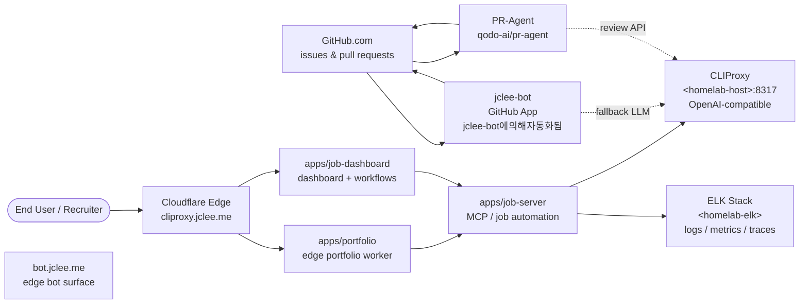

# Resume Portfolio Monorepo / 이력서 포트폴리오 모노레포

[](package.json)
[](https://nodejs.org/)
[](https://workers.cloudflare.com/)
[](LICENSE)
[](Dockerfile)
[](wrangler.jsonc)
[](https://github.com/qodo-ai/pr-agent)
[](apps/job-server)
[](https://cliproxy.jclee.me/v1)
[](https://bot.jclee.me)
[](#readme-generation)
[](https://cliproxy.jclee.me/v1)

> **Bilingual documentation / 이중 언어 문서**
> Every section header is duplicated in English and Korean. English prose appears first under each heading, followed by the Korean (한국어) translation.
> 본 README는 모든 섹션 제목을 영어와 한국어로 병기하고, 같은 제목 아래에 영어 본문을 먼저 작성한 뒤 한국어 번역을 이어 붙입니다.

> **Primary README generator model:** `gpt-5.5`
> **Fallback README generator model:** `minimax-m3`, routed through the public edge proxy at [`https://cliproxy.jclee.me/v1`](https://cliproxy.jclee.me/v1).
> **README 생성 기본 모델:** `gpt-5.5`
> **README 생성 대체 모델:** [`https://cliproxy.jclee.me/v1`](https://cliproxy.jclee.me/v1) 엣지 프록시 경유 `minimax-m3`

---

## Overview / 개요

`resume` (v1.40.11) is a private, opinionated **resume portfolio monorepo** that fuses five distinct surfaces into a single, lockfile-pinned workspace:

1. A **Cloudflare Worker edge portfolio** served from the `apps/portfolio` workspace and fronted by the public proxy [`https://cliproxy.jclee.me/v1`](https://cliproxy.jclee.me/v1).
2. A **job automation runtime** (`apps/job-server`) that drives Wanted / JobKorea crawlers, MCP tools, and proposal sync.
3. A **dashboard + workflows worker** (`apps/job-dashboard`) that exposes admin, automation, stats, and application routes on Cloudflare Workflows.
4. A **Single Source of Truth (SSoT) data layer** built from `packages/data`, `packages/types`, `packages/schemas`, `packages/contracts`, and `packages/env`.
5. A **self-hosted homelab observability plane** anchored by a CLIProxy OpenAI-compatible endpoint and an ELK stack reachable behind the `<homelab-host>` / `<homelab-elk>` placeholders.

`resume`(v1.40.11)는 다섯 개의 표면을 단일 잠금파일 워크스페이스로 통합한 사설 이력서 포트폴리오 모노레포입니다.

1. **Cloudflare Worker 엣지 포트폴리오** — `apps/portfolio` 워크스페이스에서 서빙되며, [`https://cliproxy.jclee.me/v1`](https://cliproxy.jclee.me/v1) 공개 프록시로 프런팅됩니다.
2. **잡 자동화 런타임** — `apps/job-server`로 Wanted/JobKorea 크롤러, MCP 도구, 제안 동기화를 구동합니다.
3. **대시보드 + 워크플로 워커** — `apps/job-dashboard`로 Cloudflare Workflows 위에서 admin/automation/stats/applications 라우트를 노출합니다.
4. **단일 진실 공급원(SSoT) 데이터 계층** — `packages/data`, `packages/types`, `packages/schemas`, `packages/contracts`, `packages/env`로 구성됩니다.
5. **자가 호밍 홈랩 옵저버빌리티 평면** — CLIProxy OpenAI 호환 엔드포인트와 ELK 스택이 `<homelab-host>` / `<homelab-elk>` 플레이스홀더 뒤에 위치합니다.

---

## Key Features / 주요 기능

- **Bilingual README + AGENTS.md knowledge base** — every commit-time surface is documented in English and Korean, anchored by the top-level `AGENTS.md`.
- **PR-Agent integration** — automated PR review via [`qodo-ai/pr-agent`](https://github.com/qodo-ai/pr-agent), invoked from the public edge.
- **jclee-bot GitHub App ownership** — every mutating surface (issue triage, PR auto-merge, branch creation, release publish, CI failure issues) is owned by the `jclee-bot` App.
- **Self-hosted CLIProxy** — OpenAI-compatible LLM proxy fronting `gpt-5.5` and `minimax-m3` for README generation, enrichment, and proposal review.
- **ELK-backed observability** — `apps/job-server` ships logs/metrics/traces to the homelab ELK stack.
- **Container-first runtime** — multi-stage `Dockerfile` plus `docker-compose.yml` for the `mcp-server` service.
- **Wrangler-configured edge** — `wrangler.jsonc` declares the portfolio + dashboard Workers and their bindings.
- **SSoT resume data** — `packages/data/resumes/master/resume_data.json` is the authoritative content source for both PDF and PPTX outputs.

- **이중 언어 README + AGENTS.md 지식 베이스** — 모든 커밋 시점 표면이 영문/한글 문서로 작성되며, 최상위 `AGENTS.md`에 앵커링됩니다.
- **PR-Agent 통합** — [`qodo-ai/pr-agent`](https://github.com/qodo-ai/pr-agent)를 공개 엣지에서 호출해 PR 리뷰를 자동화합니다.
- **jclee-bot GitHub App 소유권** — 이슈 분류, PR 자동 머지, 브랜치 생성, 릴리스 퍼블리시, CI 실패 이슈 등 모든 변경형 표면은 `jclee-bot` App이 소유합니다.
- **자가 호밍 CLIProxy** — OpenAI 호환 LLM 프록시가 `gpt-5.5`와 `minimax-m3`을 프런팅해 README 생성, enrich, 제안 검토에 사용합니다.
- **ELK 옵저버빌리티** — `apps/job-server`는 로그/메트릭/트레이스를 홈랩 ELK 스택으로 전송합니다.
- **컨테이너 우선 런타임** — 멀티 스테이지 `Dockerfile`과 `docker-compose.yml`이 `mcp-server` 서비스를 정의합니다.
- **Wrangler 구성 엣지** — `wrangler.jsonc`가 포트폴리오/대시보드 Worker와 바인딩을 선언합니다.
- **SSoT 이력서 데이터** — `packages/data/resumes/master/resume_data.json`이 PDF와 PPTX 출력의 권위 소스입니다.

---

## Architecture / 아키텍처

The runtime is a fan-in/fan-out graph that funnels browser traffic through Cloudflare's edge, executes Node.js workloads either on the edge (Workers) or in a self-hosted container, and persists automation state into the homelab plane. Mutating GitHub activity is owned by `jclee-bot`; read-only review is delegated to PR-Agent.

런타임은 브라우저 트래픽을 Cloudflare 엣지로 모은 뒤, Node.js 워크로드를 엣지(Worker) 또는 자가 호밍 컨테이너에서 실행하고, 자동화 상태를 홈랩 평면으로 저장하는 fan-in/fan-out 그래프입니다. GitHub의 변경형 작업은 `jclee-bot`이 소유하며, 읽기 전용 리뷰는 PR-Agent에 위임됩니다.



### Component notes / 컴포넌트 노트

- **`cliproxy.jclee.me` / `bot.jclee.me`** — public Cloudflare-fronted surfaces. No private IPs are ever hardcoded; homelab endpoints stay behind the `<homelab-host>` placeholder.
- **`apps/portfolio` / `apps/job-dashboard`** — Workers declared in `wrangler.jsonc`; the portfolio bundle is generated and not hand-edited.
- **`apps/job-server`** — the only containerised Node.js service. The `Dockerfile` is multi-stage (`deps` → `runtime`) and ships only the `job-server` source plus its internal workspace deps.
- **CLIProxy** — OpenAI-compatible shim that fronts `gpt-5.5` for primary LLM calls and `minimax-m3` as a fallback. Both the README generator and PR-Agent route through it.
- **ELK** — receives structured logs and metrics emitted from `apps/job-server` health checks and automation runs.
- **`jclee-bot`** — the only identity authorised to mutate issues, PRs, branches, releases, and CI failure issues. It carries the **jclee-bot에의해자동화됨** marker on every automation-driven event.

- **`cliproxy.jclee.me` / `bot.jclee.me`** — Cloudflare가 프런팅하는 공개 표면입니다. 사설 IP는 절대 하드코딩되지 않으며, 홈랩 엔드포인트는 `<homelab-host>` 플레이스홀더 뒤에 유지됩니다.
- **`apps/portfolio` / `apps/job-dashboard`** — `wrangler.jsonc`에 선언된 Worker입니다. 포트폴리오 번들은 생성된 산출물이며 수동 편집 대상이 아닙니다.
- **`apps/job-server`** — 컨테이너화되는 유일한 Node.js 서비스입니다. `Dockerfile`은 멀티 스테이지(`deps` → `runtime`)이며, `job-server` 소스와 내부 워크스페이스 의존성만 포함합니다.
- **CLIProxy** — OpenAI 호환 shim으로, 주 LLM 호출은 `gpt-5.5`, 대체 호출은 `minimax-m3`을 프런팅합니다. README 생성기와 PR-Agent가 모두 이 경로를 사용합니다.
- **ELK** — `apps/job-server`의 헬스체크와 자동화 실행에서 발생하는 구조화 로그와 메트릭을 수집합니다.
- **`jclee-bot`** — 이슈/PR/브랜치/릴리스/CI 실패 이슈를 변경할 수 있는 유일한 신원입니다. 모든 자동화 기반 이벤트에 **jclee-bot에의해자동화됨** 마커를 부착합니다.

---

## Repository Structure / 저장소 구조

The top-level layout reflects the snapshot of the working tree. The richer sub-tree (including `packages/`, `tools/`, `tests/`, `infrastructure/`, `docs/`, `supabase/`, `third_party/`, `.github/`) is fully described in `AGENTS.md` at the repo root.

최상위 레이아웃은 작업 트리 스냅샷을 반영합니다. `packages/`, `tools/`, `tests/`, `infrastructure/`, `docs/`, `supabase/`, `third_party/`, `.github/`를 포함한 더 풍부한 하위 트리는 저장소 루트의 `AGENTS.md`에 완전히 기술되어 있습니다.

```text
.
├── AGENTS.md                       # Project knowledge base (bilingual index)
├── CHANGELOG.md                    # Release history
├── CONTRIBUTING.md                 # Contribution guide
├── Dockerfile                      # Multi-stage build for job-server
├── LICENSE                         # MIT license
├── OWNERS                          # Code ownership roster
├── README.md                       # This file
├── docker-compose.yml              # mcp-server stack
├── eslint.config.cjs               # Lint config
├── jest.config.cjs                 # Unit test runner
├── lychee.toml                     # Link checker config
├── package.json                    # Workspace root + operator scripts
├── package-lock.json               # Lockfile
├── playwright.config.js            # E2E config
├── redocly.yaml                    # OpenAPI linter config
├── tsconfig.base.json              # Base TS config
├── tsconfig.json                   # Root TS config
├── wrangler.jsonc                  # Cloudflare Workers config
├── ta/                             # TA profile generation (Python + PPTX)
└── applications/                   # Per-company job application packages
    ├── airpremia-security-2026/
    ├── cloudflare-one-se-2026/
    ├── coupang-fintech-sre-2026/
    ├── gitlab-apac-security-2026/
    └── infrastructure-architecture-2026/
└── apps/
    └── job-dashboard/              # Dashboard Worker + workflows
        ├── API_REFERENCE.md
        ├── DEPLOYMENT_GUIDE.md
        ├── DEVELOPMENT_GUIDE.md
        ├── DIAGRAMS.md
        ├── OWNERS
        ├── README.md
        ├── SECRETS.md
        ├── schema.sql
        ├── migrate-json-to-d1.cjs
        ├── migration-data.sql
        ├── migrations/
        ├── src/
        │   ├── index.js
        │   ├── queue-consumer.js
        │   ├── router.js
        │   ├── middleware/         # cors, csrf, rate-limit (with test)
        │   ├── routes/             # admin, applications, auth, automation, health, stats, workflows
        │   └── handlers/           # applications, auth, auto-apply-webhook-handler
        └── tsconfig.json
```

> **Note / 참고:** The transient CI checkout path is intentionally not represented in this tree. `AGENTS.md` is the canonical map for any directory that does not appear above.
> **참고:** 일시적인 CI 체크아웃 경로는 의도적으로 트리에 포함하지 않았습니다. 위 트리에 나타나지 않는 모든 디렉터리의 정식 지도는 `AGENTS.md`입니다.

---

## jclee-bot Automation Surfaces / jclee-bot 자동화 영역

All mutating GitHub automation in this repository is owned by the **`jclee-bot` GitHub App**. Workflow files under `.github/workflows/` are the **implementation triggers** for that ownership — they are not the source of truth. The source of truth is `jclee-bot` itself, and every automation-driven event is annotated with the marker **jclee-bot에의해자동화됨**.

이 저장소의 모든 변경형 GitHub 자동화는 **`jclee-bot` GitHub App**이 소유합니다. `.github/workflows/` 아래의 워크플로 파일은 그 소유권을 구현하는 **트리거**일 뿐 진실의 원천이 아닙니다. 진실의 원천은 `jclee-bot` 자체이며, 자동화로 발생한 모든 이벤트에는 **jclee-bot에의해자동화됨** 마커가 부착됩니다.

### Issue-side surfaces / 이슈측 표면

- **Issue → Branch creation** — turns labelled issues into working branches and draft PRs.
- **Issue backfill** — restores missing context for issues created outside the App.
- **CI failure → Issue** — opens an issue when a CI run fails so triage stays inside the App's audit trail.
- All issues touched or created in this flow are stamped with **jclee-bot에의해자동화됨**.

- **이슈 → 브랜치 생성** — 라벨링된 이슈를 작업 브랜치와 드래프트 PR로 전환합니다.
- **이슈 백필** — App 외부에서 생성된 이슈의 누락 컨텍스트를 복원합니다.
- **CI 실패 → 이슈** — CI 실행이 실패하면 이슈를 열어 트리아지를 App의 감사 흔적 안에 유지합니다.
- 이 흐름에서触碰되거나 생성된 모든 이슈는 **jclee-bot에의해자동화됨** 마커로 도장됩니다.

### PR-side surfaces / PR측 표면

- **PR auto-review** — delegated to [`qodo-ai/pr-agent`](https://github.com/qodo-ai/pr-agent) through `cliproxy.jclee.me`; read-only.
- **Security PR review** — dedicated security checklist pass on PRs touching auth, crypto, or rate-limit surfaces.
- **PR auto-merge** — promotes green, approved PRs that match the App's allow-list.
- **Dependabot auto-merge** — merges routine Dependabot patches after the App's own CI is green.
- **Bot auto-fix** — applies automated remediations (lint, format, generated-doc refresh) and pushes them back to the same branch.
- **Merged PR cleanup** — deletes merged branches and stale remote refs.

- **PR 자동 리뷰** — [`qodo-ai/pr-agent`](https://github.com/qodo-ai/pr-agent)에 `cliproxy.jclee.me` 경유로 위임되며, 읽기 전용입니다.
- **보안 PR 리뷰** — auth/crypto/rate-limit 표면을触碰하는 PR에 대해 전용 보안 체크리스트를 수행합니다.
- **PR 자동 머지** — App의 허용 목록에 부합하고 CI가 그린인 PR을 자동 머지합니다.
- **Dependabot 자동 머지** — App 자체 CI가 그린인 경우 일반 Dependabot 패치를 머지합니다.
- **Bot 자동 수정** — lint/format/생성 문서 갱신 등 자동 해결을 동일 브랜치에 푸시합니다.
- **머지된 PR 정리** — 머지된 브랜치와 스테일 원격 ref를 삭제합니다.

### Release and data surfaces / 릴리스 및 데이터 표면

- **Release notes** — assembles CHANGELOG entries from PR titles authored through `jclee-bot`.
- **Release publish** — cuts a tagged release once CHANGELOG, version, and provenance checks pass.
- **Auto sync data** — keeps `packages/data/resumes/master/resume_data.json` and downstream PPTX/PDF outputs in lockstep.
- **Provision queues** — idempotently provisions Cloudflare Queues consumed by `apps/job-dashboard/src/queue-consumer.js`.
- **Post-deploy verify** — re-runs health and smoke checks after the App deploys a Worker.
- **Downstream health check** — pings `cliproxy.jclee.me` and the homelab ELK ingress after a release.
- **Standalone job-worker decommission** — retires ephemeral job-worker artefacts created by the App.
- Every release note, queue provisioning step, and post-deploy verdict is annotated with **jclee-bot에의해자동화됨**.

- **릴리스 노트** — `jclee-bot`이 작성한 PR 제목으로부터 CHANGELOG 항목을 조립합니다.
- **릴리스 퍼블리시** — CHANGELOG/버전/출처 검증이 통과하면 태그된 릴리스를 발행합니다.
- **자동 데이터 동기화** — `packages/data/resumes/master/resume_data.json`과 다운스트림 PPTX/PDF 산출물을 동기화합니다.
- **큐 프로비저닝** — `apps/job-dashboard/src/queue-consumer.js`가 소비하는 Cloudflare Queue를 멱등하게 프로비저닝합니다.
- **배포 후 검증** — App이 Worker를 배포한 후 헬스/스모크 체크를 재실행합니다.
- **다운스트림 헬스 체크** — 릴리스 이후 `cliproxy.jclee.me`와 홈랩 ELK 인그레스를 핑합니다.
- **단독 잡 워커 해체** — App이 생성한 일시적 잡 워커 산출물을 폐기합니다.
- 모든 릴리스 노트, 큐 프로비저닝 단계, 배포 후 판정에는 **jclee-bot에의해자동화됨** 마커가 부착됩니다.

---

## Go Tooling Surface / Go 도구 영역

The Go binaries in this repository are operator-facing utilities — none of them are HTTP services, and none of them are deployed as Workers. They are invoked exclusively through the `package.json` scripts at the repo root. None of them are production request paths.

이 저장소의 Go 바이너리는 운영자 대상 유틸리티이며, HTTP 서비스가 아니고 Worker로 배포되지도 않습니다. 모두 저장소 루트의 `package.json` 스크립트를 통해서만 호출됩니다. 프로덕션 요청 경로에 포함되는 Go 코드는 없습니다.

| Go tool / Go 도구 | npm script / npm 스크립트 | Purpose / 용도 |
| --- | --- | --- |
| `tools/scripts/build/pdf-generator.go` | `npm run sync:pdf` | Renders the master resume PDF from SSoT data. |
| `tools/scripts/build/generate_shinhan_pptx.py` (driver) | `npm run sync:pptx` | Drives the PPTX build (Python orchestrator invoking the Go render). |
| `tools/scripts/onepassword/run` | `npm run op:run` | Runs ad-hoc 1Password CLI commands against the operator vault. |
| `tools/scripts/onepassword/native-run` | `npm run op:native:run` | Native (no-proxy) 1Password invocation path. |
| `tools/scripts/onepassword/seed-resume` | `npm run op:seed:resume` | Seeds the resume secret set into 1Password. |
| `tools/scripts/onepassword/session-files` (seed) | `npm run op:seed:sessions` | Seeds session files for the job automation runtime. |
| `tools/scripts/onepassword/session-files` (restore) | `npm run op:restore:sessions` | Restores session files from a 1Password backup. |
| `tools/scripts/sync/apply-proposals.go` | `npm run sync:proposals` | Applies reviewed job proposals after the JS review CLI. |
| `tools/scripts/enrichment/github/main.go` | `npm run enrich:github` | Enriches SSoT data with GitHub-derived signals. |
| `tools/scripts/enrichment/skills/main.go` | `npm run enrich:skills` | Enriches SSoT data with normalized skill taxonomy. |
| `tools/scripts/enrichment/ai/main.go` | `npm run enrich:ai` | Enriches SSoT data with LLM-derived signals via CLIProxy. |

> All Go tools require the same `.env` contract documented in `packages/env`. They read placeholders such as `<homelab-host>` and resolve them against the operator's local 1Password vault; they never embed private IPs in source.
> 모든 Go 도구는 `packages/env`에 문서화된 동일한 `.env` 계약을 요구합니다. `<homelab-host>` 같은 플레이스홀더를 읽어 운영자의 로컬 1Password 보관소에서 해석하며, 사설 IP를 소스에 절대 하드코딩하지 않습니다.

---

## Quick Start / 빠른 시작

### Prerequisites / 사전 준비물

- Node.js ≥ 22
- npm ≥ 10 (uses the root `package-lock.json`)
- Python 3.11+ (for the PPTX orchestration driver in `tools/scripts/build/`)
- Go 1.22+ (for the operator binaries under `tools/scripts/`)
- Wrangler (declared in `wrangler.jsonc`)
- Docker + Docker Compose (for the `mcp-server` container path)
- A 1Password operator vault and a CLIProxy endpoint reachable via `<homelab-host>:8317`

- Node.js ≥ 22
- npm ≥ 10 (루트 `package-lock.json` 사용)
- Python 3.11+ (`tools/scripts/build/`의 PPTX 오케스트레이션 드라이버용)
- Go 1.22+ (`tools/scripts/`의 운영자 바이너리용)
- Wrangler (`wrangler.jsonc`에 선언됨)
- Docker + Docker Compose (`mcp-server` 컨테이너 경로용)
- 1Password 운영자 보관소 및 `<homelab-host>:8317`에서 도달 가능한 CLIProxy 엔드포인트

### 30-second boot / 30초 부팅

```bash
# 1. Install workspace dependencies
npm ci

# 2. Validate secrets against the typed env schema
node packages/env/dist/index.js check

# 3. Bring up the MCP server (Node 22, port 3000)
docker compose up -d mcp-server

# 4. Verify health
curl -fsS http://127.0.0.1:3000/health
```

```bash
# 1. 워크스페이스 의존성 설치
npm ci

# 2. 타입드 env 스키마로 비밀 값 검증
node packages/env/dist/index.js check

# 3. MCP 서버 기동 (Node 22, 3000 포트)
docker compose up -d mcp-server

# 4. 헬스 검증
curl -fsS http://127.0.0.1:3000/health
```

---

## Local Development / 로컬 개발

### Edge Worker surfaces / 엣지 Worker 표면

```bash
# Portfolio worker (apps/portfolio)
npx wrangler dev --config wrangler.jsonc

# Dashboard worker (apps/job-dashboard)
cd apps/job-dashboard && npx wrangler dev
```

```bash
# 포트폴리오 워커 (apps/portfolio)
npx wrangler dev --config wrangler.jsonc

# 대시보드 워커 (apps/job-dashboard)
cd apps/job-dashboard && npx wrangler dev
```

### MCP server (Node.js) / MCP 서버 (Node.js)

```bash
# Native (no Docker)
cd apps/job-server && npm run start

# Container path
docker compose up --build mcp-server
```

```bash
# 네이티브 (Docker 미사용)
cd apps/job-server && npm run start

# 컨테이너 경로
docker compose up --build mcp-server
```

### Dashboard API + D1 / 대시보드 API + D1

The dashboard exposes admin, automation, stats, applications, workflows, auth, and health routes. Auth is protected by CSRF, CORS, and rate-limit middleware. JSON-to-D1 migration is supported by `apps/job-dashboard/migrate-json-to-d1.cjs`, with the canonical schema in `apps/job-dashboard/schema.sql` and additive migrations in `apps/job-dashboard/migrations/`.

대시보드는 admin, automation, stats, applications, workflows, auth, health 라우트를 노출합니다. 인증은 CSRF/CORS/rate-limit 미들웨어로 보호됩니다. JSON → D1 마이그레이션은 `apps/job-dashboard/migrate-json-to-d1.cjs`로 수행하며, 정식 스키마는 `apps/job-dashboard/schema.sql`에, 가산 마이그레이션은 `apps/job-dashboard/migrations/`에 있습니다.

### Tests / 테스트

- `npm run test:node` — Jest unit + integration tests.
- `npx playwright test` — E2E browser flow declared in `playwright.config.js`.
- `npx lychee --config lychee.toml README.md` — link checker.

- `npm run test:node` — Jest 단위/통합 테스트.
- `npx playwright test` — `playwright.config.js`의 E2E 브라우저 플로우.
- `npx lychee --config lychee.toml README.md` — 링크 검사기.

---

## Commands Reference / 명령어 레퍼런스

The `package.json` at the repo root is the canonical operator interface. The following subset is the most relevant for day-to-day work; the rest of the scripts (`build`, `test`, `typecheck`, `lint`, …) follow the same shape and are documented inline in `package.json`.

저장소 루트의 `package.json`이 정식 운영자 인터페이스입니다. 아래 부분집합이 일상 작업에서 가장 자주 사용되며, 나머지 스크립트(`build`, `test`, `typecheck`, `lint`, …)도 같은 형태를 따르며 `package.json`에 인라인으로 문서화되어 있습니다.

| Command / 명령어 | Effect / 효과 |
| --- | --- |
| `npm run strip-exif` | Strips EXIF metadata from portfolio images (exiftool). |
| `npm run sync:data` | Re-emits SSoT resume JSON from authoritative source. |
| `npm run sync:pptx` | Builds the PPTX deliverable via the Python + Go render path. |
| `npm run sync:pdf` | Renders the PDF deliverable via `pdf-generator.go`. |
| `npm run sync:all` | Runs `sync:data` → `sync:pdf` → `sync:pptx` in order. |
| `npm run op:run` | Invokes 1Password CLI through the Go shim. |
| `npm run op:native:run` | Invokes 1Password CLI natively (no shim). |
| `npm run op:seed:resume` | Seeds resume secret set. |
| `npm run op:seed:sessions` | Seeds job-automation session files. |
| `npm run op:restore:sessions` | Restores session files from a 1Password backup. |
| `npm run sync:proposals` | JS review CLI + Go proposal applier. |
| `npm run enrich:github` | GitHub signal enrichment. |
| `npm run enrich:skills` | Skill taxonomy enrichment. |
| `npm run enrich:ai` | LLM-driven enrichment via CLIProxy. |
| `npm run enrich:all` | Runs all three enrichment stages. |
| `npm run automate:ssot` | SSoT sync + build + typecheck + node tests. |
| `npm run automate:full` | Full automation pipeline (sync:all + lint + typecheck + tests). |
| `npm run test:node` | Jest unit + integration tests. |
| `npx wrangler deploy` | Publishes the edge Workers declared in `wrangler.jsonc`. |
| `docker compose up -d mcp-server` | Boots the containerised MCP server. |

| 명령어 | 효과 |
| --- | --- |
| `npm run strip-exif` | 포트폴리오 이미지의 EXIF 메타데이터를 제거합니다 (exiftool). |
| `npm run sync:data` | 권위 소스에서 SSoT 이력서 JSON을 재생성합니다. |
| `npm run sync:pptx` | Python + Go 렌더 경로로 PPTX 산출물을 빌드합니다. |
| `npm run sync:pdf` | `pdf-generator.go`로 PDF 산출물을 렌더링합니다. |
| `npm run sync:all` | `sync:data` → `sync:pdf` → `sync:pptx` 순서로 실행합니다. |
| `npm run op:run` | Go shim을 통해 1Password CLI를 호출합니다. |
| `npm run op:native:run` | shim 없이 1Password CLI를 직접 호출합니다. |
| `npm run op:seed:resume` | 이력서 비밀 집합을 시드합니다. |
| `npm run op:seed:sessions` | 잡 자동화 세션 파일을 시드합니다. |
| `npm run op:restore:sessions` | 1Password 백업에서 세션 파일을 복원합니다. |
| `npm run sync:proposals` | JS 리뷰 CLI + Go 제안 적용기를 실행합니다. |
| `npm run enrich:github` | GitHub 시그널 enrich. |
| `npm run enrich:skills` | 스킬 택소노미 enrich. |
| `npm run enrich:ai` | CLIProxy를 통한 LLM 기반 enrich. |
| `npm run enrich:all` | 세 단계 enrich를 모두 실행합니다. |
| `npm run automate:ssot` | SSoT 동기화 + 빌드 + 타입체크 + Node 테스트. |
| `npm run automate:full` | 전체 자동화 파이프라인 (sync:all + lint + typecheck + tests). |
| `npm run test:node` | Jest 단위/통합 테스트. |
| `npx wrangler deploy` | `wrangler.jsonc`에 선언된 엣지 Worker를 배포합니다. |
| `docker compose up -d mcp-server` | 컨테이너화된 MCP 서버를 기동합니다. |

---

## Contribution Guide / 기여 가이드

- Read `CONTRIBUTING.md` and the project knowledge base at `AGENTS.md` **before** opening an issue or PR.
- Authoritative resume content lives in `packages/data/resumes/master/resume_data.json` — do **not** hand-edit generated PDFs/PPTXes.
- All mutating PRs (including Dependabot) are gated by `jclee-bot`. Expect a `jclee-bot에의해자동화됨`-stamped PR review and a `qodo-ai/pr-agent` review.
- Follow the workspace conventions in `eslint.config.cjs` and `tsconfig.base.json`; CI runs `lint`, `typecheck`, `test:node`, and `lychee` on every PR.
- Use semantic commit messages; the release pipeline reads PR titles to assemble `CHANGELOG.md`.

- 이슈/PR을 열기 **전에** `CONTRIBUTING.md`와 `AGENTS.md`의 프로젝트 지식 베이스를 정독하십시오.
- 권위 있는 이력서 컨텐츠는 `packages/data/resumes/master/resume_data.json`에 있으며, 생성된 PDF/PPTX를 수동으로 편집해서는 **안 됩니다**.
- Dependabot을 포함한 모든 변경형 PR은 `jclee-bot`이 게이트합니다. `jclee-bot에의해자동화됨` 마커가 부착된 PR 리뷰와 `qodo-ai/pr-agent` 리뷰를 기대하십시오.
- `eslint.config.cjs`와 `tsconfig.base.json`의 워크스페이스 컨벤션을 따르십시오. CI는 모든 PR에서 `lint`, `typecheck`, `test:node`, `lychee`를 실행합니다.
- 시맨틱 커밋 메시지를 사용하십시오. 릴리스 파이프라인이 PR 제목을 읽어 `CHANGELOG.md`를 조립합니다.

---

## README Generation / README 생성

This file is regenerated by `jclee-bot` through the public edge proxy. The primary model is `gpt-5.5`; if the primary model is unavailable, the generator falls back to `minimax-m3` via the OpenAI-compatible surface at [`https://cliproxy.jclee.me/v1`](https://cliproxy.jclee.me/v1). Generator runs are stamped with **jclee-bot에의해자동화됨** in the release notes.

이 파일은 공개 엣지 프록시를 통해 `jclee-bot`이 재생성합니다. 기본 모델은 `gpt-5.5`이며, 기본 모델을 사용할 수 없는 경우 [`https://cliproxy.jclee.me/v1`](https://cliproxy.jclee.me/v1)의 OpenAI 호환 표면을 통해 `minimax-m3`으로 대체됩니다. 생성 실행에는 릴리스 노트에 **jclee-bot에의해자동화됨** 마커가 부착됩니다.

---

## License / 라이선스

Released under the [MIT License](LICENSE). English text is authoritative; the Korean translations are provided for convenience only.
[MIT License](LICENSE) 하에 배포됩니다. 영문 본문이 정본이며, 한국어 번역은 편의를 위해 제공됩니다.

---

## Acknowledgements / 감사의 말

- [`qodo-ai/pr-agent`](https://github.com/qodo-ai/pr-agent) for the read-only PR review surface.
- Cloudflare Workers + Wrangler for the edge plane.
- The CLIProxy + ELK stack running behind the `<homelab-host>` / `<homelab-elk>` placeholders.
- `jclee-bot` for keeping every mutating surface inside a single auditable identity.

- [`qodo-ai/pr-agent`](https://github.com/qodo-ai/pr-agent): 읽기 전용 PR 리뷰 표면 제공.
- Cloudflare Workers + Wrangler: 엣지 평면 제공.
- `<homelab-host>` / `<homelab-elk>` 플레이스홀더 뒤에서 동작하는 CLIProxy + ELK 스택.
- `jclee-bot`: 모든 변경형 표면을 단일 감사 가능 신원 안에 유지.