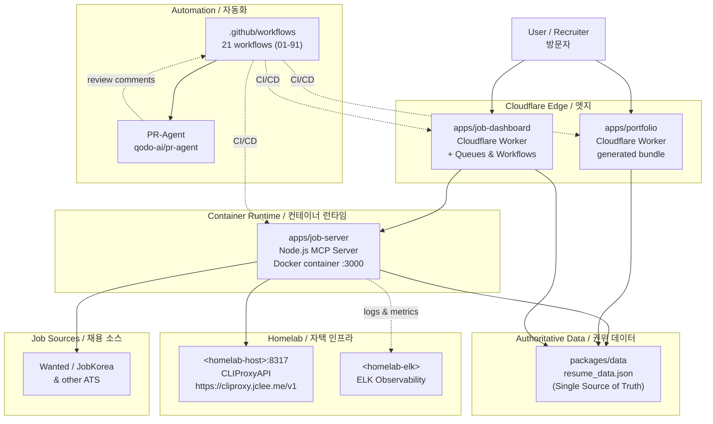

# Resume Portfolio Monorepo
# 이력서 포트폴리오 모노레포

[](package.json)
[](https://nodejs.org/)
[](https://workers.cloudflare.com/)
[](LICENSE)
[](Dockerfile)
[](wrangler.jsonc)
[](https://github.com/qodo-ai/pr-agent)
[](apps/job-server)
[](README.md)

> **Bilingual documentation** / **이중 언어 문서**: This README is provided in English first, followed by a Korean (한국어) translation of each section. Every section header is duplicated in both languages.
> 이 README는 모든 섹션을 영어와 한국어로 병기합니다. 각 섹션 제목은 양국어로 제공됩니다.

> **Primary README generator model:** `gpt-5.5` (fallback: `minimax-m3` via [https://cliproxy.jclee.me/v1](https://cliproxy.jclee.me/v1)).
> **README 생성 기본 모델:** `gpt-5.5` (대체: [https://cliproxy.jclee.me/v1](https://cliproxy.jclee.me/v1) 경유 `minimax-m3`).

---

## Overview / 개요

`resume` is a **private resume portfolio monorepo** that combines a Cloudflare Worker edge portfolio, structured resume and job-application assets, job-application tracking and automation, a dashboard Worker for operational workflows, and a Dockerized Node.js runtime that exposes a job-automation HTTP API.

`resume`는 Cloudflare Worker 기반 포트폴리오, 구조화된 이력서 및 지원 자료, 채용 지원 추적 및 자동화, 운영 워크플로우용 대시보드 Worker, 그리고 채용 자동화 HTTP API를 노출하는 Docker 기반 Node.js 런타임을 결합한 **개인 이력서 포트폴리오 모노레포**입니다.

The repository is designed as a single operational workspace for:

이 저장소는 다음을 위한 단일 운영 워크스페이스로 설계되었습니다.

- **Portfolio and resume publishing** — Cloudflare Worker edge deployment with generated bundles.
  **포트폴리오 및 이력서 게시** — 생성된 번들과 Cloudflare Worker 엣지 배포.
- **Authoritative resume content** — A single source of truth (SSoT) in `packages/data/` consumed by every surface.
  **권위 있는 이력서 콘텐츠** — `packages/data/`의 단일 진실 공급원(SSoT)을 모든 표면이 소비.
- **Job-application automation** — Crawlers, MCP tools, and HTTP API clients for Wanted, JobKorea, and other ATS.
  **채용 지원 자동화** — Wanted, JobKorea 등 ATS 대상 크롤러, MCP 도구, HTTP API 클라이언트.
- **Operational dashboard** — A Cloudflare Worker dashboard with Queues, Workflows, and admin routes.
  **운영 대시보드** — Queues, Workflows, 관리 라우트를 갖춘 Cloudflare Worker 대시보드.
- **Self-hosted observability** — Logs and metrics shipped to a homelab ELK stack and LLM proxy.
  **자체 호스팅 옵저버빌리티** — 자택 ELK 스택과 LLM 프록시로 로그/메트릭 전송.
- **Reproducible automation** — 21 numbered GitHub Actions workflows handle CI, review, release, and self-healing.
  **재현 가능한 자동화** — 21개의 번호가 매겨진 GitHub Actions 워크플로우가 CI, 리뷰, 릴리스, 자가 치유를 처리.

---

## Features / 주요 기능

### Core / 코어

- **Cloudflare Worker edge portfolio** — `apps/portfolio/` with `wrangler.jsonc` and a generated `worker.js`.
  **Cloudflare Worker 엣지 포트폴리오** — `wrangler.jsonc`와 생성된 `worker.js`를 갖춘 `apps/portfolio/`.
- **Job-automation MCP server** — `apps/job-server/` packaged as a multi-stage `node:22-alpine` Docker image with healthcheck.
  **채용 자동화 MCP 서버** — 헬스체크가 포함된 다단계 `node:22-alpine` Docker 이미지로 패키징된 `apps/job-server/`.
- **Dashboard Worker** — `apps/job-dashboard/` with Queue consumer, router, CORS/CSRF middleware, and 7 route modules.
  **대시보드 Worker** — Queue consumer, router, CORS/CSRF 미들웨어, 7개 라우트 모듈을 갖춘 `apps/job-dashboard/`.
- **Workspace monorepo** — npm workspaces covering CLI, env, data, shared, types, schemas, and contracts packages.
  **워크스페이스 모노레포** — CLI, env, data, shared, types, schemas, contracts 패키지를 포함하는 npm 워크스페이스.

### Data & Contracts / 데이터 및 계약

- **Zod-validated runtime schemas** in `packages/schemas/` with inferred TS types.
  **`packages/schemas/`의 Zod 검증 런타임 스키마**와 추론된 TS 타입.
- **OpenAPI contract** in `packages/contracts/openapi.yaml` validated by `redocly.yaml`.
  **`redocly.yaml`로 검증되는 `packages/contracts/openapi.yaml`의 OpenAPI 계약.**
- **Type-safe Cloudflare Env** re-exported from the contracts package.
  **계약 패키지에서 재내보내기되는 타입 안전 Cloudflare Env.**

### Automation / 자동화

- **21 numbered GitHub Actions workflows** covering PR review, auto-merge, dependabot, issue triage, release, and self-healing.
  **PR 리뷰, 자동 머지, Dependabot, 이슈 분류, 릴리스, 자가 치유를 다루는 21개 번호 매겨진 GitHub Actions 워크플로우.**
- **PR-Agent integration** via [qodo-ai/pr-agent](https://github.com/qodo-ai/pr-agent) for AI-assisted review.
  **[qodo-ai/pr-agent](https://github.com/qodo-ai/pr-agent)를 통한 PR-Agent 통합으로 AI 지원 리뷰 제공.**
- **Operator scripts** in `package.json` for data sync, PDF/PPTX generation, 1Password seeding, and GitHub enrichment.
  **데이터 동기화, PDF/PPTX 생성, 1Password 시딩, GitHub enrichment를 위한 `package.json` 운영 스크립트.**

### Operations / 운영

- **Docker Compose** with persistent volume and healthcheck-driven restart.
  **영구 볼륨과 헬스체크 기반 재시작을 갖춘 Docker Compose.**
- **Lychee link checker** (`lychee.toml`) for broken-link CI.
  **깨진 링크 CI를 위한 Lychee 링크 체커** (`lychee.toml`).
- **Playwright + Jest** E2E and unit test configuration.
  **Playwright + Jest E2E 및 단위 테스트 설정.**

---

## Architecture / 아키텍처

The monorepo is organised into four runtime tiers: **edge** (Cloudflare Workers), **container** (Dockerized MCP server), **homelab** (private LLM proxy and observability), and **automation** (GitHub Actions). All tiers converge on the SSoT resume data in `packages/data/`.

이 모노레포는 네 개의 런타임 계층 — **엣지** (Cloudflare Workers), **컨테이너** (Docker화된 MCP 서버), **자택 인프라** (사설 LLM 프록시 및 옵저버빌리티), **자동화** (GitHub Actions) — 로 구성됩니다. 모든 계층은 `packages/data/`의 SSoT 이력서 데이터로 수렴합니다.



### Key architectural rules / 핵심 아키텍처 규칙

1. **`packages/data/` is the SSoT.** Every surface (portfolio, dashboard, MCP server, generated PDFs/PPTX) reads from `resume_data.json`. Never duplicate.
   **`packages/data/`는 SSoT입니다.** 모든 표면(포트폴리오, 대시보드, MCP 서버, 생성된 PDF/PPTX)은 `resume_data.json`에서 읽습니다. 절대 중복하지 마세요.
2. **All automation goes through `.github/workflows/`.** No cron jobs on homelab trigger production data writes.
   **모든 자동화는 `.github/workflows/`를 거칩니다.** 자택 인프라의 cron은 운영 데이터 쓰기를 트리거하지 않습니다.
3. **Secrets are type-checked at boot** by `packages/env/` and seeded via the `op:*` scripts; no plaintext in the repo.
   **시크릿은 `packages/env/`에서 부팅 시 타입 검사**되며 `op:*` 스크립트로 시드됩니다. 저장소에 평문이 없습니다.
4. **PR-Agent runs as a workflow step**, not as a long-lived service, to keep the homelab free of idle workloads.
   **PR-Agent는 워크플로우 단계로 실행**되며 장기 실행 서비스가 아닙니다. 자택 인프라의 유휴 부하를 방지합니다.

---

## Automation Inventory / 자동화 인벤토리

### GitHub Actions Workflows / GitHub Actions 워크플로우

21 workflows (all paths under `.github/workflows/`). Names keep their numeric prefix.

총 21개 워크플로우 (모두 `.github/workflows/` 하위). 이름은 숫자 접두사를 유지합니다.

#### CI & verification / CI 및 검증

| Workflow / 워크플로우 | Purpose / 용도 |
| --- | --- |
| `ci.yml` | Lint, typecheck, unit/integration tests on PRs and pushes. / PR 및 push에 대한 린트, 타입 체크, 단위/통합 테스트. |
| `post-deploy-verify.yml` | Smoke tests against deployed edge + container endpoints. / 배포된 엣지 + 컨테이너 엔드포인트 대상 스모크 테스트. |
| `delete-standalone-job-worker.yml` | Tear down ephemeral stand-alone job workers. / 임시 단독 작업 워커 제거. |
| `provision-queues.yml` | Provision Cloudflare Queues referenced by `apps/job-dashboard`. / `apps/job-dashboard`가 참조하는 Cloudflare Queues 프로비저닝. |

#### Pull-request automation / PR 자동화

| Workflow / 워크플로우 | Purpose / 용도 |
| --- | --- |
| `01_branch-to-pr.yml` | Open a draft PR for active branches lacking one. / PR이 없는 활성 브랜치에 대해 draft PR 열기. |
| `10_pr-review.yml` | Trigger [PR-Agent](https://github.com/qodo-ai/pr-agent) review. / [PR-Agent](https://github.com/qodo-ai/pr-agent) 리뷰 트리거. |
| `11_security-pr-review.yml` | Security-focused PR review with extra SAST prompts. / SAST 프롬프트를 추가한 보안 중심 PR 리뷰. |
| `12_dependabot-auto-merge.yml` | Auto-merge trusted Dependabot patches. / 신뢰할 수 있는 Dependabot 패치 자동 머지. |
| `13_pr-auto-merge.yml` | Auto-merge PRs labelled `auto-merge`. / `auto-merge` 라벨이 붙은 PR 자동 머지. |
| `14_bot-auto-fix.yml` | Apply automated fixes (lint, format, import-order) on bot-authored commits. / 봇 커밋에 자동 수정(린트, 포맷, import 순서) 적용. |
| `15_merged-pr-cleanup.yml` | Delete merged feature branches. / 머지된 기능 브랜치 삭제. |

#### Issue automation / 이슈 자동화

| Workflow / 워크플로우 | Purpose / 용도 |
| --- | --- |
| `02_issue-to-branch.yml` | Create a branch from an issue using the issue title. / 이슈 제목으로 이슈에서 브랜치 생성. |
| `19_issue-backfill.yml` | Backfill missing labels/milestones on legacy issues. / 레거시 이슈의 누락된 라벨/마일스톤 보충. |
| `37_ci-failure-issues.yml` | Open an issue when CI fails repeatedly. / CI가 반복 실패할 때 이슈 열기. |
| `91_issue-classification.yml` | Classify incoming issues by labels and assignees. / 들어오는 이슈를 라벨과 담당자로 분류. |

#### Release & publishing / 릴리스 및 게시

| Workflow / 워크플로우 | Purpose / 용도 |
| --- | --- |
| `release.yml` | Tag-driven release orchestration. / 태그 기반 릴리스 오케스트레이션. |
| `24_release-notes.yml` | Auto-generate release notes from PRs and issues. / PR과 이슈에서 릴리스 노트 자동 생성. |
| `25_release-publish.yml` | Publish release artefacts to the appropriate registry. / 적절한 레지스트리에 릴리스 아티팩트 게시. |

#### Operations & self-healing / 운영 및 자가 치유

| Workflow / 워크플로우 | Purpose / 용도 |
| --- | --- |
| `29_downstream-health-check.yml` | Verify downstream services (homelab endpoints) are reachable. / 다운스트림 서비스(자택 엔드포인트) 도달 가능성 확인. |
| `60_ci-auto-heal.yml` | Auto-retry or patch transient CI failures. / 일시적 CI 실패 자동 재시도 또는 패치. |
| `auto-sync-data.yml` | Periodically refresh SSoT data from approved sources. / 승인된 소스에서 SSoT 데이터 주기적 새로 고침. |

### Go Automation Tools / Go 자동화 도구

No standalone Go binaries live in this repository; Go entry points are declared in `package.json` (e.g. `sync:pdf`, `op:*`, `enrich:*`, `sync:proposals`) and resolved from `tools/scripts/` at run time. Treat the `tools/scripts/` paths as the canonical location for any Go automation.

이 저장소에는 독립 실행형 Go 바이너리가 없습니다. Go 진입점은 `package.json`(`sync:pdf`, `op:*`, `enrich:*`, `sync:proposals` 등)에 선언되어 있으며 런타임 시 `tools/scripts/`에서 해석됩니다. 모든 Go 자동화의 정식 위치로 `tools/scripts/` 경로를 취급하세요.

---

## Repository Structure / 저장소 구조

```text
.
├── AGENTS.md                      # Project knowledge base (SSoT for AGENTS)
├── CHANGELOG.md
├── CONTRIBUTING.md
├── Dockerfile                     # Multi-stage build for job-server
├── LICENSE
├── OWNERS
├── README.md                      # This file
├── docker-compose.yml             # mcp-server service definition
├── eslint.config.cjs
├── jest.config.cjs
├── lychee.toml                    # Link-checker config
├── package.json                   # Workspace root + operator scripts
├── package-lock.json
├── playwright.config.js
├── redocly.yaml                   # OpenAPI lint rules
├── tsconfig.base.json
├── tsconfig.json
├── wrangler.jsonc                 # Cloudflare Worker config
├── ta/                            # TA profile generation (Python/PPTX)
│   ├── improve_visual.py
│   ├── inspect.py
│   ├── verify.py
│   ├── *.pptx
│   └── output/
├── applications/                  # Per-company application packets
│   ├── airpremia-security-2026/
│   ├── infrastructure-architecture-2026/
│   ├── coupang-fintech-sre-2026/
│   ├── cloudflare-one-se-2026/
│   └── gitlab-apac-security-2026/
└── apps/
    └── job-dashboard/             # Cloudflare Worker dashboard
        ├── API_REFERENCE.md
        ├── DEPLOYMENT_GUIDE.md
        ├── DEVELOPMENT_GUIDE.md
        ├── DIAGRAMS.md
        ├── OWNERS
        ├── README.md
        ├── SECRETS.md
        ├── migrate-json-to-d1.cjs
        ├── migration-data.sql
        ├── schema.sql
        ├── tsconfig.json
        ├── package.json
        ├── migrations/
        │   └── 0002_add_approval_metadata.sql
        └── src/
            ├── index.js
            ├── queue-consumer.js
            ├── router.js
            ├── middleware/
            │   ├── cors.js
            │   ├── csrf.js
            │   └── rate-limit.test.js
            ├── routes/
            │   ├── admin.js
            │   ├── applications.js
            │   ├── auth.js
            │   ├── automation.js
            │   ├── health.js
            │   ├── index.js
            │   ├── stats.js
            │   └── workflows.js
            └── handlers/
                ├── applications.js
                ├── auth.js
                └── auto-apply-webhook-handler.js
```

> **Note / 참고:** `package.json` declares additional workspaces (`apps/portfolio`, `apps/job-server`, `packages/cli`, `packages/data`, `packages/shared`, `packages/types`, `packages/schemas`, `packages/contracts`, `packages/env`). Their presence is governed by the lockfile; consult `AGENTS.md` for the full inventory.
> `package.json`은 추가 워크스페이스(`apps/portfolio`, `apps/job-server`, `packages/cli`, `packages/data`, `packages/shared`, `packages/types`, `packages/schemas`, `packages/contracts`, `packages/env`)를 선언합니다. 이들의 존재는 lockfile에 의해 결정되며, 전체 인벤토리는 `AGENTS.md`를 참조하세요.

---

## Quick Start / 빠른 시작

### Prerequisites / 사전 요구 사항

- **Node.js ≥ 22** (matches the runtime in `Dockerfile`).
  **Node.js ≥ 22** (`Dockerfile`의 런타임과 일치).
- **npm** with workspace support (npm 10+ recommended).
  **워크스페이스를 지원하는 npm** (npm 10+ 권장).
- **Docker** + **Docker Compose** for the MCP server runtime.
  **MCP 서버 런타임을 위한 Docker + Docker Compose**.
- **Wrangler** for Cloudflare Worker development.
  **Cloudflare Worker 개발을 위한 Wrangler**.
- Optional: **Go ≥ 1.22**, **Python 3.11+**, **1Password CLI** for full operator scripts.
  선택: 전체 운영 스크립트를 위한 **Go ≥ 1.22**, **Python 3.11+**, **1Password CLI**.

### Clone & install / 복제 및 설치

```bash
git clone <repository-url> resume
cd resume
npm ci
```

### Run the MCP server (Docker) / MCP 서버 실행 (Docker)

```bash
docker compose up -d mcp-server
docker compose ps
curl -fsS http://127.0.0.1:3000/health
```

### Run the dashboard Worker locally / 대시보드 Worker 로컬 실행

```bash
cd apps/job-dashboard
npm run dev   # wrangler dev
```

### Generate resume artefacts / 이력서 아티팩트 생성

```bash
npm run sync:data   # refresh SSoT JSON
npm run sync:pdf    # regenerate PDFs via Go
npm run sync:pptx   # regenerate PPTX via Python
npm run sync:all    # data + pdf + pptx
```

---

## Local Development / 로컬 개발

### Branch & PR convention / 브랜치 및 PR 규칙

- Branch names follow `<type>/<scope>-<ticket>` (e.g. `feat/dashboard-rate-limit-123`).
  브랜치 이름은 `<type>/<scope>-<ticket>` 형식을 따릅니다 (예: `feat/dashboard-rate-limit-123`).
- PRs must reference an issue; `01_branch-to-pr.yml` and `02_issue-to-branch.yml` keep the two linked.
  PR은 이슈를 참조해야 합니다. `01_branch-to-pr.yml`과 `02_issue-to-branch.yml`이 두 가지를 연결 상태로 유지합니다.
- Use the `auto-merge` label for safe changes; `12_dependabot-auto-merge.yml` and `13_pr-auto-merge.yml` will handle the rest.
  안전한 변경에는 `auto-merge` 라벨을 사용하세요. `12_dependabot-auto-merge.yml`과 `13_pr-auto-merge.yml`이 나머지를 처리합니다.

### Testing / 테스트

```bash
npm run lint            # ESLint (eslint.config.cjs)
npm run typecheck       # TypeScript (tsconfig.base.json)
npm run test            # Jest (jest.config.cjs)
npm run test:e2e        # Playwright (playwright.config.js)
npm run links           # Lychee link check (lychee.toml)
npm run openapi:lint    # Redocly CLI (redocly.yaml)
```

### Secrets & 1Password / 시크릿 및 1Password

```bash
npm run op:seed:resume      # seed resume secrets
npm run op:seed:sessions    # seed browser session files
npm run op:restore:sessions # restore session files
npm run op:run              # run one-shot 1Password job
npm run op:native:run       # run native 1Password binary
```

### Local observability / 로컬 옵저버빌리티

The MCP server pushes structured logs and metrics to the homelab ELK stack at `<homelab-elk>`. To point a local run elsewhere, override the `LOG_SINK` and `METRICS_SINK` environment variables defined in `packages/env/`.

MCP 서버는 자택 ELK 스택(`<homelab-elk>`)으로 구조화 로그와 메트릭을 전송합니다. 로컬 실행에서 다른 대상으로 보내려면 `packages/env/`에 정의된 `LOG_SINK` 및 `METRICS_SINK` 환경 변수를 재정의하세요.

---

## Commands Reference / 명령어 레퍼런스

All commands are declared in the root `package.json` and run from the repository root unless otherwise noted.

모든 명령어는 루트 `package.json`에 선언되어 있으며 별도 표기가 없는 한 저장소 루트에서 실행합니다.

### Data & content sync / 데이터 및 콘텐츠 동기화

| Command / 명령어 | Description / 설명 |
| --- | --- |
| `npm run strip-exif` | Strip EXIF metadata from portfolio images via `exiftool`. / `exiftool`로 포트폴리오 이미지의 EXIF 메타데이터 제거. |
| `npm run sync:data` | Refresh SSoT JSON from authoritative sources. / 권위 소스에서 SSoT JSON 새로 고침. |
| `npm run sync:pdf` | Regenerate resume PDFs (Go). / 이력서 PDF 재생성 (Go). |
| `npm run sync:pptx` | Regenerate TA PPTX (Python). / TA PPTX 재생성 (Python). |
| `npm run sync:all` | `sync:data` + `sync:pdf` + `sync:pptx`. |
| `npm run sync:proposals` | Review + apply job-board proposals. / 채용 공고 제안 검토 및 적용. |

### 1Password & secrets / 1Password 및 시크릿

| Command / 명령어 | Description / 설명 |
| --- | --- |
| `npm run op:run` | Run a one-shot 1Password job. / 일회성 1Password 작업 실행. |
| `npm run op:native:run` | Run the native 1Password binary. / 네이티브 1Password 바이너리 실행. |
| `npm run op:seed:resume` | Seed resume-specific secrets. / 이력서 전용 시크릿 시드. |
| `npm run op:seed:sessions` | Seed browser session files. / 브라우저 세션 파일 시드. |
| `npm run op:restore:sessions` | Restore session files from 1Password. / 1Password에서 세션 파일 복원. |

### Enrichment / 인리치먼트

| Command / 명령어 | Description / 설명 |
| --- | --- |
| `npm run enrich:github` | Enrich profiles from GitHub data. / GitHub 데이터로 프로필 인리치. |
| `npm run enrich:skills` | Enrich the skills catalog. / 스킬 카탈로그 인리치. |
| `npm run enrich:ai` | Enrich via LLM (CLIProxyAPI). / LLM으로 인리치 (CLIProxyAPI). |
| `npm run enrich:all` | Run all three enrichment passes. / 세 가지 인리치 패스 모두 실행. |

### Automation pipelines / 자동화 파이프라인

| Command / 명령어 | Description / 설명 |
| --- | --- |
| `npm run automate:ssot` | SSoT pipeline: sync + build + typecheck + test. / SSoT 파이프라인: 동기화 + 빌드 + 타입 체크 + 테스트. |
| `npm run automate:full` | Full pipeline including lint, typecheck, enrichment, and publish. / 린트, 타입 체크, 인리치먼트, 게재를 포함한 전체 파이프라인. |

---

## Contribution Guide / 기여 가이드

### Ground rules / 기본 규칙

1. **All changes flow through a PR.** Direct pushes to `master` are blocked by branch protection; the CI workflow and `37_ci-failure-issues.yml` enforce quality gates.
   **모든 변경은 PR을 거칩니다.** `master`로의 직접 푸시는 브랜치 보호에 의해 차단되며 CI 워크플로우와 `37_ci-failure-issues.yml`이 품질 게이트를 강제합니다.
2. **PR-Agent is mandatory.** Both `10_pr-review.yml` and `11_security-pr-review.yml` will leave review comments. Address or explicitly defer each one.
   **PR-Agent는 필수입니다.** `10_pr-review.yml`과 `11_security-pr-review.yml`이 모두 리뷰 댓글을 남깁니다. 각 항목에 응답하거나 명시적으로 연기하세요.
3. **Keep the SSoT authoritative.** Do not edit generated artefacts directly. Run the appropriate `sync:*` command instead.
   **SSoT를 권위 있게 유지하세요.** 생성된 아티팩트를 직접 편집하지 마세요. 적절한 `sync:*` 명령을 실행하세요.
4. **Respect workspace boundaries.** Internal packages communicate through `packages/contracts/` (OpenAPI) and `packages/types/` (JSDoc/TS). Do not reach into another workspace's `src/`.
   **워크스페이스 경계를 존중하세요.** 내부 패키지는 `packages/contracts/`(OpenAPI) 및 `packages/types/`(JSDoc/TS)을 통해 통신합니다. 다른 워크스페이스의 `src/`에 직접 접근하지 마세요.

### Adding a new workflow / 새 워크플로우 추가

- Choose a numeric prefix that fits the existing ordering (see `AGENTS.md` for the convention). The next free slot in the operational range is in the 60s for self-healing, 90s for classification, and unprefixed for top-level orchestration.
  기존 정렬에 맞는 숫자 접두사를 선택하세요(규칙은 `AGENTS.md` 참조). 자가 치유는 60대, 분류는 90대, 최상위 오케스트레이션은 접두사 없음이 다음 빈 슬롯입니다.
- Place the file under `.github/workflows/` with the chosen prefix.
  선택한 접두사로 `.github/workflows/` 하위에 파일을 배치하세요.
- Wire any new secrets through `packages/env/` and `op:seed:*` so they are validated at boot.
  새 시크릿을 `packages/env/`와 `op:seed:*`를 통해 연결하여 부팅 시 검증되도록 하세요.
- Update the **Automation Inventory** table in this README in the same PR.
  동일 PR에서 본 README의 **자동화 인벤토리** 표를 업데이트하세요.

### Adding a new internal package / 새 내부 패키지 추가

- Add the package to the `workspaces` array in `package.json`.
  `package.json`의 `workspaces` 배열에 패키지를 추가하세요.
- Add its `package.json` path to the `COPY` steps in `Dockerfile` (the `deps` stage resolves the workspace graph).
  `Dockerfile`의 `COPY` 단계에 해당 `package.json` 경로를 추가하세요 (`deps` 단계가 워크스페이스 그래프를 해석).
- Document the package's role in `AGENTS.md` and link it from the **Repository Structure** section above.
  `AGENTS.md`에 패키지의 역할을 문서화하고 위 **저장소 구조** 섹션에서 링크하세요.

### Reporting issues / 이슈 보고

- Issues are auto-classified by `91_issue-classification.yml`. Provide enough context to be assigned correctly: reproduction steps, expected vs. actual behaviour, and the relevant workflow log URL.
  이슈는 `91_issue-classification.yml`에 의해 자동 분류됩니다. 올바르게 할당되도록 재현 단계, 예상 동작과 실제 동작, 관련 워크플로우 로그 URL 등 충분한 맥락을 제공하세요.
- Security-sensitive issues: follow the disclosure process in `docs/security/` (or the latest entry in `AGENTS.md`) and **do not** open a public issue.
  보안 관련 이슈: `docs/security/`(또는 `AGENTS.md`의 최신 항목)의 공개 프로세스를 따르며 **절대** 공개 이슈를 열지 마세요.

### Code of conduct / 행동 강령

This is a private monorepo; contributions are limited to maintainers listed in `OWNERS`. External contributions are not accepted at this time. Behavioural expectations follow the conventions documented in `AGENTS.md` and `CONTRIBUTING.md`.

이 저장소는 사적 모노레포이며, 기여는 `OWNERS`에 나열된 메인테이너로 제한됩니다. 현재 외부 기여는 허용되지 않습니다. 행동 기대치는 `AGENTS.md`와 `CONTRIBUTING.md`에 문서화된 규칙을 따릅니다.

---

## License / 라이선스

MIT — see [LICENSE](LICENSE).

MIT — [LICENSE](LICENSE) 참조.

---

## Maintainers / 메인테이너

See [OWNERS](OWNERS).

[OWNERS](OWNERS) 참조.

---

*Generated by `gpt-5.5`. Last regenerated against commit `011dd571` on 2026-06-12.*
*`gpt-5.5`로 생성됨. 커밋 `011dd571` 기준으로 2026-06-12에 마지막 재생성됨.*