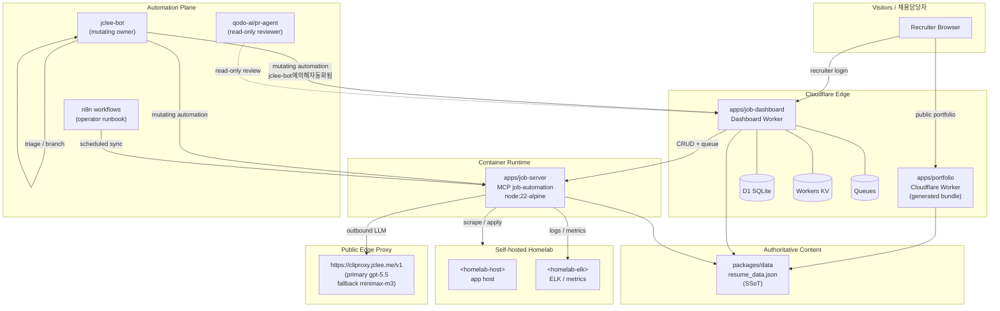

# Resume Portfolio Monorepo / 이력서 포트폴리오 모노레포

[](package.json)
[](https://nodejs.org/)
[](https://workers.cloudflare.com/)
[](LICENSE)
[](Dockerfile)
[](wrangler.jsonc)
[](https://github.com/qodo-ai/pr-agent)
[](apps/job-server)
[](https://cliproxy.jclee.me/v1)
[](https://bot.jclee.me)
[](#readme-generation)
[](https://cliproxy.jclee.me/v1)

> **Bilingual documentation / 이중 언어 문서**
> Every section header is duplicated in English and Korean. English prose appears first under each heading, followed by the Korean (한국어) translation.
> 본 README는 모든 섹션 제목을 영어와 한국어로 병기하고, 같은 제목 아래에 영어 본문을 먼저 작성한 뒤 한국어 번역을 이어 붙입니다.

> **Primary README generator model:** `gpt-5.5`
> **Fallback README generator model:** `minimax-m3`, routed through the public edge proxy at [`https://cliproxy.jclee.me/v1`](https://cliproxy.jclee.me/v1).
> **README 생성 기본 모델:** `gpt-5.5`
> **README 생성 대체 모델:** [`https://cliproxy.jclee.me/v1`](https://cliproxy.jclee.me/v1) 엣지 프록시 경유 `minimax-m3`

---

## Overview / 개요

### English

`resume` (v1.40.11) is a private, opinionated **resume portfolio monorepo** that fuses several distinct surfaces into a single, lockfile-pinned npm workspace:

1. A **Cloudflare Worker** public portfolio (edge-rendered, generated bundle).
2. A **job automation runtime** (`apps/job-server`) that runs as an MCP server inside a container, crawling and applying to Korean job boards (Wanted, JobKorea) under operator supervision.
3. A **job-dashboard worker** (`apps/job-dashboard`) that exposes admin/auth/automation/workflows/stats routes backed by Cloudflare D1, Workers KV, and Queues.
4. A set of **shared workspace packages** (`cli`, `env`, `data`, `shared`, `types`, `schemas`, `contracts`) that form the canonical type and contract surface across all apps.
5. A **self-hosted observability** layer on the operator's homelab (ELK, metrics) plus public edge endpoints [`https://cliproxy.jclee.me/v1`](https://cliproxy.jclee.me/v1) and [`https://bot.jclee.me`](https://bot.jclee.me).

The authoritative content source is `packages/data/resumes/master/resume_data.json`. Everything else — PDF, PPTX, edge HTML, dashboard — is generated from this single source of truth (SSoT) and pinned by the root `package-lock.json`.

### 한국어

`resume` (v1.40.11)은 단일 lockfile로 고정된 npm 워크스페이스에서 여러 표면을 통합한 사설 **이력서 포트폴리오 모노레포**입니다.

1. **Cloudflare Worker** 기반 공개 포트폴리오(엣지 렌더링, 생성된 번들).
2. **잡 자동화 런타임**(`apps/job-server`) — MCP 서버로 컨테이너에서 동작하며, 운영자 감독 하에 원티드/잡코리아 등 한국 구인 플랫폼을 크롤링·지원합니다.
3. **잡 대시보드 워커**(`apps/job-dashboard`) — Cloudflare D1, Workers KV, Queues를 백엔드로 사용하는 admin/auth/automation/workflows/stats 라우트를 제공합니다.
4. **공유 워크스페이스 패키지**(`cli`, `env`, `data`, `shared`, `types`, `schemas`, `contracts`) — 모든 앱의 정식 타입/계약 표면을 구성합니다.
5. 운영자 **홈랩의 자체 호스팅 옵저버빌리티**(ELK, 메트릭)와 공개 엣지 엔드포인트 [`https://cliproxy.jclee.me/v1`](https://cliproxy.jclee.me/v1), [`https://bot.jclee.me`](https://bot.jclee.me).

정식 콘텐츠 원본은 `packages/data/resumes/master/resume_data.json`입니다. PDF, PPTX, 엣지 HTML, 대시보드를 포함한 모든 결과물은 이 단일 진실 원본(SSoT)에서 생성되며 루트 `package-lock.json`으로 고정됩니다.

---

## Features / 주요 기능

### English

- **SSoT-driven build pipeline** — one JSON file drives the Cloudflare Worker bundle, the printed PDF, the recruiter PPTX, and the dashboard data.
- **Cloudflare-native edge** — `wrangler.jsonc` configures Workers, D1, KV, and Queues; `apps/portfolio/worker.js` is generated, never hand-edited.
- **Containerized MCP runtime** — multi-stage `Dockerfile` ships a minimal `node:22-alpine` image with healthcheck; `docker-compose.yml` mounts persistent job-automation data.
- **Type-safe contracts** — `packages/types` (JSDoc/TS, zero runtime deps) + `packages/schemas` (Zod) + `packages/contracts` (OpenAPI + `Env` interface).
- **Operator automation plane** — `jclee-bot` owns all mutating automation. PR review is delegated to PR-Agent (qodo-ai/pr-agent) in read-only mode.
- **External AI routing** — outbound model calls go through the public edge proxy at `https://cliproxy.jclee.me/v1` so the operator can swap primary/fallback models without code changes.
- **Per-company application packets** — `applications/<company>-<role>-<year>/` keeps resume variants, cover letters, and interview Q&A self-contained.
- **TA profile tooling** — `ta/` generates technical-assistant (TA) profile PPTX assets via Python and writes reports to `ta/output/`.

### 한국어

- **SSoT 기반 빌드 파이프라인** — 단일 JSON 파일이 Cloudflare Worker 번들, 인쇄용 PDF, 채용담당자용 PPTX, 대시보드 데이터를 모두 생성합니다.
- **Cloudflare 네이티브 엣지** — `wrangler.jsonc`로 Workers, D1, KV, Queues를 구성하며 `apps/portfolio/worker.js`는 생성 산출물로 수동 편집하지 않습니다.
- **컨테이너형 MCP 런타임** — 다단계 `Dockerfile`이 헬스체크가 포함된 경량 `node:22-alpine` 이미지를 빌드하고, `docker-compose.yml`이 잡 자동화 데이터를 영속 볼륨으로 마운트합니다.
- **타입 안전 계약** — `packages/types`(런타임 의존성 없는 JSDoc/TS) + `packages/schemas`(Zod) + `packages/contracts`(OpenAPI + `Env` 인터페이스).
- **운영자 자동화 평면** — `jclee-bot`이 모든 변경 자동화를 소유합니다. PR 리뷰는 PR-Agent(qodo-ai/pr-agent)에 읽기 전용으로 위임됩니다.
- **외부 AI 라우팅** — 외부 모델 호출은 공개 엣지 프록시 `https://cliproxy.jclee.me/v1`을 경유하여 코드 변경 없이 기본/대체 모델을 교체할 수 있습니다.
- **회사별 지원 패키지** — `applications/<회사>-<역할>-<연도>/` 디렉터리로 이력서 변형, 자기소개서, 면접 Q&A를 자기완결적으로 보관합니다.
- **TA 프로파일 도구** — `ta/` 디렉터리는 Python으로 기술 어시스턴트(TA) 프로파일 PPTX 자산을 생성하고 결과를 `ta/output/`에 기록합니다.

---

## Architecture / 아키텍처

### English

The system is layered: a public Cloudflare edge, a containerized MCP runtime, a Cloudflare-resident dashboard, a self-hosted homelab observability stack, and an automation plane driven by `jclee-bot`. Recruiter traffic terminates at the edge; mutating automation originates from `jclee-bot` and is gated by the workflow files in `.github/workflows/` (which are *implementation triggers*, not the contract of record).



### 한국어

이 시스템은 공개 Cloudflare 엣지, 컨테이너형 MCP 런타임, Cloudflare 대시보드, 자체 호스팅 홈랩 옵저버빌리티, 그리고 `jclee-bot`이 구동하는 자동화 평면으로 구성됩니다. 채용담당자 트래픽은 엣지에서 종료되며, 변경 자동화는 `jclee-bot`에서 시작되어 `.github/workflows/`의 워크플로우 파일로 *구현 트리거링*됩니다(워크플로우 파일은 계약의 원본이 아니라 구현 트리거입니다).

---

## Repository Structure / 저장소 구조

### English

The top-level layout reflects the actual filesystem. Per-area deep dives (packages, tools, tests, infrastructure, docs, supabase, third_party, .github) are documented in `AGENTS.md`.

```text
./
├── AGENTS.md                  # Canonical project knowledge base
├── CHANGELOG.md               # Versioned changelog
├── CONTRIBUTING.md            # Contribution guide
├── Dockerfile                 # Multi-stage build for job-server runtime
├── LICENSE                    # MIT
├── OWNERS                     # Code ownership
├── README.md                  # This file
├── docker-compose.yml         # mcp-server service definition
├── eslint.config.cjs          # Lint configuration
├── jest.config.cjs            # Jest configuration
├── lychee.toml                # Link checker configuration
├── package.json               # Workspace root + operator scripts
├── package-lock.json          # Pinned dependency graph
├── playwright.config.js       # Playwright E2E configuration
├── redocly.yaml               # OpenAPI lint configuration
├── tsconfig.base.json         # Shared TypeScript base config
├── tsconfig.json              # TypeScript root config
├── wrangler.jsonc             # Cloudflare Worker configuration
├── applications/              # Per-company application packets
│   ├── airpremia-security-2026/
│   ├── infrastructure-architecture-2026/
│   ├── coupang-fintech-sre-2026/
│   ├── cloudflare-one-se-2026/
│   └── gitlab-apac-security-2026/
├── apps/                      # Deployable runtimes
│   └── job-dashboard/         # Dashboard worker + routes/handlers
└── ta/                        # TA profile generation (Python/PPTX)
    ├── improve_visual.py
    ├── inspect.py
    ├── verify.py
    ├── *.pptx
    └── output/                # Generated PPTX + verify reports
```

### 한국어

최상위 레이아웃은 실제 파일시스템을 그대로 반영합니다. 패키지, 도구, 테스트, 인프라, 문서, supabase, third_party, .github 등 영역별 상세 내역은 `AGENTS.md`에 정리되어 있습니다.

---

## jclee-bot Automation Surfaces / jclee-bot 자동화 표면

### English

`jclee-bot` is the **owner of all mutating automation** against this repository. The workflow files under `.github/workflows/` are implementation triggers; the automation *contract of record* is `jclee-bot` and is documented here. PR-Agent (`qodo-ai/pr-agent`) operates strictly in read-only reviewer mode and is **not** part of the mutating surface.

**Mutating surfaces owned by `jclee-bot`:**

- **Branch → PR promotion** — promotes completed branches into pull requests with auto-generated context.
- **Issue → branch creation** — converts operator-approved issues into working branches with linked issues.
- **PR review (read-only, delegated)** — PR-Agent (`qodo-ai/pr-agent`) is invoked for read-only review; mutating decisions are made by `jclee-bot`.
- **Security PR review** — security-scoped PR review gate.
- **Dependabot auto-merge** — auto-merges Dependabot PRs that pass policy.
- **PR auto-merge** — auto-merges PRs once all required checks and approvals are satisfied.
- **Bot auto-fix** — `jclee-bot` opens or amends PRs to remediate CI failures within policy.
- **Merged-PR cleanup** — branch and artifact cleanup after merge.
- **Issue backfill** — backfills missing issue metadata and links.
- **Release notes** — generates release notes from merged PRs and conventional commits.
- **Release publish** — publishes a tagged release once notes are approved.
- **Downstream health check** — post-release health probe of downstream consumers.
- **CI-failure issues** — opens a tracked issue when CI fails repeatedly.
- **Auto data sync** — periodic SSoT data refresh from approved sources.
- **Standalone job-worker deletion** — retires ephemeral job-worker branches.
- **Post-deploy verification** — runs smoke checks after a deploy.
- **Queue provisioning** — provisions Cloudflare Queues used by the dashboard.

**Issue automation behavior:** When an issue matches the automation criteria, it is labeled, triaged, and routed by **`jclee-bot에의해자동화됨`** (this exact marker appears in issue automation logs and bot comments). Manual override is available to operators listed in `OWNERS`.

### 한국어

`jclee-bot`은 이 저장소에 대한 **모든 변경(mutating) 자동화의 소유자**입니다. `.github/workflows/`의 워크플로우 파일은 구현 트리거이며, 자동화의 *공식 계약(contract of record)*은 `jclee-bot`이며 본 README에 문서화됩니다. PR-Agent(`qodo-ai/pr-agent`)는 엄격히 읽기 전용 리뷰어 모드로 동작하며 변경 표면에 포함되지 **않습니다**.

**`jclee-bot`이 소유하는 변경 표면:**

- **Branch → PR 승격** — 완료된 브랜치를 컨텍스트와 함께 PR로 승격
- **Issue → Branch 생성** — 운영자가 승인한 이슈를 연결된 브랜치로 변환
- **PR 리뷰(읽기 전용, 위임)** — PR-Agent(`qodo-ai/pr-agent`)는 읽기 전용 리뷰에 사용되며 변경 결정은 `jclee-bot`이 수행
- **보안 PR 리뷰** — 보안 범위 PR 리뷰 게이트
- **Dependabot 자동 머지** — 정책에 부합하는 Dependabot PR 자동 머지
- **PR 자동 머지** — 필수 검사/승인이 충족되면 PR 자동 머지
- **봇 자동 수정** — 정책 범위 내에서 CI 실패를 복구하는 PR을 `jclee-bot`이 개설/수정
- **머지된 PR 정리** — 머지 후 브랜치/아티팩트 정리
- **이슈 백필** — 누락된 이슈 메타데이터/링크 보강
- **릴리스 노트** — 머지된 PR과 컨벤셔널 커밋으로부터 릴리스 노트 생성
- **릴리스 게시** — 노트 승인 후 태깅된 릴리스 게시
- **다운스트림 헬스 체크** — 릴리스 후 다운스트림 컨슈머 헬스 점검
- **CI 실패 이슈** — CI가 반복 실패하면 추적 가능한 이슈 개설
- **자동 데이터 동기화** — 승인된 소스에서 주기적 SSoT 데이터 갱신
- **단독 잡 워커 정리** — 일회성 잡 워커 브랜치 폐기
- **배포 후 검증** — 배포 후 스모크 체크 실행
- **큐 프로비저닝** — 대시보드에서 사용하는 Cloudflare Queues 프로비저닝

**이슈 자동화 동작:** 자동화 기준에 부합하는 이슈는 **`jclee-bot에의해자동화됨`** 마커와 함께 라벨링/분류/라우팅됩니다(이 정확한 마커는 이슈 자동화 로그와 봇 댓글에 표시됨). `OWNERS`에 기재된 운영자는 수동으로 재정의할 수 있습니다.

---

## Go Tools / Go 도구

### English

This repository's **inventoried Go automation tools: 0**.

The `go run` entries in `package.json` (`op:run`, `op:native:run`, `op:seed:resume`, `op:seed:sessions`, `op:restore:sessions`, `sync:proposals`, `sync:pdf`, `enrich:github`, `enrich:skills`, `enrich:ai`) are **operator entrypoints** that delegate to source under `tools/scripts/...` as described in `AGENTS.md`. They are wiring for the SSoT/build/sync pipeline, not repo-owned Go CLIs, and intentionally fall outside the Go-tools inventory.

### 한국어

이 저장소의 **인벤토리 대상 Go 자동화 도구: 0개**입니다.

`package.json`의 `go run` 엔트리(`op:run`, `op:native:run`, `op:seed:resume`, `op:seed:sessions`, `op:restore:sessions`, `sync:proposals`, `sync:pdf`, `enrich:github`, `enrich:skills`, `enrich:ai`)는 `AGENTS.md`에 기술된 `tools/scripts/...` 하위 소스로 위임하는 **운영자 진입점**입니다. SSoT/빌드/동기화 파이프라인의 배선이며 저장소 소유 Go CLI가 아니므로 의도적으로 Go 도구 인벤토리에서 제외됩니다.

---

## Quick Start / 빠른 시작

### English

```bash
# 1. Clone
git clone <this-repo> resume
cd resume

# 2. Install workspace deps (Node.js >= 22)
npm ci

# 3. Build the public portfolio worker
npm run build

# 4. Run the job-server MCP runtime in Docker
docker compose up -d mcp-server

# 5. Verify health
curl -fsS http://127.0.0.1:3000/health
```

### 한국어

위 명령은 저장소 클론 → 워크스페이스 의존성 설치(공식) → 포트폴리오 워커 빌드 → `mcp-server` 도커 기동 → 헬스체크 순서로 진행됩니다. Node.js 22 이상이 필요합니다.

---

## Local Development / 로컬 개발

### English

- **Prerequisites:** Node.js ≥ 22, Docker (optional, for `job-server`), Python 3 (for `ta/`), Wrangler CLI, and access to the public edge proxy at `https://cliproxy.jclee.me/v1` if you exercise outbound LLM paths.
- **Lint:** `npm run lint` (ESLint, `eslint.config.cjs`).
- **Type check:** `npm run typecheck` (TypeScript, `tsconfig.base.json`).
- **Unit tests:** `npm run test:node` (Jest, `jest.config.cjs`).
- **E2E tests:** `npm run test:e2e` (Playwright, `playwright.config.js`).
- **Link check:** `lychee` against `lychee.toml`.
- **OpenAPI lint:** `redocly lint` against `redocly.yaml`.
- **SSoT refresh:** `npm run automate:ssot` regenerates data, PDF, build, types, and node tests.
- **Full pipeline:** `npm run automate:full` adds lint, type-check, and E2E gates.

### 한국어

필수 도구: Node.js 22 이상, Docker(`job-server` 사용 시), Python 3(`ta/`용), Wrangler CLI, 그리고 외부 LLM 경로를 사용할 경우 `https://cliproxy.jclee.me/v1` 공개 엣지 프록시 접근 권한. 린트(ESLint), 타입 체크(TS), 유닛 테스트(Jest), E2E(Playwright), 링크 검사(lychee), OpenAPI 린트(redocly), SSoT 재생성(`automate:ssot`), 전체 파이프라인(`automate:full`) 명령을 차례로 사용할 수 있습니다.

---

## Commands Reference / 명령 레퍼런스

### English

The most-used operator scripts wired in `package.json`:

| Script | Purpose |
| --- | --- |
| `npm run strip-exif` | Strip EXIF metadata from portfolio images (`exiftool`). |
| `npm run sync:data` | Sync SSoT resume JSON via `tools/scripts/utils/sync-resume-data.js`. |
| `npm run sync:pptx` | Generate the Shinhan PPTX via `tools/scripts/build/generate_shinhan_pptx.py`. |
| `npm run sync:pdf` | Generate the master PDF via `tools/scripts/build/pdf-generator.go`. |
| `npm run sync:all` | Run `sync:data` → `sync:pdf` → `sync:pptx`. |
| `npm run op:run` | Run 1Password CLI integration (`tools/scripts/onepassword/run`). |
| `npm run op:native:run` | Run 1Password native binding integration. |
| `npm run op:seed:resume` | Seed 1Password with resume secrets. |
| `npm run op:seed:sessions` | Seed 1Password with job-board sessions. |
| `npm run op:restore:sessions` | Restore job-board sessions from 1Password. |
| `npm run sync:proposals` | Apply proposal review CLI then `tools/scripts/sync/apply-proposals.go`. |
| `npm run enrich:github` | GitHub enrichment via `tools/scripts/enrichment/github`. |
| `npm run enrich:skills` | Skills enrichment via `tools/scripts/enrichment/skills`. |
| `npm run enrich:ai` | AI enrichment via `tools/scripts/enrichment/ai`. |
| `npm run enrich:all` | Run all three enrichment jobs. |
| `npm run automate:ssot` | `sync:data` + `sync:pdf` + `build` + `typecheck` + `test:node`. |
| `npm run automate:full` | `sync:all` + `lint` + `typecheck` + full test suite. |

### 한국어

`package.json`에 연결된 운영자 스크립트는 위 표와 같습니다. `sync:*` 계열은 SSoT/산출물 동기화, `op:*` 계열은 1Password 시드/복원, `enrich:*` 계열은 GitHub/스킬/AI 데이터 보강, `automate:*` 계열은 전체 파이프라인을 트리거합니다.

---

## Contribution Guide / 기여 가이드

### English

1. Read [`AGENTS.md`](AGENTS.md) — it is the canonical knowledge base for this repository and supersedes any stale prose in older READMEs.
2. Read [`CONTRIBUTING.md`](CONTRIBUTING.md) for the operator workflow, review policy, and the `OWNERS` rotation.
3. Branch from `master` using `jclee-bot`'s `Issue → branch` automation. Do not push directly to `master`.
4. Local gates before opening a PR: `npm run lint && npm run typecheck && npm run test:node && npm run automate:ssot`.
5. PR review is delegated to PR-Agent (`qodo-ai/pr-agent`) in read-only mode. Mutating actions (auto-merge, auto-fix, release publish) are owned by `jclee-bot` — do not bypass them.
6. Per-company materials go under `applications/<company>-<role>-<year>/`; keep resume variants, cover letters, and Q&A in that packet.
7. Generated artifacts (e.g. `apps/portfolio/worker.js`, PDFs, PPTX in `ta/output/`) must not be hand-edited — regenerate from the SSoT.

### 한국어

1. [`AGENTS.md`](AGENTS.md)는 이 저장소의 정식 지식 베이스이며 구식 README보다 우선합니다.
2. 운영자 워크플로우, 리뷰 정책, `OWNERS` 로테이션은 [`CONTRIBUTING.md`](CONTRIBUTING.md)에 정리되어 있습니다.
3. `master` 브랜치에서 직접 푸시하지 말고, `jclee-bot`의 `Issue → branch` 자동화를 통해 브랜치를 생성하세요.
4. PR 개설 전 로컬 게이트: `npm run lint && npm run typecheck && npm run test:node && npm run automate:ssot`.
5. PR 리뷰는 PR-Agent(`qodo-ai/pr-agent`)에 읽기 전용으로 위임됩니다. 자동 머지/자동 수정/릴리스 게시 등 변경 동작은 `jclee-bot`이 소유하므로 우회하지 마세요.
6. 회사별 자료는 `applications/<회사>-<역할>-<연도>/` 하위에 자기소개서/Q&A와 함께 패키지화하여 보관하세요.
7. 생성 산출물(`apps/portfolio/worker.js`, PDF, `ta/output/`의 PPTX 등)은 수동 편집하지 말고 SSoT에서 재생성하세요.

---

## License / 라이선스

### English

This repository is released under the [MIT License](LICENSE).

### 한국어

이 저장소는 [MIT License](LICENSE) 하에 배포됩니다.