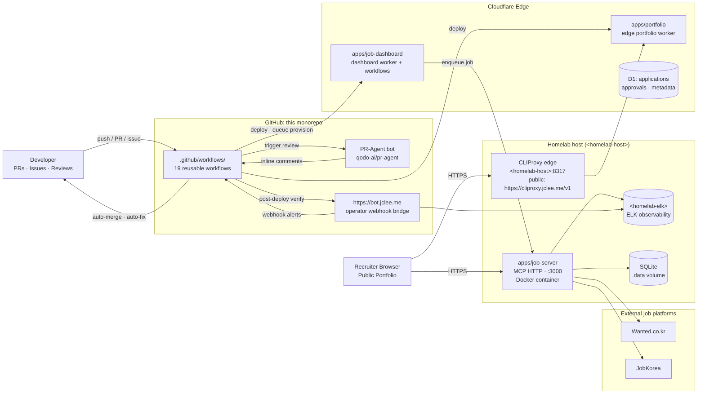

# Resume Portfolio Monorepo / 이력서 포트폴리오 모노레포

[](package.json)
[](https://nodejs.org/)
[](https://workers.cloudflare.com/)
[](LICENSE)
[](Dockerfile)
[](wrangler.jsonc)
[](https://github.com/qodo-ai/pr-agent)
[](apps/job-server)
[](https://cliproxy.jclee.me/v1)
[](https://bot.jclee.me)
[](README.md)
[](https://cliproxy.jclee.me/v1)

> **Bilingual documentation** / **이중 언어 문서**: Every section header is duplicated in English and Korean. English text appears first, followed by the Korean (한국어) translation under the same heading.
> 본 README는 모든 섹션을 영어와 한국어로 병기합니다. 같은 제목 아래에 영어 본문이 먼저, 한국어 번역이 이어집니다.

> **Primary README generator model:** `gpt-5.5` (fallback: `minimax-m3` routed via the [cliproxy.jclee.me](https://cliproxy.jclee.me/v1) edge proxy).
> **README 생성 기본 모델:** `gpt-5.5` (대체: [cliproxy.jclee.me](https://cliproxy.jclee.me/v1) 엣지 프록시 경유 `minimax-m3`).

---

## Overview / 개요

`resume` (v1.40.11) is a private, opinionated **resume portfolio monorepo** that fuses five distinct surfaces into a single, lockfile-pinned workspace:

1. A **Cloudflare Worker edge portfolio** served from the `apps/portfolio` workspace and proxied through `https://cliproxy.jclee.me/v1`.
2. A **job-automation HTTP runtime** (`apps/job-server`) containerised by the multi-stage `Dockerfile` and run on a self-hosted homelab via `docker-compose.yml`.
3. A **job-dashboard Cloudflare Worker** (`apps/job-dashboard`) exposing a router, queue consumer, handlers, and durable workflows.
4. A **shared package graph** (`packages/{cli,data,shared,types,schemas,contracts,env}`) that forms the Single Source of Truth (SSoT) for resume data, types, and runtime validation.
5. A **GitHub-native control plane** of 19 reusable workflows under `.github/workflows/` plus operator scripts in `tools/scripts/`.

`resume`(v1.40.11)는 다섯 가지 표면을 단일 잠금 파일 워크스페이스로 융합한 사설·주관적 **이력서 포트폴리오 모노레포**입니다.

1. `apps/portfolio` 워크스페이스에서 제공되는 **Cloudflare Worker 엣지 포트폴리오**(`https://cliproxy.jclee.me/v1` 경유).
2. 다단계 `Dockerfile`로 컨테이너화되어 자택 호스트(homelab)의 `docker-compose.yml`로 실행되는 **잡 자동화 HTTP 런타임**(`apps/job-server`).
3. 라우터·큐 컨슈머·핸들러·내구성 워크플로를 노출하는 **잡 대시보드 Cloudflare Worker**(`apps/job-dashboard`).
4. 이력서 데이터·타입·런타임 검증의 **단일 진실 공급원(SSoT)** 을 형성하는 공유 패키지 그래프(`packages/{cli,data,shared,types,schemas,contracts,env}`).
5. `.github/workflows/`의 19개 재사용 워크플로와 `tools/scripts/`의 운영 스크립트로 구성된 **GitHub 네이티브 컨트롤 플레인**.

---

## Features / 주요 기능

### English

- **Edge-rendered portfolio** — Cloudflare Worker that compiles to a static-friendly bundle, served behind a public reverse proxy.
- **Job automation server** — `apps/job-server` exposes an MCP-compatible HTTP surface for Wanted/JobKorea scraping, proposal sync, and OAuth-session restoration, packaged in a slim `node:22-alpine` image.
- **Dashboard + workflows** — `apps/job-dashboard` ships a router, CORS/CSRF middleware, rate limiting, queue consumer, application handlers, and Cloudflare Workflows bindings.
- **Authoritative resume data** — `packages/data/resumes/master/resume_data.json` is the SSoT; derived artefacts (PDF, PPTX, JSON) are regenerated by typed operator scripts.
- **Strict validation** — Zod schemas in `packages/schemas` with `z.infer<>` derived TypeScript/JSDoc types in `packages/types`.
- **Automation everywhere** — 19 GitHub Actions workflows for branching, reviewing, auto-merging, auto-fixing, releasing, dependency updates, CI-failure tracking, post-deploy verification, queue provisioning, and downstream health checks.
- **Observability hooks** — Self-hosted monitoring configs, an n8n webhook bridge, and a multi-stage `HEALTHCHECK` on the job-server container.
- **Bilingual docs** — This README is duplicated in English + Korean, including inline placeholders for homelab-only endpoints.

### 한국어

- **엣지 렌더링 포트폴리오** — 정적 친화적 번들로 컴파일되는 Cloudflare Worker, 공용 리버스 프록시 뒤에서 제공.
- **잡 자동화 서버** — `apps/job-server`는 Wanted/JobKorea 스크래핑, 제안 동기화, OAuth 세션 복원을 위한 MCP 호환 HTTP 표면을 노출하며 슬림한 `node:22-alpine` 이미지로 패키징.
- **대시보드 + 워크플로** — `apps/job-dashboard`는 라우터, CORS/CSRF 미들웨어, 레이트 리밋, 큐 컨슈머, 애플리케이션 핸들러, Cloudflare Workflows 바인딩을 제공.
- **권위 있는 이력서 데이터** — `packages/data/resumes/master/resume_data.json` 이 SSoT이며 파생 산출물(PDF, PPTX, JSON)은 타입이 지정된 운영 스크립트로 재생성.
- **엄격한 검증** — `packages/schemas`의 Zod 스키마와 `packages/types`의 `z.infer<>` 파생 TypeScript/JSDoc 타입.
- **전면 자동화** — 브랜칭·리뷰·자동 머지·자동 수정·릴리스·의존성 업데이트·CI 실패 추적·배포 후 검증·큐 프로비저닝·다운스트림 헬스 체크를 위한 19개의 GitHub Actions 워크플로.
- **관측 가능성 훅** — 자가 호스팅 모니터링 구성, n8n 웹훅 브리지, job-server 컨테이너의 다단계 `HEALTHCHECK`.
- **이중 언어 문서** — 이 README는 homelab 전용 엔드포인트에 대한 인라인 플레이스홀더를 포함하여 영어 + 한국어로 중복 작성됩니다.

---

## Architecture / 아키텍처

### English

The system spans four trust boundaries: the **GitHub-hosted monorepo**, the **Cloudflare edge**, the **homelab job-server runtime**, and **third-party job platforms + observability targets**. GitHub Actions is the orchestrator; the edge proxies and renders the portfolio; the homelab executes long-lived automation jobs; and external services are consumed only through typed clients.

### 한국어

이 시스템은 네 가지 신뢰 경계를 가로지릅니다: **GitHub 호스팅 모노레포**, **Cloudflare 엣지**, **homelab 잡 서버 런타임**, **서드파티 잡 플랫폼 + 관측 대상**. GitHub Actions가 오케스트레이터이고, 엣지가 포트폴리오를 프록시·렌더하며, homelab이 장기 자동화 작업을 실행하고, 외부 서비스는 타입이 지정된 클라이언트를 통해서만 소비됩니다.



> **Note**: The `<homelab-host>` and `<homelab-elk>` placeholders are intentionally generic — substitute with your own homelab inventory. The CLIProxy public endpoint is fixed at `https://cliproxy.jclee.me/v1` for this repository's deployment.
> **참고**: `<homelab-host>`, `<homelab-elk>` 플레이스홀더는 의도적으로 일반화된 값입니다 — 자체 homelab 인벤토리로 치환하세요. CLIProxy 공용 엔드포인트는 본 저장소 배포에서 `https://cliproxy.jclee.me/v1`로 고정됩니다.

---

## Repository Structure / 저장소 구조

```text
./
├── AGENTS.md                  # canonical AGENTS knowledge base
├── CHANGELOG.md               # release-by-release history
├── CONTRIBUTING.md            # contribution guide
├── Dockerfile                 # multi-stage build for job-server
├── LICENSE                    # MIT
├── OWNERS                     # CODEOWNERS-equivalent ownership list
├── README.md                  # this file
├── docker-compose.yml         # local job-server compose
├── eslint.config.cjs          # workspace lint config
├── jest.config.cjs            # workspace test config
├── lychee.toml                # link checker config
├── package.json               # workspace root + operator scripts
├── package-lock.json          # lockfile
├── playwright.config.js       # E2E config
├── redocly.yaml               # OpenAPI linter config
├── tsconfig.base.json         # shared TS compiler options
├── tsconfig.json              # project TS config
├── wrangler.jsonc             # Cloudflare Worker config
│
├── ta/                        # TA profile generation (Python + PPTX)
│   ├── AGENTS.md
│   ├── improve_visual.py
│   ├── inspect.py
│   ├── verify.py
│   ├── *.pptx                 # source decks
│   └── output/                # generated decks + verify report
│
├── applications/              # 2026 job application artefacts
│   ├── airpremia-security-2026/
│   ├── infrastructure-architecture-2026/
│   ├── coupang-fintech-sre-2026/
│   ├── cloudflare-one-se-2026/
│   └── gitlab-apac-security-2026/
│
└── apps/
    └── job-dashboard/         # dashboard worker + queue + workflows
        ├── AGENTS.md
        ├── API_REFERENCE.md
        ├── DEPLOYMENT_GUIDE.md
        ├── DEVELOPMENT_GUIDE.md
        ├── DIAGRAMS.md
        ├── OWNERS
        ├── README.md
        ├── SECRETS.md
        ├── migrate-json-to-d1.cjs
        ├── migration-data.sql
        ├── schema.sql
        ├── package.json
        ├── tsconfig.json
        ├── migrations/        # 0002_add_approval_metadata.sql + more
        ├── src/
        │   ├── index.js
        │   ├── queue-consumer.js
        │   ├── router.js
        │   ├── middleware/    # cors · csrf · rate-limit (+test)
        │   ├── routes/        # admin · applications · auth · automation
        │   │                  # health · index · stats · workflows
        │   └── handlers/      # applications · auth · auto-apply-webhook
        └── (see AGENTS.md for full tree)
```

> The full surface (`apps/portfolio`, `apps/job-server`, `packages/*`, `tools/`, `tests/`, `infrastructure/`, `docs/`, `supabase/`, `third_party/`) is enumerated in [`AGENTS.md`](AGENTS.md) under **STRUCTURE** / **WHERE TO LOOK**. The block above only lists what is present at the root and inside the workspace slices that the truncated tree exposes.
> 전체 표면(`apps/portfolio`, `apps/job-server`, `packages/*`, `tools/`, `tests/`, `infrastructure/`, `docs/`, `supabase/`, `third_party/`)은 [`AGENTS.md`](AGENTS.md)의 **STRUCTURE** / **WHERE TO LOOK** 섹션에 열거되어 있습니다. 위 블록은 루트 및 잘린 트리에 노출된 워크스페이스 슬라이스 내부만 나열합니다.

---

## Automation Inventory / 자동화 인벤토리

### Workflow files (19) / 워크플로 파일 (19개)

> All workflow files live under `.github/workflows/` and are referenced by their real on-disk names. **The numeric prefix is intentional and load-bearing** — workflows are grouped by phase (0x intake → 1x review → 2x release → 3x observability) and the prefix defines the DAG order.
> 모든 워크플로 파일은 `.github/workflows/`에 있으며 실제 디스크 상의 이름으로 참조됩니다. **숫자 접두사는 의도적이며 DAG 순서를 결정**합니다(0x 인테이크 → 1x 리뷰 → 2x 릴리스 → 3x 관측).

| #  | File | Purpose / 용도 |
| -- | ---- | -------------- |
| 01 | `01_branch-to-pr.yml` | Open a PR from a feature branch / 기능 브랜치에서 PR 오픈 |
| 02 | `02_issue-to-branch.yml` | Create a branch from an issue / 이슈에서 브랜치 생성 |
| 10 | `10_pr-review.yml` | PR-Agent review (qodo-ai/pr-agent) / PR-Agent 리뷰 |
| 11 | `11_security-pr-review.yml` | Security-focused PR review / 보안 중심 PR 리뷰 |
| 12 | `12_dependabot-auto-merge.yml` | Auto-merge vetted Dependabot PRs / 검증된 Dependabot PR 자동 머지 |
| 13 | `13_pr-auto-merge.yml` | Auto-merge PRs that pass all checks / 모든 검사 통과 시 PR 자동 머지 |
| 14 | `14_bot-auto-fix.yml` | Bot-triggered lint/format auto-fix / 봇 트리거 린트/포맷 자동 수정 |
| 15 | `15_merged-pr-cleanup.yml` | Delete merged branches / 머지된 브랜치 정리 |
| 19 | `19_issue-backfill.yml` | Backfill missing issue metadata / 누락된 이슈 메타데이터 백필 |
| 24 | `24_release-notes.yml` | Generate release notes / 릴리스 노트 생성 |
| 25 | `25_release-publish.yml` | Publish release artefacts / 릴리스 산출물 게시 |
| 29 | `29_downstream-health-check.yml` | Check downstream services post-release / 릴리스 후 다운스트림 헬스 체크 |
| 37 | `37_ci-failure-issues.yml` | Open issues on CI failures / CI 실패 시 이슈 오픈 |
| —  | `auto-sync-data.yml` | Auto-sync SSoT resume data / SSoT 이력서 데이터 자동 동기화 |
| —  | `ci.yml` | Primary CI pipeline / 기본 CI 파이프라인 |
| —  | `delete-standalone-job-worker.yml` | Tear down standalone job workers / 단독 잡 워커 해체 |
| —  | `post-deploy-verify.yml` | Verify deployments / 배포 검증 |
| —  | `provision-queues.yml` | Provision Cloudflare Queues / Cloudflare Queues 프로비저닝 |
| —  | `release.yml` | Master release workflow / 마스터 릴리스 워크플로 |

### Go automation tools (0) / Go 자동화 도구 (0개)

> No Go automation tools are vendored at the root of the repository as standalone modules. Go *scripts* are still invoked transitively from `package.json` scripts (e.g. `sync:pdf`, `enrich:github`, `enrich:skills`, `enrich:ai`, `sync:proposals`); they live inside the operator bundle referenced by `tools/scripts/` per `AGENTS.md`.
> 저장소 루트에는 단독 모듈로 베ンダ된 Go 자동화 도구가 없습니다. Go *스크립트*는 여전히 `package.json` 스크립트에서 간접적으로 호출됩니다(예: `sync:pdf`, `enrich:github`, `enrich:skills`, `enrich:ai`, `sync:proposals`); `AGENTS.md`의 `tools/scripts/`에 의해 참조되는 운영자 번들 내부에 위치합니다.

### Operator scripts (referenced from `package.json`) / 운영 스크립트 (`package.json`에서 참조)

| Script | Type | Purpose / 용도 |
| ------ | ---- | -------------- |
| `strip-exif` | Shell | Strip EXIF metadata from portfolio images / 포트폴리오 이미지 EXIF 메타데이터 제거 |
| `sync:data` | Node | Sync SSoT resume data into derived stores / SSoT 이력서 데이터를 파생 저장소로 동기화 |
| `sync:pptx` | Python | Regenerate Shinhan PPTX deck / 신한 PPTX 덱 재생성 |
| `sync:pdf` | Go | Regenerate master PDF / 마스터 PDF 재생성 |
| `sync:all` | Node+Go+Py | Full content regeneration sweep / 전체 콘텐츠 재생성 스윕 |
| `op:run` / `op:native:run` | Go | 1Password CLI wrapper / 1Password CLI 래퍼 |
| `op:seed:resume` / `op:seed:sessions` / `op:restore:sessions` | Go | Seed/rotate OAuth session secrets / OAuth 세션 시크릿 시드/회전 |
| `sync:proposals` | Node+Go | Apply reviewed proposals to job platforms / 검토된 제안을 잡 플랫폼에 적용 |
| `enrich:github` / `enrich:skills` / `enrich:ai` | Go | Enrich SSoT with GitHub, skills, and AI signals / GitHub·스킬·AI 신호로 SSoT 보강 |
| `enrich:all` | Go×3 | Run all enrichment passes / 모든 보강 패스 실행 |
| `automate:ssot` | Node | `sync:data` + `sync:pdf` + `build` + `typecheck` + `test:node` |
| `automate:full` | Node+Go+Py | Full pipeline: `sync:all` + lint + typecheck + tests |

---

## Quick Start / 빠른 시작

### English

1. **Clone the workspace** (with submodules if your fork uses them).
2. **Install Node.js ≥ 22** and ensure `npm` matches the lockfile (`npm ci` is the canonical install).
3. **Install workspace deps** with `npm ci` at the repository root.
4. **Run the portfolio worker** locally with `npx wrangler dev --config wrangler.jsonc`.
5. **Run the job-server** in Docker with `docker compose up --build mcp-server`.
6. **Run the dashboard worker** with `npx wrangler dev` from `apps/job-dashboard/`.

The portfolio is served behind `https://cliproxy.jclee.me/v1`. The job-server's `HEALTHCHECK` polls `http://127.0.0.1:3000/health`.

### 한국어

1. **워크스페이스 클론** (서브모듈을 사용한다면 함께).
2. **Node.js ≥ 22 설치** 후 `npm`이 잠금 파일과 일치하는지 확인(공식 설치는 `npm ci`).
3. 저장소 루트에서 `npm ci`로 **워크스페이스 의존성 설치**.
4. `npx wrangler dev --config wrangler.jsonc`로 **포트폴리오 워커 로컬 실행**.
5. `docker compose up --build mcp-server`로 **job-server를 Docker에서 실행**.
6. `apps/job-dashboard/`에서 `npx wrangler dev`로 **대시보드 워커 실행**.

포트폴리오는 `https://cliproxy.jclee.me/v1` 뒤에서 제공됩니다. job-server의 `HEALTHCHECK`는 `http://127.0.0.1:3000/health`를 폴링합니다.

---

## Local Development / 로컬 개발

### English

- **Prerequisites** — Node.js ≥ 22, Docker (for `mcp-server`), Python 3 (for `ta/` and `sync:pptx`), Go (for `sync:pdf`, `enrich:*`, `op:*`), and a populated `.env` referencing the typed env schema in `packages/env/`.
- **Lint** — `npm run lint` (workspace-wide, `eslint.config.cjs`).
- **Tests** — `npm test` (Jest unit), `npm run test:node` (Node-only subset), Playwright E2E per `playwright.config.js`.
- **Type-checking** — `npm run typecheck` (TS + JSDoc via `tsconfig.base.json`).
- **OpenAPI linting** — `npx @redocly/cli lint` against `redocly.yaml`.
- **Link checking** — `lychee` honours `lychee.toml` for in-doc links.
- **TA profile generation** — `cd ta && python3 verify.py && python3 improve_visual.py`.
- **Job applications folder** — `applications/<target>/` follows the `cover_letter.md` + `*.pdf` + `*.html` + `AGENTS.md`-friendly convention.

### 한국어

- **사전 요구사항** — Node.js ≥ 22, Docker(`mcp-server`용), Python 3(`ta/` 및 `sync:pptx`용), Go(`sync:pdf`, `enrich:*`, `op:*`용), `packages/env/`의 타입 env 스키마를 참조하는 `.env`.
- **린트** — `npm run lint`(워크스페이스 전체, `eslint.config.cjs`).
- **테스트** — `npm test`(Jest 단위), `npm run test:node`(Node 전용 서브셋), `playwright.config.js` 기준 Playwright E2E.
- **타입 검사** — `npm run typecheck`(`tsconfig.base.json`을 통한 TS + JSDoc).
- **OpenAPI 린팅** — `redocly.yaml`을 기준으로 `npx @redocly/cli lint`.
- **링크 검사** — `lychee`가 인文档 링크에 대해 `lychee.toml`을 따름.
- **TA 프로필 생성** — `cd ta && python3 verify.py && python3 improve_visual.py`.
- **잡 애플리케이션 폴더** — `applications/<target>/`은 `cover_letter.md` + `*.pdf` + `*.html` + `AGENTS.md` 친화적 규약을 따릅니다.

---

## Commands Reference / 명령어 참조

### Root workspace / 루트 워크스페이스

| Command | Description / 설명 |
| ------- | ------------------ |
| `npm ci` | Install from lockfile (canonical) / 잠금 파일에서 설치(공식) |
| `npm run lint` | Lint all workspaces / 모든 워크스페이스 린트 |
| `npm test` | Run Jest suites / Jest 스위트 실행 |
| `npm run test:node` | Node-only Jest subset / Node 전용 Jest 서브셋 |
| `npm run typecheck` | TS + JSDoc type check / TS + JSDoc 타입 검사 |
| `npm run build` | Build all workspace bundles / 모든 워크스페이스 번들 빌드 |
| `npm run strip-exif` | Strip EXIF from portfolio images / 포트폴리오 이미지 EXIF 제거 |

### SSoT + content sync / SSoT + 콘텐츠 동기화

| Command | Description / 설명 |
| ------- | ------------------ |
| `npm run sync:data` | Sync SSoT resume JSON to derived stores / SSoT 이력서 JSON을 파생 저장소로 동기화 |
| `npm run sync:pdf` | Regenerate master PDF (Go) / 마스터 PDF 재생성(Go) |
| `npm run sync:pptx` | Regenerate Shinhan PPTX (Python) / 신한 PPTX 재생성(Python) |
| `npm run sync:all` | Full content regeneration sweep / 전체 콘텐츠 재생성 스윕 |
| `npm run sync:proposals` | Apply reviewed proposals to job platforms / 검토된 제안을 플랫폼에 적용 |

### Enrichment / 보강

| Command | Description / 설명 |
| ------- | ------------------ |
| `npm run enrich:github` | Enrich SSoT from GitHub signals (Go) / GitHub 신호로 SSoT 보강(Go) |
| `npm run enrich:skills` | Enrich SSoT from skills graph (Go) / 스킬 그래프로 SSoT 보강(Go) |
| `npm run enrich:ai` | Enrich SSoT with AI inference (Go) / AI 추론으로 SSoT 보강(Go) |
| `npm run enrich:all` | Run all enrichment passes / 모든 보강 패스 실행 |

### 1Password + sessions / 1Password + 세션

| Command | Description / 설명 |
| ------- | ------------------ |
| `npm run op:run` | Run 1Password CLI wrapper / 1Password CLI 래퍼 실행 |
| `npm run op:native:run` | Native 1Password CLI wrapper / 네이티브 1Password CLI 래퍼 |
| `npm run op:seed:resume` | Seed resume-related 1Password items / 이력서 관련 1Password 항목 시드 |
| `npm run op:seed:sessions` | Seed OAuth session secrets / OAuth 세션 시크릿 시드 |
| `npm run op:restore:sessions` | Restore OAuth sessions from 1Password / 1Password에서 OAuth 세션 복원 |

### Orchestration / 오케스트레이션

| Command | Description / 설명 |
| ------- | ------------------ |
| `npm run automate:ssot` | `sync:data` + `sync:pdf` + `build` + `typecheck` + `test:node` |
| `npm run automate:full` | `sync:all` + `lint` + `typecheck` + full tests |

### Docker / 도커

| Command | Description / 설명 |
| ------- | ------------------ |
| `docker compose up --build mcp-server` | Build + run job-server container / job-server 컨테이너 빌드+실행 |
| `docker compose down` | Stop and remove container / 컨테이너 중지 및 제거 |

### Wrangler (per workspace) / Wrangler (워크스페이스별)

| Command | Description / 설명 |
| ------- | ------------------ |
| `npx wrangler dev --config wrangler.jsonc` | Local portfolio worker / 포트폴리오 워커 로컬 실행 |
| `cd apps/job-dashboard && npx wrangler dev` | Local dashboard worker / 대시보드 워커 로컬 실행 |
| `npx wrangler deploy` | Deploy to Cloudflare / Cloudflare에 배포 |

---

## Contribution Guide / 기여 가이드

### English

- Read [`CONTRIBUTING.md`](CONTRIBUTING.md) and [`AGENTS.md`](AGENTS.md) **before opening a PR**. AGENTS.md is the canonical project knowledge base; the structure table there is authoritative.
- Resume content is SSoT-controlled. Edit `packages/data/resumes/master/resume_data.json`, then run `npm run automate:ssot` to regenerate derived artefacts.
- All new TypeScript or JSDoc types must land in `packages/types/`. Runtime validation belongs in `packages/schemas/`. Public contracts (OpenAPI, Env interface) live in `packages/contracts/`.
- Workflows follow the **numeric prefix convention** documented in [Automation Inventory](#automation-inventory--자동화-인벤토리) — do not strip or renumber existing prefixes. New workflows must pick a free phase prefix.
- PRs are reviewed by `10_pr-review.yml` (PR-Agent) and `11_security-pr-review.yml`. Pass both before requesting human review.
- `13_pr-auto-merge.yml` will auto-merge once all required checks pass — make sure your PR title follows Conventional Commits.
- Dependabot PRs are handled by `12_dependabot-auto-merge.yml`; do not edit the workflow's allow-list casually.
- `14_bot-auto-fix.yml` may push commits directly to your branch — pull before re-reviewing.
- Security-sensitive changes require a signed commit and explicit sign-off in the PR body.
- Refer to [`OWNERS`](OWNERS) for review routing.

### 한국어

- PR을 열기 **전에** [`CONTRIBUTING.md`](CONTRIBUTING.md)와 [`AGENTS.md`](AGENTS.md)를 읽으세요. AGENTS.md는 표준 프로젝트 지식 베이스이며那里的 구조 표가 권위적입니다.
- 이력서 콘텐츠는 SSoT 통제 하에 있습니다. `packages/data/resumes/master/resume_data.json`을 편집한 후 `npm run automate:ssot`을 실행하여 파생 산출물을 재생성하세요.
- 모든 새 TypeScript 또는 JSDoc 타입은 `packages/types/`에 추가되어야 합니다. 런타임 검증은 `packages/schemas/`에, 공개 계약(OpenAPI, Env 인터페이스)은 `packages/contracts/`에 위치합니다.
- 워크플로는 [자동화 인벤토리](#automation-inventory--자동화-인벤토리)에 문서화된 **숫자 접두사 규칙**을 따릅니다 — 기존 접두사를 제거하거나 번호를 매기지 마세요. 새 워크플로는 사용 가능한 단계 접두사를 선택해야 합니다.
- PR은 `10_pr-review.yml`(PR-Agent) 및 `11_security-pr-review.yml`로 리뷰됩니다. 사람 리뷰를 요청하기 전에 둘 다 통과하세요.
- `13_pr-auto-merge.yml`은 모든 필수 검사를 통과하면 자동으로 머지합니다 — PR 제목이 Conventional Commits를 따르는지 확인하세요.
- Dependabot PR은 `12_dependabot-auto-merge.yml`이 처리합니다. 워크플로의 허용 목록을 함부로 편집하지 마세요.
- `14_bot-auto-fix.yml`이 브랜치에 직접 커밋을 푸시할 수 있습니다 — 재리뷰 전에 풀하세요.
- 보안 관련 변경은 서명된 커밋과 PR 본문의 명시적 sign-off가 필요합니다.
- 리뷰 라우팅은 [`OWNERS`](OWNERS)를 참조하세요.

---

## License / 라이선스

This project is licensed under the [MIT License](LICENSE).
본 프로젝트는 [MIT 라이선스](LICENSE) 하에 배포됩니다.