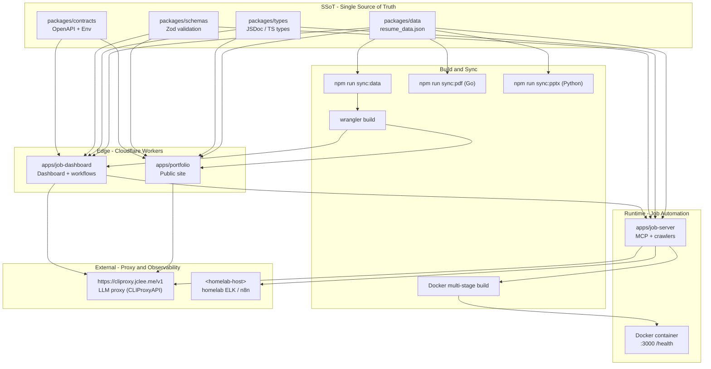

# Resume Portfolio Monorepo
# 이력서 포트폴리오 모노레포

[](package.json)
[](https://nodejs.org/)
[](https://workers.cloudflare.com/)
[](LICENSE)
[](Dockerfile)
[](wrangler.jsonc)
[](https://github.com/qodo-ai/pr-agent)
[](apps/job-server)
[](README.md)

> **Bilingual documentation** / **이중 언어 문서**: This README is provided in English first, followed by a Korean (한국어) translation of each section. Every section header is duplicated in both languages. / 이 README는 모든 섹션을 영어와 한국어로 병기합니다.

> **Primary README generator model:** `gpt-5.5` (fallback: `minimax-m3` via [https://cliproxy.jclee.me/v1](https://cliproxy.jclee.me/v1)). / **README 생성 기본 모델:** `gpt-5.5` (대체: [https://cliproxy.jclee.me/v1](https://cliproxy.jclee.me/v1) 경유 `minimax-m3`).

---

## Overview / 개요

`resume` is a private resume portfolio monorepo that combines a Cloudflare Worker edge portfolio, structured resume/application assets, job-application tracking and automation, a dashboard Worker for operational workflows, and a Dockerized Node.js runtime that exposes a job-automation HTTP API. /

`resume`는 Cloudflare Worker 기반 포트폴리오, 구조화된 이력서 및 지원 자료, 채용 지원 추적 및 자동화, 운영 워크플로우용 대시보드 Worker, 그리고 채용 자동화 HTTP API를 노출하는 Docker 기반 Node.js 런타임을 결합한 **개인 이력서 포트폴리오 모노레포**입니다.

The repository is designed as a single operational workspace for:

이 저장소는 다음 목적을 위한 단일 운영 워크스페이스로 설계되었습니다.

- **Portfolio and resume publishing** at the Cloudflare edge (Worker, generated from the Single Source of Truth). / **포트폴리오 및 이력서 게시** — Cloudflare 엣지에서 Single Source of Truth (SSoT)로부터 생성.
- **Job-application tracking and automation** (Wanted, JobKorea, Greenhouse, LinkedIn, Coupang Playwright crawler). / **채용 지원 추적 및 자동화** — Wanted, 잡코리아, Greenhouse, LinkedIn, Coupang Playwright 크롤러.
- **Application-specific cover letters and resumes** for in-flight opportunities, versioned in `applications/`. / **지원 회사별 자기소개서 및 이력서** — `applications/` 하위에 버전 관리.
- **Dashboard APIs** for applications, auth, health, stats, workflows, and automation. / **대시보드 API** — 지원 현황, 인증, 헬스체크, 통계, 워크플로우, 자동화.
- **CI/CD, security scanning, PR review automation, release automation, and maintenance workflows** (21 GitHub Actions workflows). / **CI/CD, 보안 스캔, PR 리뷰 자동화, 릴리스 자동화, 유지보수 자동화** — 21개의 GitHub Actions 워크플로우.
- **Containerized runtime** for the job automation server, exposed on port `3000` with a `/health` endpoint. / **컨테이너 기반 런타임** — 포트 `3000`에서 `/health` 엔드포인트 제공.

Package version: `1.40.11` (see `package.json`).

---

## Features / 주요 기능

| Area / 영역 | English | 한국어 |
| --- | --- | --- |
| Edge portfolio / 엣지 포트폴리오 | Cloudflare Worker surface generated from `packages/data` SSoT; Wrangler-driven build. | `packages/data` SSoT에서 생성된 Cloudflare Worker; Wrangler 기반 빌드. |
| Job dashboard / 채용 대시보드 | Worker application at `apps/job-dashboard` with handlers, middleware, and Cloudflare workflows. | `apps/job-dashboard`의 Worker 앱, 핸들러, 미들웨어, Cloudflare 워크플로우. |
| Job automation runtime / 채용 자동화 런타임 | Node.js service at `apps/job-server` packaged via multi-stage `Dockerfile` and `docker-compose.yml`. | `apps/job-server`의 Node.js 서비스, 멀티 스테이지 `Dockerfile` 및 `docker-compose.yml`로 패키징. |
| SSoT data layer / SSoT 데이터 계층 | `packages/data` holds canonical JSON; `packages/types` defines JSDoc/TS types; `packages/schemas` provides Zod validation. | `packages/data`가 정식 JSON 보유; `packages/types`가 JSDoc/TS 타입; `packages/schemas`가 Zod 검증 제공. |
| Cross-app contracts / 앱 간 계약 | `packages/contracts` exposes OpenAPI spec and Worker `Env` interface. | `packages/contracts`가 OpenAPI 스펙과 Worker `Env` 인터페이스 노출. |
| Shared utilities / 공용 유틸 | `packages/shared` provides errors, logger, retry, crypto, rate-limit, auth, browser, clients. | `packages/shared`가 errors, logger, retry, crypto, rate-limit, auth, browser, clients 제공. |
| CLI / CLI | `packages/cli` is the resume operator CLI. | `packages/cli`는 이력서 운영 CLI. |
| Environment / 환경 변수 | `packages/env` validates and types secrets. | `packages/env`가 시크릿 검증 및 타입 부여. |
| PR review automation / PR 리뷰 자동화 | [qodo-ai/pr-agent](https://github.com/qodo-ai/pr-agent) and the local bot at [https://bot.jclee.me](https://bot.jclee.me). | [qodo-ai/pr-agent](https://github.com/qodo-ai/pr-agent) 및 [https://bot.jclee.me](https://bot.jclee.me) 로컬 봇. |
| Container health / 컨테이너 헬스 | Built-in `HEALTHCHECK` against `/health` on port `3000`. | 포트 `3000`의 `/health` 대상 내장 `HEALTHCHECK`. |

---

## Architecture / 아키텍처

The repository follows a strict **SSoT → Build → Edge / Runtime → Observability** flow. The build pipeline is driven from `packages/data` (the canonical JSON) and feeds the Cloudflare Worker surfaces, the dashboard, the PDF/PPTX artifacts, and the Docker image. /

저장소는 **SSoT → Build → Edge / Runtime → Observability** 흐름을 엄격히 따릅니다. 빌드 파이프라인은 `packages/data`(정식 JSON)에서 시작되어 Cloudflare Worker, 대시보드, PDF/PPTX 산출물, Docker 이미지를 공급합니다.



Key architectural notes / 아키텍처 핵심:

- **SSoT is `packages/data`**, not the Worker bundle. The Worker source under `apps/portfolio/` is generated; never edit generated files. / **SSoT는 `packages/data`이며 Worker 번들이 아닙니다.** `apps/portfolio/`의 Worker 소스는 생성되므로 수정하지 마세요.
- **LLM calls are routed** through the public proxy at [https://cliproxy.jclee.me/v1](https://cliproxy.jclee.me/v1); no raw provider endpoints are used in the application code. / **LLM 호출은** [https://cliproxy.jclee.me/v1](https://cliproxy.jclee.me/v1) **퍼블릭 프록시를 경유**하며, 애플리케이션 코드에는 원본 provider 엔드포인트를 사용하지 않습니다.
- **The job-server is the only long-lived service** that runs as a container; both Workers are serverless at the edge. / **job-server는 컨테이너로 실행되는 유일한 상시 서비스**이며, 두 Worker는 엣지에서 서버리스로 동작합니다.
- **Observability targets** are homelab-hosted (placeholder `<homelab-host>`); concrete hostnames/ports are intentionally not hardcoded. / **관측 대상은 홈랩에서 호스팅**되며, 구체 호스트명/포트는 의도적으로 하드코딩하지 않습니다.

---

## Repository Structure / 저장소 구조

```text
.
├── AGENTS.md                       # Operational knowledge base (project SSoT for agents)
├── CHANGELOG.md                    # Release-by-release changelog
├── CONTRIBUTING.md                 # Contribution conventions
├── Dockerfile                      # Multi-stage build for the job-server runtime
├── LICENSE                         # MIT license
├── OWNERS                          # Code ownership map
├── README.md                       # This file
├── docker-compose.yml              # Local container orchestration
├── eslint.config.cjs               # Linting rules
├── jest.config.cjs                 # Jest configuration
├── lychee.toml                     # Link checker configuration
├── package.json                    # Workspace root + operator scripts
├── package-lock.json               # Locked dependency graph
├── playwright.config.js            # E2E test configuration
├── redocly.yaml                    # OpenAPI linting
├── tsconfig.base.json              # Shared TypeScript config
├── tsconfig.json                   # TypeScript config
├── wrangler.jsonc                  # Cloudflare Workers config
├── applications/                   # In-flight job applications (cover letters, resumes)
│   ├── airpremia-security-2026/
│   ├── cloudflare-one-se-2026/
│   ├── coupang-fintech-sre-2026/
│   ├── gitlab-apac-security-2026/
│   └── infrastructure-architecture-2026/
├── apps/                           # Deployable applications
│   ├── portfolio/                  # (declared workspace) Edge Worker
│   ├── job-server/                 # (declared workspace) MCP / job automation runtime
│   └── job-dashboard/              # (declared workspace) Dashboard Worker
│       ├── API_REFERENCE.md
│       ├── DEPLOYMENT_GUIDE.md
│       ├── DEVELOPMENT_GUIDE.md
│       ├── DIAGRAMS.md
│       ├── OWNERS
│       ├── README.md
│       ├── SECRETS.md
│       ├── migrate-json-to-d1.cjs
│       ├── migration-data.sql
│       ├── package.json
│       ├── schema.sql
│       ├── tsconfig.json
│       ├── migrations/
│       │   └── 0002_add_approval_metadata.sql
│       └── src/
│           ├── index.js
│           ├── queue-consumer.js
│           ├── router.js
│           ├── middleware/         # cors, csrf, rate-limit
│           ├── routes/             # admin, applications, auth, automation, health, stats, workflows
│           └── handlers/           # applications, auth, auto-apply-webhook-handler
├── packages/                       # (declared workspaces)
│   ├── cli/                        # Resume operator CLI
│   ├── contracts/                  # OpenAPI spec + Worker Env interface
│   ├── data/                       # Canonical resume JSON (SSoT)
│   ├── env/                        # Environment validation
│   ├── schemas/                    # Zod validation
│   ├── shared/                     # Cross-package utilities
│   └── types/                      # JSDoc/TS type SSoT
├── tools/                          # Build, deploy, verification scripts (Go + JS)
├── tests/                          # Jest, integration, Playwright E2E
├── infrastructure/                 # Cloudflare, monitoring, n8n, DB config
├── docs/                           # Guides, ADRs, architecture, conventions, security
├── ta/                             # TA profile generation (Python/PPTX)
│   ├── improve_visual.py
│   ├── inspect.py
│   ├── verify.py
│   ├── 2.pptx
│   ├── lee_jaecheol_profile_ta.pptx
│   ├── lee_jaecheol_ta.pptx
│   ├── lee_jaecheol_ta_profile.pptx
│   ├── ta.pptx
│   └── output/                     # Generated TA artifacts + verify reports
├── supabase/                       # Supabase edge functions (Deno runtime)
├── third_party/                    # Vendored external dependencies
└── .github/                        # CI, release, maintenance control plane
    └── workflows/                  # 21 GitHub Actions workflows
```

> The CI checkout path used by some workflows (e.g. `actions/checkout`) is transient and not a real directory in the source tree. / 일부 워크플로우의 CI 체크아웃 경로(예: `actions/checkout`)는 일시적이며 소스 트리의 실제 디렉터리가 아닙니다.

---

## Automation Inventory / 자동화 인벤토리

### GitHub Actions Workflows / GitHub Actions 워크플로우

The repository carries **21 GitHub Actions workflows** under `.github/workflows/`. Names retain their on-disk numeric prefix; the prefix encodes a functional group (issue/branch, PR, security, release, post-deploy, etc.). /

저장소에는 **21개의 GitHub Actions 워크플로우**가 `.github/workflows/`에 있습니다. 이름은 디스크 상의 숫자 접두사를 그대로 유지하며, 접두사는 기능 그룹(issue/branch, PR, security, release, post-deploy 등)을 의미합니다.

| # | Workflow file / 워크플로우 파일 | Group / 그룹 | Purpose / 목적 |
| --- | --- | --- | --- |
| 01 | `01_branch-to-pr.yml` | Issue/branch | Creates a PR from a long-lived branch. / 장기 브랜치에서 PR 생성. |
| 02 | `02_issue-to-branch.yml` | Issue/branch | Branches a tracked issue into a working branch. / 이슈를 작업 브랜치로 분기. |
| 10 | `10_pr-review.yml` | PR | Standard PR review automation (PR-Agent). / 표준 PR 리뷰 자동화 (PR-Agent). |
| 11 | `11_security-pr-review.yml` | PR | Security-focused PR review pass. / 보안 중심 PR 리뷰. |
| 12 | `12_dependabot-auto-merge.yml` | PR | Auto-merges vetted Dependabot PRs. / 검증된 Dependabot PR 자동 병합. |
| 13 | `13_pr-auto-merge.yml` | PR | Auto-merge for PRs that pass all gates. / 모든 게이트 통과 PR 자동 병합. |
| 14 | `14_bot-auto-fix.yml` | PR | Local bot ([https://bot.jclee.me](https://bot.jclee.me)) applies automated fixes. / 로컬 봇이 자동 수정 적용. |
| 15 | `15_merged-pr-cleanup.yml` | PR | Cleans up branches and stale refs after merge. / 병합 후 브랜치/참조 정리. |
| 19 | `19_issue-backfill.yml` | Issue/branch | Backfills historical issue metadata. / 과거 이슈 메타데이터 백필. |
| 24 | `24_release-notes.yml` | Release | Generates release notes from merged PRs. / 병합된 PR에서 릴리스 노트 생성. |
| 25 | `25_release-publish.yml` | Release | Publishes the release (tag + artifacts). / 릴리스 게시 (태그 + 아티팩트). |
| 29 | `29_downstream-health-check.yml` | Post-deploy | Verifies downstream services after deploy. / 배포 후 다운스트림 서비스 검증. |
| 37 | `37_ci-failure-issues.yml` | CI | Opens issues on CI failures. / CI 실패 시 이슈 개설. |
| 60 | `60_ci-auto-heal.yml` | CI | Attempts to auto-heal recurring CI failures. / 반복 CI 실패 자동 복구 시도. |
| 91 | `91_issue-classification.yml` | Issue/branch | Classifies and labels new issues. / 신규 이슈 분류/라벨링. |
| — | `auto-sync-data.yml` | Sync | Periodic SSoT data sync. / 주기적 SSoT 데이터 동기화. |
| — | `ci.yml` | CI | Primary CI pipeline. / 기본 CI 파이프라인. |
| — | `delete-standalone-job-worker.yml` | Operations | Tears down a standalone job worker. / 단독 잡 워커 제거. |
| — | `post-deploy-verify.yml` | Post-deploy | Post-deploy smoke verification. / 배포 후 스모크 검증. |
| — | `provision-queues.yml` | Operations | Provisions Cloudflare Queues. / Cloudflare Queues 프로비저닝. |
| — | `release.yml` | Release | Release orchestration. / 릴리스 오케스트레이션. |

### Operator Tooling / 운영 도구

The operator surface is exposed through `package.json` scripts. These are the entry points used both locally and from CI. / 운영 진입점은 `package.json` 스크립트로 노출됩니다. 로컬과 CI 모두에서 사용됩니다.

| Script / 스크립트 | Purpose / 목적 |
| --- | --- |
| `npm run sync:data` | Sync SSoT resume data into downstream artifacts (JSON). / SSoT 이력서 데이터를 다운스트림(JSON) 아티팩트로 동기화. |
| `npm run sync:pdf` | Generate the master PDF (Go-based generator). / 마스터 PDF 생성 (Go 기반). |
| `npm run sync:pptx` | Generate the Shinhan PPTX deck (Python). / 신한 PPTX 자료 생성 (Python). |
| `npm run sync:all` | Run `sync:data` → `sync:pdf` → `sync:pptx`. / `sync:data` → `sync:pdf` → `sync:pptx` 순차 실행. |
| `npm run automate:ssot` | End-to-end SSoT automation: sync + build + typecheck + tests. / SSoT 풀 자동화: 동기화 + 빌드 + 타입체크 + 테스트. |
| `npm run automate:full` | Full pipeline: sync + lint + typecheck + tests. / 전체 파이프라인: 동기화 + 린트 + 타입체크 + 테스트. |
| `npm run sync:proposals` | Apply JSON proposals to the resume data SSoT. / JSON 제안서를 이력서 SSoT에 적용. |
| `npm run enrich:github` | Enrich profile data from GitHub. / GitHub 프로필 데이터 보강. |
| `npm run enrich:skills` | Enrich skill taxonomy. / 스킬 분류 보강. |
| `npm run enrich:ai` | AI-assisted enrichment of SSoT content. / SSoT 콘텐츠 AI 보강. |
| `npm run enrich:all` | Run all enrichments in order. / 모든 보강 작업 순차 실행. |
| `npm run op:run` | Run the 1Password integration. / 1Password 통합 실행. |
| `npm run op:native:run` | Run the native 1Password runner. / 네이티브 1Password 러너 실행. |
| `npm run op:seed:resume` | Seed resume-related 1Password items. / 이력서 관련 1Password 항목 시드. |
| `npm run op:seed:sessions` | Seed session files. / 세션 파일 시드. |
| `npm run op:restore:sessions` | Restore sessions from 1Password. / 1Password에서 세션 복원. |
| `npm run strip-exif` | Strip EXIF metadata from portfolio images (uses `exiftool`). / 포트폴리오 이미지에서 EXIF 메타데이터 제거 (`exiftool` 사용). |

> The Go-based automation tools in `tools/scripts/` are intentionally not enumerated here; they are wired up through the operator scripts above. / `tools/scripts/`의 Go 자동화 도구는 위의 운영 스크립트를 통해 연결되므로 여기서는 의도적으로 나열하지 않습니다.

---

## Applications in Progress / 진행 중인 지원

Job-specific deliverables are versioned under `applications/`. Each directory contains the tailored resume, cover letter, and (where relevant) screenshots or HTML previews. /

회사별 지원 자료는 `applications/` 하위에서 버전 관리됩니다. 각 디렉터리에는 맞춤형 이력서, 자기소개서, 그리고 (해당되는 경우) 스크린샷/HTML 미리보기가 포함됩니다.

| Directory / 디렉터리 | Track / 트랙 | Key assets / 주요 자료 |
| --- | --- | --- |
| `applications/airpremia-security-2026/` | Air Premia — Security | `cover_letter.md`, `application-guide.md`, signup-gate screenshot. / 자기소개서, 지원 가이드, 가입 게이트 스크린샷. |
| `applications/cloudflare-one-se-2026/` | Cloudflare — One SE | `cover_letter.md`, `greenhouse-application-guide.md`, `linkedin-profile-optimization.md`, `interview-qa-10.md`, HTML resume, PDF, `preview.png`. / 자기소개서, 지원 가이드, LinkedIn 프로필 최적화, 면접 Q&A 10선, HTML 이력서, PDF, 미리보기. |
| `applications/coupang-fintech-sre-2026/` | Coupang Pay — Fintech SRE | `cover_letter.md`, `resume-coupang-fintech-sre.html`, PDF. / 자기소개서, HTML 이력서, PDF. |
| `applications/gitlab-apac-security-2026/` | GitLab — APAC InfraSec | `cover_letter.md`, `resume-gitlab-apac-security.html`, PDF. / 자기소개서, HTML 이력서, PDF. |
| `applications/infrastructure-architecture-2026/` | Homelab infra-architecture | `homelab-infrastructure-architecture.md`. / 홈랩 인프라 아키텍처 문서. |

The `ta/` workspace holds the TA (technical assessment) profile generator: `improve_visual.py`, `inspect.py`, and `verify.py` operate on the `*.pptx` files in `ta/` and emit deterministic outputs into `ta/output/`. / `ta/` 워크스페이스는 TA(기술 평가) 프로필 생성기를 보관합니다. `improve_visual.py`, `inspect.py`, `verify.py`가 `ta/`의 `*.pptx`를 처리하여 `ta/output/`에 결정적 출력을 생성합니다.

---

## Quick Start / 빠른 시작

### Prerequisites / 사전 요구사항

- **Node.js ≥ 22** (matches `package.json` engines and `Dockerfile` base image). / **Node.js 22 이상** (`package.json` engines와 `Dockerfile` 베이스 이미지에 일치).
- **npm ≥ 10** (for workspace support). / **npm 10 이상** (워크스페이스 지원).
- **Docker + Docker Compose** (for the containerized job-server). / **Docker + Docker Compose** (job-server 컨테이너 실행용).
- **Go ≥ 1.22** and **Python ≥ 3.11** (only if you intend to run `sync:pdf` / `sync:pptx` locally). / **Go 1.22 이상**, **Python 3.11 이상** (로컬에서 `sync:pdf` / `sync:pptx` 실행 시에만 필요).

### Run the job-server container / job-server 컨테이너 실행

```bash
# 1. Copy the env template and fill in required secrets.
# 1. 환경 템플릿을 복사하고 필요한 시크릿을 채웁니다.
cp .env.example .env   # adjust as needed / 필요 시 조정

# 2. Build and start the MCP server.
# 2. MCP 서버를 빌드하고 시작합니다.
docker compose up -d --build

# 3. Verify health.
# 3. 헬스체크를 확인합니다.
curl -fsS http://127.0.0.1:3000/health
```

The compose file defines a single service `mcp-server` (container name `resume-mcp-server`) that builds from the root `Dockerfile`, exposes port `3000`, and persists `/app/apps/job-server/.data` to the named volume `job_automation_data`. /

`compose` 파일은 루트 `Dockerfile`로 빌드되어 포트 `3000`을 노출하고, `/app/apps/job-server/.data`를 명명된 볼륨 `job_automation_data`에 영속화하는 단일 서비스 `mcp-server`(컨테이너명 `resume-mcp-server`)를 정의합니다.

### Deploy the Cloudflare Worker surfaces / Cloudflare Worker 배포

```bash
# Edge portfolio
npm --workspace apps/portfolio run deploy

# Dashboard
npm --workspace apps/job-dashboard run deploy
```

`wrangler.jsonc` is the single source for routes, environment bindings, and Queues. / `wrangler.jsonc`는 라우트, 환경 바인딩, Queues의 단일 출처입니다.

---

## Local Development / 로컬 개발

1. **Install workspace dependencies.** / **워크스페이스 의존성 설치.**
   ```bash
   npm ci
   ```
2. **Validate the SSoT.** / **SSoT 검증.**
   ```bash
   npm run sync:data
   ```
3. **Typecheck, lint, and test.** / **타입체크, 린트, 테스트.**
   ```bash
   npm run typecheck
   npm run lint
   npm test
   ```
4. **Run the E2E suite (optional, requires Playwright browsers).** / **E2E 스위트 실행 (선택, Playwright 브라우저 필요).**
   ```bash
   npx playwright test
   ```
5. **Run the dashboard worker locally.** / **대시보드 Worker 로컬 실행.**
   ```bash
   npm --workspace apps/job-dashboard run dev
   ```
6. **Run the job-server in watch mode (without Docker).** / **job-server 워치 모드 실행 (Docker 미사용).**
   ```bash
   cd apps/job-server && npm run dev
   ```

Conventions enforced locally / 로컬에서 강제되는 규칙:

- **TypeScript**: `tsconfig.base.json` is the shared base; per-package `tsconfig.json` extends it. / TypeScript는 `tsconfig.base.json`을 공유 베이스로 사용.
- **Linting**: `eslint.config.cjs` (flat config). / 린트는 플랫 컨피그 `eslint.config.cjs`.
- **API contract**: `redocly.yaml` lints the OpenAPI spec in `packages/contracts/`. / API 계약은 `packages/contracts/`의 OpenAPI 스펙을 `redocly.yaml`로 린트.
- **Link checking**: `lychee.toml`. / 링크 검사는 `lychee.toml`.

---

## Commands Reference / 명령어 레퍼런스

| Command / 명령어 | Description / 설명 |
| --- | --- |
| `npm run strip-exif` | Remove EXIF metadata from portfolio images. / 포트폴리오 이미지 EXIF 메타데이터 제거. |
| `npm run sync:data` | Sync SSoT resume data (JSON). / SSoT 이력서 데이터(JSON) 동기화. |
| `npm run sync:pptx` | Generate PPTX deck (Python). / PPTX 자료 생성 (Python). |
| `npm run sync:pdf` | Generate master PDF (Go). / 마스터 PDF 생성 (Go). |
| `npm run sync:all` | Run all sync steps. / 모든 동기화 단계 실행. |
| `npm run op:run` | Run 1Password integration. / 1Password 통합 실행. |
| `npm run op:native:run` | Run native 1Password runner. / 네이티브 1Password 러너 실행. |
| `npm run op:seed:resume` | Seed resume-related 1Password items. / 이력서 관련 1Password 항목 시드. |
| `npm run op:seed:sessions` | Seed session files into 1Password. / 세션 파일을 1Password에 시드. |
| `npm run op:restore:sessions` | Restore sessions from 1Password. / 1Password에서 세션 복원. |
| `npm run sync:proposals` | Apply pending JSON proposals to the SSoT. / 대기 중인 JSON 제안서를 SSoT에 적용. |
| `npm run enrich:github` | Enrich from GitHub data. / GitHub 데이터로 보강. |
| `npm run enrich:skills` | Enrich skill taxonomy. / 스킬 분류 보강. |
| `npm run enrich:ai` | AI-assisted SSoT enrichment. / SSoT AI 보조 보강. |
| `npm run enrich:all` | Run all enrichments. / 모든 보강 작업 실행. |
| `npm run automate:ssot` | SSoT automation: sync + build + typecheck + node tests. / SSoT 자동화. |
| `npm run automate:full` | Full automation: sync + lint + typecheck + tests. / 전체 자동화. |

---

## Contribution Guide / 기여 가이드

This is a private monorepo. Contributions are still expected to follow the conventions in `CONTRIBUTING.md` and `AGENTS.md`. The summary below mirrors them. /

이 저장소는 비공개 모노레포이지만, 기여는 `CONTRIBUTING.md` 및 `AGENTS.md`의 규약을 따라야 합니다. 아래는 그 요약입니다.

### 1. Branching and issues / 브랜치와 이슈

- Branch from `master` using the `02_issue-to-branch.yml` convention: `issue/<id>-<slug>`. / `master`에서 분기하며 `02_issue-to-branch.yml` 규약에 따라 `issue/<id>-<slug>` 형식을 사용.
- Long-lived branches are converted to PRs by `01_branch-to-pr.yml`. / 장기 브랜치는 `01_branch-to-pr.yml`이 PR로 변환.
- Issues are auto-classified by `91_issue-classification.yml` and backfilled by `19_issue-backfill.yml`. / 이슈는 `91_issue-classification.yml`로 자동 분류, `19_issue-backfill.yml`로 백필.

### 2. Commits and PRs / 커밋과 PR

- **Conventional Commits** (e.g. `feat:`, `fix:`, `chore:`, `docs:`). / **Conventional Commits** 사용.
- A PR is reviewed by:
  - `10_pr-review.yml` — standard PR-Agent review ([qodo-ai/pr-agent](https://github.com/qodo-ai/pr-agent)).
  - `11_security-pr-review.yml` — security-focused review.
  - `14_bot-auto-fix.yml` — local bot ([https://bot.jclee.me](https://bot.jclee.me)) applies auto-fixes. / 로컬 봇이 자동 수정.
- Auto-merge is handled by:
  - `12_dependabot-auto-merge.yml` for Dependabot PRs. / Dependabot PR.
  - `13_pr-auto-merge.yml` for green PRs. / 통과 PR.
- After merge, `15_merged-pr-cleanup.yml` removes stale refs. / 병합 후 `15_merged-pr-cleanup.yml`이 참조 정리.

### 3. Quality gates / 품질 게이트

Before requesting review / 리뷰 요청 전:

```bash
npm run sync:data
npm run typecheck
npm run lint
npm test
```

CI runs `ci.yml` and will fail fast on type, lint, or test regressions. CI failure events are converted into issues by `37_ci-failure-issues.yml`; recurring failures trigger `60_ci-auto-heal.yml`. /

CI는 `ci.yml`을 실행하며 타입/린트/테스트 회귀에서 빠르게 실패합니다. CI 실패 이벤트는 `37_ci-failure-issues.yml`로 이슈화되고, 반복 실패는 `60_ci-auto-heal.yml`을 트리거합니다.

### 4. Releases / 릴리스

- `24_release-notes.yml` generates the changelog from merged PRs. / `24_release-notes.yml`이 병합된 PR에서 변경 로그 생성.
- `25_release-publish.yml` and `release.yml` orchestrate tagging, artifact publishing, and the GitHub release. / `25_release-publish.yml`과 `release.yml`이 태깅, 아티팩트 게시, GitHub 릴리스를 오케스트레이션.
- `29_downstream-health-check.yml` and `post-deploy-verify.yml` validate the deploy before sign-off. / `29_downstream-health-check.yml`과 `post-deploy-verify.yml`이 배포를 사인오프 전 검증.

### 5. Operational runbooks / 운영 런북

- `provision-queues.yml` provisions Cloudflare Queues. / `provision-queues.yml`이 Cloudflare Queues 프로비저닝.
- `delete-standalone-job-worker.yml` tears down a temporary worker. / `delete-standalone-job-worker.yml`이 임시 워커 제거.
- `auto-sync-data.yml` keeps the SSoT fresh on a schedule. / `auto-sync-data.yml`이 SSoT를 주기적으로 신선하게 유지.

---

## Security and Compliance / 보안 및 컴플라이언스

- **Secrets** must be sourced from 1Password via `op:run` / `op:native:run`; never commit `.env` files. / **시크릿**은 `op:run` / `op:native:run`을 통해 1Password에서만 조달하며 `.env` 커밋 금지.
- **EXIF stripping** is part of the release flow (`strip-exif`). / **EXIF 제거**는 릴리스 플로우의 일부(`strip-exif`).
- **OpenAPI** is linted by `redocly.yaml` against the `packages/contracts/openapi.yaml` spec. / **OpenAPI**는 `packages/contracts/openapi.yaml`을 `redocly.yaml`로 린트.
- **PR security review** is mandatory (`11_security-pr-review.yml`). / **PR 보안 리뷰**는 필수.
- **No private/internal IPs are hardcoded**: this repository uses placeholders such as `<homelab-host>` for homelab targets and the public LLM proxy endpoint `https://cliproxy.jclee.me/v1` for LLM traffic. / **사설/내부 IP는 하드코딩하지 않음**: 홈랩 대상에는 `<homelab-host>` 같은 플레이스홀더를, LLM 트래픽에는 퍼블릭 프록시 `https://cliproxy.jclee.me/v1`를 사용합니다.

---

## License / 라이선스

This project is released under the **MIT License**. See [LICENSE](LICENSE) for the full text. / 본 프로젝트는 **MIT 라이선스**로 배포됩니다. 전문은 [LICENSE](LICENSE)를 참조하세요.

---

## Contact and Links / 연락처 및 링크

| Link / 링크 | Purpose / 용도 |
| --- | --- |
| [https://bot.jclee.me](https://bot.jclee.me) | Local automation bot (PR auto-fix, label sync). / 로컬 자동화 봇 (PR 자동 수정, 라벨 동기화). |
| [https://cliproxy.jclee.me](https://cliproxy.jclee.me) | Public LLM proxy used by automation tools. / 자동화 도구가 사용하는 퍼블릭 LLM 프록시. |
| [https://github.com/qodo-ai/pr-agent](https://github.com/qodo-ai/pr-agent) | Upstream PR-Agent used by `10_pr-review.yml`. / `10_pr-review.yml`이 사용하는 PR-Agent. |
| `AGENTS.md` | Operational knowledge base (project SSoT for agents). / 운영 지식 베이스 (에이전트용 프로젝트 SSoT). |
| `CHANGELOG.md` | Per-release changelog. / 릴리스별 변경 로그. |
| `CONTRIBUTING.md` | Contribution conventions. / 기여 규약. |
| `OWNERS` | Code ownership map. / 코드 소유권 맵. |

---

*Generated by the README generator with primary model `gpt-5.5` (fallback: `minimax-m3` via `https://cliproxy.jclee.me/v1`).* /
*README 생성기 기본 모델 `gpt-5.5`(대체: `https://cliproxy.jclee.me/v1` 경유 `minimax-m3`)로 생성되었습니다.*