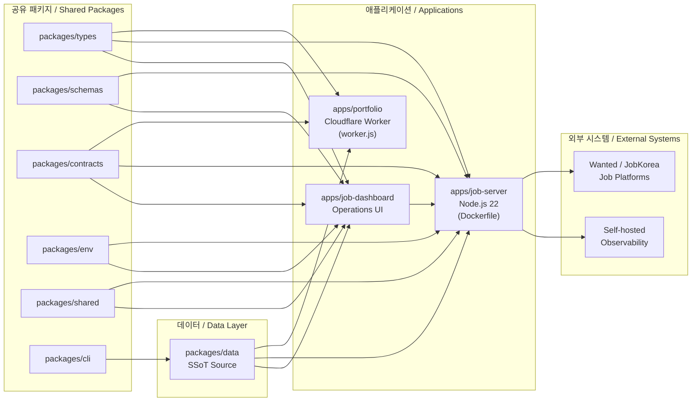

# 레쥬메 모노레포 / Resume Portfolio Monorepo


이 저장소는 개인 포트폴리오, 채용 자동화, 단일 진실 공급원(SSoT) 데이터, 그리고 자체 호스팅 옵저버빌리티를 하나의 npm 워크스페이스 모노레포로 통합한 저장소입니다. Cloudflare Workers 기반의 엣지 포트폴리오, Node.js 기반의 잡 자동화 서버(`apps/job-server`), 운영 대시보드(`apps/job-dashboard`), 그리고 여러 공유 패키지(`packages/*`)로 구성됩니다.

This repository is a personal npm workspaces monorepo that unifies a portfolio site, job automation, Single Source of Truth (SSoT) data, and self-hosted observability. It comprises a Cloudflare Workers edge portfolio (`apps/portfolio`), a Node.js job automation server (`apps/job-server`), an operations dashboard (`apps/job-dashboard`), and several shared workspace packages (`packages/*`).

---

## 목차 / Table of Contents

- [개요 / Overview](#overview--개요)
- [주요 기능 / Features](#주요-기능--features)
- [아키텍처 / Architecture](#아키텍처--architecture)
- [저장소 구조 / Repository Structure](#저장소-구조--repository-structure)
- [빠른 시작 / Quick Start](#빠른-시작--quick-start)
- [설정 / Configuration](#설정--configuration)
- [명령어 레퍼런스 / Commands Reference](#명령어-레퍼런스--commands-reference)
- [로컬 개발 / Local Development](#로컬-개발--local-development)
- [테스트 / Testing](#테스트--testing)
- [배포 / Deployment](#배포--deployment)
- [기여 / Contributing](#기여--contributing)
- [라이선스 / License](#라이선스--license)

---

## Overview / 개요

`package.json`의 `description` 필드는 이 모노레포를 다음과 같이 정의합니다.

> Resume portfolio monorepo: Cloudflare Worker edge site, job automation (Wanted/JobKorea), SSoT data, self-hosted observability

핵심 가치 / Core values:

- **단일 진실 공급원(SSoT)** — 이력, 프로필, 스킬, 직무 데이터는 `packages/data`에서 한 번 정의되고 포트폴리오, 이력서, PDF, PPTX, 대시보드 등 모든 산출물로 자동 동기화됩니다.
- **엣지 우선 포트폴리오** — `apps/portfolio`는 Cloudflare Worker(`wrangler.jsonc`)에 배포되며, `worker.js`를 메인 엔트리로 사용합니다.
- **잡 자동화** — `apps/job-server`는 Node.js 런타임에서 Wanted, JobKorea 등 채용 플랫폼을 대상으로 한 자동화 파이프라인을 제공합니다.
- **운영 대시보드** — `apps/job-dashboard`는 자동화 상태, 지원 이력, 메트릭을 확인할 수 있는 운영 UI입니다.
- **공유 패키지** — `packages/*` 워크스페이스를 통해 타입, 스키마, 환경설정, CLI, 데이터를 코드 차원에서 공유합니다.
- **자체 호스팅 옵저버빌리티** — 외부 SaaS 의존을 줄이기 위해 메트릭과 로그를 자체 호스팅 스택으로 수집합니다.

---

## 주요 기능 / Features

| 기능 / Feature | 설명 / Description |
| --- | --- |
| Cloudflare Workers 포트폴리오 / Edge Portfolio | `wrangler.jsonc` 기반 엣지 배포, `worker.js` 엔트리포인트, EXIF 제거 스크립트(`strip-exif`)로 메타데이터 최소화 |
| 잡 자동화 서버 / Job Automation Server | `apps/job-server`에서 Wanted/JobKorea 등 플랫폼 대상 자동화, 큐 컨슈머, 라우터, 미들웨어(CORS/CSRF/Rate-limit) 제공 |
| 운영 대시보드 / Operations Dashboard | `apps/job-dashboard`는 인증, 어드민, 지원 이력, 자동화, 헬스체크, 통계, 워크플로우 라우트를 제공 |
| SSoT 데이터 동기화 / SSoT Data Sync | `sync:data` → `sync:pdf` → `sync:pptx` 파이프라인으로 모든 산출물 재생성 |
| PDF/PPTX 생성 / PDF & PPTX Generation | Go 기반 PDF 생성기(`tools/scripts/build/pdf-generator.go`)와 Python 기반 PPTX 생성기 |
| 1Password 연동 / 1Password Integration | `op:run`, `op:native:run`, `op:seed:resume`, `op:seed:sessions` 등 시크릿 주입/복원 스크립트 |
| 데이터 보강 파이프라인 / Enrichment Pipelines | `enrich:github`, `enrich:skills`, `enrich:ai`로 외부 소스에서 프로필/스킬 데이터 보강 |
| OpenAPI 문서화 / API Documentation | `redocly.yaml`로 API 명세를 빌드/검증, `lychee.toml`로 링크 무결성 검사 |
| 컨테이너 배포 / Container Runtime | 멀티 스테이지 `Dockerfile` + `docker-compose.yml`로 `apps/job-server`를 컨테이너로 기동 |
| 다층 테스트 / Multi-layer Testing | Jest 단위 테스트(`jest.config.cjs`), Playwright E2E(`playwright.config.js`), Lychee 링크 검사 |

---

## 아키텍처 / Architecture

데이터 흐름은 `packages/data`(SSoT)에서 시작하여 엣지 포트폴리오, 잡 자동화 서버, 운영 대시보드로 분기되고, 서버는 외부 채용 플랫폼 및 자체 호스팅 옵저버빌리티와 통신합니다. 공유 패키지(`types`, `schemas`, `contracts`, `shared`, `env`, `cli`)는 모든 앱이 의존하는 횡단 관심사를 제공합니다.

The data flow starts at `packages/data` (SSoT) and fans out to the edge portfolio, the job automation server, and the operations dashboard. The server talks to external job platforms and to a self-hosted observability stack. Shared workspace packages provide cross-cutting concerns (types, schemas, contracts, shared utilities, env, CLI).



핵심 설계 결정 / Key design decisions:

- **SSoT 우선 동기화**: 어떤 산출물(웹/PDF/PPTX)도 원본 데이터에서 직접 빌드되며, `sync:all` 스크립트로 한 번에 재빌드됩니다.
- **워크스페이스 격리**: 각 앱과 패키지는 자체 `package.json`과 `tsconfig`를 가지며, 루트의 `tsconfig.base.json`이 공통 옵션을 제공합니다.
- **런타임 분리**: 포트폴리오는 엣지(Workers), 잡 서버와 대시보드는 일반 Node.js 22 런타임. 컨테이너 이미지는 잡 서버만 패키징합니다.

---

## 저장소 구조 / Repository Structure

루트의 실제 최상위 디렉터리와 핵심 파일은 다음과 같습니다. (`apps/portfolio`, `apps/job-server`, `packages/*` 등 일부 워크스페이스는 본문에서 다루며, `ta/`는 보조 PPTX 산출물 폴더, `applications/`는 회사별 지원서 자료 폴더입니다.)

```text
.
├── AGENTS.md                # 에이전트 운영 지침
├── CHANGELOG.md             # 변경 이력
├── CONTRIBUTING.md          # 기여 가이드
├── Dockerfile               # job-server 멀티 스테이지 빌드
├── LICENSE                  # 라이선스
├── OWNERS                   # 코드 오너십
├── README.md                # 본 문서
├── docker-compose.yml       # 컨테이너 오케스트레이션
├── eslint.config.cjs        # ESLint 설정
├── jest.config.cjs          # Jest 설정
├── lychee.toml              # 링크 검사기 설정
├── package.json             # 루트 워크스페이스 메타데이터
├── package-lock.json        # npm 잠금 파일
├── playwright.config.js     # Playwright E2E 설정
├── redocly.yaml             # API 문서 빌더 설정
├── tsconfig.base.json       # 공통 TypeScript 옵션
├── tsconfig.json            # 루트 TypeScript 설정
├── wrangler.jsonc           # Cloudflare Worker 설정
├── ta/                      # PPTX 원본/산출물
├── applications/            # 회사별 지원서/이력서 자료
├── apps/
│   ├── portfolio/           # Cloudflare Worker 포트폴리오
│   ├── job-server/          # 잡 자동화 서버
│   └── job-dashboard/       # 운영 대시보드
└── packages/
    ├── cli/                 # 공유 CLI
    ├── contracts/           # API 계약
    ├── data/                # SSoT 데이터
    ├── env/                 # 환경 변수 헬퍼
    ├── schemas/             # 검증 스키마
    ├── shared/              # 공용 유틸리티
    └── types/               # TypeScript 타입
```

각 앱의 내부 구조는 가이드 문서에서 상세히 다룹니다.

- `apps/job-dashboard/DEVELOPMENT_GUIDE.md`, `API_REFERENCE.md`, `DEPLOYMENT_GUIDE.md`, `DIAGRAMS.md`, `SECRETS.md`, `AGENTS.md`, `OWNERS`
- `apps/job-dashboard/src/routes/` — `admin`, `applications`, `auth`, `automation`, `health`, `stats`, `workflows`
- `apps/job-dashboard/src/handlers/` — `applications`, `auth`, `auto-apply-webhook-handler`
- `apps/job-dashboard/src/middleware/` — `cors`, `csrf`, `rate-limit`
- `apps/job-dashboard/migrations/` — `0002_add_approval_metadata.sql` 등 스키마 마이그레이션
- `apps/job-dashboard/migrate-json-to-d1.cjs` — JSON → D1 마이그레이션 스크립트
- `apps/job-dashboard/migration-data.sql`, `schema.sql` — D1 스키마/시드

---

## 빠른 시작 / Quick Start

요구 사항 / Requirements:

- Node.js 22.x (LTS)
- npm 10.x 이상
- (선택) Docker 24+ 및 Docker Compose v2 — 컨테이너 실행 시
- (선택) Wrangler CLI — Cloudflare 배포 시
- (선택) Go 1.22+ — `sync:pdf` 등 Go 도구 사용 시
- (선택) Python 3.11+ — `sync:pptx` 사용 시
- (선택) exiftool — `strip-exif` 스크립트 사용 시

설치 및 기본 실행 / Install and run:

```bash
# 1) 의존성 설치 (워크스페이스 전체)
npm ci

# 2) SSoT 데이터 → 산출물 동기화
npm run sync:all

# 3) 타입체크
npm run typecheck

# 4) 잡 자동화 서버를 컨테이너로 기동 (옵션 A)
docker compose up -d --build

# 4) 또는 잡 자동화 서버를 로컬로 기동 (옵션 B)
npm run dev --workspace=apps/job-server
```

헬스체크 / Health check:

```bash
# 컨테이너 기동 후 (이 저장소의 compose는 호스트의 3000 포트를 컨테이너 3000 포트로 매핑)
curl http://127.0.0.1:3000/health
```

> **참고 / Note**: 이 저장소는 비공개(private) 워크스페이스입니다. 공개 URL은 의도적으로 노출하지 않으며, 로컬/사설 호스트(`127.0.0.1` 또는 사설 IP)에서의 접근을 전제로 합니다.

---

## 설정 / Configuration

이 모노레포는 코드 기반 설정과 환경 변수 기반 설정을 혼합합니다.

### 코드 기반 설정 / Code-based configuration

| 파일 / File | 역할 / Role |
| --- | --- |
| `wrangler.jsonc` | Cloudflare Worker 바인딩(예: KV, D1, R2, Queues), 환경 이름, 호스트 등 |
| `tsconfig.base.json` / `tsconfig.json` | 워크스페이스 공통 컴파일 옵션 |
| `eslint.config.cjs` | 코드 스타일 및 정적 분석 규칙 |
| `jest.config.cjs` | Jest 단위 테스트 루트 옵션 |
| `playwright.config.js` | Playwright E2E 브라우저/시나리오 옵션 |
| `lychee.toml` | 링크 검사 대상/제외 규칙 |
| `redocly.yaml` | OpenAPI 명세 린트/문서화 규칙 |
| `docker-compose.yml` | 잡 서버 컨테이너, 볼륨, 헬스체크, 포트 매핑 |
| `Dockerfile` | 멀티 스테이지 빌드(`deps` → `runtime`) |

### 환경 변수 / Environment variables

런타임 설정은 `.env` 파일을 통해 주입되며, `docker-compose.yml`은 `env_file: - .env`로 컨테이너에 전달합니다. 주요 변수는 다음과 같으며, 정확한 키 목록은 `packages/env`와 각 앱의 `*.env.example`을 참고하십시오.

| 변수 / Variable | 용도 / Purpose |
| --- | --- |
| `NODE_ENV` | 런타임 모드 (`production` 권장) |
| `PORT` | 컨테이너/로컬 HTTP 포트 (기본 `3000`) |
| `RESUME_DATA_PATH` | `packages/data`에서 동기화된 SSoT 경로 |
| `CLOUDFLARE_*` | `wrangler deploy` 시 인증/계정 ID 등 |
| `OP_CONNECT_*` | 1Password Connect 통합 토큰/호스트 |
| `PLATFORM_*` | 잡 플랫폼(Wanted, JobKorea) 자격 증명 |

> 1Password 시크릿은 `op:run`, `op:native:run`, `op:seed:resume`, `op:seed:sessions` 스크립트를 통해 런타임 전 세션 파일로 주입됩니다. 평문 `.env`에 장기 자격 증명을 두지 않는 것을 권장합니다.

### 데이터 마이그레이션 / Data migration

`apps/job-dashboard`는 D1/SQL 스키마를 사용합니다.

- `schema.sql` — 초기 스키마
- `migrations/0002_add_approval_metadata.sql` — 후속 마이그레이션
- `migrate-json-to-d1.cjs` — 기존 JSON 데이터를 D1로 이관
- `migration-data.sql` — 시드 데이터

---

## 명령어 레퍼런스 / Commands Reference

`package.json`의 `scripts`에서 직접 노출되는 명령어입니다. 워크스페이스 컨텍스트에서 실행됩니다.

### 동기화 및 빌드 / Sync and build

| 명령어 / Command | 설명 / Description |
| --- | --- |
| `npm run sync:data` | `tools/scripts/utils/sync-resume-data.js`로 SSoT 데이터 동기화 |
| `npm run sync:pptx` | Python 스크립트로 PPTX 산출물 생성 |
| `npm run sync:pdf` | Go 스크립트로 PDF 이력서 생성 |
| `npm run sync:all` | `data` → `pdf` → `pptx` 순서로 전체 동기화 |
| `npm run strip-exif` | `exiftool`로 포트폴리오 이미지의 EXIF 메타데이터 제거 |
| `npm run build` | 각 워크스페이스의 빌드 |

### 1Password 연동 / 1Password integration

| 명령어 / Command | 설명 / Description |
| --- | --- |
| `npm run op:run` | 1Password Connect 기반 시크릿 조회/주입 |
| `npm run op:native:run` | 네이티브 1Password CLI 경로 |
| `npm run op:seed:resume` | 이력서 관련 시크릿 시드 |
| `npm run op:seed:sessions` | 세션 파일 시드 |
| `npm run op:restore:sessions` | 세션 파일 복원 |

### 데이터 보강 / Enrichment

| 명령어 / Command | 설명 / Description |
| --- | --- |
| `npm run enrich:github` | GitHub 활동 기반 프로필 보강 |
| `npm run enrich:skills` | 외부 스킬 소스 보강 |
| `npm run enrich:ai` | AI 기반 요약/스킬 보강 |
| `npm run enrich:all` | 세 보강 파이프라인 모두 실행 |

### 제안/리뷰 / Proposals

| 명령어 / Command | 설명 / Description |
| --- | --- |
| `npm run sync:proposals` | 제안 리뷰 CLI 실행 후 Go 스크립트로 반영 |

### 자동화 파이프라인 / Automation pipelines

| 명령어 / Command | 설명 / Description |
| --- | --- |
| `npm run automate:ssot` | SSoT 동기화 + 빌드 + 타입체크 + Node 테스트 |
| `npm run automate:full` | 전체 동기화 + 린트 + 타입체크 등 일괄 실행 |

> 일부 명령어는 본문에서 잘린 부분이 있을 수 있으므로, `package.json`의 `scripts` 블록을 직접 확인해 최신 키를 참조하십시오.

---

## 로컬 개발 / Local Development

권장 워크플로 / Recommended workflow:

1. **브랜치 생성** — `git switch -c feat/<topic>` 또는 `fix/<topic>`.
2. **의존성 설치** — `npm ci` (CI와 동일하게 잠금 파일 사용).
3. **SSoT 수정** — `packages/data`의 데이터 변경 후 `npm run sync:all`로 산출물 재빌드.
4. **앱별 개발**:
   - 포트폴리오: `npm run dev --workspace=apps/portfolio` (Wrangler dev server)
   - 잡 서버: `npm run dev --workspace=apps/job-server` (또는 `docker compose up --build`)
   - 대시보드: `npm run dev --workspace=apps/job-dashboard`
5. **타입체크/린트** — `npm run typecheck`, `npm run lint`.
6. **PR 제출 전** — `AGENTS.md`와 `CONTRIBUTING.md`의 체크리스트를 확인.

타입 규칙 / Type rules:

- 워크스페이스 경계에서는 패키지 이름(`@resume/*`)으로 import합니다. 경로 별칭은 `tsconfig.base.json`을 따릅니다.
- 공유 타입은 `packages/types`에 추가하고, 검증 스키마는 `packages/schemas`에 추가합니다.

이미지 자산 / Image assets:

- `apps/portfolio/src/images/`의 이미지는 커밋 전 `npm run strip-exif`로 EXIF를 제거합니다.

---

## 테스트 / Testing

다층 테스트 전략을 사용합니다.

| 계층 / Layer | 도구 / Tool | 설정 파일 / Config | 실행 예시 / Example |
| --- | --- | --- | --- |
| 단위 테스트 / Unit | Jest | `jest.config.cjs` | `npm test` 또는 `npx jest` |
| E2E 테스트 / E2E | Playwright | `playwright.config.js` | `npx playwright test` |
| 링크 무결성 / Link check | Lychee | `lychee.toml` | `npx lychee ./README.md` |
| API 명세 / API spec | Redocly CLI | `redocly.yaml` | `npx @redocly/cli lint` |
| 정적 분석 / Lint | ESLint | `eslint.config.cjs` | `npm run lint` |
| 타입 검사 / Types | TypeScript | `tsconfig.json` | `npm run typecheck` |
| 컨테이너 헬스 / Container | Docker Compose | `docker-compose.yml` | `docker compose ps` (헬스 상태 확인) |

`apps/job-dashboard`에는 인증, 미들웨어, 라우트에 대한 단위 테스트가 포함되어 있습니다(예: `src/middleware/rate-limit.test.js`). 변경 시 인접 라우트/미들웨어 테스트를 함께 갱신하십시오.

---

## 배포 / Deployment

이 모노레포는 두 가지 배포 표면을 가집니다.

### 1) 엣지 포트폴리오 / Edge portfolio (Cloudflare Workers)

```bash
# 의존성 설치 후
npm run build --workspace=apps/portfolio
npx wrangler deploy -c wrangler.jsonc
```

- 메인 엔트리: `apps/portfolio/worker.js`
- 환경/바인딩: `wrangler.jsonc`
- 이미지: `strip-exif`로 메타데이터 제거 후 업로드

### 2) 잡 자동화 서버 / Job automation server (Docker)

`docker-compose.yml`은 `resume-mcp-server`라는 컨테이너로 잡 서버 런타임을 기동합니다(서비스 명은 compose에 정의된 값이며, 이미지는 본 `Dockerfile`을 빌드). `apps/job-server/.data`는 `job_automation_data`라는 named volume으로 영속화됩니다.

```bash
docker compose up -d --build
docker compose ps                # HEALTHCHECK 결과 확인
docker compose logs -f mcp-server
curl http://127.0.0.1:3000/health
```

운영 대시보드(`apps/job-dashboard`)의 배포 절차는 `apps/job-dashboard/DEPLOYMENT_GUIDE.md`를, 시크릿 운용 절차는 `apps/job-dashboard/SECRETS.md`를 참조하십시오.

> 네트워크/도메인 설정(예: 사설 IP, LXC 컨테이너 번호 등)은 본 저장소에 하드코딩하지 마십시오. 환경 변수로 주입하거나 IaC 저장소에서 관리하십시오.

---

## 기여 / Contributing

기여 절차, 커밋 메시지 규칙, 코드 리뷰 정책은 [`CONTRIBUTING.md`](./CONTRIBUTING.md)를 참조하십시오. 코드 오너십은 [`OWNERS`](./OWNERS)에 정의되어 있으며, 에이전트 운영 지침은 [`AGENTS.md`](./AGENTS.md)에 정리되어 있습니다. 주요 변경 전 이 문서들과 [`CHANGELOG.md`](./CHANGELOG.md) 갱신 여부를 함께 검토하십시오.

기여 시 권장 확인 항목 / Suggested checklist:

- [ ] `npm run typecheck` 통과
- [ ] `npm run lint` 통과
- [ ] 단위/E2E 테스트 통과
- [ ] SSoT 변경 시 `npm run sync:all`로 산출물 재빌드
- [ ] `CHANGELOG.md`에 변경 사항 기록
- [ ] PR 본문에 동기화/배포 영향 명시

---

## 라이선스 / License

이 저장소는 비공개(private) 저장소입니다. 외부 배포, 재사용, 또는 파생 저작물 작성은 명시적 허가가 없는 한 금지됩니다. 자세한 내용은 [`LICENSE`](./LICENSE) 파일을 참조하십시오.

This repository is private. Redistribution, reuse, or creation of derivative works is prohibited without explicit permission. See the [`LICENSE`](./LICENSE) file for details.