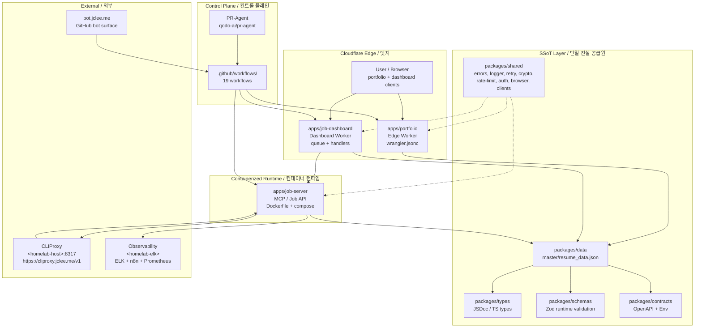

# Resume Portfolio Monorepo / 이력서 포트폴리오 모노레포

[](package.json)
[](https://nodejs.org/)
[](https://workers.cloudflare.com/)
[](LICENSE)
[](Dockerfile)
[](wrangler.jsonc)
[](https://github.com/qodo-ai/pr-agent)
[](apps/job-server)
[](https://cliproxy.jclee.me/v1)
[](https://bot.jclee.me)
[](README.md)

> **Bilingual documentation** / **이중 언어 문서**: Every section header is duplicated in English and Korean. English text appears first, followed by the Korean (한국어) translation under the same heading.
> 본 README는 모든 섹션을 영어와 한국어로 병기합니다. 같은 제목 아래에 영어 본문이 먼저, 한국어 번역이 이어집니다.

> **Primary README generator model:** `gpt-5.5` (fallback: `minimax-m3` via the [cliproxy.jclee.me](https://cliproxy.jclee.me/v1) edge proxy).
> **README 생성 기본 모델:** `gpt-5.5` (대체: [cliproxy.jclee.me](https://cliproxy.jclee.me/v1) 엣지 프록시 경유 `minimax-m3`).

---

## Overview / 개요

`resume` (v1.40.11) is a private, opinionated **resume portfolio monorepo** that fuses five surfaces into a single workspace:

1. A **Cloudflare Worker edge portfolio** served from the `apps/portfolio` workspace.
2. A **job-automation HTTP runtime** (`apps/job-server`) containerized as a Docker image, exposing an MCP-style API for Wanted / JobKorea crawlers and sync flows.
3. A **dashboard Worker** (`apps/job-dashboard`) that orchestrates application workflows, approval metadata, queue consumers, and admin endpoints.
4. A **single source of truth (SSoT) data layer** (`packages/data`, `packages/types`, `packages/schemas`, `packages/contracts`) — Zod-validated JSON resumes plus canonical JSDoc/TS types and an OpenAPI contract.
5. A **GitHub-native automation control plane** (19 workflows under `.github/workflows/`) covering PR review, security scanning, dependabot auto-merge, release notes, post-deploy verification, and downstream health checks.

`resume`(v1.40.11)는 다섯 가지 표면을 하나의 워크스페이스로 융합한 사설·주관적 **이력서 포트폴리오 모노레포**입니다.

1. `apps/portfolio` 워크스페이스에서 서빙되는 **Cloudflare Worker 엣지 포트폴리오**.
2. Docker 이미지로 컨테이너화되어 Wanted/JobKorea 크롤러와 동기화 흐름을 위한 MCP 스타일 API를 노출하는 **잡 자동화 HTTP 런타임** (`apps/job-server`).
3. 애플리케이션 워크플로, 승인 메타데이터, 큐 컨슈머, 관리자 엔드포인트를 오케스트레이션하는 **대시보드 Worker**(`apps/job-dashboard`).
4. **단일 진실 공급원(SSoT) 데이터 계층**(`packages/data`, `packages/types`, `packages/schemas`, `packages/contracts`) — Zod 검증 JSON 이력서, 정식 JSDoc/TS 타입, OpenAPI 계약.
5. PR 리뷰, 보안 스캔, Dependabot 자동 병합, 릴리스 노트, 배포 후 검증, 다운스트림 헬스 체크를 다루는 **GitHub 네이티브 자동화 컨트롤 플레인** (`.github/workflows/` 아래 19개 워크플로).

---

## Features / 기능

### English

- **Edge-first portfolio** deployed as a Cloudflare Worker; build outputs are committed so the worker is a generated bundle.
- **Containerized MCP job-server** with multi-stage Dockerfile, healthcheck, persistent volume for `.data` (job automation state), and a `docker-compose.yml` service.
- **Dashboard Worker** with CORS / CSRF / rate-limit middleware, queue consumer, route handlers for `applications`, `auth`, `automation`, `workflows`, `admin`, `health`, and `stats`.
- **SSoT data pipeline** — Zod schemas, canonical JSDoc/TS types, OpenAPI contract, and a `master/resume_data.json` driving HTML, PDF, and PPTX generation.
- **Self-hosted observability** — n8n + ELK + Prometheus stack hosted on a homelab cluster; all internal hosts are referenced as `<homelab-host>` / `<homelab-elk>` placeholders.
- **Edge LLM proxy** — outbound LLM calls (including README generation) flow through the public `https://cliproxy.jclee.me/v1` endpoint.
- **19 GitHub Actions workflows** governing PR lifecycle, security, dependabot, release, downstream health, and CI failure auto-issue.
- **PR-Agent (qodo-ai)** integration for automated PR review and suggestions.
- **E2E test suite** via Playwright, plus Jest unit/integration tests and ESLint config.
- **Strict contract enforcement** with `redocly.yaml`, `lychee.toml` (link check), and OpenAPI linting.

### 한국어

- Cloudflare Worker로 배포되는 **엣지 우선 포트폴리오**; 빌드 산출물이 커밋되므로 워커는 생성된 번들입니다.
- 멀티스테이지 Dockerfile, 헬스체크, `.data`(잡 자동화 상태) 영구 볼륨, `docker-compose.yml` 서비스를 갖춘 **컨테이너형 MCP 잡 서버**.
- CORS/CSRF/요청 제한 미들웨어, 큐 컨슈머, `applications`·`auth`·`automation`·`workflows`·`admin`·`health`·`stats` 라우트 핸들러를 갖춘 **대시보드 Worker**.
- **SSoT 데이터 파이프라인** — Zod 스키마, 정식 JSDoc/TS 타입, OpenAPI 계약, 그리고 HTML/PDF/PPTX 생성을 구동하는 `master/resume_data.json`.
- 홈랩 클러스터에 호스팅되는 n8n + ELK + Prometheus 기반의 **셀프 호스팅 옵저버빌리티**; 모든 내부 호스트는 `<homelab-host>` / `<homelab-elk>` 플레이스홀더로 참조됩니다.
- **엣지 LLM 프록시** — README 생성을 포함한 모든 외부 LLM 호출은 공용 엔드포인트 `https://cliproxy.jclee.me/v1`을 통과합니다.
- PR 수명주기, 보안, Dependabot, 릴리스, 다운스트림 헬스, CI 실패 자동 이슈를 관장하는 **19개 GitHub Actions 워크플로**.
- 자동 PR 리뷰·제안용 **PR-Agent (qodo-ai)** 통합.
- Playwright 기반 **E2E 테스트 스위트**, Jest 단위/통합 테스트, ESLint 설정.
- `redocly.yaml`, `lychee.toml`(링크 검사), OpenAPI 린팅을 통한 **엄격한 계약 강제**.

---

## Architecture / 아키텍처

### English

The monorepo is organized as a layered system: an immutable SSoT data core at the bottom, a package layer that turns that data into validated types and OpenAPI contracts, three deployable surfaces (portfolio, dashboard, job-server), and a GitHub Actions control plane that automates PR/release/verify loops. Outbound LLM calls and self-hosted observability live outside the Workers and are reached through the public edge proxy and homelab endpoints.

### 한국어

모노레포는 계층화된 시스템으로 구성됩니다. 최하단에는 불변의 SSoT 데이터 코어, 그 데이터를 검증된 타입과 OpenAPI 계약으로 변환하는 패키지 계층, 배포 가능한 세 개의 표면(portfolio, dashboard, job-server), 그리고 PR/릴리스/검증 루프를 자동화하는 GitHub Actions 컨트롤 플레인이 있습니다. 외부 LLM 호출과 셀프 호스팅 옵저버빌리티는 Worker 외부에 있으며, 공용 엣지 프록시와 홈랩 엔드포인트를 통해 도달합니다.



---

## Automation Inventory / 자동화 인벤토리

### GitHub Actions workflows / GitHub Actions 워크플로

The repository ships **19 production workflows** under `.github/workflows/`. All names below are the **real on-disk filenames** (numeric prefix preserved).

리포지토리는 `.github/workflows/` 아래에 **운영용 워크플로 19개**를 제공합니다. 아래의 이름은 모두 **실제 디스크 파일명**(숫자 접두사 유지)입니다.

| # | Workflow file / 워크플로 파일 | Purpose / 목적 |
|---|---|---|
| 01 | `01_branch-to-pr.yml` | Open a PR from a freshly created branch / 신규 브랜치에서 PR 열기 |
| 02 | `02_issue-to-branch.yml` | Convert an issue into a working branch / 이슈를 작업 브랜치로 변환 |
| 10 | `10_pr-review.yml` | PR-Agent automated review (qodo-ai) / PR-Agent 자동 리뷰 |
| 11 | `11_security-pr-review.yml` | Security-focused PR review gate / 보안 중심 PR 리뷰 게이트 |
| 12 | `12_dependabot-auto-merge.yml` | Auto-merge trusted Dependabot PRs / 신뢰할 수 있는 Dependabot PR 자동 병합 |
| 13 | `13_pr-auto-merge.yml` | Auto-merge PRs that pass all checks / 모든 검사를 통과한 PR 자동 병치 |
| 14 | `14_bot-auto-fix.yml` | Bot applies auto-fixes for routine issues / 봇이 일반 이슈 자동 수정 |
| 15 | `15_merged-pr-cleanup.yml` | Delete branches and tidy after merge / 병합 후 브랜치 정리 |
| 19 | `19_issue-backfill.yml` | Backfill issues from external trackers / 외부 트래커에서 이슈 백필 |
| 24 | `24_release-notes.yml` | Generate release notes from merged PRs / 병합된 PR로 릴리스 노트 생성 |
| 25 | `25_release-publish.yml` | Publish release artifacts / 릴리스 아티팩트 게시 |
| 29 | `29_downstream-health-check.yml` | Probe downstream services post-merge / 병합 후 다운스트림 헬스 점검 |
| 37 | `37_ci-failure-issues.yml` | Auto-open issues on CI failure / CI 실패 시 이슈 자동 개설 |
| — | `auto-sync-data.yml` | Keep SSoT data in sync across surfaces / SSoT 데이터를 표면 간 동기화 |
| — | `ci.yml` | Primary CI pipeline (lint, typecheck, test) / 기본 CI 파이프라인 |
| — | `delete-standalone-job-worker.yml` | Tear down ephemeral job worker / 일회용 잡 워커 정리 |
| — | `post-deploy-verify.yml` | Post-deploy smoke verification / 배포 후 스모크 검증 |
| — | `provision-queues.yml` | Provision Cloudflare Queues bindings / Cloudflare Queues 바인딩 프로비저닝 |
| — | `release.yml` | Coordinated release pipeline / 통합 릴리스 파이프라인 |

### Local automation tools / 로컬 자동화 도구

> **Note / 안내:** This repository has **0 dedicated Go automation binaries** in `tools/`. All build, sync, deploy, and verification automations are exposed as **npm scripts** in the root `package.json` (see [Commands Reference / 명령어 레퍼런스](#commands-reference--명령어-레퍼런스)) and orchestrated by the 19 GitHub Actions workflows above.
>
> 본 리포지토리에는 `tools/` 아래에 **전용 Go 자동화 바이너리가 0개** 있습니다. 모든 빌드·동기화·배포·검증 자동화는 루트 `package.json`의 **npm 스크립트**([명령어 레퍼런스](#commands-reference--명령어-레퍼런스) 참조)로 노출되며, 위 19개 GitHub Actions 워크플로에 의해 오케스트레이션됩니다.

---

## Repository Structure / 리포지토리 구조

### English

The layout below reflects the **actual on-disk top-level directories** present in this revision. The `_bot-scripts/` path mentioned in some CI logs is **not** a real directory — it is a transient CI checkout path used during bot runs only.

### 한국어

아래 레이아웃은 본 리비전의 **실제 디스크 최상위 디렉터리**를 반영합니다. 일부 CI 로그에 보이는 `_bot-scripts/` 경로는 **실제 디렉터리가 아니며**, 봇 실행 시 사용되는 일시적 CI 체크아웃 경로일 뿐입니다.

```text
.
├── AGENTS.md                       # Project knowledge base / 프로젝트 지식 베이스
├── CHANGELOG.md
├── CONTRIBUTING.md
├── Dockerfile                      # Multi-stage job-server image
├── LICENSE
├── OWNERS
├── README.md                       # This file / 본 문서
├── docker-compose.yml              # mcp-server service
├── eslint.config.cjs
├── jest.config.cjs
├── lychee.toml                     # Link checker config
├── package-lock.json
├── package.json                    # Workspace root + operator scripts
├── playwright.config.js            # E2E test runner
├── redocly.yaml                    # OpenAPI lint rules
├── tsconfig.base.json
├── tsconfig.json
├── wrangler.jsonc                  # Cloudflare Worker config
│
├── ta/                             # TA profile generation (Python + PPTX)
│   ├── improve_visual.py
│   ├── inspect.py
│   ├── verify.py
│   ├── lee_jaecheol_ta.pptx
│   ├── lee_jaecheol_ta_profile.pptx
│   ├── lee_jaecheol_profile_ta.pptx
│   ├── ta.pptx
│   ├── 2.pptx
│   └── output/                     # Generated artifacts + verify report
│
├── applications/                   # Job-application dossiers (per company)
│   ├── airpremia-security-2026/
│   ├── infrastructure-architecture-2026/
│   ├── coupang-fintech-sre-2026/
│   ├── cloudflare-one-se-2026/
│   └── gitlab-apac-security-2026/
│
└── apps/
    └── job-dashboard/              # Dashboard Worker
        ├── AGENTS.md
        ├── API_REFERENCE.md
        ├── DEPLOYMENT_GUIDE.md
        ├── DEVELOPMENT_GUIDE.md
        ├── DIAGRAMS.md
        ├── OWNERS
        ├── README.md
        ├── SECRETS.md
        ├── migrate-json-to-d1.cjs
        ├── migration-data.sql
        ├── package.json
        ├── schema.sql
        ├── tsconfig.json
        ├── migrations/
        │   └── 0002_add_approval_metadata.sql
        └── src/
            ├── index.js
            ├── queue-consumer.js
            ├── router.js
            ├── middleware/        # cors, csrf, rate-limit (+ tests)
            ├── routes/            # admin, applications, auth, automation,
            │                      # health, stats, workflows, index
            └── handlers/          # applications, auth,
                                   # auto-apply-webhook-handler
```

> The full set of workspace members (as declared in the root `package.json` `workspaces` field) is: `apps/portfolio`, `apps/job-server`, `apps/job-dashboard`, `packages/cli`, `packages/data`, `packages/shared`, `packages/types`, `packages/schemas`, `packages/contracts`, `packages/env`. See `AGENTS.md` for an exhaustive map including `tools/`, `tests/`, `infrastructure/`, `docs/`, `supabase/`, and `third_party/`.
>
> 루트 `package.json`의 `workspaces` 필드에 선언된 전체 워크스페이스 멤버: `apps/portfolio`, `apps/job-server`, `apps/job-dashboard`, `packages/cli`, `packages/data`, `packages/shared`, `packages/types`, `packages/schemas`, `packages/contracts`, `packages/env`. `tools/`, `tests/`, `infrastructure/`, `docs/`, `supabase/`, `third_party/`를 포함한 전체 지도는 `AGENTS.md`를 참조하십시오.

---

## Quick Start / 빠른 시작

### English

1. **Clone and install** the workspace:
   ```bash
   git clone <repo-url> resume
   cd resume
   npm ci
   ```
2. **Validate secrets and env** via the `@resume/env` package, which exposes a type-safe schema loader.
3. **Run the job-server** in Docker (the only containerized surface):
   ```bash
   docker compose up -d mcp-server
   curl http://127.0.0.1:3000/health
   ```
4. **Develop the Cloudflare Workers** locally with Wrangler:
   ```bash
   npx wrangler dev --config wrangler.jsonc           # portfolio
   npx wrangler dev --config apps/job-dashboard/wrangler.*  # dashboard
   ```
5. **Sync the SSoT** after any change to `packages/data`:
   ```bash
   npm run sync:data
   npm run sync:pdf
   npm run sync:pptx
   ```
6. **Run the full automation gate**:
   ```bash
   npm run automate:ssot
   # or the full pipeline (lint + tests + sync):
   npm run automate:full
   ```

### 한국어

1. **클론 및 의존성 설치**:
   ```bash
   git clone <repo-url> resume
   cd resume
   npm ci
   ```
2. `@resume/env` 패키지로 **시크릿/환경 변수 검증**을 수행합니다(타입 안전 스키마 로더 제공).
3. **job-server**는 컨테이너화된 유일한 표면이므로 Docker로 실행합니다:
   ```bash
   docker compose up -d mcp-server
   curl http://127.0.0.1:3000/health
   ```
4. Cloudflare Worker는 **Wrangler**로 로컬 개발합니다:
   ```bash
   npx wrangler dev --config wrangler.jsonc           # portfolio
   npx wrangler dev --config apps/job-dashboard/wrangler.*  # dashboard
   ```
5. `packages/data` 변경 후 **SSoT 동기화**:
   ```bash
   npm run sync:data
   npm run sync:pdf
   npm run sync:pptx
   ```
6. 전체 자동화 게이트 실행:
   ```bash
   npm run automate:ssot
   # 전체 파이프라인(lint + 테스트 + 동기화):
   npm run automate:full
   ```

---

## Local Development / 로컬 개발

### English

- **Node.js ≥ 22** is required (matches the Docker base image `node:22-alpine`).
- **Wrangler** authenticates against your Cloudflare account; secrets are stored per-environment in `wrangler.jsonc` and friends.
- **E2E tests** (Playwright) and **unit/integration tests** (Jest) are wired in via `playwright.config.js` and `jest.config.cjs`.
- **Linting** is enforced by `eslint.config.cjs`; the link checker is `lychee.toml`.
- **OpenAPI contracts** in `packages/contracts/` are linted with `redocly.yaml`; do not bypass it.
- **Public edge endpoints**:
  - LLM proxy: `https://cliproxy.jclee.me/v1`
  - Bot surface: `https://bot.jclee.me`
- **Internal hosts** (e.g. the homelab cluster) are referenced as `<homelab-host>` / `<homelab-elk>` placeholders in this README. Never commit real RFC1918 addresses or LXC container numbers.

### 한국어

- **Node.js ≥ 22**가 필요합니다(Docker 베이스 이미지 `node:22-alpine`과 일치).
- **Wrangler**는 Cloudflare 계정으로 인증하며, 시크릿은 환경별로 `wrangler.jsonc` 등에 저장됩니다.
- **E2E 테스트**(Playwright)와 **단위/통합 테스트**(Jest)는 `playwright.config.js`와 `jest.config.cjs`에 와이어링되어 있습니다.
- **린팅**은 `eslint.config.cjs`가 강제하며, 링크 검사는 `lychee.toml`을 사용합니다.
- `packages/contracts/`의 **OpenAPI 계약**은 `redocly.yaml`로 린트됩니다. 우회하지 마십시오.
- **공용 엣지 엔드포인트**:
  - LLM 프록시: `https://cliproxy.jclee.me/v1`
  - 봇 표면: `https://bot.jclee.me`
- **내부 호스트**(예: 홈랩 클러스터)는 본 README에서 `<homelab-host>` / `<homelab-elk>` 플레이스홀더로 참조됩니다. 실제 RFC1918 주소나 LXC 컨테이너 번호를 커밋하지 마십시오.

---

## Commands Reference / 명령어 레퍼런스

All commands run from the repository root unless otherwise noted. See `package.json` for the authoritative list.

별도 표기 없는 한 모든 명령은 리포지토리 루트에서 실행합니다. 권위 있는 목록은 `package.json`을 참조하십시오.

### SSoT & content sync / SSoT 및 콘텐츠 동기화

| Command / 명령어 | Purpose / 목적 |
|---|---|
| `npm run sync:data` | Rebuild downstream artifacts from `packages/data` / `packages/data`로 다운스트림 아티팩트 재생성 |
| `npm run sync:pptx` | Generate PPTX via `tools/scripts/build/generate_shinhan_pptx.py` / PPTX 생성 |
| `npm run sync:pdf` | Generate PDF via `tools/scripts/build/pdf-generator.go master` / PDF 생성 |
| `npm run sync:all` | Run `sync:data` → `sync:pdf` → `sync:pptx` / 세 동기화 작업 순차 실행 |
| `npm run sync:proposals` | Apply + review proposals through the job-server CLI / 잡 서버 CLI로 제안 적용·검토 |
| `npm run strip-exif` | Strip EXIF metadata from portfolio images / 포트폴리오 이미지의 EXIF 제거 |

### 1Password operations / 1Password 운영

| Command / 명령어 | Purpose / 목적 |
|---|---|
| `npm run op:run` | Run the 1Password integration via `tools/scripts/onepassword/run` / 1Password 통합 실행 |
| `npm run op:native:run` | Native-mode 1Password runner / 네이티브 모드 1Password 러너 |
| `npm run op:seed:resume` | Seed resume secrets into 1Password / 1Password에 이력서 시크릿 시드 |
| `npm run op:seed:sessions` | Seed session files into 1Password / 1Password에 세션 파일 시드 |
| `npm run op:restore:sessions` | Restore sessions from 1Password / 1Password에서 세션 복원 |

### Enrichment / 데이터 보강

| Command / 명령어 | Purpose / 목적 |
|---|---|
| `npm run enrich:github` | Enrich profiles with GitHub data / GitHub 데이터로 프로필 보강 |
| `npm run enrich:skills` | Enrich profiles with skill data / 스킬 데이터로 프로필 보강 |
| `npm run enrich:ai` | Enrich profiles with AI-derived signals / AI 파생 시그널로 프로필 보강 |
| `npm run enrich:all` | Run all three enrichers / 세 보강 작업 모두 실행 |

### Full pipelines / 전체 파이프라인

| Command / 명령어 | Purpose / 목적 |
|---|---|
| `npm run automate:ssot` | SSoT sync → build → typecheck → node tests / SSoT 동기화 → 빌드 → 타입체크 → 노드 테스트 |
| `npm run automate:full` | SSoT sync (all formats) → lint → typecheck (continued in `package.json`) / SSoT 동기화(전체 포맷) → lint → 타입체크 (계속: `package.json` 참조) |

> The script list above is **truncated for readability**; `package.json` is the source of truth. Some entries were cut off at `enrich:ai` and `automate:full` in the supplied snippet.
>
> 위 스크립트 목록은 가독성을 위해 **축약된 것**이며, `package.json`이 진실의 원천입니다. 일부 항목은 제공된 스니펫에서 `enrich:ai`와 `automate:full` 지점에서 잘렸습니다.

### Docker / Docker

```bash
# Build the multi-stage image / 멀티스테이지 이미지 빌드
docker build -t resume-mcp .

# Run via compose / compose로 실행
docker compose up -d mcp-server

# Tail logs / 로그 확인
docker compose logs -f mcp-server
```

---

## Contribution Guide / 기여 가이드

### English

1. **Read `AGENTS.md` first** — it is the authoritative project knowledge base (verified against commit `011dd571`).
2. **Open an issue** before substantial work; the `02_issue-to-branch.yml` workflow will scaffold a branch for you.
3. **Branch from `master`** using a descriptive prefix (`feat/`, `fix/`, `chore/`, `docs/`, `security/`).
4. **Make the PR-Agent happy**: `10_pr-review.yml` and `11_security-pr-review.yml` will review your PR automatically. Address feedback before requesting review.
5. **Pass the gate**:
   - `npm run lint`
   - `npm run typecheck`
   - `npm run test` (Jest)
   - `npm run test:e2e` (Playwright, when applicable)
   - `npm run automate:ssot` (for any data-layer change)
6. **Respect the SSoT**: edit `packages/data/.../resume_data.json` and types; never hand-edit derived HTML / PDF / PPTX artifacts.
7. **Squash-merge** is the default; `13_pr-auto-merge.yml` will merge qualifying PRs automatically.
8. **Do not commit** real RFC1918 addresses, LXC container numbers, or production secrets. Use the `<homelab-host>` / `<homelab-elk>` placeholders and `1Password` (see `op:*` scripts).

### 한국어

1. **`AGENTS.md`를 먼저 읽으십시오** — 본 프로젝트의 권위 있는 지식 베이스입니다(커밋 `011dd571`에 대해 검증됨).
2. 대규모 작업 전 **이슈를 먼저 개설**하십시오. `02_issue-to-branch.yml` 워크플로가 브랜치를 자동으로 생성해 줍니다.
3. **`master`에서 분기**하며, 설명적인 접두사를 사용하십시오 (`feat/`, `fix/`, `chore/`, `docs/`, `security/`).
4. **PR-Agent를 만족시키십시오**: `10_pr-review.yml`과 `11_security-pr-review.yml`이 PR을 자동으로 리뷰합니다. 리뷰 요청 전 피드백을 반영하십시오.
5. **게이트 통과**:
   - `npm run lint`
   - `npm run typecheck`
   - `npm run test` (Jest)
   - `npm run test:e2e` (Playwright, 해당 시)
   - `npm run automate:ssot` (데이터 계층 변경 시)
6. **SSoT를 존중하십시오**: `packages/data/.../resume_data.json`과 타입을 편집하고, 파생 HTML/PDF/PPTX 아티팩트를 수동 편집하지 마십시오.
7. 기본값은 **스쿼시 병합**이며, `13_pr-auto-merge.yml`이 자격 요건 충족 PR을 자동 병합합니다.
8. 실제 RFC1918 주소, LXC 컨테이너 번호, 운영 시크릿을 **커밋하지 마십시오**. `<homelab-host>` / `<homelab-elk>` 플레이스홀더와 1Password(`op:*` 스크립트 참조)를 사용하십시오.

---

## External Links / 외부 링크

- PR-Agent: <https://github.com/qodo-ai/pr-agent>
- Edge LLM proxy: <https://cliproxy.jclee.me/v1>
- Bot surface: <https://bot.jclee.me>

## License / 라이선스

MIT — see [`LICENSE`](LICENSE).
MIT — [`LICENSE`](LICENSE) 참조.