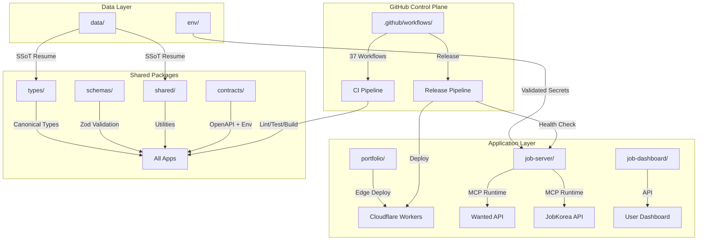

# Resume Portfolio Monorepo

# 이력서 포트폴리오 모노레포

---

[](https://github.com/qodo-ai/pr-agent/actions/workflows/ci.yml)
[](https://github.com/qodo-ai/pr-agent/actions/workflows/release.yml)
[](LICENSE)
[](https://nodejs.org/)
[](https://workers.cloudflare.com/)
[](https://github.com/qodo-ai/pr-agent/blob/master/CHANGELOG.md)

**Version:** 1.40.11

---

# Overview

**Resume** is a monorepo encompassing a Cloudflare Worker-powered portfolio site, Wanted/JobKorea recruitment automation, single source of truth (SSoT) resume data, and self-hosted observability infrastructure. It consolidates edge computing, job application workflows, and data management into a unified development platform.

**Key Capabilities:**
- Edge-deployed portfolio worker with sub-ms latency
- MCP-based job automation for Wanted and JobKorea platforms
- Canonical SSoT resume data with Zod runtime validation
- Self-hosted monitoring with Cloudflare dashboard integration

---

# 한국어 (Korean)

## 개요

**Resume**는 Cloudflare Worker 기반 포트폴리오 사이트, Wanted/JobKorea 채용 자동화, 단일 진실 공급원(SSoT) 이력서 데이터, 자체 호스팅 감시 인프라를 통합한 모노레포입니다. 이 프로젝트는 엣지 컴퓨팅, 채용 워크플로우, 데이터 관리를 통합 개발 플랫폼으로 결합합니다.

## 기술 스택

| 계층 | 기술 |
|------|------|
| **런타임** | Node.js ≥22, Cloudflare Workers |
| **언어** | JavaScript/TypeScript, Go, Python |
| **패키지 관리** | npm workspaces (monorepo) |
| **검증** | Zod (스키마), Jest (테스트), Playwright (E2E) |
| **인프라** | Cloudflare Workers/Pages, 자체 감시 |
| **자동화** | GitHub Actions (37개 워크플로우) |

## 앱 (`apps/`)

| 앱 | 설명 |
|----|------|
| `portfolio/` | Cloudflare Workers 기반 공개 포트폴리오 엣지 사이트 |
| `job-server/` | MCP 기반 채용 자동화 런타임 (Wanted/JobKorea) |
| `job-dashboard/` | 대시보드 API 및 워크플로우 핸들러 |

## 패키지 (`packages/`)

| 패키지 | 설명 |
|--------|------|
| `cli/` | CLI 배포/검증 도구 |
| `env/` | 환경 검증 + 타입 세이프 시크릿 파싱 |
| `data/` | SSoT 이력서 데이터 (master `resume_data.json`) |
| `shared/` | 에러, 로거, 재시도, 서킷 브레이커, 암호화 유틸리티 |
| `types/` | JSDoc/TS 정규 타입 정의 (런타임 의존성 없음) |
| `schemas/` | Zod 런타임 검증 스키마 |
| `contracts/` | OpenAPI 스펙 + Cloudflare Worker Env 인터페이스 |

## 도구 및 스크립트 (`tools/`)

- **Go:** `tools/scripts/` — 빌드, 배포, 검증, 동기화 유틸리티
- **JavaScript:** CI/CD 스크립트 및 자동화 도구

---

# Architecture

## System Overview



## Development Flow

```mermaid
flowchart LR
    DEV[Developer] --> |Code Push| GH[GitHub]
    GH --> |PR Created| PRC[PR Checks<br/>03_pr-checks.yml]
    PRC --> |Review Request| PRR[PR Review<br/>10_pr-review.yml]
    PRR --> |Approved| MERGE[Merge to Master]
    MERGE --> |Trigger| SYNC[Data Sync<br/>auto-sync-data.yml]
    SYNC --> |Build| BLD[Build Pipeline]
    BLD --> |Deploy| CF[Cloudflare Workers]
    CF --> |Health| HCHK[Health Check<br/>post-deploy-verify.yml]
```



---

# Automation Inventory

## GitHub Actions Workflows

Total: **37 workflow files** across `.github/workflows/` and `security/`.

### CI & Validation ( workflows)

| Workflow File | Purpose |
|---------------|---------|
| `01_branch-to-pr.yml` | Branch-to-PR conversion automation |
| `02_issue-to-branch.yml` | Issue-to-branch creation |
| `03_pr-checks.yml` | PR validation (lint, test, build) |
| `04_actionlint.yml` | GitHub Actions YAML linting |
| `05_gitleaks.yml` | Secret scanning |
| `06_codeql.yml` | Code quality analysis |
| `07_dependency-review.yml` | Dependency vulnerability review |
| `08_scorecard.yml` | OpenSSF security scorecard |
| `44_reusable-pr-checks.yml` | Reusable PR validation |
| `45_reusable-gitleaks.yml` | Reusable secret scanning |
| `ci.yml` | Core CI pipeline |

### Code Review & Merge

| Workflow File | Purpose |
|---------------|---------|
| `10_pr-review.yml` | AI-powered PR review (qodo-ai/pr-agent) |
| `11_pr-review.yml` | Security-focused PR review |
| `01_branch-to-pr.yml` | Branch-to-PR conversion |
| `09_semantic-pr.yml` | Semantic PR validation |
| `13_pr-auto-merge.yml` | Automatic PR merging |
| `14_bot-auto-fix.yml` | Bot-triggered auto-fixes |
| `15_merged-pr-cleanup.yml` | Post-merge cleanup |

### Dependency Management

| Workflow File | Purpose |
|---------------|---------|
| `12_dependabot-auto-merge.yml` | Dependabot PR auto-merge |
| `42_reusable-docs-sync.yml` | Documentation sync |

### Release & Deployment

| Workflow File | Purpose |
|---------------|---------|
| `24_release-notes.yml` | Automated release notes generation |
| `25_release-publish.yml` | Release publication |
| `release.yml` | Release pipeline trigger |
| `post-deploy-verify.yml` | Post-deployment health verification |
| `provision-queues.yml` | Queue provisioning |

### Issue & Project Management

| Workflow File | Purpose |
|---------------|---------|
| `18_issue-management.yml` | Issue lifecycle automation |
| `19_issue-backfill.yml` | Issue data backfill |
| `29_downstream-health-check.yml` | Downstream service health check |
| `37_ci-failure-issues.yml` | CI failure issue creation |
| `43_reusable-issue-management.yml` | Reusable issue automation |
| `welcome.yml` | New contributor welcome message |

### Documentation

| Workflow File | Purpose |
|---------------|---------|
| `20_readme-gen.yml` | README generation |
| `21_docs-sync.yml` | Documentation synchronization |

### Operational Automation

| Workflow File | Purpose |
|---------------|---------|
| `60_ci-auto-heal.yml` | CI self-healing automation |
| `auto-merge.yml` | Generic auto-merge handler |
| `auto-sync-data.yml` | Data synchronization pipeline |
| `delete-standalone-job-worker.yml` | Worker cleanup |
| `labeler.yml` | PR/issue labeling |
| `security/11_pr-review.yml` | Security PR review |

## AI-Powered Review Tools

| Tool | Purpose | Endpoint |
|------|---------|----------|
| **qodo-ai/pr-agent** | AI PR review and automation | Used in `10_pr-review.yml` |
| **CLIProxyAPI** | LLM gateway for PR agent | `https://cliproxy.jclee.me/v1` |

## Go Automation Tools

**None.** This repository does not contain Go-based automation tools.

---

# Quick Start

## Prerequisites

- Node.js ≥22
- npm ≥10
- Docker (for containerized job-server)
- Git

## Clone & Install

```bash
git clone https://github.com/qodo-ai/pr-agent.git
cd pr-agent
npm install
```

## Build All Applications

```bash
npm run build:all
```

## Run Portfolio Worker Locally

```bash
cd apps/portfolio
npm run dev
```

## Run Job Server (Containerized)

```bash
docker compose up -d
# Health check available at http://localhost:3000/health
```

---

# Local Development

## Repository Structure

```
.
├── apps/
│   ├── portfolio/          # Cloudflare Worker portfolio
│   ├── job-server/         # MCP job automation runtime
│   └── job-dashboard/      # Dashboard API & workflows
├── packages/
│   ├── cli/                # CLI deployment/verification tools
│   ├── env/                # Environment validation
│   ├── data/               # SSoT resume data
│   ├── shared/             # Cross-package utilities
│   ├── types/              # Canonical type definitions
│   ├── schemas/            # Zod validation schemas
│   └── contracts/          # OpenAPI + Env interfaces
├── tools/                  # CI, build, deploy scripts (Go + JS)
├── tests/                  # Jest, Playwright E2E
├── infrastructure/         # Monitoring, n8n, DB configs
├── docs/                   # ADRs, guides, architecture
└── .github/workflows/      # 37 GitHub Actions workflows
```

## Workspace Scripts

```bash
# Data synchronization
npm run sync:data           # Sync SSoT resume data
npm run sync:pdf            # Generate PDF resume
npm run sync:pptx           # Generate PPTX presentation
npm run sync:all            # Sync all (data + PDF + PPTX)

# AI enrichment
npm run enrich:github       # GitHub contribution enrichment
npm run enrich:skills       # Skills data enrichment
npm run enrich:ai           # AI-powered enrichment
npm run enrich:all          # All enrichment tasks

# Build & deployment
npm run build               # Build portfolio worker
npm run build:full          # Build portfolio + CLI
npm run build:all           # Full build pipeline

# Automation
npm run automate:ssot       # Sync → Build → Typecheck → Test
npm run automate:full       # Full pipeline (sync + lint + typecheck + test + build)

# Version management
npm run version:bump        # Version bump (interactive)
```

## Testing

```bash
# Run all tests
npm run test

# Node-specific tests
npm run test:node

# E2E tests with Playwright
npm run test:e2e

# Lint verification
npm run lint
```

## Development Workflow

1. **Create a branch** from `master`:

   ```bash
   git checkout -b feature/my-feature
   ```

2. **Make changes** and commit with semantic messages:

   ```bash
   git commit -m "feat: add new job automation capability"
   ```

3. **Push and create PR** — workflows trigger automatically:
   - `03_pr-checks.yml` runs CI checks
   - `10_pr-review.yml` requests AI review
   - `09_semantic-pr.yml` validates commit format

4. **After approval**, merge via `13_pr-auto-merge.yml` or manually

---

# Commands Reference

## npm Workspace Commands

| Command | Workspace | Description |
|---------|-----------|-------------|
| `npm run build --workspace=@resume/portfolio-worker` | apps/portfolio | Build Cloudflare Worker |
| `npm run deploy --workspace=@resume/cli` | packages/cli | Deploy via CLI |
| `npm run verify --workspace=@resume/cli` | packages/cli | Verify deployment |

## Package.json Root Scripts

| Script | Description |
|--------|-------------|
| `sync:data` | Sync SSoT resume data from source |
| `sync:pdf` | Generate PDF via Go tool |
| `sync:pptx` | Generate PPTX via Python |
| `enrich:github` | Enrich resume with GitHub contributions |
| `enrich:skills` | Enrich with skills data |
| `enrich:ai` | AI-powered data enrichment |
| `build` | Build portfolio worker |
| `lint` | Run ESLint |
| `typecheck` | Run TypeScript type checking |
| `test` | Run all tests |
| `test:node` | Run Node.js tests |
| `test:e2e` | Run Playwright E2E tests |
| `automate:ssot` | Full SSoT automation pipeline |
| `automate:full` | Complete build/test/deploy pipeline |

## Docker Commands

```bash
# Start job-server
docker compose up -d

# View logs
docker compose logs -f

# Stop services
docker compose down

# Rebuild image
docker compose build --no-cache
```

---

# Contribution Guide

## Getting Started

1. Fork the repository
2. Clone your fork:

   ```bash
   git clone https://github.com/<your-username>/pr-agent.git
   ```

3. Add upstream remote:

   ```bash
   git remote add upstream https://github.com/qodo-ai/pr-agent.git
   ```

## Workflow

### Feature Development

```bash
# Create feature branch
git checkout -b feature/your-feature-name

# Install dependencies
npm install

# Make changes, add tests
git add .
git commit -m "feat: describe your change"

# Push to your fork
git push origin feature/your-feature-name

# Create PR via GitHub UI
```

### Commit Message Convention

This project uses **Semantic PR** (`09_semantic-pr.yml`). Commits must follow:

- `feat: new feature`
- `fix: bug fix`
- `docs: documentation changes`
- `style: formatting, no code change`
- `refactor: code refactoring`
- `test: adding tests`
- `chore: maintenance tasks`

### PR Review Process

1. **Automated checks** (`03_pr-checks.yml`):
   - ESLint
   - TypeScript type check
   - Unit tests
   - Build verification

2. **AI Review** (`10_pr-review.yml`):
   - Code quality analysis via qodo-ai/pr-agent
   - Security consideration review

3. **Manual review** by maintainers

4. **Auto-merge** (`13_pr-auto-merge.yml`) upon approval

## Code Standards

| Check | Tool | Config |
|-------|------|--------|
| Linting | ESLint | `eslint.config.cjs` |
| Type checking | TypeScript | `tsconfig.json` |
| Unit tests | Jest | `jest.config.cjs` |
| E2E tests | Playwright | `playwright.config.js` |
| API lint | lx | `lychee.toml` |

## Reporting Issues

- Use issue templates via `18_issue-management.yml`
- Check existing issues before creating new ones
- Include reproduction steps and expected behavior

---

# License

MIT License — see [LICENSE](LICENSE) for details.

---

# Links

- [CHANGELOG](CHANGELOG.md)
- [CONTRIBUTING](CONTRIBUTING.md)
- [AGENTS.md](AGENTS.md) — Project knowledge base
- [OpenAPI Specification](packages/contracts/openapi.yaml)

---

**Maintained by:** qodo-ai/pr-agent  
**Documentation generated by:** README workflow (`20_readme-gen.yml`)  
**AI Review powered by:** [qodo-ai/pr-agent](https://github.com/qodo-ai/pr-agent)