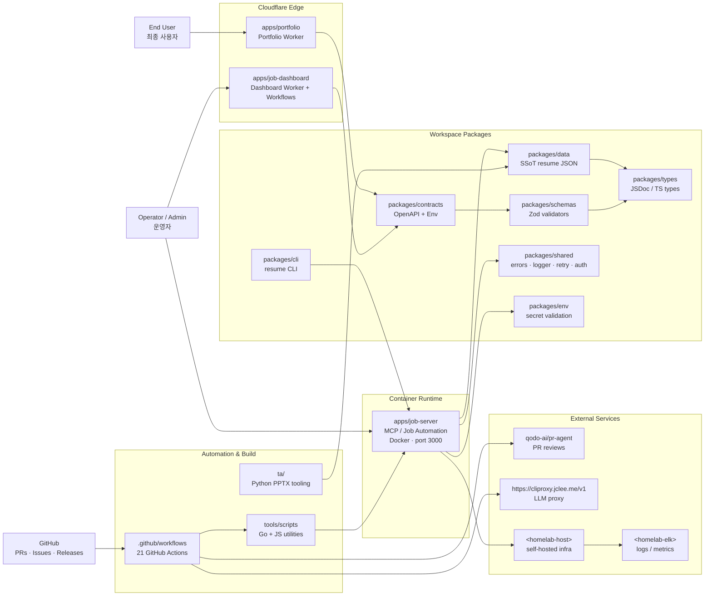

# Resume Portfolio Monorepo / 이력서 포트폴리오 모노레포

[](package.json)
[](https://nodejs.org/)
[](https://workers.cloudflare.com/)
[](LICENSE)
[](Dockerfile)
[](wrangler.jsonc)
[](https://github.com/qodo-ai/pr-agent)
[](apps/job-server)
[](README.md)
[](https://cliproxy.jclee.me/v1)
[](https://bot.jclee.me)

> **Bilingual documentation** / **이중 언어 문서**: This README is provided in English first, followed by a Korean (한국어) translation of each section. Every section header is duplicated in both languages.
> 이 README는 모든 섹션을 영어와 한국어로 병기합니다. 각 섹션 제목은 양국어로 제공됩니다.

> **Primary README generator model:** `gpt-5.5` (fallback: `minimax-m3` via the [cliproxy.jclee.me](https://cliproxy.jclee.me/v1) edge proxy).
> **README 생성 기본 모델:** `gpt-5.5` (대체: [cliproxy.jclee.me](https://cliproxy.jclee.me/v1) 엣지 프록시 경유 `minimax-m3`).

---

## Overview / 개요

`resume` is a **private resume portfolio monorepo** that combines a Cloudflare Worker edge portfolio, structured resume and job-application assets, job-application tracking and automation, a dashboard Worker for operational workflows, and a Dockerized Node.js runtime that exposes a job-automation HTTP API. The same workspace hosts the canonical resume data, shared TypeScript/JSDoc types, Zod validation schemas, OpenAPI contracts, an internal CLI, and a GitHub-native automation control plane (21 GitHub Actions workflows).

`resume`는 Cloudflare Worker 기반 포트폴리오, 구조화된 이력서 및 채용 지원 자료, 채용 지원 추적 및 자동화, 운영 워크플로우용 대시보드 Worker, 그리고 채용 자동화 HTTP API를 노출하는 Docker 기반 Node.js 런타임을 결합한 **개인 이력서 포트폴리오 모노레포**입니다. 동일 워크스페이스는 정식 이력서 데이터, 공유 TypeScript/JSDoc 타입, Zod 검증 스키마, OpenAPI 계약, 내부 CLI, 그리고 GitHub 기반 자동화 컨트롤 플레인(21개의 GitHub Actions 워크플로우)을 함께 호스팅합니다.

The repository is designed as a single operational workspace for:

이 저장소는 다음을 위한 단일 운영 워크스페이스로 설계되었습니다.

- **Portfolio and resume site** served from a Cloudflare Worker edge bundle generated from the Single Source of Truth (SSoT) `packages/data/resumes/master/resume_data.json`.
  Cloudflare Worker 엣지 번들로 서빙되는 **포트폴리오 및 이력서 사이트**(SSoT `packages/data/resumes/master/resume_data.json`에서 생성).
- **Job automation runtime** in `apps/job-server` — crawlers, API clients, sync/auth scripts, and an MCP-style HTTP API exposed via Docker on port `3000`.
  `apps/job-server`의 **채용 자동화 런타임** — 크롤러, API 클라이언트, 동기화/인증 스크립트, Docker로 포트 `3000`에 노출되는 MCP 스타일 HTTP API.
- **Operational dashboard** in `apps/job-dashboard` — Worker routes, middleware, Cloudflare Workflows bindings, and queue consumers for admin and stats surfaces.
  `apps/job-dashboard`의 **운영 대시보드** — Worker 라우트, 미들웨어, Cloudflare Workflows 바인딩, 관리자/통계 화면을 위한 큐 컨슈머.
- **Shared contracts** across the edge portfolio, dashboard, and job-server: canonical types in `packages/types`, Zod schemas in `packages/schemas`, OpenAPI + Env interface in `packages/contracts`, cross-package utilities in `packages/shared`, and type-safe environment validation in `packages/env`.
  엣지 포트폴리오, 대시보드, 잡 서버 전반의 **공유 계약**: `packages/types`의 정식 타입, `packages/schemas`의 Zod 스키마, `packages/contracts`의 OpenAPI + Env 인터페이스, `packages/shared`의 패키지 공용 유틸, `packages/env`의 타입 안전 환경 변수 검증.
- **Automation control plane** in `.github/workflows/` — 21 GitHub Actions workflows handling PR review, auto-merge, issue classification, CI auto-heal, release publishing, and downstream health checks, all wired to the [qodo-ai/pr-agent](https://github.com/qodo-ai/pr-agent) bot and the [cliproxy.jclee.me](https://cliproxy.jclee.me/v1) LLM proxy.
  `.github/workflows/`의 **자동화 컨트롤 플레인** — PR 리뷰, 자동 머지, 이슈 분류, CI 자동 복구, 릴리스 게시, 다운스트림 헬스 체크를 처리하는 21개의 GitHub Actions 워크플로우. 모두 [qodo-ai/pr-agent](https://github.com/qodo-ai/pr-agent) 봇과 [cliproxy.jclee.me](https://cliproxy.jclee.me/v1) LLM 프록시에 연결됩니다.

---

## Features / 주요 기능

- **Edge portfolio** — `apps/portfolio` compiles to a Cloudflare Worker via `wrangler.jsonc`; the worker entry is generated, so all edits flow through the data → build pipeline.
  **엣지 포트폴리오** — `apps/portfolio`는 `wrangler.jsonc`를 통해 Cloudflare Worker로 컴파일됩니다. worker 엔트리는 자동 생성되므로 모든 변경은 데이터 → 빌드 파이프라인을 거칩니다.
- **Authoritative resume content** — A single SSoT JSON in `packages/data` drives the public site, PDF generation, and the dashboard.
  **정식 이력서 콘텐츠** — `packages/data`의 단일 SSoT JSON이 공개 사이트, PDF 생성, 대시보드를 모두 구동합니다.
- **Job automation runtime** — `apps/job-server` exposes a Dockerized HTTP/MCP API (`/health`, application routes, queue consumers) with a Zod-validated contract surface.
  **채용 자동화 런타임** — `apps/job-server`는 Zod로 검증된 계약 표면을 가진 Docker 기반 HTTP/MCP API(`/health`, 지원 라우트, 큐 컨슈머)를 노출합니다.
- **Dashboard worker** — `apps/job-dashboard` ships routes for auth, applications, automation, stats, workflows, and admin, plus CORS/CSRF/rate-limit middleware and a queue consumer.
  **대시보드 worker** — `apps/job-dashboard`는 auth, applications, automation, stats, workflows, admin 라우트와 CORS/CSRF/rate-limit 미들웨어, 큐 컨슈머를 제공합니다.
- **Type-safe contracts** — JSDoc/TS types in `packages/types`, Zod schemas in `packages/schemas`, OpenAPI in `packages/contracts`, validated environment in `packages/env`.
  **타입 안전 계약** — `packages/types`의 JSDoc/TS 타입, `packages/schemas`의 Zod 스키마, `packages/contracts`의 OpenAPI, `packages/env`의 검증된 환경 변수.
- **Bilingual documentation** — Section headers duplicated EN/KR, AGENTS.md, CHANGELOG.md, CONTRIBUTING.md, and per-app guides.
  **이중 언어 문서** — 섹션 제목을 EN/KR로 병기, AGENTS.md, CHANGELOG.md, CONTRIBUTING.md, 앱별 가이드 제공.
- **21 GitHub Actions workflows** — Branch/issue automation, PR review and security review, auto-merge, bot auto-fix, merged PR cleanup, release notes, release publish, post-deploy verify, downstream health checks, CI failure → issue creation, CI auto-heal, issue classification, queue provisioning, and data sync.
  **21개의 GitHub Actions 워크플로우** — 브랜치/이슈 자동화, PR 리뷰 및 보안 리뷰, 자동 머지, 봇 자동 수정, 머지된 PR 정리, 릴리스 노트, 릴리스 게시, 배포 후 검증, 다운스트림 헬스 체크, CI 실패 → 이슈 생성, CI 자동 복구, 이슈 분류, 큐 프로비저닝, 데이터 동기화.
- **Self-hosted observability** — `infrastructure/` holds Cloudflare, monitoring, n8n, and database config; the job-server reaches the self-hosted stack at `<homelab-host>` with logs at `<homelab-elk>`.
  **셀프 호스팅 옵저버빌리티** — `infrastructure/`가 Cloudflare, 모니터링, n8n, DB 설정을 보관하고, job-server는 셀프 호스팅 스택에 `<homelab-host>`로 접근하며 로그는 `<homelab-elk>`에 기록됩니다.
- **Tooling surface** — npm workspaces, ESLint (`eslint.config.cjs`), Jest (`jest.config.cjs`), Playwright (`playwright.config.js`), Redocly (`redocly.yaml`), `lychee.toml` for link checking, and Python tooling under `ta/` for profile PPTX generation.
  **도구 표면** — npm 워크스페이스, ESLint(`eslint.config.cjs`), Jest(`jest.config.cjs`), Playwright(`playwright.config.js`), Redocly(`redocly.yaml`), 링크 검증을 위한 `lychee.toml`, 프로필 PPTX 생성을 위한 `ta/`의 Python 도구.

---

## Architecture / 아키텍처



The diagram groups the system into four planes. The **Cloudflare Edge** plane runs the public portfolio and the operator dashboard as two independent Workers. The **Container Runtime** plane runs the Dockerized `job-server` (also called `mcp-server` in `docker-compose.yml`) and is the only plane that talks to self-hosted infra at `<homelab-host>` and observability at `<homelab-elk>`. The **Workspace Packages** plane is the contract layer shared by both runtimes — types, schemas, contracts, and shared utilities. The **Automation & Build** plane owns CI, the Go + JS operator scripts, and the Python tooling under `ta/`. External services (`qodo-ai/pr-agent` and the LLM proxy at `https://cliproxy.jclee.me/v1`) are invoked only from the GitHub Actions control plane; they never run inside the edge or container runtimes.

위 다이어그램은 시스템을 4개의 플레인으로 구분합니다. **Cloudflare Edge** 플레인은 공개 포트폴리오와 운영자 대시보드를 두 개의 독립 Worker로 실행합니다. **Container Runtime** 플레인은 Docker 기반 `job-server`(`docker-compose.yml`에서는 `mcp-server`)를 실행하며, `<homelab-host>`의 셀프 호스팅 인프라와 `<homelab-elk>`의 옵저버빌리티와 통신하는 유일한 플레인입니다. **Workspace Packages** 플레인은 두 런타임이 공유하는 계약 계층(타입, 스키마, contracts, 공유 유틸)입니다. **Automation & Build** 플레인은 CI, Go + JS 운영 스크립트, `ta/`의 Python 도구를 소유합니다. 외부 서비스(`qodo-ai/pr-agent` 및 `https://cliproxy.jclee.me/v1`의 LLM 프록시)는 GitHub Actions 컨트롤 플레인에서만 호출되며 엣지/컨테이너 런타임 내부에서는 실행되지 않습니다.

---

## Repository Structure / 저장소 구조

The on-disk layout reflects the real top-level directory tree of the repository. Paths that are transient CI checkouts (for example, anything matching `_bot-scripts/`) are not real directories and are intentionally omitted.

디스크 상의 레이아웃은 저장소의 실제 최상위 디렉터리 트리를 반영합니다. 일시적인 CI 체크아웃 경로(예: `_bot-scripts/`와 같은 이름)는 실제 디렉터리가 아니므로 의도적으로 제외합니다.

```text
resume/
├── AGENTS.md                          # project knowledge base
├── CHANGELOG.md                       # release history
├── CONTRIBUTING.md                    # contribution guide
├── Dockerfile                         # multi-stage build for apps/job-server
├── LICENSE                            # MIT
├── OWNERS                             # code ownership
├── README.md                          # this file
├── docker-compose.yml                 # mcp-server / job-server runtime
├── eslint.config.cjs                  # ESLint flat config
├── jest.config.cjs                    # Jest configuration
├── lychee.toml                        # link checker configuration
├── package.json                       # workspace root + operator scripts
├── package-lock.json
├── playwright.config.js               # Playwright E2E configuration
├── redocly.yaml                       # Redocly OpenAPI linting
├── tsconfig.base.json                 # shared TypeScript config
├── tsconfig.json                      # root TS project references
├── wrangler.jsonc                     # Cloudflare Wrangler config
├── ta/                                # TA profile PPTX tooling (Python)
│   ├── AGENTS.md
│   ├── improve_visual.py
│   ├── inspect.py
│   ├── verify.py
│   ├── *.pptx
│   └── output/
├── applications/                      # job-application packages (per company)
│   ├── airpremia-security-2026/
│   ├── infrastructure-architecture-2026/
│   ├── coupang-fintech-sre-2026/
│   ├── cloudflare-one-se-2026/
│   └── gitlab-apac-security-2026/
├── apps/
│   ├── portfolio/                     # public Cloudflare Worker
│   ├── job-server/                    # MCP / job automation HTTP API
│   └── job-dashboard/                 # dashboard Worker + workflows
│       ├── AGENTS.md
│       ├── API_REFERENCE.md
│       ├── DEPLOYMENT_GUIDE.md
│       ├── DEVELOPMENT_GUIDE.md
│       ├── DIAGRAMS.md
│       ├── OWNERS
│       ├── README.md
│       ├── SECRETS.md
│       ├── migrate-json-to-d1.cjs
│       ├── migration-data.sql
│       ├── schema.sql
│       ├── migrations/
│       ├── src/
│       │   ├── index.js
│       │   ├── queue-consumer.js
│       │   ├── router.js
│       │   ├── middleware/   (cors.js, csrf.js, rate-limit.test.js)
│       │   ├── routes/       (admin, applications, auth, automation, health, index, stats, workflows)
│       │   └── handlers/     (applications, auth, auto-apply-webhook-handler)
├── packages/                          # shared workspace packages
│   ├── cli/                           # resume CLI
│   ├── env/                           # type-safe env + secrets
│   ├── data/                          # SSoT resumes and JSON schema
│   ├── shared/                        # cross-package utilities
│   ├── types/                         # canonical JSDoc/TS types
│   ├── schemas/                       # Zod validation
│   └── contracts/                     # OpenAPI + Worker Env interface
├── tools/                             # CI/build/deploy/verify scripts (Go + JS)
├── tests/                             # unit, integration, Playwright E2E
├── infrastructure/                    # Cloudflare, monitoring, n8n, DB
├── docs/                              # ADRs, architecture, conventions
├── supabase/                          # Supabase edge functions (Deno)
├── third_party/                       # vendored external deps (npm)
└── .github/
    ├── workflows/                     # 21 GitHub Actions workflows
    ├── actions/                       # composite actions used by workflows
    └── CODEOWNERS
```

---

## Automation Inventory / 자동화 인벤토리

### GitHub Actions Workflows / GitHub Actions 워크플로우

All 21 workflows live in `.github/workflows/`. Their on-disk file names include the numeric prefix; that prefix is part of the real path and must not be stripped.

21개 워크플로우는 모두 `.github/workflows/`에 있습니다. 디스크 상의 파일 이름에는 숫자 접두사가 포함되며, 이 접두사는 실제 경로의 일부이므로 제거해서는 안 됩니다.

| # | File / 파일 | Purpose / 용도 |
|---|---|---|
| 1 | `01_branch-to-pr.yml` | Convert a working branch into a draft PR with auto-context. / 작업 브랜치를 자동 컨텍스트가 포함된 드래프트 PR로 변환 |
| 2 | `02_issue-to-branch.yml` | Spawn a branch from an issue, with checklist and labels mirrored. / 이슈에서 브랜치를 생성하고 체크리스트/라벨을 미러링 |
| 3 | `10_pr-review.yml` | Run [qodo-ai/pr-agent](https://github.com/qodo-ai/pr-agent) review on every PR. / 모든 PR에 [qodo-ai/pr-agent](https://github.com/qodo-ai/pr-agent) 리뷰 실행 |
| 4 | `11_security-pr-review.yml` | Security-focused PR review for sensitive paths. / 민감 경로에 대한 보안 중심 PR 리뷰 |
| 5 | `12_dependabot-auto-merge.yml` | Auto-merge routine Dependabot PRs after CI. / CI 통과 후 일반 Dependabot PR 자동 머지 |
| 6 | `13_pr-auto-merge.yml` | Auto-merge PRs that pass review and required checks. / 리뷰 및 필수 체크 통과 PR 자동 머지 |
| 7 | `14_bot-auto-fix.yml` | Apply automated fixes proposed by the bot review. / 봇 리뷰가 제안한 자동 수정 적용 |
| 8 | `15_merged-pr-cleanup.yml` | Delete merged feature branches and stale refs. / 머지된 피처 브랜치 및 오래된 ref 정리 |
| 9 | `19_issue-backfill.yml` | Backfill missing labels/milestones on legacy issues. / 레거시 이슈의 누락된 라벨/마일스톤 보강 |
| 10 | `24_release-notes.yml` | Generate release notes from merged PRs and issues. / 머지된 PR/이슈에서 릴리스 노트 생성 |
| 11 | `25_release-publish.yml` | Publish the release artifacts and create the GitHub release. / 릴리스 아티팩트 게시 및 GitHub 릴리스 생성 |
| 12 | `29_downstream-health-check.yml` | Probe downstream services after deploy. / 배포 후 다운스트림 서비스 프로빙 |
| 13 | `37_ci-failure-issues.yml` | Open an issue when CI fails repeatedly. / CI가 반복적으로 실패할 때 이슈 생성 |
| 14 | `60_ci-auto-heal.yml` | Self-heal transient CI failures (retry/cache flush). / 일시적 CI 실패 자동 복구(재시도/캐시 플러시) |
| 15 | `91_issue-classification.yml` | Classify new issues by area/severity/owner. / 신규 이슈를 영역/심각도/담당자별로 분류 |
| 16 | `auto-sync-data.yml` | Sync the SSoT resume data on a schedule. / 정기적으로 SSoT 이력서 데이터 동기화 |
| 17 | `ci.yml` | Main CI: install, lint, typecheck, unit tests, build. / 메인 CI: 설치, 린트, 타입체크, 유닛 테스트, 빌드 |
| 18 | `delete-standalone-job-worker.yml` | Tear down the standalone job worker after migration. / 마이그레이션 후 독립 실행형 job worker 제거 |
| 19 | `post-deploy-verify.yml` | Post-deploy smoke tests against production. / 운영 환경 대상 배포 후 스모크 테스트 |
| 20 | `provision-queues.yml` | Provision Cloudflare Queues used by the dashboard. / 대시보드가 사용하는 Cloudflare Queues 프로비저닝 |
| 21 | `release.yml` | Coordinated release pipeline (notes + publish + verify). / 릴리스 통합 파이프라인(노트 + 게시 + 검증) |

### Go Automation Tools / Go 자동화 도구

This repository currently has **no Go-based automation tools** (count: `0`). The legacy operator scripts live under `tools/scripts/` as a mix of Go and JavaScript entry points invoked from the npm scripts in `package.json` (for example `sync:pdf`, `sync:proposals`, `enrich:github`, `enrich:skills`, `enrich:ai`, and the `op:*` 1Password helpers). They are not first-class Go tools in the sense of the automation inventory, so they are intentionally not enumerated here.

이 저장소에는 현재 **Go 기반 자동화 도구가 없습니다**(개수: `0`). 레거시 운영 스크립트는 `tools/scripts/` 아래에 Go와 JavaScript 진입점이 혼합된 형태로 있으며, `package.json`의 npm 스크립트(예: `sync:pdf`, `sync:proposals`, `enrich:github`, `enrich:skills`, `enrich:ai`, `op:*` 1Password 헬퍼)에서 호출됩니다. 자동화 인벤토리意义上的 Go 도구가 아니므로 의도적으로 나열하지 않습니다.

### LLM Surface / LLM 표면

The automation plane reaches the LLM only through the [cliproxy.jclee.me](https://cliproxy.jclee.me/v1) edge proxy. The primary model is `gpt-5.5`; the fallback is `minimax-m3`, also served through the same proxy. PR reviews go through the official [qodo-ai/pr-agent](https://github.com/qodo-ai/pr-agent) action.

자동화 플레인은 [cliproxy.jclee.me](https://cliproxy.jclee.me/v1) 엣지 프록시를 통해서만 LLM에 접근합니다. 기본 모델은 `gpt-5.5`이며 대체 모델은 동일 프록시를 경유하는 `minimax-m3`입니다. PR 리뷰는 공식 [qodo-ai/pr-agent](https://github.com/qodo-ai/pr-agent) 액션을 사용합니다.

---

## Quick Start / 빠른 시작

Prerequisites / 사전 요구사항:

- Node.js ≥ 22
- npm ≥ 10 (the repo uses npm workspaces)
- Docker + Docker Compose v2 (only required for the `job-server` runtime)
- Python 3.x (only for `ta/` PPTX tooling)
- Wrangler (`npx wrangler`) for Cloudflare Worker deploys

Clone and install / 클론 및 설치:

```bash
git clone <repo-url> resume
cd resume
npm ci
```

Boot the job-server (mcp-server) container / job-server(mcp-server) 컨테이너 기동:

```bash
docker compose up -d --build
curl -fsS http://127.0.0.1:3000/health
```

The expected response is a JSON health payload served by `apps/job-server`. The `HEALTHCHECK` directive in the `Dockerfile` and the `healthcheck` block in `docker-compose.yml` both probe `http://127.0.0.1:3000/health`.

기대 응답은 `apps/job-server`가 제공하는 JSON 헬스 페이로드입니다. `Dockerfile`의 `HEALTHCHECK` 디렉티브와 `docker-compose.yml`의 `healthcheck` 블록 모두 `http://127.0.0.1:3000/health`를 프로빙합니다.

---

## Local Development / 로컬 개발

Workspace layout is defined in the root `package.json` `workspaces` field:

워크스페이스 레이아웃은 루트 `package.json`의 `workspaces` 필드에 정의되어 있습니다.

```text
apps/portfolio
apps/job-server
apps/job-dashboard
packages/cli
packages/data
packages/shared
packages/types
packages/schemas
packages/contracts
packages/env
```

Day-to-day loops / 일상적인 개발 루프:

- `npm run lint` — ESLint over all workspaces using `eslint.config.cjs`.
  `eslint.config.cjs`로 모든 워크스페이스에 대해 ESLint 실행.
- `npm run typecheck` — TypeScript project-references build using `tsconfig.base.json` / `tsconfig.json`.
  `tsconfig.base.json` / `tsconfig.json`을 사용한 TypeScript 프로젝트 레퍼런스 빌드.
- `npm run test:node` — Node-side Jest tests using `jest.config.cjs`.
  `jest.config.cjs`를 사용한 Node 측 Jest 테스트.
- `npm run test:e2e` — Playwright end-to-end tests using `playwright.config.js`.
  `playwright.config.js`를 사용한 Playwright E2E 테스트.
- `npm run build` — Build all workspaces (Wrangler for Workers, Node for the server).
  모든 워크스페이스 빌드(Worker는 Wrangler, 서버는 Node).
- `npm run dev:portfolio` / `npm run dev:dashboard` / `npm run dev:server` — Per-app dev servers via Wrangler / Node.
  Wrangler / Node를 통한 앱별 개발 서버.
- `npm run automate:ssot` — Sync the SSoT data, regenerate PDF/PPTX, build, typecheck, run Node tests.
  SSoT 데이터 동기화, PDF/PPTX 재생성, 빌드, 타입체크, Node 테스트 실행.
- `npm run automate:full` — Full pipeline: sync all, lint, typecheck, full tests.
  전체 파이프라인: 전체 동기화, 린트, 타입체크, 전체 테스트.
- `npm run link-check` — Run `lychee` against the configured paths in `lychee.toml`.
  `lychee.toml`의 설정 경로에 대해 `lychee` 실행.
- `npm run openapi:lint` — Lint the OpenAPI spec with Redocly (`redocly.yaml`).
  Redocly로 OpenAPI 스펙 린트(`redocly.yaml`).

Per-app guides are co-located in each app folder:

앱별 가이드는 각 앱 폴더에 함께 제공됩니다.

- `apps/job-dashboard/DEVELOPMENT_GUIDE.md`
- `apps/job-dashboard/DEPLOYMENT_GUIDE.md`
- `apps/job-dashboard/API_REFERENCE.md`
- `apps/job-dashboard/DIAGRAMS.md`
- `apps/job-dashboard/SECRETS.md`
- `apps/job-dashboard/AGENTS.md`
- `AGENTS.md` (repo root)
- `ta/AGENTS.md`

### Environment configuration / 환경 변수 구성

`packages/env` validates environment variables with Zod. The job-server reads them from `.env` mounted by `docker-compose.yml`. Typical groups:

`packages/env`는 Zod로 환경 변수를 검증합니다. job-server는 `docker-compose.yml`이 마운트한 `.env`에서 환경 변수를 읽습니다. 일반적인 그룹은 다음과 같습니다.

- Cloudflare: `CF_ACCOUNT_ID`, `CF_API_TOKEN`, `CF_ZONE_ID` (for `wrangler` and the `provision-queues.yml` / `release.yml` workflows).
  Cloudflare: `CF_ACCOUNT_ID`, `CF_API_TOKEN`, `CF_ZONE_ID`(`wrangler` 및 `provision-queues.yml` / `release.yml` 워크플로우용).
- LLM proxy: a single base URL pointing at [https://cliproxy.jclee.me/v1](https://cliproxy.jclee.me/v1) plus a bearer token.
  LLM 프록시: [https://cliproxy.jclee.me/v1](https://cliproxy.jclee.me/v1)을 가리키는 단일 base URL과 bearer 토큰.
- PR-Agent / GitHub App: `APP_ID`, `PRIVATE_KEY`, `WEBHOOK_SECRET` consumed by [qodo-ai/pr-agent](https://github.com/qodo-ai/pr-agent) and `10_pr-review.yml` / `11_security-pr-review.yml` / `14_bot-auto-fix.yml`.
  PR-Agent / GitHub App: [qodo-ai/pr-agent](https://github.com/qodo-ai/pr-agent)와 `10_pr-review.yml` / `11_security-pr-review.yml` / `14_bot-auto-fix.yml`이 사용하는 `APP_ID`, `PRIVATE_KEY`, `WEBHOOK_SECRET`.
- Self-hosted infra: hostnames as `<homelab-host>` and `<homelab-elk>` (never hardcoded RFC1918 addresses in committed code).
  셀프 호스팅 인프라: 호스트명은 `<homelab-host>`, `<homelab-elk>`로 표기(커밋된 코드에 RFC1918 주소를 하드코딩하지 않음).

---

## Commands Reference / 명령어 레퍼런스

All commands are run from the repository root unless otherwise noted. Definitions live in the `scripts` field of the root `package.json`.

별도 표기가 없는 한 모든 명령어는 저장소 루트에서 실행합니다. 정의는 루트 `package.json`의 `scripts` 필드에 있습니다.

### Data and artifact sync / 데이터 및 아티팩트 동기화

| Command / 명령어 | What it does / 설명 |
|---|---|
| `npm run sync:data` | Rebuild downstream resume artifacts from `packages/data` (the SSoT). / `packages/data`(SSoT)에서 하위 이력서 아티팩트 재구성 |
| `npm run sync:pdf` | Generate the master PDF via `go run ./tools/scripts/build/pdf-generator.go master`. / `go run ./tools/scripts/build/pdf-generator.go master`로 마스터 PDF 생성 |
| `npm run sync:pptx` | Generate the Shinhan PPTX via `python3 tools/scripts/build/generate_shinhan_pptx.py`. / `python3 tools/scripts/build/generate_shinhan_pptx.py`로 Shinhan PPTX 생성 |
| `npm run sync:all` | Run `sync:data`, `sync:pdf`, `sync:pptx` in order. / `sync:data`, `sync:pdf`, `sync:pptx` 순차 실행 |
| `npm run sync:proposals` | Apply pending proposals (Node proposal CLI + Go applier). / 대기 중인 proposal 적용(Node proposal CLI + Go applier) |
| `npm run auto-sync-data` | Same as `sync:data` but exposed for `auto-sync-data.yml`. / `sync:data`와 동일하며 `auto-sync-data.yml`에서 호출 |

### 1Password helpers / 1Password 헬퍼

| Command / 명령어 | What it does / 설명 |
|---|---|
| `npm run op:run` | Generic 1Password-backed runner (`go run ./onepassword/run`). / 범용 1Password 러너(`go run ./onepassword/run`) |
| `npm run op:native:run` | Native 1Password CLI runner. / 네이티브 1Password CLI 러너 |
| `npm run op:seed:resume` | Seed resume secrets into 1Password. / 이력서 시크릿을 1Password에 시드 |
| `npm run op:seed:sessions` | Seed browser session files into 1Password. / 브라우저 세션 파일을 1Password에 시드 |
| `npm run op:restore:sessions` | Restore browser session files from 1Password. / 1Password에서 브라우저 세션 파일 복원 |

### Enrichment / 데이터 보강

| Command / 명령어 | What it does / 설명 |
|---|---|
| `npm run enrich:github` | Enrich SSoT with GitHub contribution data. / GitHub 기여 데이터로 SSoT 보강 |
| `npm run enrich:skills` | Enrich SSoT with skill taxonomy. / 스킬 분류로 SSoT 보강 |
| `npm run enrich:ai` | Enrich SSoT with AI-derived metadata via the LLM proxy. / LLM 프록시를 통해 AI 파생 메타데이터로 SSoT 보강 |
| `npm run enrich:all` | Run all three enrichment passes. / 세 가지 보강 패스 모두 실행 |

### Higher-level automation / 상위 자동화

| Command / 명령어 | What it does / 설명 |
|---|---|
| `npm run automate:ssot` | `sync:data` + `sync:pdf` + `build` + `typecheck` + `test:node`. |
| `npm run automate:full` | `sync:all` + `lint` + `typecheck` + full tests. |
| `npm run strip-exif` | Strip EXIF metadata from portfolio images (uses `exiftool`, no-op if missing). / 포트폴리오 이미지의 EXIF 메타데이터 제거(`exiftool` 사용, 없으면 무시) |

### Container / 컨테이너

| Command / 명령어 | What it does / 설명 |
|---|---|
| `docker compose up -d --build` | Build and start the `mcp-server` container. / `mcp-server` 컨테이너 빌드 및 기동 |
| `docker compose logs -f mcp-server` | Tail job-server logs (forwarded to `<homelab-elk>` in production). / job-server 로그 확인 (운영 환경에서는 `<homelab-elk>`로 포워딩) |
| `docker compose down` | Stop the container and remove the local `job_automation_data` volume mount. / 컨테이너 종료 및 로컬 `job_automation_data` 볼륨 마운트 해제 |

### Cloudflare / Cloudflare

| Command / 명령어 | What it does / 설명 |
|---|---|
| `npx wrangler deploy --config wrangler.jsonc` | Deploy the portfolio worker. / 포트폴리오 worker 배포 |
| `npx wrangler deploy --config apps/job-dashboard/wrangler.toml` | Deploy the dashboard worker (and its workflows). / 대시보드 worker(및 워크플로우) 배포 |
| `npx wrangler queues list` | List queues provisioned by `provision-queues.yml`. / `provision-queues.yml`이 프로비저닝한 큐 나열 |

---

## Contribution Guide / 기여 가이드

This is a **private, single-operator** monorepo. The conventions below apply to PRs authored by the operator and to any external collaborator that is explicitly granted write access.

이 저장소는 **단일 운영자가 사용하는 비공개 모노레포**입니다. 아래 규칙은 운영자가 작성한 PR과 쓰기 권한이 명시적으로 부여된 외부 협업자에게 적용됩니다.

### Branching and commits / 브랜치 및 커밋

- Use `02_issue-to-branch.yml` (or its local equivalent) to derive a branch name from an issue: `issue/<number>-<slug>` for fixes, `feat/<slug>` for features, `chore/<slug>` for ops work.
  이슈에서 브랜치를 만들 때는 `02_issue-to-branch.yml`(또는 로컬 등가물)을 사용해 브랜치 이름을 도출합니다. 수정: `issue/<number>-<slug>`, 기능: `feat/<slug>`, 운영: `chore/<slug>`.
- Commit messages follow Conventional Commits; `24_release-notes.yml` parses them to produce release notes.
  커밋 메시지는 Conventional Commits를 따르며 `24_release-notes.yml`이 이를 파싱해 릴리스 노트를 생성합니다.
- Sign commits if you have a configured signing key (the workflows do not enforce this but it is preferred).
  서명 키가 설정되어 있다면 커밋에 서명하세요(워크플로우는 강제하지 않지만 권장).

### Pull requests / 풀 리퀘스트

- Open a draft PR as soon as the first commit lands (`01_branch-to-pr.yml` automates this).
  첫 커밋이 올라오면 즉시 드래프트 PR을 엽니다(`01_branch-to-pr.yml`이 이를 자동화).
- `10_pr-review.yml` posts a [qodo-ai/pr-agent](https://github.com/qodo-ai/pr-agent) review on every PR; address all `Critical` and `Major` findings before requesting review.
  `10_pr-review.yml`이 모든 PR에 [qodo-ai/pr-agent](https://github.com/qodo-ai/pr-agent) 리뷰를 게시합니다. 리뷰 요청 전 `Critical` 및 `Major` 항목을 모두 해결하세요.
- Sensitive paths additionally trigger `11_security-pr-review.yml`; do not bypass it.
  민감 경로는 추가로 `11_security-pr-review.yml`이 트리거되며 우회해서는 안 됩니다.
- `14_bot-auto-fix.yml` may push automated fix commits; reviewers should treat these as bot-authored and re-run CI.
  `14_bot-auto-fix.yml`이 자동 수정 커밋을 푸시할 수 있으며, 리뷰어는 이를 봇 작성으로 간주하고 CI를 재실행해야 합니다.
- `13_pr-auto-merge.yml` will auto-merge once required checks and approvals are satisfied. Use labels like `no-auto-merge` to opt out.
  `13_pr-auto-merge.yml`은 필수 체크와 승인이 충족되면 자동 머지합니다. `no-auto-merge` 라벨을 사용해 자동 머지를 비활성화할 수 있습니다.

### CI expectations / CI 기대치

`ci.yml` is the source of truth. The pipeline is:

`ci.yml`이 단일 진실 공급원입니다. 파이프라인은 다음과 같습니다.

1. `npm ci` against the root lockfile.
   루트 잠금 파일 기준 `npm ci`.
2. `npm run lint` against `eslint.config.cjs`.
   `eslint.config.cjs` 기준 `npm run lint`.
3. `npm run typecheck` against `tsconfig.base.json` / `tsconfig.json`.
   `tsconfig.base.json` / `tsconfig.json` 기준 `npm run typecheck`.
4. `npm run test:node` against `jest.config.cjs`.
   `jest.config.cjs` 기준 `npm run test:node`.
5. `npm run build` for all workspaces.
   모든 워크스페이스 `npm run build`.
6. Optional: `npx playwright test` against `playwright.config.js` (gated by a path filter).
   선택: `playwright.config.js` 기준 `npx playwright test`(경로 필터로 게이팅).

If CI fails repeatedly, `37_ci-failure-issues.yml` opens an issue. `60_ci-auto-heal.yml` will attempt transient fixes (cache flush, retry) before the failure is reported.

CI가 반복적으로 실패하면 `37_ci-failure-issues.yml`이 이슈를 엽니다. `60_ci-auto-heal.yml`은 실패가 보고되기 전에 일시적 수정(캐시 플러시, 재시도)을 시도합니다.

### Releases / 릴리스

- `25_release-publish.yml` and `release.yml` produce the GitHub release; `24_release-notes.yml` is the upstream source of the body.
  `25_release-publish.yml`과 `release.yml`이 GitHub 릴리스를 생성하며 `24_release-notes.yml`이 본문 소스입니다.
- Versioning is driven by `package.json` (`version` field); tag format is `v<semver>`.
  버전 관리는 `package.json`의 `version` 필드를 따르며 태그 형식은 `v<semver>`입니다.
- `29_downstream-health-check.yml` and `post-deploy-verify.yml` run after each release; roll back via `delete-standalone-job-worker.yml` only when explicitly decided.
  `29_downstream-health-check.yml`과 `post-deploy-verify.yml`이 각 릴리스 이후 실행되며, 명시적으로 결정된 경우에만 `delete-standalone-job-worker.yml`로 롤백합니다.

### Security / 보안

- Never commit secrets. Use `packages/env` for type-safe loading and the `op:*` npm scripts to backfill 1Password.
  시크릿을 커밋하지 마세요. 타입 안전 로딩에는 `packages/env`를, 1Password 백필에는 `op:*` npm 스크립트를 사용하세요.
- Never hardcode RFC1918 addresses or LXC container numbers in committed code. Use placeholders such as `<homelab-host>` and `<homelab-elk>`.
  커밋된 코드에 RFC1918 주소나 LXC 컨테이너 번호를 하드코딩하지 마세요. `<homelab-host>`, `<homelab-elk>` 같은 플레이스홀더를 사용하세요.
- See `apps/job-dashboard/SECRETS.md` and `docs/security/` for the full policy.
  전체 정책은 `apps/job-dashboard/SECRETS.md` 및 `docs/security/`를 참조하세요.

### Code ownership / 코드 소유

- `OWNERS` at the repo root and `apps/job-dashboard/OWNERS` define ownership for the respective trees. GitHub `CODEOWNERS` rules enforce review requests.
  저장소 루트의 `OWNERS`와 `apps/job-dashboard/OWNERS`가 각 트리의 소유권을 정의합니다. GitHub `CODEOWNERS` 규칙이 리뷰 요청을 강제합니다.
- See `CONTRIBUTING.md` for the full policy and the PR template.
  전체 정책과 PR 템플릿은 `CONTRIBUTING.md`를 참조하세요.

---

## Links / 링크

- Public LLM proxy endpoint / 공개 LLM 프록시 엔드포인트: [https://cliproxy.jclee.me/v1](https://cliproxy.jclee.me/v1)
- Bot host / 봇 호스트: [https://bot.jclee.me](https://bot.jclee.me)
- PR review bot / PR 리뷰 봇: [qodo-ai/pr-agent](https://github.com/qodo-ai/pr-agent)

## License / 라이선스

[MIT](LICENSE)