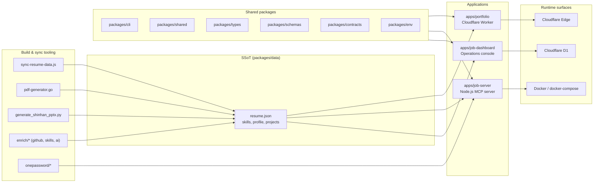

# 레쥬메 모노레포 / Resume Portfolio Monorepo

[](package.json)
[](Dockerfile)
[](docker-compose.yml)
[](wrangler.jsonc)
[](LICENSE)

이 저장소는 개인 포트폴리오 사이트, 채용 자동화 워커, 단일 진실 공급원(SSoT) 데이터 레이어, 그리고 운영 대시보드를 하나의 npm 워크스페이스 모노레포로 통합한 사설 저장소입니다.

This repository is a private npm workspaces monorepo that unifies a personal portfolio site, job automation tooling, a Single Source of Truth (SSoT) data layer, and an operations dashboard under a single, versioned codebase.

---

## 목차 / Table of Contents

- [개요 / Overview](#overview--개요)
- [주요 기능 / Features](#주요-기능--features)
- [아키텍처 / Architecture](#아키텍처--architecture)
- [저장소 구조 / Repository Structure](#저장소-구조--repository-structure)
- [빠른 시작 / Quick Start](#빠른-시작--quick-start)
- [설정 / Configuration](#설정--configuration)
- [명령어 레퍼런스 / Commands Reference](#명령어-레퍼런스--commands-reference)
- [로컬 개발 / Local Development](#로컬-개발--local-development)
- [테스트 / Testing](#테스트--testing)
- [배포 / Deployment](#배포--deployment)
- [기여 / Contributing](#기여--contributing)
- [라이선스 / License](#라이선스--license)

---

## Overview / 개요

`package.json`의 `description` 필드는 이 모노레포를 다음과 같이 정의합니다.

> Resume portfolio monorepo: Cloudflare Worker edge site, job automation (Wanted/JobKorea), SSoT data, self-hosted observability

핵심 가치 / Core values:

- **단일 진실 공급원 (SSoT)** — 이력, 프로필, 스킬, 직무 데이터는 `packages/data`에서 한 번 정의되고 포트폴리오, 이력서, PDF, PPTX, 대시보드 등 모든 산출물로 자동 동기화됩니다.
- **엣지 우선 포트폴리오** — `apps/portfolio`는 Cloudflare Worker(`wrangler.jsonc`)로 글로벌 엣지에 배포되어 저지연으로 페이지를 제공합니다.
- **운영 가능한 잡 자동화** — `apps/job-server`(MCP 서버)는 채용 플랫폼(원티드/잡코리아 등)과의 연동, 워크플로우, 통계 집계를 단일 Node.js 프로세스로 처리합니다.
- **운영 대시보드** — `apps/job-dashboard`는 신청, 워크플로우, 통계, 자동화 이벤트를 한 화면에서 조회·관리할 수 있는 운영 콘솔입니다(라우터 + 미들웨어 + 핸들러 + 큐 컨슈머).
- **재현 가능한 빌드 파이프라인** — Go와 Python으로 작성된 빌드/동기화 스크립트가 SSoT에서 PDF/PPTX/JSON 산출물을 재현합니다.
- **자체 호스팅 옵저버빌리티** — 헬스체크 엔드포인트(`/health`)와 docker-compose 헬스체크로 런타임 상태를 자체적으로 검증합니다.

### 대상 사용자 / Who this is for

- 본 모노레포의 **소유자**: 한 곳에서 이력/포트폴리오/자동화 워크플로우를 일관성 있게 유지·공개·모니터링하려는 개인.
- **채용 담당자/리뷰어**: 동일한 SSoT에서 파생된 이력서, PDF, PPTX, 라이브 포트폴리오, 운영 대시보드를 한 저장소에서 확인.
- **후속 협업자/검토자**: 모노레포 구조, 워크스페이스 경계, 공유 패키지 인터페이스를 통해 변경 영향을 명확히 파악.

---

## 주요 기능 / Features

| 영역 / Area | 기능 / Feature | 위치 / Location |
| --- | --- | --- |
| Edge Portfolio | Cloudflare Worker 기반 정적/동적 포트폴리오, 글로벌 캐싱 | `apps/portfolio`, `wrangler.jsonc` |
| Job Server | MCP 호환 잡 자동화 백엔드, REST 라우터, 큐 컨슈머 | `apps/job-server` |
| Job Dashboard | 신청/워크플로우/통계/관리 콘솔, D1 마이그레이션 | `apps/job-dashboard` |
| SSoT Data | 이력·스킬·프로필의 정규화된 JSON 데이터셋 | `packages/data` |
| Shared Schemas | 요청/응답 스키마, 환경 변수, 타입 | `packages/schemas`, `packages/types`, `packages/contracts`, `packages/env` |
| Shared Logic | 워크스페이스 공통 유틸리티 | `packages/shared` |
| Internal CLI | 워크스페이스 내부 명령줄 도구 | `packages/cli` |
| Build Tooling | PDF/PPTX/JSON 생성, 데이터 동기화 | `tools/scripts/build`, `tools/scripts/sync` |
| Enrichment | GitHub/스킬/AI 기반 데이터 보강 | `tools/scripts/enrichment` |
| Secret Ops | 1Password 기반 시드/복원/네이티브 실행 | `tools/scripts/onepassword` |
| Local Runtime | Docker Compose 기반 자급식 런타임 | `docker-compose.yml`, `Dockerfile` |
| Quality Gate | ESLint, Jest, Playwright, Redocly, lychee | `eslint.config.cjs`, `jest.config.cjs`, `playwright.config.js`, `redocly.yaml`, `lychee.toml` |

---

## 아키텍처 / Architecture



### 구성 요소 책임 / Component responsibilities

- **`apps/portfolio` (Cloudflare Worker)** — `wrangler.jsonc`로 정의된 엣지 워커. `worker.js`가 진입점이며 SSoT 데이터 + 공유 패키지를 결합해 정적·동적 페이지를 렌더링합니다.
- **`apps/job-server` (Node.js MCP server)** — `src/server/index.js`가 진입점. 잡 자동화 워크플로우, REST 라우터, 큐 컨슈머를 호스팅하며 `/health` 헬스체크를 노출합니다(Dockerfile `HEALTHCHECK`과 docker-compose `healthcheck`에서 사용).
- **`apps/job-dashboard` (Operations console)** — `src/index.js`(진입점), `src/router.js`(라우팅), `src/queue-consumer.js`(백그라운드 작업), `src/middleware/*`(CORS/CSRF/레이트 리미트), `src/routes/*`(admin/applications/auth/automation/health/stats/workflows), `src/handlers/*`(비즈니스 로직, `auto-apply-webhook-handler.js` 포함), `migrations/0002_add_approval_metadata.sql` 등 SQL 마이그레이션으로 D1 스키마를 관리합니다.
- **`packages/data`** — 모든 산출물의 원천. 다른 패키지와 앱은 이 데이터를 읽기 전용으로 소비하는 것을 원칙으로 합니다.
- **`packages/schemas`, `packages/types`, `packages/contracts`, `packages/env`, `packages/shared`, `packages/cli`** — 워크스페이스 간 공통 인터페이스/유틸/CLI.
- **`tools/scripts/*`** — Go(`*.go`)와 Python(`*.py`)로 작성된 보조 도구. SSoT 동기화, PDF/PPTX 빌드, GitHub/스킬/AI 데이터 보강, 1Password 시드/복원 등을 담당합니다.
- **`ta/`, `applications/`** — 보조 자산. `ta/`는 TA 관련 PPTX와 Python 검사/검증/개선 스크립트, `applications/`는 회사별 지원서/이력서 패키지입니다.

### 데이터 흐름 / Data flow

1. `packages/data`의 정형 데이터를 `tools/scripts`의 빌더가 읽어 PDF/PPTX/JSON 산출물로 변환합니다.
2. 동시에 `apps/portfolio`는 같은 데이터를 워커 자산으로 번들하여 Cloudflare 엣지에 배포합니다.
3. `apps/job-server`는 데이터·공유 패키지·1Password 시크릿을 결합해 잡 자동화 워크플로우를 실행하고, 영속 데이터는 도커 볼륨(`job_automation_data`)에 저장합니다.
4. `apps/job-dashboard`는 신청/워크플로우/통계를 조회하고, Cloudflare D1(스키마는 `schema.sql` + `migrations/`)에 감사/승인 메타데이터를 저장합니다.

---

## 저장소 구조 / Repository Structure

```
.
├── AGENTS.md                  # 에이전트/협업자 운영 가이드
├── CHANGELOG.md               # 변경 이력
├── CONTRIBUTING.md            # 기여 절차
├── Dockerfile                 # 멀티스테이지 (deps → runtime, job-server)
├── LICENSE                    # 라이선스
├── OWNERS                     # 책임자 명단
├── README.md                  # 본 문서
├── docker-compose.yml         # mcp-server 서비스 정의
├── eslint.config.cjs          # ESLint 구성
├── jest.config.cjs            # Jest(유닛 테스트) 구성
├── lychee.toml                # 링크 검사기 구성
├── package.json               # npm 워크스페이스 루트
├── package-lock.json
├── playwright.config.js       # Playwright(E2E) 구성
├── redocly.yaml               # OpenAPI/Redoc 구성
├── tsconfig.base.json         # TypeScript 베이스 구성
├── tsconfig.json              # TypeScript 프로젝트 구성
├── wrangler.jsonc             # Cloudflare Worker 구성
│
├── ta/                        # TA 자산 (PPTX, Python 검사/검증 스크립트)
│   ├── 2.pptx
│   ├── improve_visual.py
│   ├── inspect.py
│   ├── lee_jaecheol_profile_ta.pptx
│   ├── lee_jaecheol_ta.pptx
│   ├── lee_jaecheol_ta_profile.pptx
│   ├── ta.pptx
│   ├── verify.py
│   └── output/                # 스크립트 실행 산출물
│
├── applications/              # 회사별 지원서/이력서 패키지
│   ├── airpremia-security-2026/
│   ├── infrastructure-architecture-2026/
│   ├── coupang-fintech-sre-2026/
│   ├── cloudflare-one-se-2026/
│   └── gitlab-apac-security-2026/
│
└── apps/
    ├── portfolio/             # Cloudflare Worker 포트폴리오 (worker.js)
    ├── job-server/            # Node.js MCP 잡 자동화 서버
    └── job-dashboard/         # 운영 대시보드 (D1 + 라우터/미들웨어/핸들러)
        ├── API_REFERENCE.md
        ├── DEPLOYMENT_GUIDE.md
        ├── DEVELOPMENT_GUIDE.md
        ├── DIAGRAMS.md
        ├── SECRETS.md
        ├── migrate-json-to-d1.cjs
        ├── migration-data.sql
        ├── schema.sql
        └── src/
            ├── index.js
            ├── queue-consumer.js
            ├── router.js
            ├── middleware/    # cors, csrf, rate-limit(.test)
            ├── routes/        # admin, applications, auth, automation, health, stats, workflows
            └── handlers/      # applications, auth, auto-apply-webhook-handler
```

> 참고: `packages/cli`, `packages/data`, `packages/shared`, `packages/types`, `packages/schemas`, `packages/contracts`, `packages/env`은 `package.json`의 `workspaces`에 선언된 공유 워크스페이스이며, 이 모노레포의 SSoT/공통 인터페이스를 제공합니다.

---

## 빠른 시작 / Quick Start

### 사전 요구 사항 / Prerequisites

- Node.js 22 이상 (Dockerfile이 `node:22-alpine` 사용)
- npm 10+ (워크스페이스 + lockfile 지원)
- Wrangler (`apps/portfolio`를 로컬/엣지에 배포할 때)
- Go 1.22+ (`tools/scripts/**` 빌드/동기화 도구)
- Python 3.x (`ta/` 스크립트, `tools/scripts/build/generate_shinhan_pptx.py`)
- Docker + Docker Compose (MCP 서버 자급식 실행)
- (선택) 1Password CLI — `op:run`, `op:seed:*` 사용 시

### 로컬 클론 & 설치 / Clone & install

```bash
git clone <repository-url> resume
cd resume
npm ci
```

### 환경 변수 파일 준비 / Environment file

```bash
cp .env.example .env   # .env.example이 없으면 docker-compose가 참조하는 키 목록을 참고해 생성
```

`docker-compose.yml`은 `env_file: .env`로 환경 변수를 주입합니다.

### 자급식 런타임 기동 / Self-hosted runtime

```bash
docker compose up -d --build
docker compose ps                 # healthcheck 통과 확인
docker compose logs -f mcp-server
```

기동 후 `http://localhost:3000/health`로 헬스체크를 직접 확인할 수 있습니다.

### 포트폴리오 워커 로컬 실행 / Run portfolio worker locally

```bash
cd apps/portfolio
npx wrangler dev
```

`wrangler.jsonc`에 정의된 바인딩(예: D1, KV, R2 등)을 그대로 사용합니다.

---

## 설정 / Configuration

설정은 다음 4개 계층에 분산되어 있습니다.

| 계층 / Layer | 파일 / File | 용도 / Purpose |
| --- | --- | --- |
| npm 워크스페이스 | `package.json` (`workspaces`) | 모노레포 구성과 스크립트 진입점 |
| 환경 변수 | `.env`, `docker-compose.yml` (`env_file`) | 런타임 비밀/엔드포인트 주입 |
| Cloudflare Worker | `wrangler.jsonc` | 엣지 바인딩, 환경, 호스트명 |
| TypeScript | `tsconfig.base.json`, `tsconfig.json`, `apps/job-dashboard/tsconfig.json` | 컴파일러 옵션/경로 별칭 |
| 품질 도구 | `eslint.config.cjs`, `jest.config.cjs`, `playwright.config.js`, `redocly.yaml`, `lychee.toml` | 린트, 테스트, API/링크 검사 |

### 헬스체크 / Health checks

Dockerfile의 컨테이너 헬스체크는 다음을 호출합니다.

```
GET http://127.0.0.1:3000/health
```

응답이 `ok`이고 HTTP 상태가 200이면 컨테이너는 정상(`healthy`)으로 표시됩니다. docker-compose의 `healthcheck`는 동일 엔드포인트와 동일 주기(30s)·타임아웃(5s)·재시도(3)·초기 대기(20s)로 정의되어 있습니다.

### 시크릿 / Secrets

- 컨테이너 환경: `.env` (docker-compose가 `env_file`로 주입)
- 1Password 연동: `tools/scripts/onepassword` — `npm run op:run`, `op:seed:resume`, `op:seed:sessions`, `op:restore:sessions`
- 대시보드: `apps/job-dashboard/SECRETS.md` 참조

### 데이터 영속화 / Data persistence

`docker-compose.yml`은 명명된 볼륨 `job_automation_data`를 컨테이너의 `/app/apps/job-server/.data`에 마운트합니다. 컨테이너를 재생성해도 잡 자동화 상태가 유지됩니다.

---

## 명령어 레퍼런스 / Commands Reference

루트 `package.json`의 `scripts`에서 직접 사용 가능한 명령어입니다. 워크스페이스 내부 명령은 `npm -w <workspace> run <script>`으로 실행하세요.

### 데이터/산출물 동기화 / Sync

| 명령 / Command | 설명 / Description |
| --- | --- |
| `npm run sync:data` | `tools/scripts/utils/sync-resume-data.js` — SSoT 데이터를 산출물 위치로 동기화 |
| `npm run sync:pptx` | `tools/scripts/build/generate_shinhan_pptx.py` — PPTX 산출물 생성 |
| `npm run sync:pdf` | `go run ./tools/scripts/build/pdf-generator.go master` — PDF 마스터 빌드 |
| `npm run sync:all` | 위 세 명령을 차례로 실행 |
| `npm run sync:proposals` | 제안서 동기화 (CLI + Go 어플라이어) |
| `npm run strip-exif` | 포트폴리오 이미지의 EXIF 제거 (`exiftool` 사용) |

### 1Password 시크릿 / Secrets

| 명령 / Command | 설명 / Description |
| --- | --- |
| `npm run op:run` | 1Password run 래퍼 |
| `npm run op:native:run` | 네이티브 1Password run |
| `npm run op:seed:resume` | 이력서 관련 시크릿 시드 |
| `npm run op:seed:sessions` | 세션 파일 시드 |
| `npm run op:restore:sessions` | 세션 파일 복원 |

### 데이터 보강 / Enrichment

| 명령 / Command | 설명 / Description |
| --- | --- |
| `npm run enrich:github` | `tools/scripts/enrichment/github` — GitHub 활동 기반 보강 |
| `npm run enrich:skills` | `tools/scripts/enrichment/skills` — 스킬 분류 보강 |
| `npm run enrich:ai` | `tools/scripts/enrichment/ai` — AI 기반 보강 |
| `npm run enrich:all` | 세 보강 파이프라인 일괄 실행 |

### 종합 파이프라인 / Aggregate pipelines

| 명령 / Command | 설명 / Description |
| --- | --- |
| `npm run automate:ssot` | SSoT → PDF/PPTX → 빌드 → 타입체크 → Node 테스트 |
| `npm run automate:full` | 전체 동기화 + 린트 + 타입체크(스크립트에 정의된 범위까지) |

> 참고: `package.json`에 정의된 스크립트만 표기했습니다. 그 외 워크스페이스 고유 스크립트(예: `apps/portfolio`의 `dev`/`deploy`)는 해당 워크스페이스의 `package.json`을 확인하세요.

---

## 로컬 개발 / Local Development

### 워크플로 / Workflow

1. **데이터 변경**: `packages/data` 또는 `packages/schemas`, `packages/types` 수정.
2. **동기화**: `npm run sync:all`로 SSoT → PDF/PPTX/JSON 산출물 재생성.
3. **포트폴리오 워커**: `cd apps/portfolio && npx wrangler dev`로 로컬 미리보기.
4. **잡 서버**: `docker compose up -d --build`로 자급식 실행 후 `http://localhost:3000/health` 확인.
5. **대시보드**: `cd apps/job-dashboard && npm run dev`(해당 워크스페이스 스크립트가 있다면). D1 마이그레이션은 `migrate-json-to-d1.cjs`, `migrations/*.sql`로 적용.
6. **검증**: `npm run lint`, `npm test`(Jest), `npx playwright test`(E2E), `redocly lint`(API 스펙), `lychee` (외부 링크) — 각각의 설정 파일이 루트에 있습니다.

### 워크스페이스 팁 / Workspace tips

- 공통 타입/스키마는 항상 공유 패키지(`packages/types`, `packages/schemas`, `packages/contracts`)에서 import하세요. 앱 로컬에 중복 정의를 두면 SSoT 일관성이 깨집니다.
- 환경 변수는 `packages/env`의 단일 진입점을 통해 주입받습니다.
- 새 CLI 명령은 `packages/cli`에 모은 뒤 각 앱에서 import해 사용하세요.

### TA 자산 / TA assets

`ta/` 디렉터리의 Python 스크립트는 PPTX를 검사(`inspect.py`), 검증(`verify.py`), 시각적으로 개선(`improve_visual.py`)합니다. 산출물은 `ta/output/`에 기록되며 `verify_report_<YYYYMMDD>.txt` 형식의 리포트가 함께 생성됩니다.

---

## 테스트 / Testing

이 모노레포는 다음 테스트 도구를 사용합니다.

| 도구 / Tool | 설정 파일 / Config | 대상 / Scope | 실행 예시 / Example |
| --- | --- | --- | --- |
| Jest | `jest.config.cjs` | 유닛/통합 테스트 (예: `apps/job-dashboard/src/middleware/rate-limit.test.js`) | `npm test` |
| Playwright | `playwright.config.js` | 엔드투엔드 시나리오 | `npx playwright test` |
| Redocly | `redocly.yaml` | OpenAPI/문서 린트 | `npx redocly lint` |
| lychee | `lychee.toml` | 외부 링크 유효성 | `npx lychee '**/*.md'` |
| ESLint | `eslint.config.cjs` | 정적 분석/린트 | `npm run lint` |
| TypeScript | `tsconfig.json` | 타입 체크 | `npm run typecheck`(워크스페이스 정의 시) |

대시보드 마이그레이션은 `apps/job-dashboard/migrate-json-to-d1.cjs`, `apps/job-dashboard/migration-data.sql`, `apps/job-dashboard/migrations/0002_add_approval_metadata.sql`을 순서대로 적용해 검증합니다.

### 컨테이너 헬스체크 / Container health

`docker compose ps`에서 `mcp-server`의 `STATUS`가 `Up (healthy)`인지 확인하세요. 미흡 시 `docker compose logs mcp-server`로 `/health` 응답 실패 원인을 추적합니다.

---

## 배포 / Deployment

### Cloudflare Worker (포트폴리오)

```bash
cd apps/portfolio
npx wrangler deploy
```

`wrangler.jsonc`에 정의된 환경/바인딩을 그대로 사용합니다. 스테이징과 프로덕션 환경은 `wrangler.jsonc`의 `env.<name>` 블록으로 분리하세요.

### MCP 잡 자동화 서버 (자급식)

```bash
docker compose -f docker-compose.yml up -d --build
docker compose ps
```

- 이미지: `Dockerfile`의 멀티스테이지(`deps` → `runtime`)로 빌드. 런타임 이미지는 `apps/job-server`의 소스와 `@resume/*` 워크스페이스만 포함합니다.
- 포트: 컨테이너 `3000`을 호스트 `3000`에 매핑.
- 헬스체크: `interval=30s`, `timeout=5s`, `retries=3`, `start_period=20s`.
- 영속 데이터: 명명된 볼륨 `job_automation_data` → `/app/apps/job-server/.data`.
- 환경: `env_file: .env`, `NODE_ENV=production`, `PORT=3000`.

### 대시보드 (D1)

`apps/job-dashboard/DEPLOYMENT_GUIDE.md`와 `migrate-json-to-d1.cjs`, `schema.sql`, `migrations/*.sql`을 순서대로 적용합니다. 환경별 차이는 해당 가이드를 따르세요.

---

## 기여 / Contributing

기여 절차는 [`CONTRIBUTING.md`](CONTRIBUTING.md), 책임자 목록은 [`OWNERS`](OWNERS), 에이전트/협업자 운영 지침은 [`AGENTS.md`](AGENTS.md)에 정리되어 있습니다. 주요 원칙:

1. **SSoT 우선**: 도메인 데이터 변경은 반드시 `packages/data`(및 관련 스키마/타입)에서 시작합니다.
2. **공유 패키지 우선**: 로컬에서 재정의하지 말고 `packages/*`을 활용합니다.
3. **자동화 가능한 변경은 자동화**: PDF/PPTX/JSON 산출물은 `tools/scripts`로 재현 가능해야 합니다.
4. **품질 게이트 통과**: `npm run lint`, 타입체크, 관련 테스트를 변경 범위에 맞춰 실행합니다.
5. **변경 이력 동기화**: 의미 있는 변경은 `CHANGELOG.md`에 기록합니다.

---

## 라이선스 / License

[`LICENSE`](LICENSE) 파일을 참조하세요. 본 모노레포는 사설(Private) 의도로 운영됩니다.

---

## 부록: 빠른 참조 / Appendix: Quick reference

- **버전**: `1.40.11` ( `package.json` )
- **런타임**: Node.js 22 (Dockerfile 베이스 이미지)
- **기본 포트**: `3000` (잡 자동화 MCP 서버)
- **헬스 엔드포인트**: `GET /health` (Dockerfile + docker-compose 공통)
- **볼륨**: `job_automation_data` (잡 자동화 영속 데이터)
- **주요 워크스페이스**: `apps/portfolio`, `apps/job-server`, `apps/job-dashboard`, `packages/{cli,data,shared,types,schemas,contracts,env}`
- **보조 디렉터리**: `ta/` (TA 자산), `applications/` (회사별 지원 패키지), `tools/scripts/` (빌드/동기화/보강/1Password 도구)