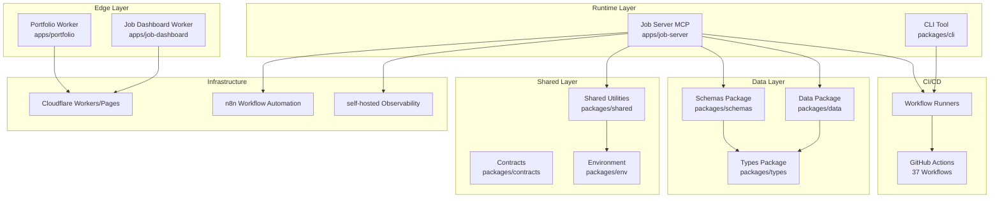

# Resume Portfolio Monorepo

# 이력서 포트폴리오 모노레포

---

[](https://github.com/qodo-ai/pr-agent/actions/workflows/ci.yml)
[](https://github.com/qodo-ai/pr-agent/actions/workflows/release.yml)
[](LICENSE)
[](https://nodejs.org/)
[](https://workers.cloudflare.com/)
[](https://github.com/qodo-ai/pr-agent/blob/master/CHANGELOG.md)

**Version:** 1.40.11

---

# Overview

**Resume** is a monorepo encompassing a Cloudflare Worker-powered portfolio site, Wanted/JobKorea recruitment automation, single source of truth (SSoT) resume data, and self-hosted observability infrastructure. It consolidates edge computing, job application workflows, and data management into a unified development platform.

**Key Capabilities:**
- Edge-deployed portfolio worker with sub-ms latency
- MCP-based job automation for Wanted and JobKorea platforms
- Canonical SSoT resume data with Zod runtime validation
- Self-hosted monitoring with Cloudflare dashboard integration

---

# 한국어 (Korean)

## 개요

**Resume**는 Cloudflare Worker 기반 포트폴리오 사이트, Wanted/JobKorea 채용 자동화, 단일 진실 공급원(SSoT) 이력서 데이터, 자체 호스팅 감시 인프라를 통합한 모노레포입니다. 이 프로젝트는 엣지 컴퓨팅, 채용 워크플로우, 데이터 관리를 통합 개발 플랫폼으로 결합합니다.

## 기술 스택

| 계층 | 기술 |
|------|------|
| **런타임** | Node.js ≥22, Cloudflare Workers |
| **언어** | JavaScript/TypeScript, Go, Python |
| **패키지 관리** | npm workspaces (monorepo) |
| **검증** | Zod (스키마), Jest (테스트), Playwright (E2E) |
| **인프라** | Cloudflare Workers/Pages, 자체 감시 |
| **자동화** | GitHub Actions (37개 워크플로우) |

## 앱 (`apps/`)

| 앱 | 설명 |
|----|------|
| `portfolio/` | Cloudflare Workers 기반 공개 엣지 포트폴리오 |
| `job-server/` | Wanted/JobKorea 채용 자동화 MCP 런타임 |
| `job-dashboard/` | 대시보드 API 및 워크플로우 핸들러 |

## 패키지 (`packages/`)

| 패키지 | 설명 |
|--------|------|
| `cli/` | resume CLI 도구 |
| `env/` | 환경 검증 및 타입 세이프 시크릿 |
| `data/` | SSoT 이력서 및 JSON 스키마 |
| `shared/` | 에러, 로거, 리트라이, 암호화, 레이트 리밋, 인증, 브라우저, 클라이언트 유틸리티 |
| `types/` | 표준 JSDoc/TS 타입 정의 (런타임 의존성 없음) |
| `schemas/` | 런타임 Zod 검증 스키마 |
| `contracts/` | OpenAPI 스펙 + Cloudflare Worker Env 인터페이스 |

---

# Features

## 주요 기능

### Edge Portfolio Worker
- Cloudflare Workers에 배포된 서버리스 포트폴리오
- 서브 밀리초 응답 지연
- 자동 생성된 엣지 번들

### Job Automation (MCP)
- Wanted 및 JobKorea 플랫폼용 MCP 서버
- 자동화된 잡 스크래핑 및 지원
- 제안서 검토 및 동기화 CLI

### SSoT Data Management
- 중앙 집중식 이력서 데이터 저장소
- Zod 스키마 기반 런타임 검증
- JSON 스키마 정의

### Observability
- 자체 호스팅 모니터링 대시보드
- Cloudflare 대시보드 연동
- n8n 기반 워크플로우 자동화

---

# Architecture



## Repository Structure

```
/
├── AGENTS.md
├── CHANGELOG.md
├── CONTRIBUTING.md
├── Dockerfile
├── LICENSE
├── OWNERS
├── README.md
├── docker-compose.yml
├── eslint.config.cjs
├── jest.config.cjs
├── lychee.toml
├── package-lock.json
├── package.json
├── playwright.config.js
├── redocly.yaml
├── tsconfig.base.json
├── tsconfig.json
├── wrangler.jsonc
├── apps/
│   ├── portfolio/
│   │   └── package.json
│   ├── job-server/
│   │   └── package.json
│   └── job-dashboard/
│       └── package.json
├── packages/
│   ├── cli/
│   │   ├── package.json
│   │   └── src/
│   ├── env/
│   │   ├── package.json
│   │   └── src/
│   ├── data/
│   │   └── package.json
│   ├── shared/
│   │   ├── package.json
│   │   └── src/
│   ├── types/
│   │   ├── package.json
│   │   └── src/
│   ├── schemas/
│   │   ├── package.json
│   │   └── src/
│   └── contracts/
│       ├── package.json
│       ├── openapi.yaml
│       └── src/
├── tools/
│   └── scripts/
│       ├── build/
│       ├── enrichment/
│       ├── sync/
│       └── utils/
├── tests/
├── infrastructure/
├── docs/
├── supabase/
└── .github/
    ├── workflows/
    └── security/
```

---

# Automation Inventory

## GitHub Actions Workflows

This project uses **37 GitHub Actions workflows** for CI/CD, automation, and maintenance:

### Core CI Workflows

| Workflow File | Purpose |
|---------------|---------|
| `01_branch-to-pr.yml` | Branch to PR creation automation |
| `02_issue-to-branch.yml` | Issue to branch automation |
| `03_pr-checks.yml` | PR validation and checks |
| `04_actionlint.yml` | GitHub Actions YAML linting |
| `05_gitleaks.yml` | Secrets scanning |
| `06_codeql.yml` | Code quality analysis |
| `07_dependency-review.yml` | Dependency security review |
| `08_scorecard.yml` | OpenSSF scorecard |
| `09_semantic-pr.yml` | Semantic PR enforcement |
| `10_pr-review.yml` | Automated PR review (security/) |
| `11_pr-review.yml` | PR review automation (security/) |

### Automation Workflows

| Workflow File | Purpose |
|---------------|---------|
| `12_dependabot-auto-merge.yml` | Dependabot PR auto-merge |
| `13_pr-auto-merge.yml` | General PR auto-merge |
| `14_bot-auto-fix.yml` | Bot-powered auto-fixes |
| `15_merged-pr-cleanup.yml` | Post-merge cleanup |
| `18_issue-management.yml` | Issue state management |
| `19_issue-backfill.yml` | Issue data backfill |
| `20_readme-gen.yml` | README generation |
| `21_docs-sync.yml` | Documentation sync |
| `42_reusable-docs-sync.yml` | Reusable docs sync |

### Release Workflows

| Workflow File | Purpose |
|---------------|---------|
| `24_release-notes.yml` | Release notes generation |
| `25_release-publish.yml` | Release publication |
| `release.yml` | Main release workflow |
| `auto-merge.yml` | Auto-merge trigger |

### Health & Monitoring Workflows

| Workflow File | Purpose |
|---------------|---------|
| `29_downstream-health-check.yml` | Downstream service health |
| `37_ci-failure-issues.yml` | CI failure issue creation |
| `60_ci-auto-heal.yml` | CI self-healing automation |

### Utility Workflows

| Workflow File | Purpose |
|---------------|---------|
| `auto-sync-data.yml` | Data synchronization |
| `ci.yml` | Main CI workflow |
| `delete-standalone-job-worker.yml` | Worker cleanup |
| `labeler.yml` | PR label management |
| `post-deploy-verify.yml` | Post-deployment verification |
| `provision-queues.yml` | Queue provisioning |
| `welcome.yml` | New contributor welcome |
| `43_reusable-issue-management.yml` | Reusable issue management |
| `44_reusable-pr-checks.yml` | Reusable PR checks |
| `45_reusable-gitleaks.yml` | Reusable secrets scanning |

## External Integrations

| Service | Purpose |
|---------|---------|
| **qodo-ai/pr-agent** | PR review automation via `10_pr-review.yml` |
| **cliproxy.jclee.me** | CLI Proxy API endpoint for AI operations |
| **bot.jclee.me** | Bot automation endpoint |

---

# Quick Start

## Prerequisites

- Node.js ≥22
- npm ≥10
- Docker (for containerized development)
- Git

## Installation

```bash
# Clone the repository
git clone https://github.com/qodo-ai/pr-agent.git
cd resume

# Install all workspace dependencies
npm install

# Verify installation
npm run typecheck
```

## Development Setup

### Local Portfolio Development

```bash
# Sync SSoT data before building
npm run sync:data

# Build portfolio worker
npm run build:portfolio

# Run type checking
npm run typecheck

# Run tests
npm run test
```

### Job Server Development

```bash
# Start job server with Docker
docker-compose up -d

# Check health
curl http://localhost:3000/health
```

### Running CLI Commands

```bash
# Deploy operations
npm run deploy --workspace=@resume/cli

# Database operations
npm run db --workspace=@resume/cli

# Verification
npm run verify --workspace=@resume/cli
```

---

# Local Development

## Environment Variables

Create a `.env` file with required environment variables:

```env
NODE_ENV=development
PORT=3000
# Add required secrets for job automation
```

## Docker Development

```bash
# Build the MCP server container
docker-compose build

# Start all services
docker-compose up

# View logs
docker-compose logs -f

# Stop services
docker-compose down
```

## Testing

```bash
# Run all tests
npm run test

# Run unit tests
npm run test:node

# Run E2E tests
npm run test:e2e

# Run with coverage
npm run test -- --coverage
```

## Linting

```bash
# Run ESLint
npm run lint

# Fix auto-fixable issues
npm run lint -- --fix
```

---

# Commands Reference

## Build Commands

| Command | Description |
|---------|-------------|
| `npm run build` | Sync SSoT data and build portfolio worker |
| `npm run build:portfolio` | Build portfolio worker with data sync |
| `npm run build:full` | Full build including CLI |
| `npm run build:all` | Build all workspaces |

## Sync Commands

| Command | Description |
|---------|-------------|
| `npm run sync:data` | Sync resume data from SSoT |
| `npm run sync:pdf` | Generate PDF (Go) |
| `npm run sync:pptx` | Generate PPTX (Python) |
| `npm run sync:all` | Sync all formats (data, PDF, PPTX) |
| `npm run sync:proposals` | Sync job proposals |

## Enrichment Commands

| Command | Description |
|---------|-------------|
| `npm run enrich:github` | Enrich with GitHub data (Go) |
| `npm run enrich:skills` | Enrich with skills data (Go) |
| `npm run enrich:ai` | AI-based enrichment (Go) |
| `npm run enrich:all` | Run all enrichment scripts |

## Automation Commands

| Command | Description |
|---------|-------------|
| `npm run automate:ssot` | Sync data, build, typecheck, test |
| `npm run automate:full` | Full automation pipeline |

## CI/CD Commands

```bash
# Validate Cloudflare native build
go run ./tools/ci/validate-cloudflare-native.go

# Run health check
npm run health-check

# Deploy with verification
npm run deploy --workspace=@resume/cli
```

---

# Contribution Guide

## Contributing

Contributions are welcome! Please read our [CONTRIBUTING.md](CONTRIBUTING.md) for guidelines.

## Development Workflow

1. **Fork** the repository
2. **Create** a feature branch from `master`
3. **Make** your changes with tests
4. **Run** `npm run automate:ssot` to validate
5. **Submit** a Pull Request

## Code Standards

- Run `npm run lint` before committing
- Ensure `npm run typecheck` passes
- All new features require tests
- Follow the monorepo workspace structure

## Commit Convention

This project uses semantic PR titles enforced by `09_semantic-pr.yml`.

Format: `<type>(<scope>): <description>`

Types: `feat`, `fix`, `docs`, `style`, `refactor`, `test`, `chore`

## Release Process

Releases follow a biweekly schedule managed by `24_release-notes.yml` and `25_release-publish.yml`:

1. Features merged to `master`
2. `20_readme-gen.yml` regenerates documentation
3. `24_release-notes.yml` generates changelog
4. `25_release-publish.yml` publishes release

---

# License

MIT License - see [LICENSE](LICENSE) file for details.

---

# Support

- **Documentation:** [docs/](docs/)
- **Changelog:** [CHANGELOG.md](CHANGELOG.md)
- **Agents.md:** [AGENTS.md](AGENTS.md) for project knowledge base
- **Workflow Issues:** GitHub Actions workflows located in [.github/workflows/](.github/workflows/)

---

*Generated by README-gen (minimax-m2.7 with gpt-5.5 fallback via CLIProxyAPI)*