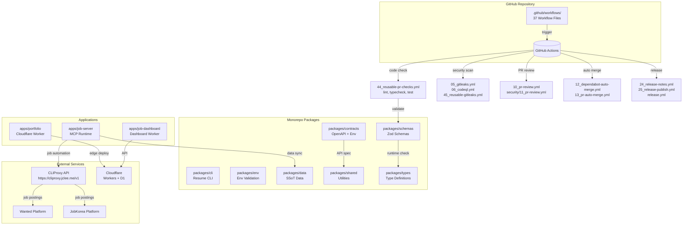

# Resume Portfolio Monorepo

# 이력서 포트폴리오 모노레포

---

[](https://github.com/qodo-ai/pr-agent/actions/workflows/ci.yml)
[](https://github.com/qodo-ai/pr-agent/actions/workflows/release.yml)
[](LICENSE)
[](https://nodejs.org/)
[](https://workers.cloudflare.com/)
[](https://github.com/qodo-ai/pr-agent/blob/master/CHANGELOG.md)

**Version:** 1.40.11

---

## Overview / 개요

**Resume** is a monorepo encompassing a Cloudflare Worker-powered portfolio site, Wanted/JobKorea recruitment automation, single source of truth (SSoT) resume data, and self-hosted observability infrastructure. It consolidates edge computing, job application workflows, and data management into a unified development platform.

**Resume**는 Cloudflare Worker 기반 포트폴리오 사이트, Wanted/JobKorea 채용 자동화, 단일 진실 공급원(SSoT) 이력서 데이터, 자체 호스팅 감시 인프라를 통합한 모노레포입니다. 이 프로젝트는 엣지 컴퓨팅, 채용 워크플로우, 데이터 관리를 통합 개발 플랫폼으로 결합합니다.

---

## Features / 주요 기능

| Feature | Description |
|---------|-------------|
| **Edge Portfolio Worker** | Cloudflare Workers deployed portfolio with sub-ms latency worldwide |
| **Job Automation (MCP)** | MCP-based automation for Wanted and JobKorea platforms via CLIProxy API (`https://cliproxy.jclee.me/v1`) |
| **SSoT Resume Data** | Authoritative resume content in `packages/data/` with Zod runtime validation |
| **Self-Hosted Observability** | Infrastructure monitoring with Cloudflare dashboard integration |
| **Multi-Package Monorepo** | 8 shared packages: `cli`, `env`, `data`, `shared`, `types`, `schemas`, `contracts`, `env` |
| **Comprehensive CI/CD** | 37 GitHub Actions workflows covering PR checks, releases, security, and automation |

---

## Architecture / 아키텍처



---

## Repository Structure / 저장소 구조

```
resume/
├── apps/
│   ├── portfolio/           # Cloudflare Worker portfolio site
│   ├── job-server/          # MCP/job automation runtime
│   └── job-dashboard/       # Dashboard worker + workflows
├── packages/
│   ├── cli/                 # resume CLI
│   ├── env/                 # Environment validation + type-safe secrets
│   ├── data/                # SSoT resumes and JSON schema
│   ├── shared/              # Cross-package utilities (errors, retry, crypto)
│   ├── types/               # Canonical JSDoc/TS type definitions
│   ├── schemas/             # Runtime Zod validation schemas
│   └── contracts/           # OpenAPI spec + Cloudflare Worker Env interface
├── tools/
│   ├── scripts/             # Build, deploy, verification scripts (Go + JS)
│   └── ci/                  # CI validation scripts
├── tests/                   # Jest, Playwright E2E
├── infrastructure/          # Cloudflare, monitoring, n8n configs
├── docs/                    # Guides, ADRs, architecture docs
├── .github/
│   ├── workflows/           # 37 GitHub Actions workflow files
│   └── security/            # Security-specific workflows
├── Dockerfile               # Multi-stage container build
├── docker-compose.yml       # Local MCP server container
├── package.json             # Workspace root
└── package-lock.json
```

---

## Automation Inventory / 자동화 인벤토리

### GitHub Actions Workflows (37 total)

#### Pull Request & Merge Automation

| Workflow File | Purpose |
|--------------|---------|
| `01_branch-to-pr.yml` | Create PR from feature branch |
| `03_pr-checks.yml` | PR validation: lint, typecheck, test |
| `09_semantic-pr.yml` | Enforce semantic commit format |
| `10_pr-review.yml` | AI-powered PR review via qodo-ai/pr-agent |
| `security/11_pr-review.yml` | Security-focused PR review |
| `13_pr-auto-merge.yml` | Auto-merge approved PRs |
| `14_bot-auto-fix.yml` | Auto-fix PR linting issues |
| `15_merged-pr-cleanup.yml` | Cleanup after PR merge |

#### Dependency Management

| Workflow File | Purpose |
|--------------|---------|
| `07_dependency-review.yml` | Dependency vulnerability review |
| `08_scorecard.yml` | OpenSSF Scorecard security assessment |
| `12_dependabot-auto-merge.yml` | Auto-merge Dependabot PRs |

#### Issue Management

| Workflow File | Purpose |
|--------------|---------|
| `02_issue-to-branch.yml` | Create branch from issue |
| `18_issue-management.yml` | Issue labeling and triage |
| `19_issue-backfill.yml` | Issue content backfill |
| `43_reusable-issue-management.yml` | Reusable issue management logic |

#### Documentation

| Workflow File | Purpose |
|--------------|---------|
| `20_readme-gen.yml` | Auto-generate README |
| `21_docs-sync.yml` | Sync documentation changes |
| `42_reusable-docs-sync.yml` | Reusable docs sync logic |

#### Release & Publishing

| Workflow File | Purpose |
|--------------|---------|
| `24_release-notes.yml` | Generate release notes |
| `25_release-publish.yml` | Publish release artifacts |
| `release.yml` | Main release workflow |

#### Security & Compliance

| Workflow File | Purpose |
|--------------|---------|
| `04_actionlint.yml` | GitHub Actions workflow linting |
| `05_gitleaks.yml` | Secret scanning |
| `06_codeql.yml` | CodeQL static analysis |
| `45_reusable-gitleaks.yml` | Reusable secret scanning |

#### CI/CD Operations

| Workflow File | Purpose |
|--------------|---------|
| `ci.yml` | Main CI pipeline |
| `auto-merge.yml` | Generic auto-merge |
| `auto-sync-data.yml` | Auto-sync SSoT data |
| `delete-standalone-job-worker.yml` | Cleanup stale workers |
| `labeler.yml` | PR/issue label management |
| `post-deploy-verify.yml` | Post-deployment verification |
| `provision-queues.yml` | Queue provisioning |
| `welcome.yml` | New contributor welcome |
| `29_downstream-health-check.yml` | Downstream service health |
| `37_ci-failure-issues.yml` | Create issues for CI failures |
| `60_ci-auto-heal.yml` | Auto-heal broken CI |

### External Tools & Services

| Service | Endpoint | Purpose |
|---------|----------|---------|
| **CLIProxy API** | `https://cliproxy.jclee.me/v1` | MCP proxy for job platform automation |
| **Bot Service** | `https://bot.jclee.me` | Bot operations |
| **qodo-ai/pr-agent** | GitHub Marketplace | AI-powered PR review and automation |

---

## Quick Start / 빠른 시작

### Prerequisites

- Node.js ≥ 22
- npm ≥ 10
- Docker & Docker Compose (for local MCP server)

### Installation

```bash
# Clone repository
git clone https://github.com/qodo-ai/pr-agent.git
cd pr-agent

# Install dependencies (monorepo workspace)
npm install

# Verify installation
npm run typecheck
```

### Running Locally

```bash
# Start MCP server container
docker compose up -d

# Verify health
curl http://localhost:3000/health

# View logs
docker compose logs -f mcp-server
```

---

## Local Development / 로컬 개발

### Development Workflow

```bash
# 1. Sync SSoT resume data
npm run sync:data

# 2. Run linting
npm run lint

# 3. Run type checking
npm run typecheck

# 4. Run tests
npm test

# 5. Build portfolio
npm run build:portfolio

# 6. Full build (data + PDF + PPTX)
npm run sync:all
npm run build:full
```

### Workspace Scripts

| Command | Description |
|---------|-------------|
| `npm run sync:data` | Sync SSoT resume JSON data |
| `npm run sync:pdf` | Generate PDF resume (Go) |
| `npm run sync:pptx` | Generate PPTX presentation (Python) |
| `npm run sync:all` | Sync data + PDF + PPTX |
| `npm run enrich:github` | Enrich data with GitHub info |
| `npm run enrich:skills` | Enrich with skills data |
| `npm run enrich:ai` | AI-powered data enrichment |
| `npm run enrich:all` | Run all enrichment scripts |
| `npm run automate:ssot` | Full SSoT automation pipeline |
| `npm run automate:full` | Complete build + validation pipeline |
| `npm run build` | Build portfolio worker |
| `npm run lint` | Run ESLint |
| `npm run typecheck` | Run TypeScript type checking |
| `npm test` | Run Jest tests |
| `npm run test:e2e` | Run Playwright E2E tests |

### Container Deployment

```bash
# Build and run MCP server
docker compose up --build

# Run in detached mode
docker compose up -d

# Stop services
docker compose down

# Rebuild from scratch
docker compose down --rmi local
```

---

## Commands Reference / 명령어 참조

### Build Commands

| Command | Workspace | Description |
|---------|-----------|-------------|
| `npm run build` | root | Build portfolio worker |
| `npm run build:portfolio` | apps/portfolio | Build portfolio with data sync |
| `npm run build:full` | root | Full build including CLI |
| `npm run cli:build` | packages/cli | Build CLI binary |

### Sync Commands

| Command | Description |
|---------|-------------|
| `npm run sync:data` | Sync resume JSON to SSoT |
| `npm run sync:pdf` | Generate PDF via Go |
| `npm run sync:pptx` | Generate PPTX via Python |
| `npm run sync:all` | Sync all formats |
| `npm run sync:proposals` | Sync job proposals |

### Enrichment Commands

| Command | Description |
|---------|-------------|
| `npm run enrich:github` | GitHub data enrichment |
| `npm run enrich:skills` | Skills data enrichment |
| `npm run enrich:ai` | AI-powered enrichment |
| `npm run enrich:all` | All enrichment |

### Automation Commands

| Command | Description |
|---------|-------------|
| `npm run automate:ssot` | Data sync → PDF → build → typecheck → test |
| `npm run automate:full` | Full pipeline with lint and validation |

---

## Contribution Guide / 기여 가이드

### Branch Strategy

1. **Create issue first** — use `02_issue-to-branch.yml` workflow
2. **Create feature branch** — naming: `feat/`, `fix/`, `chore/`, `docs/`
3. **Open PR** — use `01_branch-to-pr.yml` workflow
4. **Address review** — `10_pr-review.yml` and `security/11_pr-review.yml` will review
5. **Auto-merge** — `13_pr-auto-merge.yml` merges after approval

### Commit Convention

Follow [Conventional Commits](https://www.conventionalcommits.org/):

```
feat: add new job platform support
fix: correct resume data parsing
docs: update API documentation
chore: update dependencies
refactor: simplify retry logic
test: add integration tests for MCP client
```

Use `09_semantic-pr.yml` to enforce semantic commits.

### Pull Request Checklist

- [ ] Passes `03_pr-checks.yml` (lint, typecheck, tests)
- [ ] Passes security scans (`05_gitleaks.yml`, `06_codeql.yml`)
- [ ] Has appropriate labels (use `labeler.yml`)
- [ ] Breaking changes documented
- [ ] CHANGELOG.md updated

### Security Considerations

- **Secret Scanning** — `05_gitleaks.yml` runs on all PRs
- **Dependency Review** — `07_dependency-review.yml` checks for vulnerabilities
- **CodeQL** — `06_codeql.yml` performs static analysis
- **OpenSSF Scorecard** — `08_scorecard.yml` monitors security posture

### Reporting Issues

- Use issue templates (managed by `18_issue-management.yml`)
- Tag appropriately for triage
- For security issues, follow responsible disclosure

---

## License

MIT License — see [LICENSE](LICENSE) file for details.

---

## External Resources

| Resource | Link |
|----------|------|
| CLIProxy API | `https://cliproxy.jclee.me/v1` |
| Bot Service | `https://bot.jclee.me` |
| PR-Agent (qodo-ai) | [GitHub Marketplace](https://github.com/marketplace/pr-agent) |
| Cloudflare Workers | [Documentation](https://developers.cloudflare.com/workers/) |