# Resume Portfolio Monorepo

# 이력서 포트폴리오 모노레포

[](package.json)
[](https://nodejs.org/)
[](https://workers.cloudflare.com/)
[](LICENSE)
[](Dockerfile)
[](README.md)

---

## Overview / 개요

`resume` is a private resume portfolio monorepo that combines a Cloudflare Worker-based portfolio surface, job-application automation, structured resume/application assets, and a dashboard Worker for operational workflows.

`resume`는 Cloudflare Worker 기반 포트폴리오, 채용 지원 자동화, 구조화된 이력서 및 지원 자료, 운영 워크플로우용 대시보드 Worker를 함께 관리하는 private 모노레포입니다.

The repository is designed as a single operational workspace for:

- Portfolio and resume publishing
- Job-application tracking and automation
- Application-specific cover letters and resumes
- Dashboard APIs for applications, auth, health, stats, workflows, and automation
- CI/CD, security scanning, PR review automation, release automation, and maintenance workflows
- Containerized runtime for the job automation server

이 저장소는 다음 목적을 위한 단일 운영 워크스페이스입니다.

- 포트폴리오 및 이력서 게시
- 채용 지원 추적 및 자동화
- 지원 회사별 자기소개서 및 이력서 관리
- 지원 현황, 인증, 헬스체크, 통계, 워크플로우, 자동화 API 제공
- CI/CD, 보안 스캔, PR 리뷰 자동화, 릴리스 자동화, 유지보수 자동화
- 채용 자동화 서버의 컨테이너 기반 실행

Package version: `1.40.11`

---

## Features / 주요 기능

| Area | English | 한국어 |
| --- | --- | --- |
| Portfolio monorepo | Central workspace for resume, portfolio, and application materials | 이력서, 포트폴리오, 지원 자료를 한 곳에서 관리 |
| Job dashboard | Cloudflare Worker-style dashboard application under `apps/job-dashboard` | `apps/job-dashboard` 기반 채용 대시보드 |
| Job automation runtime | Dockerized Node.js runtime exposing a `/health` endpoint on port `3000` | `3000` 포트의 `/health` 엔드포인트를 제공하는 Docker 기반 Node.js 런타임 |
| Application assets | Company/role-specific resumes, cover letters, guides, and previews | 회사/직무별 이력서, 자기소개서, 지원 가이드, 미리보기 자료 |
| TA slide automation | Python/PPTX utilities and generated presentation outputs under `ta/` | `ta/` 디렉터리의 Python/PPTX 기반 발표자료 자동화 |
| CI and quality gates | GitHub Actions for CI, linting, security, dependency review, CodeQL, Scorecard, PR checks | CI, 린트, 보안, 의존성 검토, CodeQL, Scorecard, PR 검증 자동화 |
| PR automation | PR review, semantic PR validation, auto-fix, auto-merge, cleanup, Dependabot merge support | PR 리뷰, Semantic PR 검증, 자동 수정, 자동 병합, 정리, Dependabot 병합 지원 |
| Release automation | Release notes, release publish, and release workflow orchestration | 릴리스 노트, 릴리스 게시, 릴리스 워크플로우 자동화 |
| Documentation automation | README generation and docs synchronization workflows | README 생성 및 문서 동기화 자동화 |
| Observability hooks | Downstream health check, post-deploy verification, sanity workflows | 다운스트림 헬스체크, 배포 후 검증, sanity 워크플로우 |

---

## Architecture / 아키텍처

```mermaid
flowchart TD
  Dev["Developer<br/>Local Workspace"] --> NPM["npm workspace commands<br/>package.json scripts"]
  Dev --> Docker["Docker / Docker Compose<br/>resume-mcp-server"]

  NPM --> DataSync["SSoT / Resume Data Sync<br/>sync:data"]
  NPM --> BuildSync["Generated Assets<br/>sync:pdf / sync:pptx / sync:all"]
  NPM --> Enrich["Enrichment Jobs<br/>enrich:github / enrich:skills / enrich:ai"]

  Docker --> JobServer["Job Automation Runtime<br/>Node.js 22 Alpine<br/>/health on port 3000"]
  JobServer --> Volume["job_automation_data<br/>persistent local volume"]
  JobServer --> CLIProxy["CLIProxy API<br/>https://cliproxy.jclee.me/v1"]
  JobServer --> HomelabHost["&lt;homelab-host&gt;:8317<br/>automation bridge"]

  GitHub["GitHub Actions<br/>.github/workflows"] --> CI["CI / Checks<br/>ci.yml / 03_pr-checks.yml / 44_reusable-pr-checks.yml"]
  GitHub --> Security["Security Gates<br/>05_gitleaks.yml / 06_codeql.yml / 07_dependency-review.yml / 08_scorecard.yml"]
  GitHub --> PRBot["PR Automation<br/>10_pr-review.yml / 11_security-pr-review.yml / 13_pr-auto-merge.yml"]
  GitHub --> Docs["Docs Automation<br/>20_readme-gen.yml / 21_docs-sync.yml / 42_reusable-docs-sync.yml"]
  GitHub --> Release["Release Automation<br/>24_release-notes.yml / 25_release-publish.yml / release.yml"]

  Apps["apps/job-dashboard"] --> Routes["Routes<br/>admin / applications / auth / automation / health / stats / workflows"]
  Apps --> Handlers["Handlers<br/>applications / auth / auto-apply-webhook-handler"]
  Apps --> Middleware["Middleware<br/>cors / csrf / rate-limit"]

  Applications["applications/"] --> AppDocs["Role-specific resumes<br/>cover letters<br/>application guides"]
  TA["ta/"] --> PPTX["PPTX inspection<br/>visual improvement<br/>verification reports"]

  HomelabELK["&lt;homelab-elk&gt;<br/>observability target"] -.-> JobServer
```



### Architecture notes / 아키텍처 메모

- The Docker runtime is built from `node:22-alpine`.
- The container entrypoint runs `node src/server/index.js` from `apps/job-server`.
- The runtime exposes `PORT=3000` and includes a Docker healthcheck against `http://127.0.0.1:3000/health`.
- `docker-compose.yml` defines the `resume-mcp-server` service and persists runtime data in `job_automation_data`.
- CLIProxy-compatible automation uses the public endpoint `https://cliproxy.jclee.me/v1`.
- Homelab endpoints are intentionally documented with placeholders such as `<homelab-host>` and `<homelab-elk>`.

---

## Repository Structure / 저장소 구조

Actual top-level layout reflected from this repository snapshot:

```text
/
├── AGENTS.md
├── CHANGELOG.md
├── CONTRIBUTING.md
├── Dockerfile
├── LICENSE
├── OWNERS
├── README.md
├── docker-compose.yml
├── eslint.config.cjs
├── jest.config.cjs
├── lychee.toml
├── package-lock.json
├── package.json
├── playwright.config.js
├── redocly.yaml
├── tsconfig.base.json
├── tsconfig.json
├── wrangler.jsonc
├── ta/
│   ├── AGENTS.md
│   ├── improve_visual.py
│   ├── inspect.py
│   ├── verify.py
│   ├── *.pptx
│   └── output/
├── applications/
│   ├── airpremia-security-2026/
│   ├── infrastructure-architecture-2026/
│   ├── coupang-fintech-sre-2026/
│   ├── cloudflare-one-se-2026/
│   └── gitlab-apac-security-2026/
└── apps/
    └── job-dashboard/
        ├── AGENTS.md
        ├── API_REFERENCE.md
        ├── DEPLOYMENT_GUIDE.md
        ├── DEVELOPMENT_GUIDE.md
        ├── DIAGRAMS.md
        ├── OWNERS
        ├── README.md
        ├── SECRETS.md
        ├── migrate-json-to-d1.cjs
        ├── migration-data.sql
        ├── package.json
        ├── schema.sql
        ├── tsconfig.json
        ├── migrations/
        └── src/
```

---

## Automation Inventory / 자동화 인벤토리

### GitHub Actions workflows / GitHub Actions 워크플로우

This repository currently declares **36** workflow files.

현재 저장소에는 **36개**의 GitHub Actions 워크플로우 파일이 정의되어 있습니다.

| File | Purpose |
| --- | --- |
| `01_branch-to-pr.yml` | Branch-to-PR automation |
| `02_issue-to-branch.yml` | Issue-to-branch automation |
| `03_pr-checks.yml` | Pull request checks |
| `04_actionlint.yml` | GitHub Actions workflow linting |
| `05_gitleaks.yml` | Secret scanning with Gitleaks |
| `06_codeql.yml` | CodeQL security analysis |
| `07_dependency-review.yml` | Dependency review gate |
| `08_scorecard.yml` | OpenSSF Scorecard checks |
| `09_semantic-pr.yml` | Semantic pull request validation |
| `10_pr-review.yml` | Automated PR review |
| `11_security-pr-review.yml` | Security-focused PR review |
| `12_dependabot-auto-merge.yml` | Dependabot auto-merge automation |
| `13_pr-auto-merge.yml` | General PR auto-merge automation |
| `14_bot-auto-fix.yml` | Bot-driven auto-fix workflow |
| `15_merged-pr-cleanup.yml` | Cleanup after merged PRs |
| `19_issue-backfill.yml` | Issue metadata/backfill automation |
| `20_readme-gen.yml` | README generation workflow |
| `21_docs-sync.yml` | Documentation synchronization |
| `24_release-notes.yml` | Release notes generation |
| `25_release-publish.yml` | Release publishing |
| `29_downstream-health-check.yml` | Downstream service health check |
| `37_ci-failure-issues.yml` | CI failure issue creation/tracking |
| `42_reusable-docs-sync.yml` | Reusable docs sync workflow |
| `44_reusable-pr-checks.yml` | Reusable PR checks workflow |
| `45_reusable-gitleaks.yml` | Reusable Gitleaks workflow |
| `60_ci-auto-heal.yml` | CI auto-healing automation |
| `91_issue-classification.yml` | Issue classification automation |
| `auto-merge.yml` | Auto-merge workflow |
| `auto-sync-data.yml` | Automated data synchronization |
| `ci.yml` | Main CI workflow |
| `delete-standalone-job-worker.yml` | Standalone job worker cleanup/deletion |
| `labeler.yml` | Issue/PR labeling automation |
| `post-deploy-verify.yml` | Post-deployment verification |
| `provision-queues.yml` | Queue provisioning automation |
| `release.yml` | Release orchestration |
| `welcome.yml` | New contributor welcome automation |

### Automation tools / 자동화 도구

| Tool | Role |
| --- | --- |
| GitHub Actions | CI/CD, PR automation, release automation, documentation automation |
| Qodo PR-Agent | AI-assisted pull request review automation |
| Gitleaks | Secret detection |
| CodeQL | Static security analysis |
| Dependency Review | Dependency risk checks for pull requests |
| OpenSSF Scorecard | Repository security posture checks |
| actionlint | GitHub Actions workflow validation |
| npm workspaces | Monorepo package orchestration |
| Docker | Containerized runtime packaging |
| Docker Compose | Local service orchestration |
| Wrangler | Cloudflare Worker configuration and deployment support |
| Jest | Node.js unit/integration test runner |
| Playwright | Browser/E2E testing |
| ESLint | JavaScript/TypeScript linting |
| Redocly | OpenAPI documentation/spec validation |
| Lychee | Link checking |
| Python PPTX utilities | TA slide inspection, visual improvement, verification |
| CLIProxy API | External automation API endpoint at `https://cliproxy.jclee.me/v1` |

### Go automation tools / Go 자동화 도구

The provided automation inventory reports **0** standalone Go automation tools.

제공된 자동화 인벤토리 기준으로 독립 실행형 Go 자동화 도구는 **0개**입니다.

However, several package scripts call Go-based utilities from the broader workspace, such as PDF generation, OnePassword helpers, proposal application, and enrichment commands. Treat those scripts as workspace commands and verify their source paths before modifying or invoking them.

다만 일부 `package.json` 스크립트는 PDF 생성, OnePassword 헬퍼, 제안 적용, enrichment 작업 등을 위해 Go 기반 유틸리티를 호출합니다. 해당 스크립트는 워크스페이스 명령으로 취급하고, 실행 또는 수정 전 실제 소스 경로를 확인해야 합니다.

---

## Quick Start / 빠른 시작

### Prerequisites / 사전 요구사항

- Node.js `22` or newer
- npm compatible with the checked-in `package-lock.json`
- Docker and Docker Compose
- Python 3 for `ta/` slide utilities
- Cloudflare Wrangler, if deploying Worker-based components
- Optional local tools:
  - `exiftool` for image metadata stripping
  - Go toolchain for scripts that invoke `go run`

### Install dependencies / 의존성 설치

```bash
npm ci
```

### Run data synchronization / 데이터 동기화 실행

```bash
npm run sync:data
```

### Generate all derived resume assets / 파생 이력서 산출물 생성

```bash
npm run sync:all
```

This runs:

```bash
npm run sync:data
npm run sync:pdf
npm run sync:pptx
```

### Run the Dockerized job automation runtime / Docker 기반 채용 자동화 런타임 실행

Create a local `.env` file first.

먼저 로컬 `.env` 파일을 생성합니다.

```bash
docker compose up --build
```

The service exposes:

```text
http://localhost:3000/health
```

Healthcheck behavior is also defined in both `Dockerfile` and `docker-compose.yml`.

헬스체크는 `Dockerfile`과 `docker-compose.yml` 양쪽에 정의되어 있습니다.

### Stop local containers / 로컬 컨테이너 중지

```bash
docker compose down
```

To remove the persistent local volume:

```bash
docker compose down -v
```

---

## Local Development / 로컬 개발

### Root workspace / 루트 워크스페이스

Use the root `package.json` as the command entrypoint.

루트 `package.json`을 명령 실행 진입점으로 사용합니다.

```bash
npm ci
npm run sync:data
npm run automate:ssot
```

### Job dashboard / 채용 대시보드

The dashboard application lives under:

```text
apps/job-dashboard/
```

Important files:

| Path | Purpose |
| --- | --- |
| `apps/job-dashboard/README.md` | Dashboard-specific overview |
| `apps/job-dashboard/API_REFERENCE.md` | API reference |
| `apps/job-dashboard/DEPLOYMENT_GUIDE.md` | Deployment guide |
| `apps/job-dashboard/DEVELOPMENT_GUIDE.md` | Development guide |
| `apps/job-dashboard/DIAGRAMS.md` | Architecture and flow diagrams |
| `apps/job-dashboard/SECRETS.md` | Secret handling documentation |
| `apps/job-dashboard/schema.sql` | Database schema |
| `apps/job-dashboard/migration-data.sql` | Migration data |
| `apps/job-dashboard/migrations/0002_add_approval_metadata.sql` | Approval metadata migration |

Important source areas:

| Path | Purpose |
| --- | --- |
| `apps/job-dashboard/src/index.js` | Worker/application entrypoint |
| `apps/job-dashboard/src/router.js` | Route registration |
| `apps/job-dashboard/src/queue-consumer.js` | Queue consumer |
| `apps/job-dashboard/src/middleware/cors.js` | CORS middleware |
| `apps/job-dashboard/src/middleware/csrf.js` | CSRF middleware |
| `apps/job-dashboard/src/middleware/rate-limit.test.js` | Rate-limit tests |
| `apps/job-dashboard/src/routes/admin.js` | Admin routes |
| `apps/job-dashboard/src/routes/applications.js` | Application routes |
| `apps/job-dashboard/src/routes/auth.js` | Auth routes |
| `apps/job-dashboard/src/routes/automation.js` | Automation routes |
| `apps/job-dashboard/src/routes/health.js` | Health routes |
| `apps/job-dashboard/src/routes/stats.js` | Stats routes |
| `apps/job-dashboard/src/routes/workflows.js` | Workflow routes |
| `apps/job-dashboard/src/handlers/applications.js` | Application handlers |
| `apps/job-dashboard/src/handlers/auth.js` | Auth handlers |
| `apps/job-dashboard/src/handlers/auto-apply-webhook-handler.js` | Auto-apply webhook handler |

### Application materials / 지원 자료

Company- and role-specific application materials are stored under `applications/`.

회사 및 직무별 지원 자료는 `applications/` 아래에 저장됩니다.

Examples:

| Directory | Contents |
| --- | --- |
| `applications/airpremia-security-2026/` | Signup gate image, application guide, cover letter |
| `applications/infrastructure-architecture-2026/` | Homelab infrastructure architecture document |
| `applications/coupang-fintech-sre-2026/` | Coupang Pay Fintech SRE resume and cover letter |
| `applications/cloudflare-one-se-2026/` | Cloudflare One SE resume, cover letter, interview Q&A, LinkedIn optimization, preview |
| `applications/gitlab-apac-security-2026/` | GitLab APAC infrastructure/security resume and cover letter |

### TA presentation utilities / TA 발표자료 유틸리티

The `ta/` directory contains PPTX inputs, Python utilities, and generated outputs.

`ta/` 디렉터리는 PPTX 입력 파일, Python 유틸리티, 생성 결과물을 포함합니다.

| File | Purpose |
| --- | --- |
| `ta/inspect.py` | Inspect presentation files |
| `ta/improve_visual.py` | Improve slide visuals |
| `ta/verify.py` | Verify generated PPTX outputs |
| `ta/output/verify_report_20260212.txt` | Verification report |

---

## Commands Reference / 명령어 레퍼런스

Commands below are taken from the visible root `package.json` scripts.

아래 명령어는 제공된 루트 `package.json` 스크립트 기준입니다.

### Asset and data synchronization / 자산 및 데이터 동기화

| Command | Description |
| --- | --- |
| `npm run strip-exif` | Removes EXIF metadata from portfolio images when `exiftool` is available |
| `npm run sync:data` | Synchronizes resume data using `tools/scripts/utils/sync-resume-data.js` |
| `npm run sync:pptx` | Generates PPTX assets using `tools/scripts/build/generate_shinhan_pptx.py` |
| `npm run sync:pdf` | Generates PDF assets through a Go-based PDF generator |
| `npm run sync:all` | Runs data, PDF, and PPTX synchronization |

### OnePassword helper scripts / OnePassword 헬퍼 스크립트

| Command | Description |
| --- | --- |
| `npm run op:run` | Runs the OnePassword helper |
| `npm run op:native:run` | Runs the native OnePassword helper |
| `npm run op:seed:resume` | Seeds resume-related OnePassword data |
| `npm run op:seed:sessions` | Seeds OnePassword session files |
| `npm run op:restore:sessions` | Restores OnePassword session files |

### Proposal and enrichment automation / 제안 및 enrichment 자동화

| Command | Description |
| --- | --- |
| `npm run sync:proposals` | Runs proposal review sync and applies proposals |
| `npm run enrich:github` | Runs GitHub enrichment |
| `npm run enrich:skills` | Runs skills enrichment |
| `npm run enrich:ai` | Runs AI enrichment |
| `npm run enrich:all` | Runs all enrichment commands |

### Composite automation / 복합 자동화

| Command | Description |
| --- | --- |
| `npm run automate:ssot` | Runs data sync, PDF sync, build, typecheck, and Node tests |
| `npm run automate:full` | Full automation command defined in `package.json`; inspect the current script before running |

---

## Docker Runtime / Docker 런타임

### Image stages / 이미지 단계

The `Dockerfile` uses a multi-stage build:

| Stage | Purpose |
| --- | --- |
| `deps` | Installs production dependencies from the root lockfile and workspace metadata |
| `runtime` | Copies runtime dependencies, internal workspace packages, and `apps/job-server` source |

### Runtime configuration / 런타임 설정

| Variable | Default | Description |
| --- | --- | --- |
| `NODE_ENV` | `production` | Runtime mode |
| `PORT` | `3000` | HTTP server port |

### Docker Compose service / Docker Compose 서비스

| Field | Value |
| --- | --- |
| Service name | `mcp-server` |
| Container name | `resume-mcp-server` |
| Port mapping | `3000:3000` |
| Persistent volume | `job_automation_data:/app/apps/job-server/.data` |
| Restart policy | `unless-stopped` |

---

## Security and Secrets / 보안 및 시크릿

- Do not commit `.env` files, credentials, tokens, browser session data, or generated secrets.
- Use repository/environment secrets for GitHub Actions.
- Keep private infrastructure addresses out of documentation and logs.
- Use placeholders such as `<homelab-host>` and `<homelab-elk>` when documenting private infrastructure.
- Use `https://cliproxy.jclee.me/v1` for CLIProxy API references.
- Run security workflows before merging sensitive automation changes:
  - `05_gitleaks.yml`
  - `06_codeql.yml`
  - `07_dependency-review.yml`
  - `08_scorecard.yml`
  - `11_security-pr-review.yml`

보안 원칙:

- `.env`, 인증정보, 토큰, 브라우저 세션 데이터, 생성된 시크릿을 커밋하지 않습니다.
- GitHub Actions에는 repository/environment secrets를 사용합니다.
- 문서와 로그에 사설 인프라 주소를 남기지 않습니다.
- 사설 인프라 문서화 시 `<homelab-host>`, `<homelab-elk>` 같은 placeholder를 사용합니다.
- CLIProxy API는 `https://cliproxy.jclee.me/v1` 엔드포인트를 기준으로 문서화합니다.

---

## Documentation / 문서

Primary documentation files:

| File | Purpose |
| --- | --- |
| `README.md` | Repository overview |
| `AGENTS.md` | Project knowledge base and automation context |
| `CHANGELOG.md` | Release history |
| `CONTRIBUTING.md` | Contribution rules |
| `LICENSE` | MIT license |
| `OWNERS` | Ownership metadata |
| `apps/job-dashboard/API_REFERENCE.md` | Dashboard API reference |
| `apps/job-dashboard/DEPLOYMENT_GUIDE.md` | Dashboard deployment guide |
| `apps/job-dashboard/DEVELOPMENT_GUIDE.md` | Dashboard development guide |
| `apps/job-dashboard/DIAGRAMS.md` | Dashboard diagrams |
| `apps/job-dashboard/SECRETS.md` | Dashboard secret handling |

README generation is automated by:

```text
20_readme-gen.yml
```

Current README generation primary model:

```text
gpt-5.5
```

Fallback model:

```text
minimax-m3 via CLIProxyAPI
```

---

## Contribution Guide / 기여 가이드

### Before you start / 시작 전 확인사항

1. Read `CONTRIBUTING.md`.
2. Check `OWNERS` for ownership expectations.
3. Review relevant `AGENTS.md` files before editing scoped areas.
4. Install dependencies with `npm ci`.
5. Run the smallest relevant validation before opening a PR.

### Branch and PR expectations / 브랜치 및 PR 기준

- Use a focused branch name that describes the change.
- Keep PRs small and reviewable.
- Follow semantic PR title requirements enforced by `09_semantic-pr.yml`.
- Include tests or validation notes when behavior changes.
- Update documentation when commands, workflows, APIs, or runtime behavior changes.

### Validation checklist / 검증 체크리스트

Before opening or merging a PR, run applicable checks:

```bash
npm ci
npm run sync:data
npm run automate:ssot
```

For Docker/runtime changes:

```bash
docker compose up --build
curl http://localhost:3000/health
docker compose down
```

For dashboard changes, review:

```text
apps/job-dashboard/API_REFERENCE.md
apps/job-dashboard/DEVELOPMENT_GUIDE.md
apps/job-dashboard/DEPLOYMENT_GUIDE.md
```

### Pull request automation / PR 자동화

The following workflows may interact with your PR:

- `03_pr-checks.yml`
- `09_semantic-pr.yml`
- `10_pr-review.yml`
- `11_security-pr-review.yml`
- `13_pr-auto-merge.yml`
- `14_bot-auto-fix.yml`
- `37_ci-failure-issues.yml`
- `60_ci-auto-heal.yml`

### Documentation contribution rules / 문서 기여 규칙

- Use real Markdown headings instead of bold text pretending to be a heading.
- Keep workflow filenames exact, including numeric prefixes.
- Do not document private IP addresses or container numbers.
- Use `<homelab-host>` and `<homelab-elk>` placeholders for private infrastructure.
- For Mermaid diagrams, quote labels that contain angle brackets and HTML-escape the brackets.
- Keep repository structure aligned with the actual checked-in layout.
- Do not add references to non-existent repositories.

---

## License / 라이선스

This project is licensed under the MIT License. See [`LICENSE`](LICENSE).

이 프로젝트는 MIT 라이선스를 따릅니다. 자세한 내용은 [`LICENSE`](LICENSE)를 확인하세요.