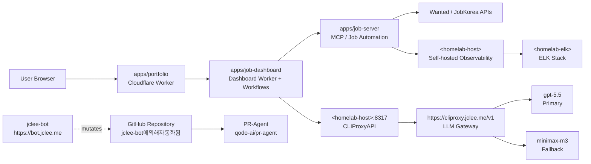

# Resume Portfolio Monorepo / 이력서 포트폴리오 모노레포

`version: 1.40.11` · `Node.js: >=22` · `Docker: enabled` · `Cloudflare Workers: configured` · `Wrangler: configured` · `License: MIT` · `PR-Agent: qodo-ai/pr-agent` · `Bot: jclee-bot` · `README-gen: gpt-5.5` · `fallback: minimax-m3 via CLIProxyAPI`

- PR-Agent: [qodo-ai/pr-agent](https://github.com/qodo-ai/pr-agent)
- CLIProxyAPI endpoint: [https://cliproxy.jclee.me/v1](https://cliproxy.jclee.me/v1)
- Bot surface: [https://bot.jclee.me](https://bot.jclee.me)

---

## Overview / 개요

### English

This repository is a private resume and job-application automation monorepo. It consolidates bilingual resume artifacts, per-employer application packages, a Cloudflare Worker edge portfolio, a Dockerized MCP/job-automation runtime, a dashboard worker with workflows, and a bot-driven GitHub control plane.

The repository is organized around three operational concerns:

1. **Career material management** — author-authored resume content, employer-specific application packages, and TA presentation assets.
   - `applications/` — per-employer dossiers (cover letter, HTML/PDF resume, interview prep, profile assets).
   - `ta/` — Python/PPTX pipeline for generated TA decks, profiles, and verification reports.
2. **Edge runtime and automation** — Cloudflare Worker portfolio, dashboard worker, and the Node.js MCP/job-server runtime.
   - `apps/portfolio/` — public edge site (Wrangler-managed).
   - `apps/job-dashboard/` — dashboard worker, routes, handlers, middleware, migrations, schema, queue consumer.
   - `apps/job-server/` — MCP/job automation runtime (Dockerized via `Dockerfile` / `docker-compose.yml`).
3. **Repository automation** — mutating GitHub operations are owned by the `jclee-bot` application, not by the workflow YAML files themselves. The YAML files in `.github/workflows/` are implementation triggers that invoke bot-owned surfaces; they are not the source of truth for automation behavior.

The root `package.json` describes the project as:

> Resume portfolio monorepo: Cloudflare Worker edge site, job automation (Wanted/JobKorea), SSoT data, self-hosted observability

README generation metadata: primary model `gpt-5.5`; fallback model `minimax-m3` served through the public [https://cliproxy.jclee.me/v1](https://cliproxy.jclee.me/v1) gateway.

### 한국어

이 저장소는 비공개 이력서 및 채용 지원 자동화 모노레포입니다. 한국어/영어 이력서 산출물, 지원사별 패키지, Cloudflare Worker 엣지 포트폴리오, Docker 기반 MCP/잡 자동화 런타임, 대시보드 워커, 그리고 봇 기반 GitHub 제어 평면을 한 곳에서 관리합니다.

이 저장소는 세 가지 운영 관심사를 중심으로 구성됩니다.

1. **커리어 자료 관리** — 저자가 직접 작성한 이력서 콘텐츠, 지원사별 패키지, TA 발표 자료.
   - `applications/` — 지원사별 도시에 (자기소개서, HTML/PDF 이력서, 면접 준비, 프로필 자산).
   - `ta/` — Python/PPTX 파이프라인이 생성한 TA 덱·프로필·검증 리포트.
2. **엣지 런타임 및 자동화** — Cloudflare Worker 포트폴리오, 대시보드 워커, Node.js MCP/잡-서버 런타임.
   - `apps/portfolio/` — 공개 엣지 사이트(Wrangler로 관리).
   - `apps/job-dashboard/` — 대시보드 워커, 라우트, 핸들러, 미들웨어, 마이그레이션, 스키마, 큐 컨슈머.
   - `apps/job-server/` — MCP/잡 자동화 런타임(`Dockerfile` / `docker-compose.yml`로 도커화).
3. **저장소 자동화** — 변이(mutating) GitHub 작업은 `jclee-bot` 애플리케이션이 소유합니다. `.github/workflows/` 안의 YAML 파일은 봇 소유 표면을 호출하는 구현 트리거일 뿐, 자동화 동작의 진실 공급원은 아닙니다.

루트 `package.json`의 프로젝트 설명:

> Resume portfolio monorepo: Cloudflare Worker edge site, job automation (Wanted/JobKorea), SSoT data, self-hosted observability

README 생성 메타데이터: 1차 모델 `gpt-5.5`, 폴백 모델 `minimax-m3`(공개 게이트웨이 [https://cliproxy.jclee.me/v1](https://cliproxy.jclee.me/v1) 경유).

---

## Features / 주요 기능

### English

- **Bilingual career content** — every employer dossier under `applications/` ships Korean and English artifacts in lock-step (cover letter, HTML/PDF resume, optional guides and screenshots).
- **TA presentation pipeline** — deterministic Python + PPTX generation under `ta/`, with `inspect.py` / `improve_visual.py` / `verify.py` plus a `verify_report_*.txt` audit trail.
- **Cloudflare Worker portfolio** — `apps/portfolio` is the public edge site, managed via `wrangler.jsonc`; `worker.js` is generated and is not edited directly.
- **Dashboard worker** — `apps/job-dashboard` exposes routes (`admin`, `applications`, `auth`, `automation`, `health`, `stats`, `workflows`), middleware (`cors`, `csrf`, `rate-limit`), queue consumer, and SQL migrations.
- **MCP/job-server runtime** — `apps/job-server` runs in a multi-stage `node:22-alpine` Docker image with a healthcheck; coordinated by `docker-compose.yml`.
- **SSoT data layer** — `packages/data`, `packages/types`, `packages/schemas`, `packages/contracts`, `packages/shared`, `packages/env`, `packages/cli` are workspace packages that the apps consume via npm workspaces.
- **1Password tooling** — Go-based session and secret management for browser automation.
- **LLM routing** — automated model selection between `gpt-5.5` and `minimax-m3` (fallback) through CLIProxyAPI.
- **Bot-owned GitHub automation** — all mutating repository operations are surfaced and orchestrated by the `jclee-bot` application at `https://bot.jclee.me`. PR review assistance is delegated to the upstream [qodo-ai/pr-agent](https://github.com/qodo-ai/pr-agent) project.
- **Self-hosted observability** — local observability/ELK stack reachable through the `<homelab-host>` / `<homelab-elk>` placeholders.

### 한국어

- **이국어 커리어 콘텐츠** — `applications/` 아래의 모든 지원사 도시에 한국어/영어 산출물(자기소개서, HTML/PDF 이력서, 선택적 가이드/스크린샷)이 동기화되어 출하됩니다.
- **TA 발표 파이프라인** — `ta/`에서 결정론적인 Python + PPTX 생성을 수행하며, `inspect.py` / `improve_visual.py` / `verify.py`와 `verify_report_*.txt` 감사 흔적을 함께 제공합니다.
- **Cloudflare Worker 포트폴리오** — `apps/portfolio`는 공개 엣지 사이트이며 `wrangler.jsonc`로 관리됩니다. `worker.js`는 생성물이며 직접 편집하지 않습니다.
- **대시보드 워커** — `apps/job-dashboard`는 라우트(`admin`, `applications`, `auth`, `automation`, `health`, `stats`, `workflows`), 미들웨어(`cors`, `csrf`, `rate-limit`), 큐 컨슈머, SQL 마이그레이션을 제공합니다.
- **MCP/잡-서버 런타임** — `apps/job-server`는 멀티스테이지 `node:22-alpine` 도커 이미지에서 헬스체크와 함께 동작하며 `docker-compose.yml`이 이를编排합니다.
- **SSoT 데이터 계층** — `packages/data`, `packages/types`, `packages/schemas`, `packages/contracts`, `packages/shared`, `packages/env`, `packages/cli` 워크스페이스 패키지를 앱이 npm 워크스페이스로 소비합니다.
- **1Password 도구** — 브라우저 자동화를 위한 Go 기반 세션/시크릿 관리.
- **LLM 라우팅** — `gpt-5.5` 1차 / `minimax-m3` 폴백 모델을 CLIProxyAPI를 통해 자동 선택.
- **봇 소유 GitHub 자동화** — 모든 변이 저장소 작업은 `https://bot.jclee.me`의 `jclee-bot` 애플리케이션이 표면화하고 지휘합니다. PR 리뷰 보조는 업스트림 [qodo-ai/pr-agent](https://github.com/qodo-ai/pr-agent) 프로젝트에 위임됩니다.
- **자체 호스팅 옵저버빌리티** — `<homelab-host>` / `<homelab-elk>` 플레이스홀더로 대표되는 로컬 옵저버빌리티/ELK 스택.

---

## Architecture / 아키텍처

The repository is split into three runtime tiers: a Cloudflare Worker edge tier, a containerized Node.js automation tier, and a self-hosted observability tier. The `jclee-bot` application owns every mutating GitHub operation, with PR review delegated to the upstream `qodo-ai/pr-agent` project. LLM traffic is funneled through the public CLIProxyAPI gateway.



### English

- The **edge tier** (Cloudflare Workers) serves the portfolio and dashboard. `worker.js` is generated from a build pipeline — do not edit it directly.
- The **automation tier** (`apps/job-server`, containerized via `Dockerfile` / `docker-compose.yml`) drives Wanted / JobKorea interactions, MCP tool execution, and queue-based background work consumed by the dashboard.
- The **observability tier** lives on a self-hosted homelab; the `<homelab-host>` placeholder denotes the gateway host, and `<homelab-elk>` denotes the ELK/Elasticsearch endpoint. Internal LAN addresses are never hardcoded.
- The **LLM gateway** is the public endpoint `https://cliproxy.jclee.me/v1`; CLIProxyAPI on the homelab host multiplexes traffic between the primary `gpt-5.5` model and the `minimax-m3` fallback.
- The **bot tier** (`jclee-bot` at `https://bot.jclee.me`) is the only authoritative source for mutating repository behavior. Workflow files under `.github/workflows/` are implementation triggers that dispatch into bot-owned surfaces.

### 한국어

- **엣지 계층**(Cloudflare Workers)은 포트폴리오와 대시보드를 제공합니다. `worker.js`는 빌드 파이프라인이 생성하는 산출물이며 직접 편집하지 않습니다.
- **자동화 계층**(`apps/job-server`, `Dockerfile` / `docker-compose.yml`로 컨테이너화)이 Wanted / JobKorea 연동, MCP 도구 실행, 대시보드가 소비하는 큐 기반 백그라운드 작업을 구동합니다.
- **옵저버빌리티 계층**은 자체 호스팅 홈랩에 위치합니다. `<homelab-host>`는 게이트웨이 호스트, `<homelab-elk>`는 ELK/Elasticsearch 엔드포인트의 플레이스홀더입니다. 사설 LAN 주소는 절대 하드코딩하지 않습니다.
- **LLM 게이트웨이**는 공개 엔드포인트 `https://cliproxy.jclee.me/v1`이며, 홈랩 호스트의 CLIProxyAPI가 1차 `gpt-5.5` 모델과 `minimax-m3` 폴백 사이의 트래픽을 다중화합니다.
- **봇 계층**(`https://bot.jclee.me`의 `jclee-bot`)만이 저장소 변이 동작의 진실 공급원입니다. `.github/workflows/`의 워크플로 파일은 봇 소유 표면으로 디스패치하는 구현 트리거입니다.

---

## jclee-bot Automation Surfaces / jclee-bot 자동화 표면

The `jclee-bot` application owns the following mutating repository surfaces. Workflow files under `.github/workflows/` exist only as triggers; the canonical behavior, audit trail, and rollback posture for each surface live inside the bot application at `https://bot.jclee.me`.

`jclee-bot에의해자동화됨` — every issue created or modified by automation is tagged with this marker, including issues that originate from the `issue-to-branch` surface, the `ci-failure-issues` surface, and the `issue-backfill` surface.

### Branch and pull request surfaces / 브랜치 및 PR 표면

- `branch-to-pr` — converts an open branch into a pull request, assigns reviewers, and applies the bot-managed PR template.
- `issue-to-branch` — opens a branch and a tracking PR from an issue body, and stamps the resulting PR/issue with `jclee-bot에의해자동화됨`.
- `pr-review` — non-blocking automated review suggestions.
- `security-pr-review` — security-focused PR review; routes to the `qodo-ai/pr-agent` integration.
- `dependabot-auto-merge` — approves and merges qualifying Dependabot PRs after CI/health signals clear.
- `pr-auto-merge` — auto-merges PRs that satisfy the bot-managed merge policy.
- `bot-auto-fix` — pushes bot-authored fix commits in response to a CI or review signal.
- `merged-pr-cleanup` — deletes merged branches and closes downstream tracking issues.

### Issue and operations surfaces / 이슈 및 운영 표면

- `issue-backfill` — populates missing structured fields on historical issues, marking the touchpoint with `jclee-bot에의해자동화됨`.
- `ci-failure-issues` — opens a labeled issue whenever a CI run fails on a protected surface.
- `data-sync` — runs the `sync:all` chain (SSoT data, PDF, PPTX) and posts a status comment.
- `auto-sync-data` — periodic SSoT reconciliation job.
- `post-deploy-verify` — smoke-tests the deployed job-server after a release.
- `provision-queues` — provisions dashboard queue resources before a release.

### Release surfaces / 릴리스 표면

- `release-notes` — generates the changelog section for the next release.
- `release-publish` — publishes the GitHub release and tags the worker bundle.
- `worker-release` — wraps the Cloudflare Worker release pipeline via `wrangler.jsonc`.

### Health and maintenance surfaces / 상태 및 유지보수 표면

- `downstream-health-check` — probes external dependencies and opens issues on regression.
- `delete-standalone-job-worker` — removes orphaned standalone job workers on cleanup cadence.

### Cross-cutting policy / 횡단 정책

- All surfaces are **idempotent** and log to the bot's own audit log before mutating the repository.
- Surfaces never invent or rewrite user-authored content; they only reorganize, label, and merge.
- Any surface that creates or modifies an issue is required to attach the `jclee-bot에의해자동화됨` marker.
- Workflow YAML files are **not** the source of truth for these surfaces; the bot application owns the contract.

---

## Go Tools / Go 도구

The repository ships a small set of Go programs under `tools/scripts/`. They are invoked through the npm scripts in the root `package.json` and are the canonical entry points for build, sync, enrichment, and 1Password operations.

### Build and PDF / 빌드 및 PDF

- `tools/scripts/build/pdf-generator.go` — `master` argument regenerates the master PDF from the SSoT JSON; invoked by `npm run sync:pdf`.
- `tools/scripts/build/generate_shinhan_pptx.py` — Python companion for the PPTX pipeline; invoked by `npm run sync:pptx`.

### 1Password session and secret tools / 1Password 세션/시크릿 도구

- `tools/scripts/onepassword/run` — `npm run op:run` runs an arbitrary 1Password-backed command under the bot's session.
- `tools/scripts/onepassword/native-run` — `npm run op:native:run` runs a command against the native 1Password CLI binary.
- `tools/scripts/onepassword/seed-resume` — `npm run op:seed:resume` seeds the resume-related 1Password items.
- `tools/scripts/onepassword/session-files seed` — `npm run op:seed:sessions` writes fresh session files.
- `tools/scripts/onepassword/session-files restore` — `npm run op:restore:sessions` restores prior session files from 1Password.

### Sync and proposal tools / 동기화 및 제안 도구

- `tools/scripts/sync/apply-proposals.go` — `npm run sync:proposals` applies reviewed proposals (after `apps/job-server/src/sync/proposal-review-cli.js`).
- `tools/scripts/utils/sync-resume-data.js` — `npm run sync:data` reconciles resume SSoT data.

### Enrichment tools / 데이터 보강 도구

- `tools/scripts/enrichment/github/main.go` — `npm run enrich:github` enriches profiles from GitHub metadata.
- `tools/scripts/enrichment/skills/main.go` — `npm run enrich:skills` enriches skill taxonomy entries.
- `tools/scripts/enrichment/ai/main.go` — `npm run enrich:ai` runs AI-based enrichment through the CLIProxyAPI gateway.

---

## Repository Layout / 저장소 레이아웃

```text
/
├── AGENTS.md                  # project knowledge base
├── CHANGELOG.md
├── CONTRIBUTING.md
├── Dockerfile                 # multi-stage build for apps/job-server
├── LICENSE
├── OWNERS
├── README.md
├── docker-compose.yml         # mcp-server service
├── eslint.config.cjs
├── jest.config.cjs
├── lychee.toml                # link checker config
├── package.json               # workspace root + operator scripts
├── package-lock.json
├── playwright.config.js
├── redocly.yaml               # API docs linting
├── tsconfig.base.json
├── tsconfig.json
├── wrangler.jsonc             # Cloudflare Workers config
├── ta/                        # TA profile generation (Python/PPTX)
└── applications/              # per-employer dossiers
    ├── airpremia-security-2026/
    ├── coupang-fintech-sre-2026/
    ├── cloudflare-one-se-2026/
    ├── gitlab-apac-security-2026/
    └── infrastructure-architecture-2026/
```

Workspace apps (declared in `package.json` workspaces, expanded where the structure is shown):

- `apps/portfolio/` — public Cloudflare Worker portfolio.
- `apps/job-server/` — MCP / job-automation runtime.
- `apps/job-dashboard/` — dashboard worker (routes, handlers, middleware, migrations).

`apps/job-dashboard/` is laid out as:

```text
apps/job-dashboard/
├── AGENTS.md
├── API_REFERENCE.md
├── DEPLOYMENT_GUIDE.md
├── DEVELOPMENT_GUIDE.md
├── DIAGRAMS.md
├── OWNERS
├── README.md
├── SECRETS.md
├── migrate-json-to-d1.cjs
├── migration-data.sql
├── schema.sql
├── package.json
├── tsconfig.json
├── migrations/
│   └── 0002_add_approval_metadata.sql
└── src/
    ├── index.js
    ├── queue-consumer.js
    ├── router.js
    ├── middleware/        # cors.js, csrf.js, rate-limit.test.js
    ├── routes/            # admin, applications, auth, automation, health, stats, workflows, index
    └── handlers/          # applications, auth, auto-apply-webhook-handler
```

---

## Quick Start / 빠른 시작

### English

1. **Clone the repository.**
   ```bash
   git clone <repository-url> resume
   cd resume
   ```
2. **Install workspace dependencies** (requires Node.js 22+).
   ```bash
   npm install
   ```
3. **Bootstrap SSoT data and the master PDF.**
   ```bash
   npm run automate:ssot
   ```
4. **Bring up the local MCP / job-server runtime** with Docker Compose.
   ```bash
   docker compose up -d mcp-server
   ```
5. **Verify the runtime** is healthy.
   ```bash
   curl -fsS http://127.0.0.1:3000/health
   ```
6. **Sign in to 1Password tooling** (used by browser-automation scripts).
   ```bash
   npm run op:seed:sessions
   ```

### 한국어

1. **저장소 클론**
   ```bash
   git clone <repository-url> resume
   cd resume
   ```
2. **워크스페이스 의존성 설치** (Node.js 22+ 필요)
   ```bash
   npm install
   ```
3. **SSoT 데이터와 마스터 PDF 부트스트랩**
   ```bash
   npm run automate:ssot
   ```
4. **로컬 MCP / 잡-서버 런타임 기동** (Docker Compose)
   ```bash
   docker compose up -d mcp-server
   ```
5. **런타임 헬스체크**
   ```bash
   curl -fsS http://127.0.0.1:3000/health
   ```
6. **1Password 도구 세션 시드** (브라우저 자동화 스크립트에서 사용)
   ```bash
   npm run op:seed:sessions
   ```

---

## Local Development / 로컬 개발

### English

- **Workspaces.** `package.json` declares npm workspaces for the three apps and the shared packages. Always run install from the root so the workspace graph stays consistent.
- **Portfolio build.** The portfolio worker is built and deployed via `wrangler.jsonc`. Treat `worker.js` as a build artifact.
- **Dashboard worker.** `apps/job-dashboard` exposes its own `package.json`; use its local scripts for unit and integration tests, and run `npm run typecheck` from the root for cross-workspace type safety.
- **Job-server runtime.** The container built from the multi-stage `Dockerfile` runs `apps/job-server` on `PORT=3000` with a `node -e "fetch(...)"` healthcheck. Local data persists in the `job_automation_data` named volume.
- **LLM gateway.** Any code path that hits an LLM should call the public endpoint `https://cliproxy.jclee.me/v1`; do not embed private homelab addresses.
- **Observability.** Logs and metrics flow to the self-hosted homelab stack identified by the `<homelab-host>` and `<homelab-elk>` placeholders. Configure your local environment to point at those placeholders rather than hardcoded IPs.
- **Bot integration.** Local development against `jclee-bot` is done by pointing your tooling at `https://bot.jclee.me`; the bot is the only authoritative source for mutating surfaces.

### 한국어

- **워크스페이스.** `package.json`은 3개 앱과 공유 패키지를 npm 워크스페이스로 선언합니다. 워크스페이스 그래프 일관성을 위해 항상 루트에서 `install`하세요.
- **포트폴리오 빌드.** 포트폴리오 워커는 `wrangler.jsonc`로 빌드/배포합니다. `worker.js`는 빌드 산출물로 취급하세요.
- **대시보드 워커.** `apps/job-dashboard`는 자체 `package.json`을 가지며, 단위/통합 테스트는 로컬 스크립트를, 워크스페이스 전체 타입 안전성은 루트의 `npm run typecheck`을 사용하세요.
- **잡-서버 런타임.** 멀티스테이지 `Dockerfile`로 빌드된 컨테이너가 `apps/job-server`를 `PORT=3000`에서 헬스체크와 함께 실행합니다. 로컬 데이터는 `job_automation_data` named volume에 보존됩니다.
- **LLM 게이트웨이.** LLM을 호출하는 모든 코드 경로는 공개 엔드포인트 `https://cliproxy.jclee.me/v1`을 사용해야 하며, 사설 홈랩 주소를 임베드하지 마세요.
- **옵저버빌리티.** 로그/메트릭은 `<homelab-host>` 및 `<homelab-elk>` 플레이스홀더로 대표되는 자체 호스팅 홈랩 스택으로 흐릅니다. 로컬 환경은 하드코딩된 IP 대신 이 플레이스홀더를 가리키도록 설정하세요.
- **봇 연동.** `jclee-bot` 대상 로컬 개발은 `https://bot.jclee.me`로 도구를 연결해 수행합니다. 봇이 변이 표면의 유일한 권위 있는 공급원입니다.

---

## Commands Reference / 명령어 레퍼런스

All commands below are defined in the root `package.json`.

### SSoT and content sync / SSoT 및 콘텐츠 동기화

| Command | Purpose |
| --- | --- |
| `npm run sync:data` | Reconciles SSoT resume data via `tools/scripts/utils/sync-resume-data.js`. |
| `npm run sync:pdf` | Runs `tools/scripts/build/pdf-generator.go master` to regenerate the master PDF. |
| `npm run sync:pptx` | Runs `tools/scripts/build/generate_shinhan_pptx.py` to regenerate the PPTX deck. |
| `npm run sync:all` | Runs `sync:data`, then `sync:pdf`, then `sync:pptx`. |
| `npm run sync:proposals` | Reviews proposals with the Node CLI and applies them with `tools/scripts/sync/apply-proposals.go`. |

### Enrichment / 데이터 보강

| Command | Purpose |
| --- | --- |
| `npm run enrich:github` | Runs `tools/scripts/enrichment/github/main.go`. |
| `npm run enrich:skills` | Runs `tools/scripts/enrichment/skills/main.go`. |
| `npm run enrich:ai` | Runs `tools/scripts/enrichment/ai/main.go`. |
| `npm run enrich:all` | Runs the three enrichment tools in sequence. |

### 1Password session tooling / 1Password 세션 도구

| Command | Purpose |
| --- | --- |
| `npm run op:run` | Runs an arbitrary command under `tools/scripts/onepassword/run`. |
| `npm run op:native:run` | Runs `tools/scripts/onepassword/native-run`. |
| `npm run op:seed:resume` | Seeds resume-related 1Password items. |
| `npm run op:seed:sessions` | Writes fresh session files. |
| `npm run op:restore:sessions` | Restores prior session files from 1Password. |

### Asset hygiene / 자산 위생

| Command | Purpose |
| --- | --- |
| `npm run strip-exif` | Strips EXIF metadata from portfolio PNG/WebP images. |

### High-level automation chains / 고수준 자동화 체인

| Command | Purpose |
| --- | --- |
| `npm run automate:ssot` | Runs `sync:data`, `sync:pdf`, `build`, `typecheck`, and `test:node`. |
| `npm run automate:full` | Runs `sync:all`, `lint`, `typecheck`, and the test suites. |

> Note: chains ending in `typecheck`, `lint`, `test:node`, etc. delegate to workspace-local scripts; see each `apps/*/package.json` for the per-app definition.

---

## Application Packages / 지원사별 패키지

The `applications/` directory contains one dossier per target employer. Each dossier is self-contained and ships bilingual artifacts.

| Package | Artifacts |
| --- | --- |
| `airpremia-security-2026/` | `application-guide.md`, `cover_letter.md`, signup-gate screenshot. |
| `infrastructure-architecture-2026/` | `homelab-infrastructure-architecture.md`. |
| `coupang-fintech-sre-2026/` | `cover_letter.md`, HTML resume, PDF resume. |
| `cloudflare-one-se-2026/` | `cover_letter.md`, HTML resume, PDF resume, application guide, interview Q&A, LinkedIn optimization, `preview.png`. |
| `gitlab-apac-security-2026/` | `cover_letter.md`, HTML resume, PDF resume. |

The `ta/` directory contains the TA presentation pipeline:

- Inputs: `ta.pptx`, `lee_jaecheol_ta.pptx`, `lee_jaecheol_ta_profile.pptx`, `lee_jaecheol_profile_ta.pptx`, `2.pptx`.
- Scripts: `inspect.py`, `improve_visual.py`, `verify.py`.
- Outputs: `ta/output/*.pptx`, `ta/output/verify_report_20260212.txt`.

---

## Contribution Guide / 기여 가이드

### English

1. **Read the project knowledge base.** Start with `AGENTS.md` at the repository root and the per-app `AGENTS.md` files (for example, `apps/job-dashboard/AGENTS.md`).
2. **Follow the contribution contract.** `CONTRIBUTING.md` is the authoritative guide for commit hygiene, branch naming, and review expectations.
3. **Honor the SSoT.** Resume content is sourced from `packages/data`; do not edit generated artifacts. Use `npm run automate:ssot` to regenerate them.
4. **Never hardcode private infrastructure.** Use the `<homelab-host>` and `<homelab-elk>` placeholders in code, comments, and diagrams. For LLM traffic, use the public endpoint `https://cliproxy.jclee.me/v1`.
5. **Respect bot-owned automation.** All mutating repository operations (PR creation, merging, issue opening, release publishing, branch cleanup, etc.) are owned by `jclee-bot` at `https://bot.jclee.me`. Do not bypass it from a workflow file. New automation should be added as a new bot surface, not as a new mutating workflow step.
6. **PR review assistance.** The bot delegates PR review suggestions to the upstream [qodo-ai/pr-agent](https://github.com/qodo-ai/pr-agent) project. Treat `qodo-ai/pr-agent` comments as advisory, not authoritative.
7. **Issue automation marker.** Any issue that is created or modified by automation must carry the `jclee-bot에의해자동화됨` marker; the bot enforces this on its owned surfaces.

### 한국어

1. **프로젝트 지식 베이스를 먼저 읽으세요.** 루트의 `AGENTS.md`와 앱별 `AGENTS.md`(예: `apps/job-dashboard/AGENTS.md`)부터 시작합니다.
2. **기여 규약을 따르세요.** `CONTRIBUTING.md`가 커밋 위생, 브랜치 명명, 리뷰 기대치의 권위 있는 가이드입니다.
3. **SSoT를 존중하세요.** 이력서 콘텐츠는 `packages/data`가 진실 공급원입니다. 생성 산출물을 직접 편집하지 말고 `npm run automate:ssot`로 재생성하세요.
4. **사설 인프라를 하드코딩하지 마세요.** 코드/주석/다이어그램 어디에도 `<homelab-host>`, `<homelab-elk>` 플레이스홀더만 사용하세요. LLM 트래픽은 공개 엔드포인트 `https://cliproxy.jclee.me/v1`을 사용합니다.
5. **봇 소유 자동화를 존중하세요.** 모든 변이 저장소 작업(PR 생성/머지, 이슈 개설, 릴리스 게시, 브랜치 정리 등)은 `https://bot.jclee.me`의 `jclee-bot`이 소유합니다. 워크플로 파일에서 우회하지 마세요. 새 자동화는 새 변이 워크플로 단계가 아니라 새로운 봇 표면으로 추가되어야 합니다.
6. **PR 리뷰 보조.** 봇은 PR 리뷰 제안을 업스트림 [qodo-ai/pr-agent](https://github.com/qodo-ai/pr-agent) 프로젝트에 위임합니다. `qodo-ai/pr-agent`의 코멘트는 권위 있는 결정보다는 보조 의견으로 취급하세요.
7. **이슈 자동화 마커.** 자동화로 생성/수정되는 모든 이슈는 `jclee-bot에의해자동화됨` 마커를 반드시 가져야 하며, 봇이 소유 표면에서 이를 강제합니다.

---

## License / 라이선스

This project is released under the **MIT License**. See `LICENSE` for the full text.

이 프로젝트는 **MIT 라이선스** 하에 배포됩니다. 전문은 `LICENSE` 파일을 참조하세요.