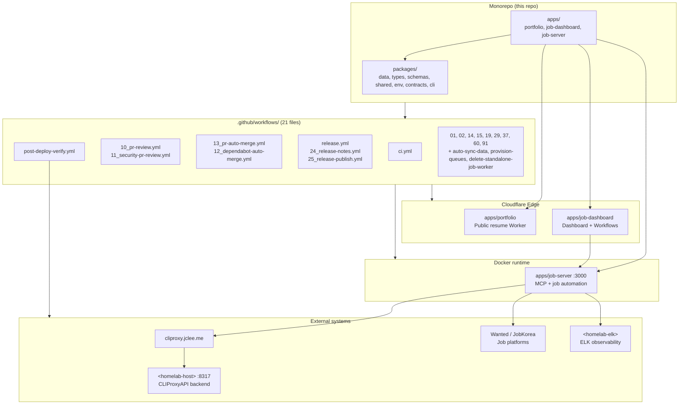

# Resume Portfolio Monorepo
# 이력서 포트폴리오 모노레포

[](package.json)
[](https://nodejs.org/)
[](https://workers.cloudflare.com/)
[](LICENSE)
[](Dockerfile)
[](wrangler.jsonc)
[](https://github.com/qodo-ai/pr-agent)
[](apps/job-server)
[](README.md)

> **Bilingual documentation** / **이중 언어 문서**: This README is provided in English first, followed by a Korean (한국어) translation of each section. Every section header is duplicated in both languages.
> 이 README는 모든 섹션을 영어와 한국어로 병기합니다. 각 섹션 제목은 양국어로 제공됩니다.

> **Primary README generator model:** `gpt-5.5` (fallback: `minimax-m3` via [https://cliproxy.jclee.me/v1](https://cliproxy.jclee.me/v1)).
> **README 생성 기본 모델:** `gpt-5.5` (대체: [https://cliproxy.jclee.me/v1](https://cliproxy.jclee.me/v1) 경유 `minimax-m3`).

---

## Overview / 개요

`resume` is a private resume portfolio monorepo that combines a Cloudflare Worker edge portfolio, structured resume/application assets, job-application tracking and automation, a dashboard Worker for operational workflows, and a Dockerized Node.js runtime that exposes a job-automation HTTP API.

`resume`는 Cloudflare Worker 기반 포트폴리오, 구조화된 이력서 및 지원 자료, 채용 지원 추적 및 자동화, 운영 워크플로우용 대시보드 Worker, 그리고 채용 자동화 HTTP API를 노출하는 Docker 기반 Node.js 런타임을 결합한 **개인 이력서 포트폴리오 모노레포**입니다.

The repository is designed as a single operational workspace for:

이 저장소는 다음을 위한 단일 운영 워크스페이스로 설계되었습니다.

- **Portfolio and resume publishing** at the Cloudflare edge.
  Cloudflare Edge에서의 **포트폴리오 및 이력서 게시**.
- **Job-application automation** for Wanted / JobKorea (ingestion, sync, MCP tools).
  원티드/잡코리아 대상 **채용 지원 자동화** (수집, 동기화, MCP 도구).
- **Single source of truth (SSoT)** for resume data, types, schemas, and contracts.
  이력서 데이터, 타입, 스키마, 계약의 **단일 진실 공급원 (SSoT)**.
- **Operational dashboards** powered by Cloudflare Workflows.
  Cloudflare Workflows 기반의 **운영 대시보드**.
- **Self-hosted observability** via an ELK stack on a homelab host.
  홈랩 호스트의 ELK 스택을 통한 **자체 호스팅 옵저버빌리티**.

---

## Features / 주요 기능

- **Edge portfolio** — `apps/portfolio` is a Cloudflare Worker that serves the public resume and tailors content from `packages/data` (SSoT).
  **Edge 포트폴리오** — `apps/portfolio`는 Cloudflare Worker로 동작하며, `packages/data` (SSoT)에서 콘텐츠를 가져와 공개 이력서를 제공합니다.
- **Job automation runtime** — `apps/job-server` runs as a Docker container (`Dockerfile`, `docker-compose.yml`) and exposes MCP-compatible HTTP endpoints on port `3000`.
  **채용 자동화 런타임** — `apps/job-server`는 Docker 컨테이너(`Dockerfile`, `docker-compose.yml`)로 실행되며, `3000` 포트에서 MCP 호환 HTTP 엔드포인트를 노출합니다.
- **Dashboard Worker** — `apps/job-dashboard` ships handlers, middleware (CORS/CSRF/rate-limit), and Cloudflare Workflows for operational tooling.
  **대시보드 Worker** — `apps/job-dashboard`는 핸들러, 미들웨어(CORS/CSRF/rate-limit) 및 운영 도구용 Cloudflare Workflows를 제공합니다.
- **SSoT data + contracts** — `packages/data` (master resume JSON), `packages/types` (JSDoc/TS), `packages/schemas` (Zod), `packages/contracts` (OpenAPI + Worker Env).
  **SSoT 데이터 및 계약** — `packages/data` (마스터 이력서 JSON), `packages/types` (JSDoc/TS), `packages/schemas` (Zod), `packages/contracts` (OpenAPI + Worker Env).
- **Cross-package utilities** — `packages/shared` exposes `errors`, `logger`, `retry`, `crypto`, `rate-limit`, `auth`, `browser`, and `clients`.
  **공유 유틸리티** — `packages/shared`는 `errors`, `logger`, `retry`, `crypto`, `rate-limit`, `auth`, `browser`, `clients`를 제공합니다.
- **GitHub-native CI/CD** — 21 numbered workflows in `.github/workflows/` cover CI, PR review, auto-merge, release, and operational maintenance.
  **GitHub 네이티브 CI/CD** — `.github/workflows/`의 21개 번호 매겨진 워크플로우로 CI, PR 리뷰, 자동 머지, 릴리스, 운영 유지보수를 처리합니다.
- **PR-Agent integration** — [qodo-ai/pr-agent](https://github.com/qodo-ai/pr-agent) drives the `10_pr-review.yml` and `11_security-pr-review.yml` workflows.
  **PR-Agent 통합** — [qodo-ai/pr-agent](https://github.com/qodo-ai/pr-agent)가 `10_pr-review.yml` 및 `11_security-pr-review.yml` 워크플로우를 구동합니다.
- **Self-hosted LLM gateway** — Internal requests route through `https://cliproxy.jclee.me/v1` to a CLIProxyAPI backend on a homelab host.
  **자체 호스팅 LLM 게이트웨이** — 내부 요청은 `https://cliproxy.jclee.me/v1`을 통해 홈랩 호스트의 CLIProxyAPI 백엔드로 라우팅됩니다.
- **TA profile generation** — `ta/` contains Python tooling to generate, inspect, and verify teaching-assistant profile PowerPoint artifacts.
  **TA 프로필 생성** — `ta/`는 파이썬 도구로 TA(Teaching Assistant) 프로필 PowerPoint 산출물을 생성, 검사 및 검증합니다.

---

## Architecture / 아키텍처



> Notes / 참고:
> - `<homelab-host>` and `<homelab-elk>` are placeholders for self-hosted infrastructure and are **not** real hostnames or IPs. Resolve them from your secrets manager (1Password) at deploy time.
>   `<homelab-host>` 및 `<homelab-elk>`는 자체 호스팅 인프라를 가리키는 **자리표시자**이며 실제 호스트명이나 IP가 아닙니다. 배포 시 시크릿 매니저(1Password)에서 해석하세요.
> - The public LLM gateway endpoint is `https://cliproxy.jclee.me/v1`; everything behind it (the CLIProxyAPI daemon) lives on the homelab host.
>   공개 LLM 게이트웨이 엔드포인트는 `https://cliproxy.jclee.me/v1`이며, 그 뒤의 CLIProxyAPI 데몬은 홈랩 호스트에 위치합니다.

---

## Repository Structure / 저장소 구조

The layout below reflects the canonical structure documented in `AGENTS.md` and the actual on-disk top-level entries.
아래 구조는 `AGENTS.md`에 명시된 표준 구조와 실제 최상위 디렉터리 구성을 반영합니다.

```text
.
├── AGENTS.md                    # Canonical project knowledge base
├── CHANGELOG.md                 # Versioned change log
├── CONTRIBUTING.md              # Contribution guide
├── Dockerfile                   # Multi-stage build for job-server
├── LICENSE                      # MIT
├── OWNERS                       # Code ownership
├── README.md                    # This file
├── docker-compose.yml           # Local mcp-server stack
├── eslint.config.cjs            # Root ESLint config
├── jest.config.cjs              # Root Jest config
├── lychee.toml                  # Link checker config
├── package.json                 # Workspace root + operator scripts
├── package-lock.json
├── playwright.config.js         # Playwright E2E config
├── redocly.yaml                 # OpenAPI lint config
├── tsconfig.base.json           # Shared TS config
├── tsconfig.json
├── wrangler.jsonc               # Cloudflare Worker config
│
├── applications/                # Per-company job application materials
│   ├── airpremia-security-2026/
│   ├── cloudflare-one-se-2026/
│   ├── coupang-fintech-sre-2026/
│   ├── gitlab-apac-security-2026/
│   └── infrastructure-architecture-2026/
│
├── apps/                        # Deployable apps
│   ├── portfolio/               # Public Cloudflare Worker resume site
│   ├── job-server/              # MCP / job automation runtime (Docker)
│   └── job-dashboard/           # Dashboard Worker + Cloudflare Workflows
│
├── packages/                    # Shared libraries
│   ├── cli/                     # resume CLI
│   ├── contracts/               # OpenAPI spec + Worker Env interface
│   ├── data/                    # SSoT resume JSON + JSON schema
│   ├── env/                     # Type-safe env validation
│   ├── schemas/                 # Runtime Zod validation
│   ├── shared/                  # Cross-package utils (errors, logger, retry, crypto, ...)
│   └── types/                   # Canonical JSDoc/TS type definitions
│
├── ta/                          # TA profile generation (Python + PPTX)
│   ├── improve_visual.py
│   ├── inspect.py
│   ├── verify.py
│   └── output/                  # Generated artifacts
│
├── tools/                       # Build, deploy, verification scripts
├── tests/                       # unit/, integration/, e2e/
├── infrastructure/              # Cloudflare, monitoring, n8n, DB config
├── docs/                        # Guides, ADRs, architecture, conventions
├── supabase/                    # Supabase edge functions (Deno runtime)
├── third_party/                 # Vendored external deps (npm-managed)
└── .github/                     # CI / release / maintenance control plane
    └── workflows/               # 21 workflow files (see Automation)
```

---

## Applications / 지원 자료 (applications/)

Each subfolder under `applications/` is a self-contained, per-company job application package: cover letter, tailored resume, and (where applicable) an application guide.
`applications/`의 각 하위 폴더는 회사별 **채용 지원 패키지**로, 자기소개서, 맞춤 이력서, 그리고 (해당되는 경우) 지원 가이드를 포함합니다.

| Folder / 폴더 | Company / 회사 | Role / 직무 | Key files / 주요 파일 |
| --- | --- | --- | --- |
| `airpremia-security-2026/` | Air Premia | Security (2026) | `cover_letter.md`, `application-guide.md`, screenshot |
| `cloudflare-one-se-2026/` | Cloudflare | Solutions Engineer, Cloudflare One (2026) | `cover_letter.md`, `resume-cloudflare-one-se.html`, `greenhouse-application-guide.md`, `interview-qa-10.md`, `linkedin-profile-optimization.md`, `preview.png` |
| `coupang-fintech-sre-2026/` | Coupang Pay | Fintech SRE (2026) | `cover_letter.md`, `resume-coupang-fintech-sre.html`, PDF resume |
| `gitlab-apac-security-2026/` | GitLab | APAC InfraSec (2026) | `cover_letter.md`, `resume-gitlab-apac-security.html`, PDF resume |
| `infrastructure-architecture-2026/` | (Generic) | Infrastructure Architecture (2026) | `homelab-infrastructure-architecture.md` |

---

## Apps / 앱 (apps/)

| App / 앱 | Runtime / 런타임 | Purpose / 목적 | Key paths / 주요 경로 |
| --- | --- | --- | --- |
| `apps/portfolio` | Cloudflare Worker (`wrangler.jsonc`) | Public resume site, served from the edge. The public Worker is generated from a source/build pipeline; edit the source, not the emitted `worker.js`. | `worker.js` (generated), `src/` |
| `apps/job-server` | Node.js 22 Docker image (`Dockerfile`) | MCP-compatible job-automation HTTP API. Exposes port `3000`, persists data under `apps/job-server/.data` (Docker volume `job_automation_data`). | `src/server/`, `src/sync/`, `.data/` |
| `apps/job-dashboard` | Cloudflare Worker + Workflows | Operational dashboard. Includes CORS / CSRF / rate-limit middleware, queue consumer, automation / workflows / stats / health routes, and a JSON-to-D1 migrator. | `src/index.js`, `src/router.js`, `src/middleware/`, `src/routes/`, `src/handlers/`, `migrations/`, `schema.sql` |

---

## Packages / 패키지 (packages/)

| Package / 패키지 | Purpose / 목적 | Notable exports / 주요 export |
| --- | --- | --- |
| `packages/data` | Single source of truth for resume content. | `packages/data/resumes/master/resume_data.json`, JSON schema |
| `packages/types` | Canonical JSDoc/TS type definitions (zero runtime deps). | `Application`, `Resume`, `WantedJob`, `WorkerEnv`, ... |
| `packages/schemas` | Runtime Zod validation; types inferred via `z.infer<>`. | Resume, auth, API payload schemas |
| `packages/contracts` | API contracts. | `openapi.yaml`, `WorkerEnv` interface re-export |
| `packages/shared` | Cross-package utilities. | `errors`, `logger`, `retry`, `crypto`, `rate-limit`, `auth`, `browser`, `clients` |
| `packages/env` | Type-safe environment validation. | Env loaders, secret type guards |
| `packages/cli` | Resume-domain CLI. | Used by `npm run sync:*` and `op:*` scripts |

---

## TA Profile Generation / TA 프로필 생성

The `ta/` folder hosts a small Python toolchain for producing teaching-assistant (TA) profile PowerPoint artifacts. It is intentionally isolated from the Node.js monorepo toolchain.
`ta/` 폴더는 TA(Teaching Assistant) 프로필 PowerPoint 산출물을 생성하기 위한 파이썬 도구 체인입니다. Node.js 모노레포 도구 체인과 의도적으로 분리되어 있습니다.

- `improve_visual.py` — visual improvements over the base PPTX.
  `improve_visual.py` — 기본 PPTX에 시각적 개선을 적용합니다.
- `inspect.py` — introspection helper for PPTX contents.
  `inspect.py` — PPTX 내용 검사용 헬퍼입니다.
- `verify.py` — verification pass; writes a timestamped report to `ta/output/`.
  `verify.py` — 검증 단계로, 타임스탬프가 찍힌 리포트를 `ta/output/`에 기록합니다.
- `ta/output/` — generated artifacts (`.pptx`, `verify_report_*.txt`).
  `ta/output/` — 생성된 산출물 (`.pptx`, `verify_report_*.txt`).

---

## Automation Inventory / 자동화 인벤토리

### GitHub Actions Workflows / GitHub Actions 워크플로우

All 21 workflow files live in `.github/workflows/`. Filenames retain their numeric prefix; the descriptions below are inferred from each file's name and standard usage patterns.
21개 워크플로우 파일은 모두 `.github/workflows/`에 있습니다. 파일명은 숫자 접두사를 그대로 유지하며, 아래 설명은 파일명과 일반적인 사용 패턴에서 추론한 것입니다.

| File / 파일 | Category / 분류 | Purpose / 목적 |
| --- | --- | --- |
| `01_branch-to-pr.yml` | Branch/PR lifecycle / 브랜치·PR | Open a PR from a feature branch. / 기능 브랜치에서 PR을 엽니다. |
| `02_issue-to-branch.yml` | Branch/PR lifecycle / 브랜치·PR | Create a feature branch from an issue. / 이슈에서 기능 브랜치를 생성합니다. |
| `10_pr-review.yml` | PR review / PR 리뷰 | Automated PR review via [qodo-ai/pr-agent](https://github.com/qodo-ai/pr-agent). / [qodo-ai/pr-agent](https://github.com/qodo-ai/pr-agent) 기반 자동 PR 리뷰. |
| `11_security-pr-review.yml` | PR review / PR 리뷰 | Security-focused PR review pass. / 보안 중심 PR 리뷰 패스. |
| `12_dependabot-auto-merge.yml` | PR automation / PR 자동화 | Auto-merge qualifying Dependabot PRs. / 조건을 만족하는 Dependabot PR 자동 머지. |
| `13_pr-auto-merge.yml` | PR automation / PR 자동화 | Auto-merge qualifying PRs after checks. / 검사 통과 후 PR 자동 머지. |
| `14_bot-auto-fix.yml` | Maintenance / 유지보수 | Bot-driven auto-fixes (lint/format). / 봇이 린트/포맷 자동 수정. |
| `15_merged-pr-cleanup.yml` | Maintenance / 유지보수 | Branch / ref cleanup after merge. / 머지 후 브랜치·참조 정리. |
| `19_issue-backfill.yml` | Issue hygiene / 이슈 관리 | Backfill missing issues / labels. / 누락된 이슈·라벨 백필. |
| `24_release-notes.yml` | Release / 릴리스 | Generate release notes. / 릴리스 노트 생성. |
| `25_release-publish.yml` | Release / 릴리스 | Publish GitHub release. / GitHub 릴리스 게시. |
| `29_downstream-health-check.yml` | Operations / 운영 | Verify downstream health after deploy. / 배포 후 다운스트림 헬스 확인. |
| `37_ci-failure-issues.yml` | Operations / 운영 | Open issues for recurring CI failures. / 반복되는 CI 실패에 대해 이슈를 생성. |
| `60_ci-auto-heal.yml` | Operations / 운영 | Auto-heal common CI failures. / 일반적인 CI 실패 자동 복구. |
| `91_issue-classification.yml` | Issue hygiene / 이슈 관리 | Classify / label incoming issues. / 들어오는 이슈 분류 및 라벨링. |
| `auto-sync-data.yml` | Data sync / 데이터 동기화 | Sync SSoT data to downstream consumers. / SSoT 데이터를 다운스트림 컨슈머에 동기화. |
| `ci.yml` | CI | Main CI pipeline (lint / test / build). / 메인 CI 파이프라인 (린트·테스트·빌드). |
| `delete-standalone-job-worker.yml` | Operations / 운영 | Tear down a standalone job worker. / 단독 잡 워커 해체. |
| `post-deploy-verify.yml` | Operations / 운영 | Post-deploy smoke verification. / 배포 후 스모크 검증. |
| `provision-queues.yml` | Provisioning / 프로비저닝 | Provision Cloudflare Queues. / Cloudflare Queues 프로비저닝. |
| `release.yml` | Release / 릴리스 | Coordinated release pipeline. / 조정된 릴리스 파이프라인. |

### Operator Scripts (npm) / 운영 스크립트 (npm)

These scripts are defined in the root `package.json` and cover data sync, 1Password-mediated secrets, enrichment, and full automation pipelines.
루트 `package.json`에 정의된 스크립트로, 데이터 동기화, 1Password 기반 시크릿, 데이터 보강, 전체 자동화 파이프라인을 다룹니다.

- **Data sync / 데이터 동기화**
  - `npm run strip-exif` — strip EXIF metadata from portfolio images (no-op if `exiftool` missing).
    포트폴리오 이미지의 EXIF 메타데이터 제거 (`exiftool` 없으면 no-op).
  - `npm run sync:data` — sync master resume JSON into downstream artifacts.
    마스터 이력서 JSON을 다운스트림 산출물에 동기화.
  - `npm run sync:pptx` — generate Shinhan PPTX artifacts.
    신한 PPTX 산출물 생성.
  - `npm run sync:pdf` — run the Go PDF generator for the master resume.
    Go PDF 생성기를 마스터 이력서로 실행.
  - `npm run sync:all` — `sync:data` + `sync:pdf` + `sync:pptx`.
  - `npm run sync:proposals` — review and apply proposal sync.
    제안 동기화 검토 및 적용.
- **1Password-mediated secrets / 1Password 시크릿**
  - `npm run op:run`, `op:native:run`, `op:seed:resume`, `op:seed:sessions`, `op:restore:sessions` — 1Password CLI helpers under `tools/scripts/onepassword/`.
    `tools/scripts/onepassword/` 경로의 1Password CLI 헬퍼.
- **Enrichment / 데이터 보강**
  - `npm run enrich:github`, `enrich:skills`, `enrich:ai` — Go-based enrichment jobs under `tools/scripts/enrichment/`.
    `tools/scripts/enrichment/`의 Go 기반 보강 잡.
  - `npm run enrich:all` — run all three enrichment jobs in sequence.
    세 보강 잡을 순차 실행.
- **Automation pipelines / 자동화 파이프라인**
  - `npm run automate:ssot` — sync SSoT data, regenerate PDFs, build, typecheck, and run Node tests.
    SSoT 데이터 동기화 → PDF 재생성 → 빌드 → 타입체크 → Node 테스트.
  - `npm run automate:full` — full SSoT + lint + typecheck + test pipeline.
    SSoT + 린트 + 타입체크 + 테스트 전체 파이프라인.

> The Go automation tools table is intentionally empty for this revision: this repo currently relies on npm scripts that delegate to `tools/scripts/**/*.go`, and there are no standalone Go automation binaries in the workspace root.
> 이번 리비전의 Go 자동화 도구 표는 의도적으로 비어 있습니다. 현재 저장소는 `tools/scripts/**/*.go`에 위임하는 npm 스크립트에 의존하며, 워크스페이스 루트에 독립 실행형 Go 자동화 바이너리는 없습니다.

---

## Quick Start / 빠른 시작

### Prerequisites / 사전 준비물

- **Node.js ≥ 22** (matches `Dockerfile` `node:22-alpine`).
  **Node.js ≥ 22** (`Dockerfile`의 `node:22-alpine`과 일치).
- **npm** (workspace-aware, uses the root `package-lock.json`).
  **npm** (워크스페이스 인식, 루트 `package-lock.json` 사용).
- **Docker** + **Docker Compose** (for the `mcp-server` runtime).
  **Docker** + **Docker Compose** (`mcp-server` 런타임용).
- **Wrangler** (`wrangler.jsonc` is configured at the root for Cloudflare Workers).
  **Wrangler** (`wrangler.jsonc`이 Cloudflare Workers용으로 루트에 설정되어 있음).
- **1Password CLI** (for `op:*` operator scripts).
  **1Password CLI** (`op:*` 운영 스크립트용).

### First-time setup / 초기 설정

```bash
# 1. Clone / 클론
git clone <repo-url> resume
cd resume

# 2. Install all workspace dependencies / 워크스페이스 의존성 설치
npm ci

# 3. Build shared packages (types/schemas/data/env/shared) / 공유 패키지 빌드
npm run build

# 4. Verify CI is happy locally / 로컬 CI 검증
npm run lint
npm run typecheck
npm run test:node
```

### Run the job-server / job-server 실행

```bash
# Build & start the MCP-compatible HTTP server on :3000
# :3000에서 MCP 호환 HTTP 서버 빌드 및 기동
docker compose up --build
```

The service exposes `/health` for the in-container healthcheck defined in both `Dockerfile` and `docker-compose.yml`.
이 서비스는 `Dockerfile`과 `docker-compose.yml`에 정의된 컨테이너 내부 헬스체크용 `/health`를 노출합니다.

---

## Local Development / 로컬 개발

### Portfolio Worker / 포트폴리오 Worker

```bash
# Local Wrangler dev server (uses wrangler.jsonc) / Wrangler 로컬 개발 서버
npx wr