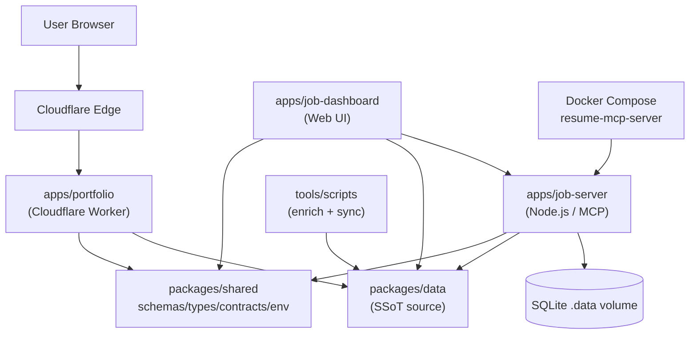

# 레쥬메 모노레포 / Resume Portfolio Monorepo


이 저장소는 개인 포트폴리오, 채용 자동화, 단일 진실 공급원(SSoT) 데이터, 자체 호스팅 옵저버빌리티를 하나의 npm 워크스페이스 모노레포로 통합한 저장소입니다. Cloudflare Workers 기반의 엣지 포트폴리오, Node.js 기반의 잡 자동화 서버(`apps/job-server`), 운영 대시보드(`apps/job-dashboard`), 그리고 다양한 공유 패키지(`packages/*`)로 구성되어 있습니다.

This repository is a personal npm workspaces monorepo that unifies a portfolio site, job automation, Single Source of Truth (SSoT) data, and self-hosted observability. It is composed of a Cloudflare Workers edge portfolio, a Node.js job automation server (`apps/job-server`), an operations dashboard (`apps/job-dashboard`), and several shared workspace packages (`packages/*`).

---

## 목차 / Table of Contents

- [개요 / Overview](#overview--개요)
- [주요 기능 / Features](#주요-기능--features)
- [아키텍처 / Architecture](#아키텍처--architecture)
- [저장소 구조 / Repository Structure](#저장소-구조--repository-structure)
- [빠른 시작 / Quick Start](#빠른-시작--quick-start)
- [설정 / Configuration](#설정--configuration)
- [명령어 레퍼런스 / Commands Reference](#명령어-레퍼런스--commands-reference)
- [로컬 개발 / Local Development](#로컬-개발--local-development)
- [테스트 / Testing](#테스트--testing)
- [배포 / Deployment](#배포--deployment)
- [기여 / Contributing](#기여--contributing)
- [라이선스 / License](#라이선스--license)

---

## Overview / 개요

`package.json`의 `description` 필드는 이 모노레포를 다음과 같이 설명합니다.

> Resume portfolio monorepo: Cloudflare Worker edge site, job automation (Wanted/JobKorea), SSoT data, self-hosted observability

핵심 가치 / Core values:

- **단일 진실 공급원(SSoT)** — 이력/프로필/스킬 데이터는 `packages/data`에서 한 번 정의되고, 포트폴리오/이력서/PDF/PPTX/대시보드 등 모든 산출물로 동기화됩니다.
- **엣지 우선 포트폴리오** — `apps/portfolio`는 Cloudflare Worker(`wrangler.jsonc`)로 배포되며, `worker.js`를 메인 엔트리로 사용합니다.
- **잡 자동화** — `apps/job-server`는 Wanted, JobKorea 등 플랫폼 대상 자동화 로직과 `proposal-review-cli` 같은 운영 도구를 제공합니다.
- **자체 호스팅 옵저버빌리티** — `Dockerfile`과 `docker-compose.yml`로 로컬 또는 사설 인프라에서 `mcp-server` 컨테이너를 실행할 수 있습니다.
- **풍부한 워크스페이스** — 4개의 앱(`portfolio`, `job-server`, `job-dashboard`, 기타)과 6개의 공유 패키지로 역할이 명확히 분리되어 있습니다.

---

## 주요 기능 / Features

| 영역 / Area | 설명 / Description |
| --- | --- |
| Portfolio Edge Site | Cloudflare Worker로 정적/동적 포트폴리오 제공 (`apps/portfolio`) |
| Job Automation | Wanted/JobKorea 등 채용 플랫폼 자동화 (`apps/job-server`) |
| Operations Dashboard | 지원 현황/통계/관리 화면 (`apps/job-dashboard`) |
| SSoT Data Layer | 이력/프로필/스킬의 단일 정의 (`packages/data`) |
| Shared Schemas | JSON Schema 기반 데이터 계약 (`packages/schemas`) |
| Type Contracts | 워크스페이스 간 타입 계약 (`packages/types`, `packages/contracts`) |
| CLI Tooling | 보조 명령행 도구 (`packages/cli`) |
| Env Management | 워크스페이스 공통 환경 변수 처리 (`packages/env`) |
| Proposal Review | 지원서 초안 검토 CLI (`apps/job-server/src/sync`) |
| Enrichment | GitHub/Skills/AI 메타데이터 보강 (`tools/scripts/enrichment/*`) |
| PPTX/PDF Gen | 신한 TA 등 프로필 PPTX/PDF 생성 (`tools/scripts/build`) |
| 1Password Integration | 시크릿/세션 시드/복원 (`tools/scripts/onepassword`) |
| Local Container | Docker 기반 `mcp-server` 실행 (`docker-compose.yml`) |
| Observability | 자체 헬스체크(`/health`) 및 큐 컨슈머(`apps/job-dashboard/src/queue-consumer.js`) |

---

## 아키텍처 / Architecture



### 데이터 흐름 / Data Flow

1. **SSoT 정의** — `packages/data`(및 인접한 `packages/schemas`, `packages/types`)에서 이력/프로필/스킬을 정의합니다.
2. **동기화** — `npm run sync:data` → `sync:pdf` → `sync:pptx` 순으로 포트폴리오, PDF, PPTX 산출물을 갱신합니다.
3. **보강** — `npm run enrich:all`이 GitHub 활동, 스킬, AI 메타데이터를 수집합니다.
4. **서빙** — `apps/portfolio`는 Cloudflare Worker로, `apps/job-dashboard`는 자체 서버로 배포됩니다.
5. **자동화** — `apps/job-server`는 큐/잡 오케스트레이션을 처리하며 `apps/job-dashboard`의 `queue-consumer.js`가 백그라운드 워크플로우를 수행합니다.
6. **컨테이너화** — `docker-compose up`으로 `mcp-server`를 띄워 사설 인프라에서 동일한 잡 자동화 런타임을 운영합니다.

### 컨테이너 토폴로지 / Container Topology

- 단일 서비스 `mcp-server`(`resume-mcp-server` 컨테이너)가 루트 `Dockerfile`을 사용해 `apps/job-server`를 Node 22 런타임으로 실행합니다.
- `job_automation_data` 명명 볼륨이 `/app/apps/job-server/.data`에 마운트되어 SQLite 등 영속 데이터를 보존합니다.
- 헬스체크는 30초 간격으로 컨테이너 내부의 `127.0.0.1:3000/health` 엔드포인트에 GET 요청을 보내 검증합니다.

---

## 저장소 구조 / Repository Structure

루트 디렉터리 기준 실제 레이아웃입니다. 워크스페이스(`apps/*`, `packages/*`)는 `npm workspaces`로 연결됩니다.

```
.
├── AGENTS.md
├── CHANGELOG.md
├── CONTRIBUTING.md
├── Dockerfile
├── LICENSE
├── OWNERS
├── README.md
├── docker-compose.yml
├── eslint.config.cjs
├── jest.config.cjs
├── lychee.toml
├── package.json
├── package-lock.json
├── playwright.config.js
├── redocly.yaml
├── tsconfig.base.json
├── tsconfig.json
├── wrangler.jsonc
├── applications/
│   ├── airpremia-security-2026/
│   ├── cloudflare-one-se-2026/
│   ├── coupang-fintech-sre-2026/
│   ├── gitlab-apac-security-2026/
│   └── infrastructure-architecture-2026/
├── apps/
│   ├── job-dashboard/
│   │   ├── API_REFERENCE.md
│   │   ├── DEPLOYMENT_GUIDE.md
│   │   ├── DEVELOPMENT_GUIDE.md
│   │   ├── DIAGRAMS.md
│   │   ├── SECRETS.md
│   │   ├── migrate-json-to-d1.cjs
│   │   ├── migration-data.sql
│   │   ├── schema.sql
│   │   ├── migrations/
│   │   │   └── 0002_add_approval_metadata.sql
│   │   └── src/
│   │       ├── index.js
│   │       ├── queue-consumer.js
│   │       ├── router.js
│   │       ├── middleware/
│   │       ├── routes/
│   │       └── handlers/
│   ├── job-server/                 # (워크스페이스로 선언됨)
│   └── portfolio/                  # (Cloudflare Worker, 메인 엔트리)
├── packages/
│   ├── cli/
│   ├── contracts/
│   ├── data/
│   ├── env/
│   ├── schemas/
│   ├── shared/
│   └── types/
└── ta/
    ├── 2.pptx
    ├── lee_jaecheol_profile_ta.pptx
    ├── lee_jaecheol_ta.pptx
    ├── lee_jaecheol_ta_profile.pptx
    ├── ta.pptx
    ├── improve_visual.py
    ├── inspect.py
    ├── verify.py
    └── output/
```

### 디렉터리별 역할 / Directory Roles

| 경로 / Path | 역할 / Role |
| --- | --- |
| `apps/portfolio/` | Cloudflare Worker 기반 포트폴리오(`worker.js`가 `main`) |
| `apps/job-server/` | 잡 자동화/오케스트레이션 백엔드 (`src/server/index.js`) |
| `apps/job-dashboard/` | 운영 대시보드 (라우터, 미들웨어, 라우트, 핸들러) |
| `packages/data/` | SSoT 데이터 모듈 |
| `packages/schemas/` | 데이터 스키마 정의 |
| `packages/types/` | 워크스페이스 타입 정의 |
| `packages/contracts/` | 워크스페이스 간 계약 |
| `packages/shared/` | 공통 유틸리티 |
| `packages/env/` | 환경 변수/설정 관리 |
| `packages/cli/` | 보조 CLI 도구 |
| `applications/` | 회사별 지원서/이력서/가이드 패키지 |
| `ta/` | 신한 TA 등 프로필 PPTX 자산 + Python 보조 스크립트 |
| `tools/scripts/` | 동기화, 보강, PDF/PPTX 생성, 1Password 통합 스크립트 (별도 트리) |

---

## 빠른 시작 / Quick Start

### 요구 사항 / Prerequisites

- **Node.js 22** (Dockerfile 베이스 이미지와 일치)
- **npm 10+** (workspaces 지원)
- **Python 3** (PPTX/검증 스크립트)
- **Go 1.22+** (PDF 생성, 프로포절 적용, 보강 스크립트)
- **Docker / Docker Compose** (컨테이너 실행 시)
- (선택) `exiftool` — `npm run strip-exif` 실행 시

### 설치 / Installation

```bash
git clone <repository-url>
cd resume
npm ci
```

### SSoT → 산출물 동기화 / Sync SSoT to Artifacts

```bash
npm run sync:data   # 데이터 동기화
npm run sync:pdf    # PDF 이력서 생성
npm run sync:pptx   # PPTX 프로필 생성
```

### 워크스페이스 빌드/검증 / Build & Verify

```bash
npm run typecheck
npm run lint
npm run test:node
```

### 로컬 컨테이너 실행 / Run Container Locally

```bash
cp .env.example .env  # 필요 시
docker compose up -d mcp-server
docker compose ps
docker compose logs -f mcp-server
```

---

## 설정 / Configuration

### 환경 변수 / Environment Variables

`docker-compose.yml`이 참조하는 `.env` 파일과 `apps/job-server` 런타임이 사용하는 변수:

| 변수 / Variable | 기본값 / Default | 설명 / Description |
| --- | --- | --- |
| `NODE_ENV` | `production` | Node 런타임 모드 |
| `PORT` | `3000` | `mcp-server`가 바인딩하는 포트 |

그 외 워크스페이스별 시크릿은 `tools/scripts/onepassword/*` 경로의 Go 스크립트(`op:seed:resume`, `op:seed:sessions`, `op:restore:sessions`)로 1Password에서 주입합니다.

### 포트폴리오 워커 설정 / Portfolio Worker Config

- `wrangler.jsonc` — Cloudflare Worker 바인딩/환경 정의
- `redocly.yaml` — OpenAPI/Redoc 린트 설정
- `lychee.toml` — 링크 검사기 설정

### 잡 대시보드 설정 / Job Dashboard Config

`apps/job-dashboard/SECRETS.md` 및 `DEPLOYMENT_GUIDE.md`를 참고하세요. 다음 파일이 핵심 설정 자산입니다.

- `apps/job-dashboard/schema.sql` — SQLite 스키마
- `apps/job-dashboard/migrations/0002_add_approval_metadata.sql` — 마이그레이션
- `apps/job-dashboard/migration-data.sql` — 초기 데이터
- `apps/job-dashboard/migrate-json-to-d1.cjs` — JSON → D1 변환기

### ESLint / TypeScript / Jest

- `eslint.config.cjs` — 평탄 설정(flat config)
- `tsconfig.base.json`, `tsconfig.json` — 베이스 및 루트 TS 설정
- `jest.config.cjs` — Node 테스트 러너
- `playwright.config.js` — E2E 테스트

---

## 명령어 레퍼런스 / Commands Reference

루트 `package.json`에 정의된 주요 스크립트입니다.

### SSoT / 산출물 동기화 / SSoT & Artifacts

| 명령어 / Command | 설명 / Description |
| --- | --- |
| `npm run sync:data` | `tools/scripts/utils/sync-resume-data.js`로 데이터 동기화 |
| `npm run sync:pdf` | `tools/scripts/build/pdf-generator.go`로 PDF 이력서 생성 |
| `npm run sync:pptx` | `tools/scripts/build/generate_shinhan_pptx.py`로 PPTX 프로필 생성 |
| `npm run sync:all` | data → pdf → pptx 순차 실행 |
| `npm run sync:proposals` | 지원서 초안 검토 + 프로포절 적용 |

### 1Password 통합 / 1Password Integration

| 명령어 / Command | 설명 / Description |
| --- | --- |
| `npm run op:run` | `tools/scripts/onepassword/run` |
| `npm run op:native:run` | `tools/scripts/onepassword/native-run` |
| `npm run op:seed:resume` | `tools/scripts/onepassword/seed-resume` |
| `npm run op:seed:sessions` | `tools/scripts/onepassword/session-files seed` |
| `npm run op:restore:sessions` | `tools/scripts/onepassword/session-files restore` |

### 보강 / Enrichment

| 명령어 / Command | 설명 / Description |
| --- | --- |
| `npm run enrich:github` | GitHub 활동 기반 메타데이터 보강 |
| `npm run enrich:skills` | 스킬 데이터 보강 |
| `npm run enrich:ai` | AI 기반 메타데이터 보강 |
| `npm run enrich:all` | 위 세 단계 통합 실행 |

### 자동화 파이프라인 / Automation Pipelines

| 명령어 / Command | 설명 / Description |
| --- | --- |
| `npm run automate:ssot` | sync + build + typecheck + test:node |
| `npm run automate:full` | sync:all + lint + typecheck + … (`package.json`에 정의된 전체 체인) |

### 자산 정리 / Asset Hygiene

| 명령어 / Command | 설명 / Description |
| --- | --- |
| `npm run strip-exif` | `apps/portfolio/src/images`에서 PNG/WebP의 EXIF 제거 (exiftool 필요) |

> 참고: `apps/job-server/src/sync/proposal-review-cli.js`는 `proposal-review` CLI로 직접 호출할 수도 있습니다.

---

## 로컬 개발 / Local Development

### 워크스페이스 의존성 / Workspace Dependencies

`package.json`의 `workspaces` 필드는 다음과 같습니다.

```json
[
  "apps/portfolio",
  "apps/job-server",
  "apps/job-dashboard",
  "packages/cli",
  "packages/data",
  "packages/shared",
  "packages/types",
  "packages/schemas",
  "packages/contracts",
  "packages/env"
]
```

npm 10 이상에서 `npm ci`는 루트 `package-lock.json`을 기준으로 모든 워크스페이스 의존성을 한 번에 설치합니다.

### 워크스페이스별 개발 흐름 / Per-Workspace Workflow

- **Portfolio** — `cd apps/portfolio && npx wrangler dev` (또는 `wrangler.jsonc` 기반 로컬 시뮬레이션)
- **Job Server** — `cd apps/job-server && node src/server/index.js`
- **Job Dashboard** — `cd apps/job-dashboard && node src/index.js` (라우터/미들웨어/라우트/핸들러 진입점은 `src/` 트리 참고)
- **Shared Packages** — 각 패키지 디렉터리에서 `npm run build` (해당 패키지에 정의된 경우)

### 잡 대시보드 구조 / Job Dashboard Internals

```
apps/job-dashboard/src/
├── index.js                 # 부트스트랩 엔트리
├── queue-consumer.js        # 큐 워커/잡 컨슈머
├── router.js                # 요청 라우팅
├── middleware/              # cors, csrf, rate-limit 등
├── routes/                  # admin, applications, auth, automation, health, stats, workflows, ...
└── handlers/                # auth, applications, auto-apply-webhook-handler 등
```

라우트별 자세한 API는 `apps/job-dashboard/API_REFERENCE.md`를, 다이어그램은 `DIAGRAMS.md`를 참고하세요.

### Python 자산 스크립트 / Python Asset Scripts

`ta/` 디렉터리는 PPTX 프로필 자산과 함께 다음 보조 스크립트를 포함합니다.

- `ta/inspect.py` — PPTX 내부 구조 점검
- `ta/verify.py` — 산출물 검증 (결과 예: `ta/output/verify_report_20260212.txt`)
- `ta/improve_visual.py` — 시각 자료 개선

```bash
cd ta
python3 verify.py
```

---

## 테스트 / Testing

| 영역 / Area | 도구 / Tool | 설정 / Config |
| --- | --- | --- |
| Node 단위 테스트 | Jest | `jest.config.cjs` |
| E2E 테스트 | Playwright | `playwright.config.js` |
| 타입 체크 | TypeScript | `tsconfig.base.json`, `tsconfig.json` |
| 린트 | ESLint | `eslint.config.cjs` |
| OpenAPI/문서 | Redocly | `redocly.yaml` |
| 링크 검사 | lychee | `lychee.toml` |

### 일반적인 명령 / Common Commands

```bash
npm run typecheck
npm run lint
npm run test:node
npx playwright test
```

`apps/job-dashboard/src/middleware/rate-limit.test.js` 등 일부 모듈은 워크스페이스 내부에 공존 테스트를 둡니다.

---

## 배포 / Deployment

### Cloudflare Worker (Portfolio)

```bash
cd apps/portfolio
npx wrangler deploy
```

`wrangler.jsonc`의 환경(예: `production`, `preview`)을 선택해 배포합니다.

### `mcp-server` 컨테이너

루트의 `Dockerfile`은 멀티 스테이지로 `apps/job-server` 런타임 이미지를 생성합니다.

- **deps 스테이지** — 루트 `package-lock.json`과 모든 워크스페이스 `package.json`을 먼저 복사한 뒤 `npm ci --omit=dev --ignore-scripts`로 프로덕션 의존성을 설치합니다.
- **runtime 스테이지** — `@resume/{shared,schemas,types,data,env}` 패키지 소스와 `apps/job-server`를 복사하고 `node src/server/index.js`를 실행합니다.
- **헬스체크** — `HEALTHCHECK`와 docker-compose의 `healthcheck` 모두 컨테이너 내부 `127.0.0.1:3000/health`를 30초마다 확인합니다.

```bash
docker compose build mcp-server
docker compose up -d mcp-server
docker compose logs -f mcp-server
```

`job_automation_data` 명명 볼륨이 `/app/apps/job-server/.data`에 마운트되므로 컨테이너를 재생성해도 잡 자동화 데이터는 유지됩니다.

> 원격 호스트 주소가 필요한 경우, 사설 IP(예: `192.168.x.x`, `10.x.x.x`)를 README에 하드코딩하지 마세요. `.env`의 `PORT`/`NODE_ENV`와 Cloudflare/Vault 시크릿을 통해 주입하세요.

---

## 기여 / Contributing

기여 절차는 `CONTRIBUTING.md`에 정리되어 있으며, 코드 오너십은 `OWNERS` 파일을 참고하세요. 변경 이력은 `CHANGELOG.md`에서 추적합니다.

기여 시 권장 워크플로우:

1. 이슈 또는 작업을 생성하고 영향 범위(예: `apps/job-server`, `packages/data`)를 명시합니다.
2. 관련 워크스페이스에서 변경 후 `npm run typecheck && npm run lint && npm run test:node`를 통과시킵니다.
3. SSoT 영향을 주는 변경이라면 `npm run sync:all`로 산출물(웹/PDF/PPTX)을 함께 갱신합니다.
4. PR에 변경 요약, 테스트 결과, 관련 문서(`API_REFERENCE.md`, `DEPLOYMENT_GUIDE.md`, `SECRETS.md` 등) 업데이트를 포함합니다.
5. 자동화/보안 관련 변경은 `AGENTS.md` 가이드라인을 함께 검토합니다.

---

## 라이선스 / License

이 저장소는 사설 라이선스입니다. 자세한 내용은 [`LICENSE`](./LICENSE) 파일을 참고하세요. 외부에 공개된 자료(이력서, 회사별 지원서 등)를 포함하므로, 재배포/2차 가공 전에 라이선스 조건을 반드시 확인하세요.

This repository is distributed under a private license. See [`LICENSE`](./LICENSE) for the full terms. Because the repository contains externally submitted application materials (resumes, cover letters, company-specific guides), please verify license terms before redistributing or reusing any artifact.