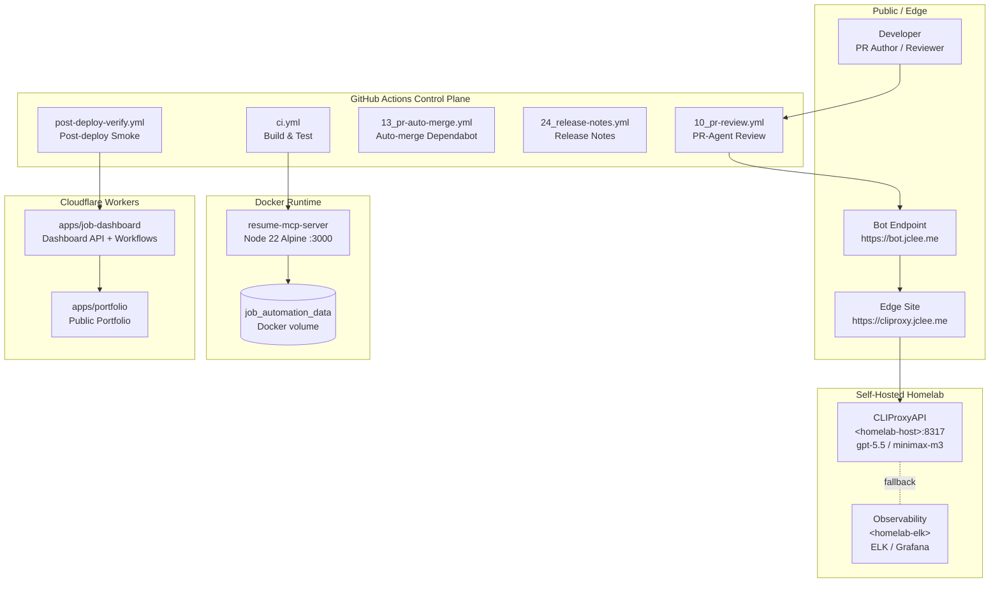

# Resume Portfolio Monorepo / 이력서 포트폴리오 모노레포

[](package.json)
[](https://nodejs.org/)
[](https://workers.cloudflare.com/)
[](LICENSE)
[](Dockerfile)
[](wrangler.jsonc)
[](https://github.com/qodo-ai/pr-agent)
[](apps/job-server)
[](https://cliproxy.jclee.me/v1)
[](https://bot.jclee.me)
[](README.md)

> **Bilingual documentation** / **이중 언어 문서**: Every section header is duplicated in English and Korean. English text appears first, followed by the Korean (한국어) translation under the same heading.
> 본 README는 모든 섹션을 영어와 한국어로 병기합니다. 같은 제목 아래에 영어 본문이 먼저, 한국어 번역이 이어집니다.

> **Primary README generator model:** `gpt-5.5` (fallback: `minimax-m3` via the [cliproxy.jclee.me](https://cliproxy.jclee.me/v1) edge proxy).
> **README 생성 기본 모델:** `gpt-5.5` (대체: [cliproxy.jclee.me](https://cliproxy.jclee.me/v1) 엣지 프록시 경유 `minimax-m3`).

---

## Overview / 개요

`resume` (v1.40.11) is a private, opinionated **resume portfolio monorepo** that fuses five surfaces into a single workspace:

1. A **Cloudflare Worker edge portfolio** served from the `apps/portfolio` workspace.
2. A **job-automation HTTP runtime** (`apps/job-server`) containerized as a Docker image, exposing an MCP-style API for Wanted / JobKorea crawlers and sync flows.
3. A **dashboard Worker** (`apps/job-dashboard`) that fronts operational workflows, admin endpoints, queue consumers, and webhook handlers.
4. A **job-application asset library** (`applications/`) holding role-specific resumes, cover letters, and interview Q&A.
5. A **TA profile generator** (`ta/`) that turns canonical resume data into branded PPTX deliverables.

The workspace is the Single Source of Truth (SSoT) for resume content (`packages/data/`), shared JSDoc/TS types (`packages/types/`), Zod validation schemas (`packages/schemas/`), OpenAPI contracts (`packages/contracts/`), and cross-package utilities (`packages/shared/`). 19 GitHub Actions workflows in `.github/workflows/` automate the entire PR → review → release → post-deploy loop, with self-hosted observability and a CLIProxyAPI edge proxy in the loop for LLM-backed automation.

`resume` (v1.40.11)는 다음 다섯 가지 표면을 단일 워크스페이스로 결합한 사적(opinionated) **이력서 포트폴리오 모노레포**입니다.

1. `apps/portfolio` 워크스페이스에서 제공되는 **Cloudflare Worker 엣지 포트폴리오**.
2. `apps/job-server`로 컨테이너화된 **잡 자동화 HTTP 런타임**(MCP 스타일 API 제공 — Wanted/JobKorea 크롤러 및 동기화 흐름).
3. 운영 워크플로우, 관리자 엔드포인트, 큐 컨슈머, 웹훅 핸들러를 프론트엔드하는 **대시보드 Worker**(`apps/job-dashboard`).
4. 직무별 이력서, 자기소개서, 면접 Q&A를 보관하는 **지원 자산 라이브러리**(`applications/`).
5. 표준 이력서 데이터를 브랜디드 PPTX 결과물로 변환하는 **TA 프로필 생성기**(`ta/`).

이 워크스페이스는 이력서 콘텐츠의 단일 진실 공급원(Single Source of Truth, SSoT)인 `packages/data/`, 공유 JSDoc/TS 타입의 `packages/types/`, Zod 검증 스키마의 `packages/schemas/`, OpenAPI 컨트랙트의 `packages/contracts/`, 패키지 공용 유틸리티의 `packages/shared/`를 둡니다. `.github/workflows/`의 19개 GitHub Actions 워크플로우가 PR → 리뷰 → 릴리스 → 배포 후 검증 루프 전체를 자동화하며, LLM 기반 자동화를 위해 셀프 호스트 옵저버빌리티 스택과 CLIProxyAPI 엣지 프록시가 협업합니다.

---

## Features / 기능

- **Edge portfolio on Cloudflare Workers** — fast, globally cached public surface with `wrangler.jsonc` as the deployment manifest.
- **Job-automation HTTP API** — `apps/job-server` is built into a multi-stage Alpine image (`Dockerfile`) and orchestrated by `docker-compose.yml` as the `resume-mcp-server` service, exposing port 3000 with a Docker healthcheck against `/health`.
- **Dashboard Worker with Cloudflare Workflows** — `apps/job-dashboard` ships a router, middleware layer (CORS/CSRF/rate-limit), REST routes (auth, applications, admin, stats, health, automation, workflows), and a queue consumer.
- **Canonical data & types SSoT** — `packages/data/resumes/master/resume_data.json` is the authoritative content root; types, schemas, and OpenAPI contracts are derived from it.
- **Job-application asset library** — five role-targeted application packages under `applications/` (airpremia-security, infrastructure-architecture, coupang-fintech-sre, cloudflare-one-se, gitlab-apac-security), each with role-specific resume PDF/HTML and cover letter.
- **TA profile generator** — Python-based PPTX generation pipeline in `ta/` with an `output/` directory for verified deliverables and dated verification reports.
- **PR-Agent integration** — `qodo-ai/pr-agent` is wired into the review pipeline.
- **Operator scripts** — `package.json` exposes a rich set of `sync:*`, `enrich:*`, `op:*`, and `automate:*` scripts for one-shot content regeneration and verification.
- **Edge LLM proxy** — `https://cliproxy.jclee.me/v1` fronts the LLM calls made by automation; `https://bot.jclee.me` is the bot service endpoint invoked from workflows.

- **Cloudflare Workers 기반 엣지 포트폴리오** — `wrangler.jsonc`를 배포 매니페스트로 사용하는 전 세계 캐시형 공개 표면.
- **잡 자동화 HTTP API** — `apps/job-server`는 멀티스테이지 Alpine 이미지(`Dockerfile`)로 빌드되어 `docker-compose.yml`의 `resume-mcp-server` 서비스로 오케스트레이션되며, `/health`에 대한 Docker 헬스체크와 함께 3000 포트를 노출합니다.
- **Cloudflare Workflows를 갖춘 대시보드 Worker** — `apps/job-dashboard`는 라우터, 미들웨어 계층(CORS/CSRF/rate-limit), REST 라우트(auth, applications, admin, stats, health, automation, workflows), 큐 컨슈머를 제공합니다.
- **표준 데이터 및 타입 SSoT** — `packages/data/resumes/master/resume_data.json`이 권위 있는 콘텐츠 루트이며, 타입·스키마·OpenAPI 컨트랙트는 여기서 파생됩니다.
- **잡 애플리케이션 자산 라이브러리** — `applications/` 아래 5개 직무별 지원 패키지(airpremia-security, infrastructure-architecture, coupang-fintech-sre, cloudflare-one-se, gitlab-apac-security). 각 패키지는 직무 특화 이력서 PDF/HTML과 자기소개서를 포함합니다.
- **TA 프로필 생성기** — `ta/`의 Python 기반 PPTX 생성 파이프라인. 검증된 결과물과 일자별 검증 리포트를 `output/`에 보관합니다.
- **PR-Agent 통합** — `qodo-ai/pr-agent`이 리뷰 파이프라인에 연결되어 있습니다.
- **운영자 스크립트** — `package.json`은 1회성 콘텐츠 재생성·검증을 위한 풍부한 `sync:*`, `enrich:*`, `op:*`, `automate:*` 스크립트를 제공합니다.
- **엣지 LLM 프록시** — `https://cliproxy.jclee.me/v1`가 자동화의 LLM 호출을 프론트엔드하며, `https://bot.jclee.me`는 워크플로우에서 호출되는 봇 서비스 엔드포인트입니다.

---

## Architecture / 아키텍처

The system has four trust boundaries: a **public edge** (Cloudflare Workers + the bot/edge endpoints), a **GitHub Actions control plane** (19 workflows), a **self-hosted homelab** that runs the LLM proxy and observability stack, and a **containerized runtime** for the MCP job server. The Mermaid diagram below uses GitHub-native syntax; placeholders `<homelab-host>` and `<homelab-elk>` are HTML-escaped inside quoted labels per Mermaid rendering requirements.

시스템은 네 가지 신뢰 경계(공개 엣지, GitHub Actions 컨트롤 플레인, 셀프 호스트 홈랩, 컨테이너 런타임)로 구성됩니다. 아래 다이어그램은 GitHub 네이티브 Mermaid 문법을 사용하며, Mermaid 렌더링 요구사항에 따라 `<homelab-host>`, `<homelab-elk>` 플레이스홀더는 따옴표로 감싸고 HTML 이스케이프했습니다.



**Reading the diagram / 다이어그램 읽기**

- Public PR/issue events enter the control plane through standard GitHub webhooks and route into `10_pr-review.yml` (PR-Agent via `qodo-ai/pr-agent`).
- The bot service at `bot.jclee.me` and the edge site at `cliproxy.jclee.me` are the only public ingress points for LLM-backed automation; they forward into CLIProxyAPI on the homelab host.
- The MCP runtime runs inside a Docker Compose stack with a persistent `job_automation_data` volume; the Dockerfile is a two-stage `node:22-alpine` build.
- `post-deploy-verify.yml` exercises the dashboard Worker after each release.

- 공개 PR/이슈 이벤트는 표준 GitHub 웹훅을 통해 컨트롤 플레인으로 진입하여 `10_pr-review.yml`(PR-Agent, `qodo-ai/pr-agent`)로 라우팅됩니다.
- `bot.jclee.me` 봇 서비스와 `cliproxy.jclee.me` 엣지 사이트는 LLM 기반 자동화를 위한 유일한 공개 인그레스 포인트이며, 홈랩 호스트의 CLIProxyAPI로 전달합니다.
- MCP 런타임은 영구 `job_automation_data` 볼륨을 사용하는 Docker Compose 스택 내부에서 실행되며, Dockerfile은 2단계 `node:22-alpine` 빌드입니다.
- `post-deploy-verify.yml`은 각 릴리스 이후 대시보드 Worker를 검증합니다.

---

## Repository Structure / 저장소 구조

The listing below reflects the **actual top-level layout** of the repository. Subdirectories that exist on disk (e.g., `apps/portfolio`, `apps/job-server`, `packages/*`, `tools/`, `tests/`, `infrastructure/`, `docs/`, `supabase/`, `third_party/`, `.github/`) are referenced in `AGENTS.md` and may be partially omitted from this tree for brevity; consult `AGENTS.md` for the canonical full map.

아래 목록은 저장소의 **실제 최상위 레이아웃**을 반영합니다. 디스크에 존재하는 하위 디렉터리(예: `apps/portfolio`, `apps/job-server`, `packages/*`, `tools/`, `tests/`, `infrastructure/`, `docs/`, `supabase/`, `third_party/`, `.github/`)는 `AGENTS.md`에 명시되어 있으며, 본 트리에서는 가독성을 위해 일부 생략될 수 있습니다. 정식 전체 지도는 `AGENTS.md`를 참조하세요.

```text
.
├── AGENTS.md                    # Project knowledge base (SSoT for structure)
├── CHANGELOG.md
├── CONTRIBUTING.md
├── Dockerfile                   # Multi-stage Node 22 Alpine build (job-server)
├── LICENSE
├── OWNERS
├── README.md
├── docker-compose.yml           # resume-mcp-server stack
├── eslint.config.cjs
├── jest.config.cjs
├── lychee.toml                  # Link checker config
├── package.json                 # Workspace root + operator scripts
├── package-lock.json
├── playwright.config.js         # E2E test runner config
├── redocly.yaml                 # OpenAPI lint config
├── tsconfig.base.json
├── tsconfig.json
├── wrangler.jsonc               # Cloudflare Workers config
│
├── ta/                          # TA profile PPTX generation
│   ├── AGENTS.md
│   ├── improve_visual.py
│   ├── inspect.py
│   ├── verify.py
│   ├── lee_jaecheol_ta.pptx
│   ├── lee_jaecheol_profile_ta.pptx
│   ├── lee_jaecheol_ta_profile.pptx
│   ├── ta.pptx
│   ├── 2.pptx
│   └── output/                  # Verified deliverables + dated reports
│
├── applications/                # Job-application asset library
│   ├── airpremia-security-2026/
│   ├── infrastructure-architecture-2026/
│   ├── coupang-fintech-sre-2026/
│   ├── cloudflare-one-se-2026/
│   └── gitlab-apac-security-2026/
│
└── apps/
    └── job-dashboard/           # Cloudflare Worker dashboard
        ├── AGENTS.md
        ├── API_REFERENCE.md
        ├── DEPLOYMENT_GUIDE.md
        ├── DEVELOPMENT_GUIDE.md
        ├── DIAGRAMS.md
        ├── OWNERS
        ├── README.md
        ├── SECRETS.md
        ├── migrate-json-to-d1.cjs
        ├── migration-data.sql
        ├── package.json
        ├── schema.sql
        ├── tsconfig.json
        ├── migrations/
        │   └── 0002_add_approval_metadata.sql
        └── src/
            ├── index.js
            ├── queue-consumer.js
            ├── router.js
            ├── middleware/      # cors, csrf, rate-limit
            ├── routes/          # admin, applications, auth, automation, health, index, stats, workflows
            └── handlers/        # applications, auth, auto-apply-webhook-handler
```

---

## Automation Inventory / 자동화 인벤토리

### GitHub Actions Workflows / GitHub Actions 워크플로우

The repository ships **19 GitHub Actions workflows** under `.github/workflows/`. The numeric prefix is the routing order used by the bot; bare names without the prefix are intentionally not used.

이 저장소는 `.github/workflows/` 아래 **19개의 GitHub Actions 워크플로우**를 제공합니다. 숫자 접두사는 봇이 사용하는 라우팅 순서이며, 접두사 없는 이름은 의도적으로 사용하지 않습니다.

| # | Workflow file | Purpose | Category |
|---|---|---|---|
| 01 | `01_branch-to-pr.yml` | Open a PR from a freshly created branch | Branch / PR |
| 02 | `02_issue-to-branch.yml` | Convert an issue into a working branch | Branch / PR |
| 10 | `10_pr-review.yml` | Trigger PR-Agent (`qodo-ai/pr-agent`) review on every PR | Review |
| 11 | `11_security-pr-review.yml` | Security-focused PR review pass | Review |
| 12 | `12_dependabot-auto-merge.yml` | Auto-merge eligible Dependabot PRs | Dependabot |
| 13 | `13_pr-auto-merge.yml` | Auto-merge PRs that satisfy the merge gate | Merge |
| 14 | `14_bot-auto-fix.yml` | Apply automated bot fixes in response to review feedback | Bot |
| 15 | `15_merged-pr-cleanup.yml` | Post-merge branch / label / linked-issue cleanup | Maintenance |
| 19 | `19_issue-backfill.yml` | Backfill issues from external trackers | Maintenance |
| 24 | `24_release-notes.yml` | Generate release notes from merged PRs | Release |
| 25 | `25_release-publish.yml` | Publish release artifacts / tags | Release |
| 29 | `29_downstream-health-check.yml` | Probe downstream health after release | Post-deploy |
| 37 | `37_ci-failure-issues.yml` | Open a tracking issue when CI fails | CI |
| — | `auto-sync-data.yml` | Resync SSoT resume data | Data sync |
| — | `ci.yml` | Build, lint, typecheck, test | CI |
| — | `delete-standalone-job-worker.yml` | Tear down the standalone job Worker | Worker |
| — | `post-deploy-verify.yml` | Smoke-test the dashboard Worker after deploy | Post-deploy |
| — | `provision-queues.yml` | Provision Cloudflare Queues for the dashboard | Worker |
| — | `release.yml` | End-to-end release pipeline (notes + publish) | Release |

| # | 워크플로우 파일 | 목적 | 분류 |
|---|---|---|---|
| 01 | `01_branch-to-pr.yml` | 새 브랜치에서 PR 열기 | 브랜치/PR |
| 02 | `02_issue-to-branch.yml` | 이슈를 작업 브랜치로 변환 | 브랜치/PR |
| 10 | `10_pr-review.yml` | 모든 PR에서 PR-Agent(`qodo-ai/pr-agent`) 리뷰 트리거 | 리뷰 |
| 11 | `11_security-pr-review.yml` | 보안 중심 PR 리뷰 패스 | 리뷰 |
| 12 | `12_dependabot-auto-merge.yml` | 조건을 충족하는 Dependabot PR 자동 병합 | Dependabot |
| 13 | `13_pr-auto-merge.yml` | 병합 게이트를 통과한 PR 자동 병합 | 병합 |
| 14 | `14_bot-auto-fix.yml` | 리뷰 피드백에 따라 봇 자동 수정 적용 | 봇 |
| 15 | `15_merged-pr-cleanup.yml` | 병합 후 브랜치/라벨/연결 이슈 정리 | 유지보수 |
| 19 | `19_issue-backfill.yml` | 외부 트래커에서 이슈 백필 | 유지보수 |
| 24 | `24_release-notes.yml` | 병합된 PR에서 릴리스 노트 생성 | 릴리스 |
| 25 | `25_release-publish.yml` | 릴리스 아티팩트/태그 게시 | 릴리스 |
| 29 | `29_downstream-health-check.yml` | 릴리스 후 다운스트림 헬스 프로빙 | 배포 후 |
| 37 | `37_ci-failure-issues.yml` | CI 실패 시 추적 이슈 오픈 | CI |
| — | `auto-sync-data.yml` | SSoT 이력서 데이터 재동기화 | 데이터 동기화 |
| — | `ci.yml` | 빌드, 린트, 타입체크, 테스트 | CI |
| — | `delete-standalone-job-worker.yml` | 단독 잡 Worker 해체 | Worker |
| — | `post-deploy-verify.yml` | 배포 후 대시보드 Worker 스모크 테스트 | 배포 후 |
| — | `provision-queues.yml` | 대시보드용 Cloudflare Queues 프로비저닝 | Worker |
| — | `release.yml` | 종단간 릴리스 파이프라인(노트 + 게시) | 릴리스 |

### Go Automation Tools / Go 자동화 도구

The current automation surface in `tools/` is **0 Go-based executables**. All automation that previously lived in `tools/scripts/...` is either:

- invoked from `package.json` scripts that wrap a `go run ./...` command (e.g., `sync:pdf`, `op:run`, `enrich:github`), or
- delegated to the GitHub Actions workflows above.

If you add a new Go automation tool, register it in `package.json` scripts and document it here.

`tools/`의 현재 자동화 표면은 **Go 실행 파일 0개**입니다. 기존 `tools/scripts/...`에 있던 자동화는 다음 중 하나입니다.

- `go run ./...` 호출을 감싼 `package.json` 스크립트로 노출됨(예: `sync:pdf`, `op:run`, `enrich:github`), 혹은
- 위 GitHub Actions 워크플로우로 위임됨.

새 Go 자동화 도구를 추가할 경우 `package.json` 스크립트에 등록하고 본 섹션에 문서화하세요.

---

## Quick Start / 빠른 시작

The fastest path to a running MCP job server is via Docker Compose. The `resume-mcp-server` container builds from the root `Dockerfile` (multi-stage `node:22-alpine`), exposes port `3000`, and persists state to a local Docker volume named `job_automation_data`.

MCP 잡 서버를 가장 빠르게 기동하는 경로는 Docker Compose입니다. `resume-mcp-server` 컨테이너는 루트 `Dockerfile`(멀티스테이지 `node:22-alpine`)에서 빌드되며, 3000 포트를 노출하고 `job_automation_data`라는 로컬 Docker 볼륨에 상태를 보존합니다.

```bash
# 1. Clone the repository
git clone <repo-url> resume && cd resume

# 2. Provide required environment variables
cp .env.example .env   # then fill in secrets referenced in apps/job-server

# 3. Build and start the MCP job server
docker compose up -d --build

# 4. Verify health
curl -fsS http://127.0.0.1:3000/health
```

The Cloudflare Worker portfolio and dashboard are deployed separately via Wrangler using `wrangler.jsonc`. See `apps/portfolio/` and `apps/job-dashboard/DEPLOYMENT_GUIDE.md` for per-app deploy instructions.

Cloudflare Worker 포트폴리오와 대시보드는 `wrangler.jsonc`를 통해 Wrangler로 별도 배포됩니다. 앱별 배포 지침은 `apps/portfolio/` 및 `apps/job-dashboard/DEPLOYMENT_GUIDE.md`를 참조하세요.

---

## Local Development / 로컬 개발

1. **Toolchain** — Node.js ≥ 22, npm 10+, Docker 24+, Wrangler (`npx wrangler`), and optionally Python 3 for the `ta/` PPTX pipeline.
2. **Install workspace dependencies** — `npm install` at the repository root. The root `package.json` declares all workspaces; `npm ci` from the root lockfile is the supported reproducer.
3. **Run the MCP server in dev** — `docker compose up --build` is the canonical loop. For a faster Node-only iteration you can `cd apps/job-server && node src/server/index.js` once env vars are exported.
4. **Run the dashboard worker locally** — `cd apps/job-dashboard && npx wrangler dev` per the local config in `wrangler.jsonc`.
5. **Iterate on resume content** — edit `packages/data/resumes/master/resume_data.json` and then run `npm run automate:ssot` to regenerate derived artifacts and re-run typecheck + tests.
6. **TA profile generation** — `ta/inspect.py` introspects an existing `.pptx`, `ta/improve_visual.py` applies visual changes, `ta/verify.py` runs verification, and dated reports land in `ta/output/`.
7. **Lint, typecheck, test** — `npm run lint`, `npm run typecheck`, `npm test` (Jest), and `npx playwright test` (E2E) are the standard quality gates.

1. **툴체인** — Node.js ≥ 22, npm 10+, Docker 24+, Wrangler(`npx wrangler`), 그리고 `ta/` PPTX 파이프라인을 위한 Python 3(선택).
2. **워크스페이스 의존성 설치** — 저장소 루트에서 `npm install`. 루트 `package.json`이 모든 워크스페이스를 선언하며, 루트 잠금 파일 기반 재현은 `npm ci`를 사용하세요.
3. **개발 모드에서 MCP 서버 실행** — 정식 루프는 `docker compose up --build`. Node 단독 반복 개발은 환경변수 export 후 `cd apps/job-server && node src/server/index.js`로 가능합니다.
4. **대시보드 Worker 로컬 실행** — `wrangler.jsonc` 로컬 설정을 사용해 `cd apps/job-dashboard && npx wrangler dev`.
5. **이력서 콘텐츠 반복** — `packages/data/resumes/master/resume_data.json`을 수정한 뒤 `npm run automate:ssot`을 실행해 파생 아티팩트를 재생성하고 타입체크 + 테스트를 다시 실행합니다.
6. **TA 프로필 생성** — `ta/inspect.py`가 기존 `.pptx`를 분석, `ta/improve_visual.py`가 시각적 변경을 적용, `ta/verify.py`가 검증을 실행하며, 일자별 리포트는 `ta/output/`에 저장됩니다.
7. **린트, 타입체크, 테스트** — `npm run lint`, `npm run typecheck`, `npm test`(Jest), `npx playwright test`(E2E)가 표준 품질 게이트입니다.

---

## Commands Reference / 명령어 참조

The following operator scripts are exposed by the root `package.json` and form the canonical one-liners for the most common maintenance flows. The list is curated; see `package.json` for the full set.

아래 운영자 스크립트는 루트 `package.json`에서 노출되며 가장 일반적인 유지보수 흐름의 표준 원라이너입니다. 발췌 목록이며, 전체 집합은 `package.json`을 참조하세요.

### Sync / 동기화

| Script | Command | Use case |
|---|---|---|
| `sync:data` | `node tools/scripts/utils/sync-resume-data.js` | Re-emit derived JSON from the SSoT |
| `sync:pdf` | `go run ./tools/scripts/build/pdf-generator.go master` | Regenerate role-specific PDFs |
| `sync:pptx` | `python3 tools/scripts/build/generate_shinhan_pptx.py` | Regenerate the TA PPTX |
| `sync:all` | `sync:data && sync:pdf && sync:pptx` | Full content regeneration |
| `sync:proposals` | `node apps/job-server/src/sync/proposal-review-cli.js && go run ./tools/scripts/sync/apply-proposals.go` | Review and apply pending proposals |
| `strip-exif` | `exiftool -all= ...` | Strip EXIF metadata from portfolio assets |

### 1Password session helpers / 1Password 세션 헬퍼

| Script | Purpose |
|---|---|
| `op:run` | Run an op-mode task |
| `op:native:run` | Run a task in native op-mode |
| `op:seed:resume` | Seed resume-related 1Password items |
| `op:seed:sessions` | Seed session files into 1Password |
| `op:restore:sessions` | Restore session files from 1Password |

### Enrichment / Enrichment

| Script | Command | Purpose |
|---|---|---|
| `enrich:github` | `cd tools/scripts/enrichment/github && go run main.go` | Enrich profile with GitHub data |
| `enrich:skills` | `cd tools/scripts/enrichment/skills && go run main.go` | Enrich skills taxonomy |
| `enrich:ai` | `cd tools/scripts/enrichment/ai && go run main.go` | AI-assisted enrichment pass |
| `enrich:all` | runs all three | Full enrichment sweep |

### Automate / 자동화

| Script | Command | Purpose |
|---|---|---|
| `automate:ssot` | `sync:data && sync:pdf && build && typecheck && test:node` | SSoT regeneration + verification |
| `automate:full` | `sync:all && lint && typecheck && ...` | Full pre-release sweep |

### Docker / Docker

```bash
# Build only
docker build -t resume-mcp-server .

# Bring up the stack
docker compose up -d --build

# Tail logs
docker compose logs -f mcp-server

# Tear down (keeps the volume)
docker compose down
```

### Wrangler / Wrangler

```bash
# Local dev for the portfolio worker
cd apps/portfolio && npx wrangler dev

# Local dev for the dashboard worker
cd apps/job-dashboard && npx wrangler dev

# Production deploy (uses wrangler.jsonc)
npx wrangler deploy
```

### 한국어 요약 / Korean summary

- `sync:*`는 SSoT에서 파생 산출물(JSON, PDF, PPTX)을 재생성합니다.
- `op:*`는 1Password 시드 및 세션 복원 헬퍼입니다.
- `enrich:*`는 GitHub/스킬/AI 경로의 데이터 보강을 수행합니다.
- `automate:*`는 `sync`를 검증 게이트(build, typecheck, test)와 묶어 회귀 위험을 줄입니다.
- `docker compose`는 MCP 잡 서버 스택, `wrangler`는 Cloudflare Worker 표면을 다룹니다.

---

## Contribution Guide / 기여 가이드

1. **Read the project knowledge base first** — `AGENTS.md` is the canonical map of the workspace, including the SSoT for resume content (`packages/data/resumes/master/resume_data.json`) and the routing order of the 19 workflows.
2. **Follow the change-type policy**:
   - Content changes to the canonical resume must land in `packages/data/` and be regenerated via `npm run automate:ssot`.
   - New application assets belong under `applications/<role>-<year>/` and must include a cover letter (`cover_letter.md`) plus a resume PDF/HTML.
   - TA profile changes use the `ta/` Python pipeline; verify with `ta/verify.py` and commit dated reports to `ta/output/`.
3. **Open a branch via the bot** — issue `02_issue-to-branch.yml` for an issue-to-branch conversion, or push a branch and let `01_branch-to-pr.yml` open the PR. Use the conventional commit style already established in the repo.
4. **Wait for the review gates** — `10_pr-review.yml` triggers PR-Agent (`qodo-ai/pr-agent`), `11_security-pr-review.yml` runs the security pass, and `ci.yml` enforces build, lint, typecheck, and tests. The merge gate is `13_pr-auto-merge.yml`.
5. **Respect the release pipeline** — release notes come from `24_release-notes.yml`, the publish step is `25_release-publish.yml`, the end-to-end pipeline is `release.yml`, and `post-deploy-verify.yml` smoke-tests the dashboard Worker.
6. **Consult ownership** — root-level code ownership is tracked in `OWNERS`; per-app ownership lives in `apps/*/OWNERS`.
7. **Do not commit secrets** — use the `op:*` scripts and 1Password sessions. See `apps/job-dashboard/SECRETS.md` for the dashboard's secret catalog and `SECRETS.md` references inside other packages.

1. **먼저 프로젝트 지식 베이스를 읽으세요** — `AGENTS.md`는 이력서 콘텐츠의 SSoT(`packages/data/resumes/master/resume_data.json`)와 19개 워크플로우의 라우팅 순서를 포함한 워크스페이스 정식 지도입니다.
2. **변경 유형 정책을 따르세요**:
   - 표준 이력서에 대한 콘텐츠 변경은 `packages/data/`에 랜딩하고 `npm run automate:ssot`으로 재생성해야 합니다.
   - 새 지원 자산은 `applications/<role>-<year>/` 아래에 위치하며, 자기소개서(`cover_letter.md`)와 이력서 PDF/HTML을 반드시 포함해야 합니다.
   - TA 프로필 변경은 `ta/` Python 파이프라인을 사용하고, `ta/verify.py`로 검증한 뒤 일자별 리포트를 `ta/output/`에 커밋하세요.
3. **봇을 통해 브랜치를 여세요** — 이슈 기반 작업은 `02_issue-to-branch.yml`, 브랜치 푸시 기반 PR은 `01_branch-to-pr.yml`이 처리합니다. 저장소에서 확립된 컨벤셔널 커밋 스타일을 따르세요.
4. **리뷰 게이트를 기다리세요** — `10_pr-review.yml`이 PR-Agent(`qodo-ai/pr-agent`)를 트리거하고, `11_security-pr-review.yml`이 보안 패스를 실행하며, `ci.yml`이 빌드·린트·타입체크·테스트를 강제합니다. 병합 게이트는 `13_pr-auto-merge.yml`입니다.
5. **릴리스 파이프라인을 존중하세요** — 릴리스 노트는 `24_release-notes.yml`, 게시 단계는 `25_release-publish.yml`, 종단간 파이프라인은 `release.yml`이며, `post-deploy-verify.yml`이 대시보드 Worker를 스모크 테스트합니다.
6. **소유권을 확인하세요** — 루트 레벨 코드 소유권은 `OWNERS`에, 앱별 소유권은 `apps/*/OWNERS`에 추적됩니다.
7. **시크릿을 커밋하지 마세요** — `op:*` 스크립트와 1Password 세션을 사용하세요. 대시보드의 시크릿 카탈로그는 `apps/job-dashboard/SECRETS.md`, 다른 패키지의 시크릿 참조는 해당 패키지의 `SECRETS.md`를 참조하세요.

---

_Last regenerated by the README-gen pipeline (primary: `gpt-5.5`, fallback: `minimax-m3` via the `https://cliproxy.jclee.me/v1` edge proxy)._
_본 문서는 README-gen 파이프라인(기본: `gpt-5.5`, 대체: `https://cliproxy.jclee.me/v1` 엣지 프록시 경유 `minimax-m3`)에 의해 마지막으로 재생성되었습니다._