# Resume Portfolio Monorepo / 이력서 포트폴리오 모노레포

`version: 1.40.11` · `Node.js: >=22` · `Docker: enabled` · `Cloudflare Workers: configured` · `Wrangler: configured` · `License: MIT` · `PR-Agent: qodo-ai/pr-agent` · `Bot: jclee-bot` · `README-gen primary: gpt-5.5` · `fallback: minimax-m3 via CLIProxyAPI`

[](#license)
[](https://nodejs.org)
[](#quick-start)
[](#architecture)
[](https://github.com/qodo-ai/pr-agent)
[](#jclee-bot-automation-surfaces)

## External Surfaces / 외부 노출면

- PR-Agent upstream: [qodo-ai/pr-agent](https://github.com/qodo-ai/pr-agent)
- CLIProxyAPI endpoint: [https://cliproxy.jclee.me/v1](https://cliproxy.jclee.me/v1)
- Bot surface: [https://bot.jclee.me](https://bot.jclee.me)

---

## Overview / 개요

### English

This repository is a private resume and job-application automation monorepo. It consolidates bilingual resume artifacts, per-employer application packages, a Cloudflare Worker edge portfolio, a Dockerized MCP / job-automation runtime, a dashboard worker with workflows, and a bot-driven GitHub control plane.

The monorepo is organized around three operational concerns:

1. **Career material management** — author-authored resume content, employer-specific application packages, and TA presentation assets.
   - `applications/` — per-employer dossiers (cover letter, HTML/PDF resume, interview prep, profile assets).
   - `ta/` — Python/PPTX pipeline for generated TA decks, profiles, and verification reports.
2. **Edge runtime and automation** — Cloudflare Worker portfolio, dashboard Worker with Cloudflare Workflows, and a self-hosted `job-server` runtime packaged via the root `Dockerfile` and `docker-compose.yml`.
3. **Shared workspace and SSoT** — typed data, schemas, contracts, environment validation, and cross-package utilities consumed by every app and tool.

### 한국어

이 저장소는 이력서와 채용 자동화를 위한 비공개 모노레포입니다. 한국어/영어 이력서 산출물, 채용사별 지원 패키지, Cloudflare Worker 엣지 포트폴리오, Docker 기반 MCP/잡 자동화 런타임, 워크플로가 있는 대시보드 Worker, 그리고 봇 기반 GitHub 컨트롤 플레인을 통합합니다.

모노레포는 세 가지 운영 축을 중심으로 구성됩니다.

1. **커리어 자료 관리** — 작성자 본인의 이력서 콘텐츠, 채용사별 지원 패키지, TA 프레젠테이션 자산.
   - `applications/` — 채용사별 도시에르(커버레터, HTML/PDF 이력서, 면접 준비, 프로필 자산).
   - `ta/` — Python/PPTX 파이프라인으로 생성된 TA 덱, 프로필, 검증 리포트.
2. **엣지 런타임 및 자동화** — Cloudflare Worker 포트폴리오, Cloudflare Workflows 기반 대시보드 Worker, 루트 `Dockerfile` 및 `docker-compose.yml`로 패키징된 자체 호스팅 `job-server` 런타임.
3. **공유 워크스페이스와 SSoT** — 타입 데이터, 스키마, 컨트랙트, 환경 검증, 그리고 모든 앱과 도구가 소비하는 공용 유틸리티.

---

## Features / 주요 기능

### English

- **Bilingual resume SSoT** — A single `resume_data.json` source feeds the public portfolio, employer dossiers, and TA decks.
- **Cloudflare Worker edge portfolio** — Static-fast, edge-cached, automatically re-bundled from SSoT.
- **Per-employer application packages** — Structured dossiers for `cloudflare-one-se-2026`, `coupang-fintech-sre-2026`, `gitlab-apac-security-2026`, `airpremia-security-2026`, and `infrastructure-architecture-2026`.
- **MCP / job automation server** — Self-hosted Node 22 runtime exposed via `apps/job-server`, packaged by the multi-stage `Dockerfile`.
- **Dashboard Worker with Workflows** — `apps/job-dashboard` exposes applicant, admin, automation, stats, and workflow routes backed by Cloudflare D1 and Queues.
- **TA presentation pipeline** — Python-driven `ta/` flow with `inspect.py`, `improve_visual.py`, and `verify.py` producing audited decks.
- **Bot-driven GitHub control plane** — `jclee-bot` owns every mutating automation surface in this repository.
- **PR-Agent review** — [qodo-ai/pr-agent](https://github.com/qodo-ai/pr-agent) is wired in for AI-assisted PR review.
- **LLM proxy fallback chain** — The README generator prefers `gpt-5.5` and falls back to `minimax-m3` via [CLIProxyAPI](https://cliproxy.jclee.me/v1).

### 한국어

- **이중 언어 이력서 SSoT** — 단일 `resume_data.json` 소스가 공개 포트폴리오, 채용사 도시에르, TA 덱을 모두 구동.
- **Cloudflare Worker 엣지 포트폴리오** — SSoT에서 자동 재번들되는 정적-고속, 엣지 캐시 기반 사이트.
- **채용사별 지원 패키지** — `cloudflare-one-se-2026`, `coupang-fintech-sre-2026`, `gitlab-apac-security-2026`, `airpremia-security-2026`, `infrastructure-architecture-2026`에 대한 구조화된 도시에르.
- **MCP / 잡 자동화 서버** — `apps/job-server` 기반의 자체 호스팅 Node 22 런타임을 다단계 `Dockerfile`로 패키징.
- **워크플로 기반 대시보드 Worker** — `apps/job-dashboard`가 Cloudflare D1과 Queues를 백엔드로 applicant, admin, automation, stats, workflow 라우트를 제공.
- **TA 프레젠테이션 파이프라인** — `inspect.py`, `improve_visual.py`, `verify.py`로 감사된 덱을 생성하는 Python 기반 `ta/` 플로우.
- **봇 기반 GitHub 컨트롤 플레인** — `jclee-bot`이 이 저장소의 모든 변형(mutating) 자동화 표면을 소유.
- **PR-Agent 리뷰** — [qodo-ai/pr-agent](https://github.com/qodo-ai/pr-agent)가 AI 보조 PR 리뷰로 연동.
- **LLM 프록시 폴백 체인** — README 생성기는 `gpt-5.5`를 우선 사용하고 [CLIProxyAPI](https://cliproxy.jclee.me/v1)를 통해 `minimax-m3`로 폴백.

---

## Architecture / 아키텍처

The monorepo is a layered system: a public Cloudflare Worker portfolio at the edge, a dashboard Worker for applicants, a self-hosted `job-server` runtime for crawling and job automation, a homelab observability plane, a Go/Python build toolchain operating on the SSoT data, and a GitHub App control plane that mutates this repository.

```mermaid
flowchart TB
    subgraph Client["Client Layer"]
        Visitor["Public visitor<br/>browses portfolio"]
        Applicant["Applicant / Recruiter<br/>uses dashboard"]
    end

    subgraph Edge["Cloudflare Edge"]
        Portfolio["apps/portfolio<br/>Worker edge bundle"]
        Dashboard["apps/job-dashboard<br/>Worker + Workflows"]
        D1["D1 SQLite<br/>applicant state"]
        Queues["Queues<br/>async job tasks"]
    end

    subgraph Runtime["Self-hosted Runtime"]
        JobServer["apps/job-server<br/>MCP / job automation"]
        CLIProxy["CLIProxyAPI<br/>&lt;homelab-host&gt;:8317<br/>https://cliproxy.jclee.me/v1"]
        ELK["Homelab ELK<br/>&lt;homelab-elk&gt;<br/>logs / metrics"]
    end

    subgraph Packages["Shared Workspace Packages"]
        Data["packages/data<br/>resume_data.json SSoT"]
        Types["packages/types<br/>JSDoc/TS SSoT"]
        Schemas["packages/schemas<br/>Zod runtime"]
        Shared["packages/shared<br/>errors / logger / crypto / auth"]
        Contracts["packages/contracts<br/>OpenAPI / Env"]
        Env["packages/env<br/>type-safe secrets"]
    end

    subgraph Tooling["Build &amp; Ops Tooling"]
        PDFGen["Go: pdf-generator<br/>tools/scripts/build"]
        PropSync["Go: apply-proposals<br/>tools/scripts/sync"]
        EnrichGH["Go: enrich/github<br/>tools/scripts/enrichment/github"]
        EnrichSkills["Go: enrich/skills<br/>tools/scripts/enrichment/skills"]
        EnrichAI["Go: enrich/ai<br/>tools/scripts/enrichment/ai"]
        OPRun["Go: onepassword/run<br/>tools/scripts/onepassword"]
        OPSessions["Go: onepassword/session-files<br/>tools/scripts/onepassword"]
        PPTX["Python: PPTX pipeline<br/>tools/scripts/build"]
    end

    subgraph Control["GitHub Control Plane"]
        Bot["jclee-bot<br/>GitHub App"]
        Marker["jclee-bot에의해자동화됨<br/>issue marker"]
    end

    Visitor --> Portfolio
    Applicant --> Dashboard
    Dashboard --> D1
    Dashboard --> Queues
    Queues --> JobServer
    JobServer --> CLIProxy
    JobServer --> ELK
    Portfolio --> Data
    Dashboard --> Data
    JobServer --> Data
    Data --> Types
    Data --> Schemas
    Data --> Shared
    Data --> Contracts
    Data --> Env
    Data --> PDFGen
    Data --> PPTX
    Data --> PropSync
    Data --> EnrichGH
    Data --> EnrichSkills
    Data --> EnrichAI
    OPRun --> Data
    OPSessions --> Data
    Bot -. mutates .-> Marker
    Bot -. mutates .-> Portfolio
    Bot -. mutates .-> Dashboard
    Bot -. mutates .-> JobServer
    Bot -. mutates .-> Releases["Releases / Notes / Branches"]
```



### Reading guide / 읽기 가이드

- **Edge layer** — `apps/portfolio` and `apps/job-dashboard` are Cloudflare Workers. The portfolio reads `packages/data` directly; the dashboard writes to D1 and dispatches async tasks to Queues.
- **Runtime layer** — `apps/job-server` runs in Docker (`Dockerfile`, `docker-compose.yml`) and talks to `CLIProxyAPI` for LLM calls and to the homelab ELK stack for telemetry. Placeholders `<homelab-host>` and `<homelab-elk>` are intentionally not real addresses.
- **Package layer** — `packages/data` is the single source of truth; every other package only describes, validates, or transports that data.
- **Tooling layer** — Go binaries and a Python pipeline materialize the SSoT into PDFs, PPTX decks, and enrichment payloads.
- **Control plane** — `jclee-bot` is the only actor authorized to mutate this repository through automation.

---

## jclee-bot Automation Surfaces / jclee-bot 자동화 표면

> All mutating automation in this repository is owned by `jclee-bot`. Workflow files in `.github/workflows/` are implementation triggers only; the automation source of truth is the surface, not the file.

### English

`jclee-bot` is the sole operator of the following automation surfaces. Each surface is described by intent; the concrete trigger files are implementation details.

1. **Issue lifecycle** — Triage, label, backfill, and unstick stalled issues. Issue bodies and comments that contain the literal marker `jclee-bot에의해자동화됨` are produced by this surface.
2. **Issue-to-branch and branch-to-PR** — Convert accepted issues into working branches, then promote branches into reviewable PRs with the correct base.
3. **PR review and security review** — Orchestrate human and AI review (via [qodo-ai/pr-agent](https://github.com/qodo-ai/pr-agent)) and apply security-focused review feedback.
4. **Dependabot auto-merge** — Merge Dependabot PRs that pass the configured guardrails.
5. **PR auto-merge** — Auto-merge PRs that meet the merge criteria (approvals, status checks, labels).
6. **Bot auto-fix** — Apply automated fixes for review comments, lint, and format issues.
7. **Merged-PR cleanup** — Delete merged branches and stale artifacts.
8. **Release notes and publish** — Generate release notes from merged PRs and publish releases.
9. **CI failure issues** — Open issues when CI fails on `master`.
10. **Post-deploy verification** — Trigger verification after deployments.
11. **Downstream health check** — Probe downstream systems and surface regressions.
12. **Queue provisioning** — Provision Cloudflare Queues resources for `apps/job-dashboard`.
13. **Standalone worker lifecycle** — Delete retired standalone job workers.
14. **Data auto-sync** — Re-run data sync when SSoT content changes.

When an issue, comment, or PR body includes the marker `jclee-bot에의해자동화됨`, it is a signal that the artifact is produced or maintained by this bot, not by a human author.

### 한국어

`jclee-bot`은 다음 자동화 표면의 유일한 운영자입니다. 각 표면은 의도 단위로 설명되며, 이를 트리거하는 구체적인 파일은 구현 디테일입니다.

1. **이슈 라이프사이클** — 이슈 트리아지, 라벨링, 백필, 정체 이슈 해소. 본문이나 댓글에 리터럴 마커 `jclee-bot에의해자동화됨`이 포함된 이슈는 이 표면에서 생성/유지됩니다.
2. **이슈-브랜치 및 브랜치-PR** — 승인된 이슈를 작업 브랜치로 변환하고, 올바른 베이스로 PR로 승격.
3. **PR 리뷰 및 보안 리뷰** — 휴먼 리뷰와 AI 리뷰([qodo-ai/pr-agent](https://github.com/qodo-ai/pr-agent))를 오케스트레이션하고 보안 피드백을 적용.
4. **Dependabot 자동 머지** — 설정된 가드를 통과한 Dependabot PR 머지.
5. **PR 자동 머지** — 머지 조건(승인, 상태 체크, 라벨)을 충족한 PR 자동 머지.
6. **봇 자동 수정** — 리뷰 코멘트, 린트, 포맷 이슈에 대한 자동 수정 적용.
7. **머지된 PR 정리** — 머지된 브랜치 및 스테일 아티팩트 삭제.
8. **릴리스 노트 및 게시** — 머지된 PR로부터 릴리스 노트를 생성하고 릴리스를 게시.
9. **CI 실패 이슈** — `master`에서 CI 실패 시 이슈 오픈.
10. **배포 후 검증** — 배포 후 검증 트리거.
11. **다운스트림 헬스 체크** — 다운스트림 시스템 프로빙 및 회귀 표면화.
12. **큐 프로비저닝** — `apps/job-dashboard`용 Cloudflare Queues 리소스 프로비저닝.
13. **단독 워커 라이프사이클** —退役된 단독 잡 워커 삭제.
14. **데이터 자동 동기화** — SSoT 콘텐츠 변경 시 데이터 동기화 재실행.

이슈/PR/댓글 본문에 `jclee-bot에의해자동화됨` 마커가 있다면 그 산출물은 인간 작성자가 아닌 이 봇이 생성/유지한다는 신호입니다.

---

## Go Tools / Go 도구

The repository's build, sync, enrichment, and 1Password plumbing are implemented as Go modules under `tools/scripts/`. Each tool is invoked through the root `package.json` scripts and never directly by humans in production.

### Build and sync / 빌드 및 동기화

- **`tools/scripts/build/pdf-generator.go`** — `npm run sync:pdf` (`go run ./tools/scripts/build/pdf-generator.go master`) — Renders the SSoT into the master PDF bundle.
- **`tools/scripts/sync/apply-proposals.go`** — `npm run sync:proposals` (`go run ./tools/scripts/sync/apply-proposals.go`) — Applies reviewed resume proposals produced by the proposal-review CLI.
- **`tools/scripts/build/generate_shinhan_pptx.py`** — `npm run sync:pptx` (Python driver) — Generates the TA PPTX deliverables alongside the Go PDF pipeline.

### Enrichment / 인리치먼트

- **`tools/scripts/enrichment/github/main.go`** — `npm run enrich:github` — Pulls GitHub-side signals (repos, contribution graph, pinned projects) into the SSoT.
- **`tools/scripts/enrichment/skills/main.go`** — `npm run enrich:skills` — Reconciles and normalizes the skills taxonomy.
- **`tools/scripts/enrichment/ai/main.go`** — `npm run enrich:ai` — Calls the configured LLM (gpt-5.5 primary, minimax-m3 via CLIProxyAPI fallback) to enrich narrative sections.

### 1Password plumbing / 1Password 운영

- **`tools/scripts/onepassword/run/main.go`** — `npm run op:run` — Generic 1Password secret fetch and inject.
- **`tools/scripts/onepassword/native-run/main.go`** — `npm run op:native:run` — Native (desktop-integrated) 1Password runner used on the operator workstation.
- **`tools/scripts/onepassword/seed-resume/main.go`** — `npm run op:seed:resume` — Seeds resume secrets into 1Password.
- **`tools/scripts/onepassword/session-files/main.go`** — `npm run op:seed:sessions`, `npm run op:restore:sessions` — Manages reusable session files for job-automation login flows.

---

## Quick Start / 빠른 시작

### English

```bash
# 1. Clone
git clone <repo-url> resume && cd resume

# 2. Install Node 22+ and Docker
node --version    # v22.x or newer
docker --version

# 3. Install workspace dependencies
npm ci

# 4. Validate secrets and environment
npm run env:check    # uses packages/env

# 5. Sync SSoT into rendered artifacts
npm run automate:ssot

# 6. Bring up the self-hosted job-server
docker compose up -d mcp-server

# 7. Start the local Workers dev loop (portfolio + dashboard)
npx wrangler dev --config wrangler.jsonc
```

### 한국어

```bash
# 1. 클론
git clone <repo-url> resume && cd resume

# 2. Node 22+ 및 Docker 설치 확인
node --version    # v22 이상
docker --version

# 3. 워크스페이스 의존성 설치
npm ci

# 4. 시크릿/환경 검증
npm run env:check    # packages/env 사용

# 5. SSoT → 산출물 동기화
npm run automate:ssot

# 6. 자체 호스팅 job-server 기동
docker compose up -d mcp-server

# 7. 로컬 Worker 개발 루프 시작
npx wrangler dev --config wrangler.jsonc
```

---

## Local Development / 로컬 개발

### Prerequisites / 사전 요구사항

- **Node.js** ≥ 22 (matches `Dockerfile` and `wrangler.jsonc`)
- **npm** ≥ 10 (uses the root `package-lock.json` and workspace hoisting)
- **Docker** with Compose v2 (for `apps/job-server`)
- **Wrangler** authenticated against the Cloudflare account that owns the portfolio and dashboard zones
- **Go** ≥ 1.22 (to run the Go tools in `tools/scripts/` directly)
- **Python 3.11+** with `python-pptx` and the inspection/visual tooling used by `ta/`
- **1Password CLI** signed in (only on the operator workstation, used by `tools/scripts/onepassword`)

### Recommended layout / 권장 레이아웃

- `apps/portfolio/` — Public Worker source. `worker.js` is generated; edit the source/build pipeline instead.
- `apps/job-server/` — Self-hosted MCP / job-automation runtime, exercised by `docker compose`.
- `apps/job-dashboard/` — Dashboard Worker with handlers, middleware, routes, and Cloudflare Workflows.
- `packages/data/resumes/master/resume_data.json` — The authoritative SSoT. Treat it as a write-protected file for non-bot automation.
- `tools/scripts/` — Go and JS tooling (build, sync, enrichment, 1Password, verification).
- `ta/` — Python pipeline for TA presentation decks and verification reports.

### Editing rules / 편집 규칙

- Always edit `packages/data/resumes/master/resume_data.json`; never edit the generated PDFs/PPTX by hand.
- Run `npm run automate:ssot` after any SSoT change to regenerate artifacts and re-validate types, schemas, and Node tests.
- Run `npm run lint`, `npm run typecheck`, and `npm run test:node` before opening a PR.
- PR review is performed by humans and augmented by [qodo-ai/pr-agent](https://github.com/qodo-ai/pr-agent).

---

## Commands Reference / 명령어 레퍼런스

All commands below are run from the repository root unless noted.

| Command | Description |
| --- | --- |
| `npm run strip-exif` | Strips EXIF metadata from PNG/WebP assets via `exiftool` (skips if missing). |
| `npm run sync:data` | Runs `tools/scripts/utils/sync-resume-data.js` to propagate SSoT changes. |
| `npm run sync:pptx` | `python3 tools/scripts/build/generate_shinhan_pptx.py` — generates PPTX deliverables. |
| `npm run sync:pdf` | `go run ./tools/scripts/build/pdf-generator.go master` — generates the PDF bundle. |
| `npm run sync:all` | `sync:data` + `sync:pdf` + `sync:pptx` full materialization. |
| `npm run op:run` | `go run ./onepassword/run` — generic 1Password secret fetch/inject. |
| `npm run op:native:run` | `go run ./onepassword/native-run` — native 1Password runner. |
| `npm run op:seed:resume` | `go run ./onepassword/seed-resume` — seeds resume secrets. |
| `npm run op:seed:sessions` | `go run ./onepassword/session-files seed` — seeds session files. |
| `npm run op:restore:sessions` | `go run ./onepassword/session-files restore` — restores session files. |
| `npm run sync:proposals` | Node + Go proposal review and apply. |
| `npm run enrich:github` | `go run ./tools/scripts/enrichment/github/main.go` |
| `npm run enrich:skills` | `go run ./tools/scripts/enrichment/skills/main.go` |
| `npm run enrich:ai` | `go run ./tools/scripts/enrichment/ai/main.go` |
| `npm run enrich:all` | All three enrichment tools in sequence. |
| `npm run automate:ssot` | `sync:data` + `sync:pdf` + `build` + `typecheck` + `test:node`. |
| `npm run automate:full` | Full SSoT + lint + typecheck + tests automation. |
| `npx wrangler dev --config wrangler.jsonc` | Local Workers dev loop for `apps/portfolio` and `apps/job-dashboard`. |
| `docker compose up -d mcp-server` | Bring up the self-hosted `job-server` runtime. |
| `docker compose down` | Tear down the runtime and its `job_automation_data` volume. |

### Linting, type-checking, and tests / 린트, 타입 체크, 테스트

- `npm run lint` — ESLint (root `eslint.config.cjs`).
- `npm run typecheck` — `tsconfig.base.json` and `tsconfig.json` driven.
- `npm run test:node` — Jest (root `jest.config.cjs`).
- `npm run test:e2e` — Playwright (root `playwright.config.js`).
- `npm run docs:lint` — Redocly (`redocly.yaml`) for OpenAPI in `packages/contracts`.
- `npm run docs:check` — `lychee.toml` driven link checker.

---

## Contribution Guide / 기여 가이드

### English

- Read [`CONTRIBUTING.md`](./CONTRIBUTING.md) and [`AGENTS.md`](./AGENTS.md) before opening a PR. `AGENTS.md` is the agent-facing project knowledge base.
- Branch from `master`. Use the format `feat/...`, `fix/...`, `chore/...`, or `docs/...`.
- Keep PRs scoped; one concern per PR. Cross-app changes must touch `packages/data` and re-run `npm run automate:ssot`.
- AI review: [qodo-ai/pr-agent](https://github.com/qodo-ai/pr-agent) will comment automatically; address its findings or explain why they do not apply.
- Bot review: `jclee-bot` will apply auto-fix, label, and (if eligible) auto-merge per the surfaces described above. Do not bypass the bot on mutating workflows.
- Code of conduct: see [`CONTRIBUTING.md`](./CONTRIBUTING.md).
- See [`OWNERS`](./OWNERS) for the current owner list and escalation path.

### 한국어

- PR을 열기 전에 [`CONTRIBUTING.md`](./CONTRIBUTING.md)와 [`AGENTS.md`](./AGENTS.md)를 읽어 주세요. `AGENTS.md`는 에이전트용 프로젝트 지식 베이스입니다.
- `master`에서 분기하고 브랜치 명은 `feat/...`, `fix/...`, `chore/...`, `docs/...` 형식을 따릅니다.
- PR은 단일 관심사에 한정하고, 앱을 넘나드는 변경은 `packages/data`를 수정한 뒤 `npm run automate:ssot`을 재실행해야 합니다.
- AI 리뷰: [qodo-ai/pr-agent](https://github.com/qodo-ai/pr-agent)가 자동으로 코멘트를 남기며, 그 지적에 응하거나 적용하지 않는 이유를 설명해야 합니다.
- 봇 리뷰: `jclee-bot`이 위 자동화 표면에 따라 자동 수정, 라벨링, (조건 충족 시) 자동 머지를 수행합니다. 변형 워크플로에서는 봇을 우회하지 마세요.
- 행동 강령: [`CONTRIBUTING.md`](./CONTRIBUTING.md) 참고.
- [`OWNERS`](./OWNERS)는 현재 오너 목록과 에스컬레이션 경로입니다.

---

## Repository Structure / 저장소 구조

The layout below reflects the actual top-level directories of this repository.

```text
.
├── AGENTS.md
├── CHANGELOG.md
├── CONTRIBUTING.md
├── Dockerfile
├── LICENSE
├── OWNERS
├── README.md
├── docker-compose.yml
├── eslint.config.cjs
├── jest.config.cjs
├── lychee.toml
├── package-lock.json
├── package.json
├── playwright.config.js
├── redocly.yaml
├── tsconfig.base.json
├── tsconfig.json
├── wrangler.jsonc
├── ta/                          # TA presentation pipeline (Python/PPTX)
│   ├── 2.pptx
│   ├── AGENTS.md
│   ├── improve_visual.py
│   ├── inspect.py
│   ├── lee_jaecheol_profile_ta.pptx
│   ├── lee_jaecheol_ta.pptx
│   ├── lee_jaecheol_ta_profile.pptx
│   ├── ta.pptx
│   ├── verify.py
│   └── output/
├── applications/                # Per-employer application dossiers
│   ├── airpremia-security-2026/
│   ├── cloudflare-one-se-2026/
│   ├── coupang-fintech-sre-2026/
│   ├── gitlab-apac-security-2026/
│   └── infrastructure-architecture-2026/
└── apps/
    └── job-dashboard/           # Dashboard Worker + Workflows
        ├── AGENTS.md
        ├── API_REFERENCE.md
        ├── DEPLOYMENT_GUIDE.md
        ├── DEVELOPMENT_GUIDE.md
        ├── DIAGRAMS.md
        ├── OWNERS
        ├── README.md
        ├── SECRETS.md
        ├── migrate-json-to-d1.cjs
        ├── migration-data.sql
        ├── package.json
        ├── schema.sql
        ├── tsconfig.json
        ├── migrations/
        │   └── 0002_add_approval_metadata.sql
        └── src/
            ├── index.js
            ├── queue-consumer.js
            ├── router.js
            ├── middleware/      # cors, csrf, rate-limit
            ├── routes/          # admin, applications, auth, automation, health, stats, workflows
            └── handlers/        # applications, auth, auto-apply-webhook
```

The full workspace (declared in `package.json` `workspaces`) additionally includes `apps/portfolio`, `apps/job-server`, and the `packages/{cli,data,shared,types,schemas,contracts,env}` library set. Supporting roots referenced by `AGENTS.md` include `tools/`, `tests/`, `infrastructure/`, `docs/`, `supabase/`, and `third_party/`.

---

## License / 라이선스

This repository is released under the **MIT License**. See [`LICENSE`](./LICENSE) for the full text.
이 저장소는 **MIT License** 하에 배포됩니다. 전문은 [`LICENSE`](./LICENSE)를 참고하세요.