# SSOT Improvement Plan — `resume` Monorepo

**Generated:** 2026-04-27
**Repo:** `/home/jclee/dev/resume`
**Version:** package.json `1.8.0`
**Original Status:** Documentation only — each task intended as a separate PR.

## 2026-04-27 Execution Update

The owner asked to execute the plan in one session. The following Epics
were completed automatically; the remainder are explicitly out of scope
for the current execution and remain task-tracked here.

| Epic | Status | Commits | Notes |
|------|--------|---------|-------|
| **Epic 0** Security | ✅ Working tree complete | `e0ee539`, `c8b85d8` | History rewrite + force push are owner-driven (see `docs/security/SECRET_ROTATION_PLAYBOOK.md`). Backup tag `backup/pre-secret-rewrite-20260427-133607`. |
| **Epic 1** Build/Config | ✅ Complete | `dfcf9ef` | Bazel dropped (D-1: Option A → ADR 0008). `jsconfig.json` → `tsconfig.base.json`. ESLint sub-configs inlined into root. `workspace:*` protocol. |
| **Epic 2** Types/Schemas/Contracts | ✅ Foundation complete | `a14f7c5` | 3 new packages created: `@resume/types` (8 modules), `@resume/schemas` (5 Zod modules), `@resume/contracts` (env + openapi). Each with own AGENTS.md. **Migration of existing call-sites is per-domain follow-up PRs.** |
| **Epic 3** Env/Secrets | ⚠️ Partial | (Epic 0) | CI gitleaks gate + pre-commit hook landed in Epic 0. Full secrets manager (Doppler/Keyflare) deferred. t3-env / `packages/env` not yet created. |
| **Epic 4** Domain SSOT | ✅ Foundation complete | `bc2aff0` | New canonical modules in `@resume/shared`: `retry/` (http + circuit-breaker), `crypto/` (webcrypto + node), `rate-limit/` (token-bucket + sliding-window), `auth/` (cookie + hmac). Smoke test passes. **Migration of app-local consumers (errors, logger, retry, crypto, rate-limit, auth, validation, wanted-client) is per-PR follow-up.** |
| **Epic 5** Documentation | ✅ Complete | `230823b`, `a1880c1` | `.gitlab-legacy/` deleted (10 YAMLs + 5 Go scripts + 3 docs). `rules/` → `docs/conventions/architecture-rules.md`. Root binaries (deploy-auto-apply, deploy-workflow, n8n-browser-auth, setup-api-key) deleted (~24MB; rebuild from `infrastructure/n8n/*.go`). Root AGENTS.md refreshed for current state. CI pipeline test updated. |
| **Epic 6** File splits | ❌ Not executed | — | 9544L `applications.js` and 10963L `auto-apply.js` splits are each large enough to warrant a dedicated PR series with careful behavior-preservation testing. Out of scope for this execution. |

### Verification (post-execution)

```
$ npm run lint        # exit 0
$ npm run typecheck   # exit 0
$ npm test:jest       # 60 suites, 1169 tests pass
$ gitleaks detect --source . --no-git
  16 findings — ALL in gitignored files (.env*, *-session.json) — no
  tracked file leaks.
```

### Remaining work (task IDs reference original plan below)

1. **Owner-driven (manual):** Epic 0 SECRET_ROTATION_PLAYBOOK.md steps 1–9
   (credential rotation, 1Password upload, wrangler secret put,
   `git filter-repo`, force push).
2. **Follow-up PRs (per domain):** Epic 4 consumer migrations — for each of
   errors / logger / retry / crypto / rate-limit / auth / validation /
   wanted-client, audit existing call-sites, switch to `@resume/shared/*`,
   delete the app-local duplicate.
3. **Larger workstreams:** Epic 3 secrets-manager adoption (D-2 final
   choice + `packages/env` with t3-env), Epic 6 file splits.

### Backup tags created

```
backup/pre-secret-rewrite-20260427-133607   # before Epic 0 (working tree + bundle)
backup/pre-epic-1-6-20260427-135829         # before Epics 1-6 batch
```

---


---

## Executive Summary

The `resume` monorepo is well-organized at the directory level (clear `apps/`, `packages/`, `infrastructure/`, `tools/`, `docs/` split with extensive AGENTS.md hierarchy) but suffers from significant SSOT violations at three layers: **(1) committed secrets** (CRITICAL), **(2) duplicated cross-cutting concerns** (encryption, session, rate-limit, validation, retry, logger, error classes implemented 2–4× across the three apps), and **(3) build/config fragmentation** (TypeScript strict mode is a paper tiger, Bazel is facade-only, `jsconfig.json` hardcodes workspace paths, ESLint sub-configs are coupled by `require()`).

Total: **52 atomic tasks** organized into **7 epics**.

### Severity Legend

| Tag | Meaning | Examples |
|-----|---------|----------|
| **P0** | Active security issue or data loss risk — fix now | committed session tokens, plaintext credentials |
| **P1** | High duplication or correctness risk — fix this quarter | duplicated encryption, conflicting validators |
| **P2** | Architectural debt — fix when convenient | tsconfig hygiene, missing project references |
| **P3** | Hygiene/documentation — opportunistic | AGENTS.md gaps, legacy cleanup |

### Effort Legend

`S` ≤ 2h · `M` ≈ ½ day · `L` ≈ 1–2 days · `XL` > 2 days

---

## Decisions Needed from Owner (Top of Stack)

These tasks block downstream Epic planning. Resolve first.

- [ ] **D-1 — Bazel: keep, drop, or commit?** Bazel is currently facade-only (`tools/BUILD.bazel:17` says "Bazel facade removed"). Three options:
  - **(A) Drop Bazel entirely** — remove `BUILD.bazel`, `MODULE.bazel`, `WORKSPACE`, `.bazelrc`, all `bazel-*` symlinks. Adopt `Turborepo` if caching is desired. (Recommended given current state.)
  - **(B) Keep facade as-is** — document that Bazel exists for legacy queryability only and is not on the build path.
  - **(C) Re-commit to Bazel** — adopt `rules_js`/`rules_ts`, write real `BUILD` files per package. (High effort, requires Bazel champion.)
- [ ] **D-2 — Secrets manager choice?** Pick one:
  - **(A) Cloudflare Workers Secrets only** (zero new tooling, set via `wrangler secret put`). Suitable since most prod secrets land in Workers.
  - **(B) Doppler** — mature, paid, hierarchical envs.
  - **(C) Keyflare** — open-source, Cloudflare-native, free. (Recommended for stack alignment.)
  - **(D) Infisical** — open-source self-hostable.
- [ ] **D-3 — `packages/shared` scope?** Today it holds 12+ unrelated concerns (errors, logger, ES client, browser, wanted-client, ua, phone, job-categories, gitlab). Choose:
  - **(A) Keep monolithic** with subpath exports (current).
  - **(B) Split into `@resume/errors`, `@resume/logger`, `@resume/clients-wanted`, `@resume/browser`, `@resume/types`, etc.** (Recommended — improves tree-shaking + clarity.)
- [ ] **D-4 — TypeScript adoption strategy?** Currently `strict: true` but `checkJs: false` — strict mode enforces nothing. Choose:
  - **(A) Stay JS + JSDoc, enable `checkJs: true`** for incremental type discipline without `.ts` migration.
  - **(B) Migrate `packages/*` to `.ts`** first (smaller surface), then `apps/*`.
  - **(C) Status quo** — accept that TS configuration is decorative.
- [ ] **D-5 — Allow code refactor PRs in this plan?** This document only specifies tasks; mark whether the owner wants each Epic to be executed by an agent (default: tasks are owner-driven, agent assists only when explicitly invoked).

---

## Cross-Cutting Risks (read before opening Epics)

1. **Code that looks like a duplicate may have intentional divergence.** e.g. `apps/job-server/src/shared/clients/wanted/WantedAPI` (40+ methods) vs `packages/shared/src/wanted-client.js` (191L) — one is build-up, the other might be a transitional layer. Each consolidation task below assumes "investigate divergence first" before the rewrite.
2. **KV namespace silent coupling** between `apps/portfolio` and `apps/job-dashboard` (same IDs for `SESSIONS`, `RATE_LIMIT_KV`, `NONCE_KV`) means breaking changes in key-naming are a runtime hazard until SSOT-23 lands.
3. **The 9544-line `applications.js` and 10963-line `auto-apply.js`** in `apps/job-dashboard/src/handlers/` are explicitly outside `docs/conventions/architecture-rules.md` (200 LOC limit). Splitting them is Epic 6 but is prerequisite for trustworthy domain SSOT (Epic 4).

---

## Epic 0 — CRITICAL Security (P0)

> **Stop the bleed first.** These are leaks of live credentials.

- [ ] **SSOT-001 — Remove committed session credential JSONs from git history**
  - **Severity:** P0 · **Effort:** M
  - **Files:** `/home/jclee/dev/resume/sessions.json` (410L), `/home/jclee/dev/resume/jobkorea-session.json` (279L), `/home/jclee/dev/resume/wanted-session.json` (309L)
  - **Why:** These contain live cookies including `WWW_ONEID_ACCESS_TOKEN`, `ASP.NET_SessionId`, and JobKorea session cookies. They are committed in git history.
  - **Acceptance:**
    - All 3 files removed from working tree.
    - Added to `.gitignore` (with comment explaining).
    - Git history rewritten via `git filter-repo` or BFG (force push to master required — coordinate with team).
    - Affected accounts (Wanted OneID, JobKorea) have credentials rotated.
    - Session loading code reads from secrets manager / 1Password instead of files.
  - **Depends on:** D-2

- [ ] **SSOT-002 — Move `.env.automation` plaintext passwords to secrets manager**
  - **Severity:** P0 · **Effort:** S
  - **Files:** `/home/jclee/dev/resume/.env.automation`
  - **Why:** Contains plaintext credentials.
  - **Acceptance:** File removed from git history. Values migrated to chosen secrets manager (D-2). `.env.example` updated with new sourcing pattern.
  - **Depends on:** D-2

- [ ] **SSOT-003 — Sanitize `apps/job-server/.env` and `apps/job-dashboard/.env.secrets`**
  - **Severity:** P0 · **Effort:** S
  - **Files:** `apps/job-server/.env`, `apps/job-server/.env.example`, `apps/job-dashboard/.env.secrets`
  - **Why:** Plaintext Wanted/JobKorea credentials and live tokens.
  - **Acceptance:** Both files removed from git, history rewritten. App startup loads via secrets manager.
  - **Depends on:** D-2

- [ ] **SSOT-004 — Add pre-commit hook + CI gate for secret scanning**
  - **Severity:** P0 · **Effort:** S
  - **Files:** `.gitleaks.toml` (exists), `.github/workflows/ci.yml`
  - **Why:** `.gitleaks.toml` exists at root but no enforcement gate confirmed. Prevent recurrence.
  - **Acceptance:**
    - `gitleaks detect` runs in CI as a required check.
    - `pre-commit` config installs `gitleaks` locally.
    - Documented in `docs/security/secrets-handling.md`.

- [ ] **SSOT-005 — Document KV namespace ownership contract**
  - **Severity:** P0 · **Effort:** S
  - **Files:** `apps/portfolio/wrangler.jsonc`, `apps/job-dashboard/wrangler.jsonc`, new `docs/architecture/kv-ownership.md`
  - **Why:** Both workers bind identical KV IDs for `SESSIONS`, `RATE_LIMIT_KV`, `NONCE_KV`. No documented key-naming or ownership convention. Future change in either could silently break the other.
  - **Acceptance:**
    - Document specifies key prefix per worker (e.g. `pf:` portfolio, `jd:` job-dashboard).
    - Reader/writer matrix per binding.
    - Rollback procedure if a worker pollutes shared namespace.
    - Both `wrangler.jsonc` files updated with comments referencing the doc.

---

## Epic 1 — Build / Config SSOT (P1–P2)

### 1.1 — TypeScript Foundation

- [ ] **SSOT-006 — Resolve `tsconfig.json` ⇄ `jsconfig.json` paradox**
  - **Severity:** P2 · **Effort:** M
  - **Files:** `tsconfig.json`, `jsconfig.json`
  - **Why:** Root `tsconfig.json` extends `jsconfig.json` (reverse of standard pattern). `tsconfig` declares `strict: true` and 10+ strict flags, but with `allowJs: true, checkJs: false` it enforces nothing on the JS files that make up the entire codebase. Strict mode is a paper tiger.
  - **Acceptance:**
    - Decide D-4 first (stay JS or migrate).
    - If staying JS: rename `jsconfig.json` → `tsconfig.base.json`, eliminate the reverse-extends.
    - If `checkJs: true`: triage and suppress existing JSDoc errors via `// @ts-expect-error` with TODO.
    - `npm run typecheck` produces meaningful output.
  - **Depends on:** D-4

- [ ] **SSOT-007 — Include `packages/shared/src/**` in type-check**
  - **Severity:** P2 · **Effort:** S
  - **Files:** `jsconfig.json` (lines 31-38)
  - **Why:** `packages/shared/src/**` is excluded from `include` array — the canonical shared package is invisible to type-checking.
  - **Acceptance:** `tsc --noEmit` covers `packages/shared/src/**/*.js`. Existing errors triaged.

- [ ] **SSOT-008 — Add per-package `tsconfig.json` with `composite: true`**
  - **Severity:** P2 · **Effort:** M
  - **Files:** new `packages/cli/tsconfig.json`, `packages/data/tsconfig.json`, `packages/shared/tsconfig.json`, `apps/portfolio/tsconfig.json`, `apps/job-server/tsconfig.json`; update `apps/job-dashboard/tsconfig.json`; new root `tsconfig.json` `references[]`
  - **Why:** No project references means no incremental builds. Industry standard per Nx/Turborepo/t3-turbo. `apps/job-dashboard/tsconfig.json` already exists but uses no references.
  - **Acceptance:**
    - Each package has a tsconfig extending base with `composite: true`, `declaration: true`, `declarationMap: true`.
    - Root `tsconfig.json` lists `references` for all packages.
    - `tsc -b` succeeds at repo root.
    - CI uses `tsc -b` instead of plain `tsc`.
  - **Depends on:** SSOT-006

- [ ] **SSOT-009 — Drop hardcoded workspace paths from `jsconfig.json` includes**
  - **Severity:** P2 · **Effort:** S
  - **Files:** `jsconfig.json:31-38`
  - **Why:** `include: ["packages/cli/**/*.js", "apps/portfolio/lib/**/*.js", ...]` duplicates `package.json` workspaces. Adding a workspace requires updating two files.
  - **Acceptance:** `include` uses workspace globs (`packages/*/src/**`, `apps/*/src/**`) or relies entirely on per-package tsconfig (after SSOT-008). New workspace addition requires zero changes here.

### 1.2 — ESLint Modernization

- [ ] **SSOT-010 — Decouple root ESLint from sub-configs**
  - **Severity:** P2 · **Effort:** M
  - **Files:** `eslint.config.cjs:113-118`, all `apps/*/eslint.config.cjs`, all `packages/*/eslint.config.cjs`
  - **Why:** Root config does `...require('./apps/job-dashboard/eslint.config.cjs')` — moving/renaming a package breaks root lint.
  - **Acceptance:**
    - Single root `eslint.config.cjs` uses `files` patterns to scope rules per workspace.
    - Per-package configs deleted (or replaced with empty no-op for IDE).
    - `npm run lint` from root produces same output as before.

- [ ] **SSOT-011 — Delete empty per-package ESLint configs**
  - **Severity:** P3 · **Effort:** S
  - **Files:** `packages/cli/eslint.config.cjs`, `packages/data/eslint.config.cjs`, `packages/shared/eslint.config.cjs`
  - **Why:** Each is 5 lines defining `files` array with zero rules — dead config.
  - **Acceptance:** Files deleted. Root config covers them via globs.
  - **Depends on:** SSOT-010

- [ ] **SSOT-012 — Verify ESLint v9 flat config compliance**
  - **Severity:** P2 · **Effort:** S
  - **Files:** `eslint.config.cjs`
  - **Why:** Flat config is mandatory in ESLint v9+. Confirm we are not relying on legacy auto-discovery (e.g. running `eslint` from a subdirectory).
  - **Acceptance:** CI lint job runs from repo root. Pre-commit hook (if any) runs from repo root. Documented in `CONTRIBUTING.md`.

### 1.3 — Test Config

- [ ] **SSOT-013 — Auto-derive Jest `collectCoverageFrom` from workspaces**
  - **Severity:** P3 · **Effort:** S
  - **Files:** `jest.config.cjs:6-13`
  - **Why:** Hardcodes `apps/portfolio/lib/**/*.js`, `packages/shared/src/**/*.js`. Adding a workspace requires editing here.
  - **Acceptance:** Use a workspace-aware glob or read `package.json` workspaces at config-load time.

- [ ] **SSOT-014 — Standardize test commands across workspaces**
  - **Severity:** P3 · **Effort:** M
  - **Files:** root `package.json`, `apps/job-server/package.json`
  - **Why:** Root mixes `jest` (apps/portfolio + packages/shared) with `node --test` (job-server). Confusing for new contributors.
  - **Acceptance:** Document the split clearly in `CONTRIBUTING.md` OR migrate one to the other. Add `npm run test:all` that runs both with consistent reporting.

### 1.4 — Wrangler Config

- [ ] **SSOT-015 — Extract shared wrangler base settings**
  - **Severity:** P2 · **Effort:** M
  - **Files:** `apps/portfolio/wrangler.jsonc`, `apps/job-dashboard/wrangler.jsonc`, root `wrangler.jsonc`
  - **Why:** `compatibility_date: "2026-02-21"` and `compatibility_flags: ["nodejs_compat"]` are duplicated. Cloudflare's `--config` chain or a shared JSONC fragment can deduplicate.
  - **Acceptance:**
    - Single source of truth for `compatibility_date` and shared flags.
    - Either via build-time JSONC merge or documented "must match" comment with CI assertion.

- [ ] **SSOT-016 — Clarify root `wrangler.jsonc` purpose or remove**
  - **Severity:** P3 · **Effort:** S
  - **Files:** `/home/jclee/dev/resume/wrangler.jsonc`
  - **Why:** Root `wrangler.jsonc` aliases `apps/portfolio/entry.js`. Root-level wrangler config in monorepos is typically a code-smell — it's unclear whether `wrangler dev` from root is supported.
  - **Acceptance:** Either documented in `apps/portfolio/AGENTS.md` as the canonical dev entrypoint, or removed.

- [ ] **SSOT-017 — Evaluate `auxiliaryWorkers` for unified local dev**
  - **Severity:** P3 · **Effort:** M
  - **Files:** `apps/portfolio/wrangler.jsonc`
  - **Why:** Cloudflare 2026 best practice — single `wrangler dev` starts portfolio + job-dashboard via `auxiliaryWorkers` config block. Service binding from portfolio→job-dashboard becomes seamless locally.
  - **Acceptance:** `npm run dev` from root starts both workers. Service binding works locally.

### 1.5 — Bazel / Build Tooling Decision

- [ ] **SSOT-018 — Execute D-1 Bazel decision (drop / keep / re-commit)**
  - **Severity:** P2 · **Effort:** L
  - **Files:** `BUILD.bazel`, `MODULE.bazel`, `MODULE.bazel.lock` (49KB), `WORKSPACE`, `.bazelrc`, `.bazelignore`, `tools/BUILD.bazel`, `third_party/BUILD.bazel`, all `bazel-*` symlinks
  - **Why:** `tools/BUILD.bazel:17` literally says `# Bazel facade removed - use npm scripts directly`. Bazel symlinks at root confuse tooling. `MODULE.bazel.lock` is 49KB of unused dependency state. Either commit fully or remove.
  - **Acceptance:** Per D-1 outcome. Document decision in new `docs/adr/0008-bazel-decision.md`.
  - **Depends on:** D-1

- [ ] **SSOT-019 — Add Turborepo OR document why not (if Bazel dropped)**
  - **Severity:** P3 · **Effort:** M
  - **Files:** new `turbo.json`, root `package.json`
  - **Why:** Without Bazel, npm workspaces alone don't cache builds. Turborepo provides caching with low complexity. If team is OK with longer CI builds, document the choice.
  - **Acceptance:** `turbo.json` exists with `build`, `lint`, `test`, `typecheck` pipeline OR ADR explaining why no caching layer.
  - **Depends on:** SSOT-018

### 1.6 — Workspace Hygiene

- [ ] **SSOT-020 — Adopt `workspace:*` protocol for inter-package deps**
  - **Severity:** P3 · **Effort:** S
  - **Files:** all `apps/*/package.json`, `packages/*/package.json`
  - **Why:** Currently uses `file:../../packages/X` paths. `workspace:*` is the standard protocol for npm 9+ workspace resolution and prevents accidental external publishing.
  - **Acceptance:** All inter-workspace deps use `"@resume/X": "workspace:*"`. `npm install` succeeds. No external publish risk.

- [ ] **SSOT-021 — Standardize package versioning**
  - **Severity:** P3 · **Effort:** S
  - **Files:** `packages/cli/package.json`, `packages/data/package.json`, `packages/shared/package.json`
  - **Why:** All `packages/*` are v1.0.0; `apps/job-server` is v1.4.0; root is v1.8.0. Decide on independent versioning (changesets) or fixed (lerna fixed).
  - **Acceptance:** Documented in `docs/architecture/versioning.md`. Tooling configured (e.g. `changesets`).

---

## Epic 2 — Types / Schema SSOT (P2)

- [ ] **SSOT-022 — Create `packages/types`** (zero-runtime-dep TS types)
  - **Severity:** P2 · **Effort:** L
  - **Files:** new `packages/types/`
  - **Why:** Domain types (User, Resume, Job, Application, Cookie, Session, Cover Letter, Profile) are duplicated as JSDoc typedefs in `packages/shared/src/clients/gitlab/types.js`, `apps/job-server/src/shared/clients/wanted/types.js`, `apps/job-dashboard/src/types/notification-queue.js`.
  - **Acceptance:**
    - `packages/types/src/index.ts` exports all canonical domain types.
    - Zero runtime dependencies.
    - Consumed via `import type` from `apps/*` and `packages/shared`.
    - All existing typedef duplicates removed and imports updated.
  - **Depends on:** D-3, SSOT-008

- [ ] **SSOT-023 — Create `packages/schemas`** (Zod runtime schemas)
  - **Severity:** P2 · **Effort:** L
  - **Files:** new `packages/schemas/`
  - **Why:** Three apps each implement validation manually (`apps/portfolio/lib/validators.js` 133L, `apps/job-dashboard/src/utils/validators.js` 205L, `apps/job-server/src/shared/validation/index.js`). No Zod, no shared schema. Resume schema lives in `packages/data/resumes/master/resume_schema.json` (draft-07) but isn't bound to TS types.
  - **Acceptance:**
    - `packages/schemas/src/` defines Zod schemas for: resume_data, application payload, status update, auth cookie, webhook signature, n8n payload.
    - Each schema exports `z.infer<typeof X>` so types come from schemas (no drift with `packages/types`).
    - `apps/portfolio/lib/validators.js`, `apps/job-dashboard/src/utils/validators.js`, `apps/job-server/src/shared/validation/index.js` all delegate to `@resume/schemas`.
    - JSON schema (`resume_schema.json`) generated from Zod via `zod-to-json-schema` — single source.
  - **Depends on:** SSOT-022

- [ ] **SSOT-024 — Create `packages/contracts`** (OpenAPI + binding interfaces)
  - **Severity:** P2 · **Effort:** M
  - **Files:** new `packages/contracts/`, move `apps/job-server/openapi.yaml` (504L)
  - **Why:** OpenAPI spec lives inside one app but is consumed (or should be) by `apps/job-dashboard` and any future client. Cloudflare binding interfaces (`Env` types) are also implicitly duplicated across workers.
  - **Acceptance:**
    - `packages/contracts/openapi.yaml` is the canonical spec.
    - `packages/contracts/src/env.ts` defines `Env` interface for each worker (KV, D1, R2, AI, DO bindings).
    - Both workers import their `Env` type from contracts.
    - Generated client via `openapi-typescript` available at `packages/contracts/dist/api.d.ts`.

- [ ] **SSOT-025 — Consolidate `JOB_CATEGORIES` duplication**
  - **Severity:** P2 · **Effort:** S
  - **Files:** `packages/shared/src/job-categories.js`, `apps/job-server/src/shared/clients/wanted/types.js`
  - **Why:** Same data, different shape (string→ID vs numeric IDs only). Risk of drift.
  - **Acceptance:** Single source in `packages/types` with both lookups (`byName`, `byId`) exported. Consumers updated.
  - **Depends on:** SSOT-022

- [ ] **SSOT-026 — Generate Supabase types into `packages/types`**
  - **Severity:** P3 · **Effort:** S
  - **Files:** `infrastructure/database/supabase/`, `packages/types/src/db.supabase.ts` (generated)
  - **Why:** Supabase PostgreSQL schema is the SSoT for those tables but no generated TypeScript types exist for consumers.
  - **Acceptance:** `npm run gen:types:supabase` produces `packages/types/src/db.supabase.ts`. CI runs on schema migration changes.
  - **Depends on:** SSOT-022

- [ ] **SSOT-027 — Generate D1 types into `packages/types`**
  - **Severity:** P3 · **Effort:** S
  - **Files:** `infrastructure/database/migrations/0000_baseline_schema.sql`, `packages/types/src/db.d1.ts`
  - **Why:** Same as SSOT-026 but for D1 schema (separate database).
  - **Acceptance:** `npm run gen:types:d1` produces typed query interfaces.
  - **Depends on:** SSOT-022

---

## Epic 3 — Env / Secrets SSOT (P0–P2)

- [ ] **SSOT-028 — Adopt secrets manager (per D-2)**
  - **Severity:** P0 (follows from Epic 0) · **Effort:** L
  - **Files:** new `docs/security/secrets-handling.md`, `.env.example` updates, all app boot code
  - **Why:** 7+ env files exist (`.env`, `.env.local`, `.env.example`, `.env.automation`, `apps/job-server/.env`, `apps/job-dashboard/.env.secrets`, `.dev.vars.example`). No SSoT.
  - **Acceptance:**
    - Chosen tool integrated.
    - All current secrets migrated.
    - `.env*` files only contain non-sensitive config (URLs, feature flags) or are gitignored entirely.
    - Cloudflare Workers Secrets are set via `wrangler secret put` from secrets manager (CI script).
    - Documented in `docs/security/secrets-handling.md`.
  - **Depends on:** D-2, SSOT-001 to SSOT-003

- [ ] **SSOT-029 — Adopt `t3-env` for type-safe env access**
  - **Severity:** P2 · **Effort:** M
  - **Files:** new `packages/env/`, `apps/*/src/env.{js,ts}`
  - **Why:** Currently `process.env.X` and `env.X` accessed directly with no validation. Boot fails at runtime if env var missing.
  - **Acceptance:**
    - `packages/env/src/index.ts` defines Zod-validated env schemas per app.
    - Apps import `import { env } from '@resume/env/job-server'` (or similar).
    - Build fails if required env missing.
  - **Depends on:** SSOT-023, SSOT-028

- [ ] **SSOT-030 — Document the wrangler `vars` vs `secret` boundary**
  - **Severity:** P3 · **Effort:** S
  - **Files:** `apps/portfolio/wrangler.jsonc`, `apps/job-dashboard/wrangler.jsonc`, new `docs/security/wrangler-vars-vs-secrets.md`
  - **Why:** Wrangler supports both `vars` (committed plaintext) and runtime secrets. Current usage is ad-hoc.
  - **Acceptance:** Document specifies which categories live where. CI lints `wrangler.jsonc` for accidental secret-in-vars patterns.

- [ ] **SSOT-031 — CI gate: required env vars match secrets manager**
  - **Severity:** P2 · **Effort:** M
  - **Files:** `.github/workflows/ci.yml`, new `tools/ci/validate-env.go`
  - **Why:** Most common drift: `.env.example` says you need `WANTED_EMAIL` but secrets manager doesn't have it. Drift caught at runtime.
  - **Acceptance:** CI job verifies every var declared in `packages/env` schemas is present in target secrets store. Fails build otherwise.
  - **Depends on:** SSOT-028, SSOT-029

---

## Epic 4 — Domain Model / Cross-Cutting Code SSOT (P1)

> **Investigate divergence first** — these duplications may have intentional differences. Each task includes a "diff/triage" sub-step before code consolidation.

- [ ] **SSOT-032 — Consolidate Error class hierarchy**
  - **Severity:** P1 · **Effort:** L
  - **Files:**
    - `packages/shared/src/errors/index.js` (267L: AppError, HttpError, CrawlerError, AuthError, ValidationError, ExternalServiceError, normalizeError)
    - `apps/job-server/src/shared/errors/app-error.js`
    - `apps/job-server/src/shared/errors/domain-errors.js`
    - `apps/job-server/src/shared/errors/apply-errors.js` (15+ subclasses, 5133 bytes)
    - `apps/job-server/src/shared/errors/error-codes.js`
    - `apps/job-server/src/shared/errors/error-formatter.js`
    - `apps/job-dashboard/src/handlers/*.js` (inline `{ error, status }`)
  - **Why:** Three error systems, two with explicit hierarchies that overlap.
  - **Acceptance:**
    - Triage doc enumerating each error's purpose, distinguishing identical ones from intentionally divergent ones.
    - Canonical hierarchy lives in `packages/shared/src/errors/` (or split-out `packages/errors` per D-3).
    - `ErrorCodes` enum centralized.
    - `apps/job-dashboard` uses canonical errors instead of inline objects.
    - All apps converge on one `errorFormatter` for HTTP responses.

- [ ] **SSOT-033 — Consolidate Encryption implementations**
  - **Severity:** P1 · **Effort:** M
  - **Files:**
    - `apps/job-dashboard/src/utils/crypto.js` (AES-GCM Web Crypto, 56L)
    - `apps/job-server/src/session-broker/services/encryption-service.js` (AES-256-GCM Node, 99L)
    - `apps/portfolio/lib/auth.js` (HMAC-SHA256 codegen, 179L)
  - **Why:** Three crypto implementations for similar concerns. Web Crypto vs Node `crypto` is a legitimate runtime split, but the algorithms (AES-GCM vs AES-256-GCM, HMAC-SHA256) and key formats are inconsistent.
  - **Acceptance:**
    - Document distinguishes which runtime requires which API.
    - Canonical implementations in `packages/shared/src/crypto/` with separate exports for `node` and `webcrypto` (subpath exports).
    - Consistent algorithm choices and key derivation.
    - `apps/portfolio/lib/auth.js` codegen calls into the canonical worker (Web Crypto) impl.

- [ ] **SSOT-034 — Consolidate Session management**
  - **Severity:** P1 · **Effort:** XL
  - **Files:**
    - `apps/job-server/src/shared/services/session/session-manager.js`
    - `apps/job-server/src/session-broker/services/session-broker-service.js`
    - `apps/job-server/src/session-broker/services/session-broker-operations.js`
    - `apps/job-server/src/session-broker/services/session-broker-storage.js`
    - `apps/job-server/src/session-broker/services/session-broker-state.js`
    - `apps/job-dashboard/src/services/auth.js` (198L: cookies, webhook signatures)
    - `apps/job-dashboard/src/durable-objects/browser-session-do.js`
    - `apps/portfolio/lib/auth.js` (verifySession template)
  - **Why:** 4+ session systems. Some serve different concerns (Wanted platform sessions vs admin auth vs browser DO state) but cookie management, HMAC verification, and TTL logic are repeated.
  - **Acceptance:**
    - Triage doc separates "Wanted/JobKorea platform sessions" (job-server domain) from "admin/webhook auth" (cross-cutting).
    - Cross-cutting auth utilities (cookie parse/serialize, HMAC sign/verify, expiry check) move to `packages/shared/src/auth/`.
    - Wanted/JobKorea session state stays in `apps/job-server` as legitimate domain logic.
    - `BrowserSessionDO` documented as runtime-specific (Cloudflare DO).

- [ ] **SSOT-035 — Consolidate Rate limiting**
  - **Severity:** P1 · **Effort:** L
  - **Files:**
    - `apps/job-dashboard/src/middleware/rate-limit.js` (KV sliding window, 161L)
    - `apps/job-server/src/shared/services/orchestrator/rate-limiter.js` (token bucket + sliding, 275L)
    - `apps/job-dashboard/src/services/rate-limiter/token-bucket.js` (separate impl)
  - **Why:** Three rate-limiting strategies. Some are legitimately different (KV-based for HTTP middleware vs in-memory for crawl orchestration), but token-bucket logic is duplicated within job-dashboard alone.
  - **Acceptance:**
    - Canonical token-bucket and sliding-window primitives in `packages/shared/src/rate-limit/`.
    - Per-app middleware wrappers consume primitives.
    - Per-platform crawler rate-limiter in `apps/job-server` consumes primitives.

- [ ] **SSOT-036 — Consolidate Validation**
  - **Severity:** P1 · **Effort:** M
  - **Files:**
    - `apps/portfolio/lib/validators.js` (resume_data.json schema, 133L)
    - `apps/job-dashboard/src/utils/validators.js` (API payloads, 205L)
    - `apps/job-server/src/shared/validation/index.js`
  - **Why:** Validations live next to the schemas they validate (good) but each app reinvents `validateRequired`/`validateString`/`validateEnum`. Duplicate primitives.
  - **Acceptance:** Schema-bound validation moves to `packages/schemas` (per SSOT-023). All three files become thin re-exports.
  - **Depends on:** SSOT-023

- [ ] **SSOT-037 — Consolidate Wanted client**
  - **Severity:** P1 · **Effort:** L
  - **Files:**
    - `packages/shared/src/wanted-client.js` (191L, simple WantedClient)
    - `apps/job-server/src/shared/clients/wanted/wanted-api.js`
    - `apps/job-server/src/shared/clients/wanted/http-client.js`
    - `apps/job-server/src/shared/clients/wanted/types.js`
    - 3 more files in same directory
  - **Why:** Two Wanted API clients with overlapping URL constants and methods. The job-server WantedAPI is more sophisticated (40+ methods); the shared one is the older simpler client.
  - **Acceptance:**
    - Decision: promote `apps/job-server/src/shared/clients/wanted/` to `packages/clients-wanted/` (or absorb into `packages/shared`).
    - Old `packages/shared/src/wanted-client.js` deleted, consumers updated.
    - Types moved to `packages/types`.
  - **Depends on:** D-3, SSOT-022

- [ ] **SSOT-038 — Consolidate Logger**
  - **Severity:** P1 · **Effort:** M
  - **Files:**
    - `apps/portfolio/logger.js` (build-only, 95L)
    - `apps/job-server/src/logger.js` (delegates to `@resume/shared/logger`)
    - `apps/job-dashboard/src/utils/loki-logger.js`
    - `apps/portfolio/lib/es-logger.js`
  - **Why:** Three logger implementations across runtimes (Node + 2 Workers). Portfolio logger is build-only — that's legitimate. The two Worker loggers (Loki, ES) overlap conceptually.
  - **Acceptance:**
    - Canonical `packages/shared/src/logger/` with subpath exports for `node`, `worker`.
    - Loki and ES sinks become pluggable transports.
    - Build-time portfolio logger stays separate (different concern).

- [ ] **SSOT-039 — Consolidate Retry logic**
  - **Severity:** P1 · **Effort:** S
  - **Files:**
    - `apps/job-server/src/shared/utils/retry.js`
    - `apps/job-dashboard/src/utils/retry.js`
    - `apps/job-server/src/shared/services/apply/retry-service.js` (domain-specific)
  - **Why:** Two general retry utilities + one domain. Easiest consolidation.
  - **Acceptance:** Canonical `packages/shared/src/retry/` with backoff strategies. Domain retry in job-server uses primitives.

- [ ] **SSOT-040 — Move OpenAPI spec to `packages/contracts`**
  - **Severity:** P2 · **Effort:** S
  - **Files:** `apps/job-server/openapi.yaml`
  - **Why:** API spec belongs to a contract, not an app. Sharing with job-dashboard becomes natural.
  - **Acceptance:** `packages/contracts/openapi.yaml` is canonical. `apps/job-server/openapi.yaml` deleted (or symlinked for tooling discoverability).
  - **Depends on:** SSOT-024

---

## Epic 5 — Documentation / AGENTS.md SSOT (P3)

- [ ] **SSOT-041 — Add missing AGENTS.md to `packages/cli` and `packages/data`**
  - **Severity:** P3 · **Effort:** S
  - **Files:** new `packages/cli/AGENTS.md`, `packages/data/AGENTS.md`
  - **Why:** 43 child AGENTS.md exist but these two packages lack their own.
  - **Acceptance:** Each package has AGENTS.md following root pointer-map style (≤100 lines).

- [ ] **SSOT-042 — Refresh root `AGENTS.md` after Epic 1–4 changes**
  - **Severity:** P3 · **Effort:** S
  - **Files:** `AGENTS.md`
  - **Why:** Root AGENTS.md will be stale after structural changes (Bazel decision, types/schemas/contracts packages, secrets management).
  - **Acceptance:** Updated `## STRUCTURE` and `## CONVENTIONS` sections. Date+commit metadata refreshed.
  - **Depends on:** SSOT-018, SSOT-022, SSOT-023, SSOT-024, SSOT-028

- [ ] **SSOT-043 — Add CI link-check for AGENTS.md pointer-map targets**
  - **Severity:** P3 · **Effort:** S
  - **Files:** `.github/workflows/ci.yml`, new `tools/ci/check-agents-links.go`
  - **Why:** AGENTS.md references 43 child files. No mechanism prevents drift when files move.
  - **Acceptance:** CI fails if any AGENTS.md cross-reference is broken.

- [ ] **SSOT-044 — Delete `.gitlab-legacy/ci/` directory**
  - **Severity:** P3 · **Effort:** S
  - **Files:** `.gitlab-legacy/ci/*.yml` (10+ files), `.gitlab-legacy/MIGRATION.md`, `.gitlab-legacy/verify-*.go`
  - **Why:** Migration to GitHub Actions is complete. Legacy YAML is reference-only and pollutes file search. Git history preserves it.
  - **Acceptance:** Directory deleted. `.gitlab/MIGRATION_TO_GITHUB.md` updated to point to git history if needed.

- [ ] **SSOT-045 — Document `.opencode` vs `.sisyphus` purpose**
  - **Severity:** P3 · **Effort:** S
  - **Files:** new `docs/architecture/agent-tooling.md`
  - **Why:** Both directories exist (different agent systems), neither is documented at root level. Confusing for new contributors.
  - **Acceptance:** Doc explains each, when committed vs gitignored, ownership.

- [ ] **SSOT-046 — Promote `rules/` to `docs/rules/` or merge into `docs/conventions/`**
  - **Severity:** P3 · **Effort:** S
  - **Files:** `docs/conventions/architecture-rules.md` (was `rules/MANDATORY_ARCHITECTURE_AND_WORKFLOW_RULE.md`, moved during Epic 5)
  - **Why:** Top-level `rules/` directory with one file is unusual structure. Rules are documentation.
  - **Acceptance:** File moved to `docs/conventions/architecture-rules.md`. References updated. `rules/` directory removed.

---

## Epic 6 — File-Size / Architecture Hygiene (P2)

> Per `docs/conventions/architecture-rules.md`: 200 LOC limit, >500L = MUST split. Below files violate this.

- [ ] **SSOT-047 — Split `apps/job-dashboard/src/handlers/auto-apply.js` (10963L)**
  - **Severity:** P2 · **Effort:** XL
  - **Files:** `apps/job-dashboard/src/handlers/auto-apply.js`
  - **Why:** Largest file in repo. 50× the 200L target. Untrustable, unreviewable.
  - **Acceptance:** Split by sub-resource into `auto-apply/{config,run,status,history,...}.js`. No file >500L. All tests still pass.

- [ ] **SSOT-048 — Split `apps/job-dashboard/src/handlers/applications.js` (9544L)**
  - **Severity:** P2 · **Effort:** XL
  - **Files:** `apps/job-dashboard/src/handlers/applications.js`
  - **Why:** Same as above.
  - **Acceptance:** Split by HTTP verb / sub-route. No file >500L.

- [ ] **SSOT-049 — Split job-server oversized files (8 files >450L)**
  - **Severity:** P2 · **Effort:** L
  - **Files:**
    - `apps/job-server/src/shared/services/.../job-matcher.js` (554L)
    - `apps/job-server/src/auto-apply/auto-apply-config.js` (499L)
    - `apps/job-server/src/.../application-repository.js` (492L)
    - `apps/job-server/src/auto-apply/wanted-strategy.js` (489L)
    - `apps/job-server/src/.../performance-metrics.js` (479L)
    - `apps/job-server/src/.../approval-manager.js` (454L)
    - `apps/job-server/src/.../application-tracker.js` (452L)
    - `apps/job-server/scripts/.../renew-jobkorea-session.js` (464L)
  - **Acceptance:** Each split to ≤300L following SRP. Sibling tests updated.

- [ ] **SSOT-050 — Split `apps/portfolio/dashboard.html` (1290L)**
  - **Severity:** P3 · **Effort:** M
  - **Files:** `apps/portfolio/dashboard.html`
  - **Why:** Inline HTML+CSS+JS in one file. Build pipeline could compose at build time.
  - **Acceptance:** Split into HTML template, CSS module, JS module. `generate-worker.js` composes at build.

- [ ] **SSOT-051 — Move root Go binaries to `tools/` or `infrastructure/n8n/`**
  - **Severity:** P3 · **Effort:** S
  - **Files:**
    - `/home/jclee/dev/resume/deploy-auto-apply` (7.5MB)
    - `/home/jclee/dev/resume/deploy-workflow` (7.5MB)
    - `/home/jclee/dev/resume/n8n-browser-auth` (2.4MB)
    - `/home/jclee/dev/resume/setup-api-key` (7.2MB)
  - **Why:** 24MB+ of compiled binaries at repo root pollutes file search and is unconventional. Source is in `infrastructure/n8n/`.
  - **Acceptance:**
    - Binaries removed from root.
    - Build process (Go) lives in `infrastructure/n8n/build.go` or similar.
    - If binaries are needed in CI/dev, build them at run time, do not commit.
    - `.gitignore` updated to prevent re-commit.

- [ ] **SSOT-052 — Add unified `Env` interface for each Worker**
  - **Severity:** P2 · **Effort:** S
  - **Files:** new `packages/contracts/src/env.ts`, `apps/portfolio/src/env.d.ts`, `apps/job-dashboard/src/env.d.ts`
  - **Why:** Workers' `env` parameter is untyped — KV, D1, R2, AI, Browser, Queue, DO bindings are accessed as `env.FOO` with no type-checking.
  - **Acceptance:** Each Worker imports `Env` interface from contracts. `env.X` is type-checked. New binding requires update in one place.
  - **Depends on:** SSOT-024

---

## Dependency Graph

```mermaid
flowchart TD
  D1[D-1: Bazel decision]
  D2[D-2: Secrets manager]
  D3[D-3: packages/shared scope]
  D4[D-4: TypeScript strategy]

  subgraph "Wave 1 — Critical Security (parallel)"
    S001[SSOT-001<br/>Remove session JSONs]
    S002[SSOT-002<br/>.env.automation]
    S003[SSOT-003<br/>app .env files]
    S004[SSOT-004<br/>gitleaks gate]
    S005[SSOT-005<br/>KV ownership doc]
  end

  subgraph "Wave 2 — Foundations (after decisions)"
    S006[SSOT-006<br/>tsconfig fix]
    S018[SSOT-018<br/>Bazel decision exec]
    S020[SSOT-020<br/>workspace:* protocol]
    S028[SSOT-028<br/>Adopt secrets mgr]
  end

  subgraph "Wave 3 — Build Hygiene"
    S007[SSOT-007] --> S006
    S008[SSOT-008<br/>per-pkg tsconfig] --> S006
    S009[SSOT-009] --> S008
    S010[SSOT-010<br/>ESLint root] --> S012[SSOT-012]
    S011[SSOT-011] --> S010
    S013[SSOT-013]
    S014[SSOT-014]
    S015[SSOT-015<br/>wrangler base]
    S016[SSOT-016]
    S017[SSOT-017]
    S019[SSOT-019] --> S018
    S021[SSOT-021]
  end

  subgraph "Wave 4 — Types/Schemas/Contracts"
    S022[SSOT-022<br/>packages/types] --> S008
    S023[SSOT-023<br/>packages/schemas] --> S022
    S024[SSOT-024<br/>packages/contracts] --> S022
    S025[SSOT-025] --> S022
    S026[SSOT-026] --> S022
    S027[SSOT-027] --> S022
  end

  subgraph "Wave 5 — Env / Secrets type-safe"
    S029[SSOT-029<br/>t3-env] --> S023
    S029 --> S028
    S030[SSOT-030]
    S031[SSOT-031] --> S029
  end

  subgraph "Wave 6 — Domain SSOT (parallel)"
    S032[SSOT-032<br/>Errors] --> D3
    S033[SSOT-033<br/>Crypto]
    S034[SSOT-034<br/>Session]
    S035[SSOT-035<br/>Rate limit]
    S036[SSOT-036<br/>Validation] --> S023
    S037[SSOT-037<br/>Wanted client] --> S022
    S037 --> D3
    S038[SSOT-038<br/>Logger]
    S039[SSOT-039<br/>Retry]
    S040[SSOT-040<br/>OpenAPI] --> S024
  end

  subgraph "Wave 7 — Docs & Hygiene"
    S041[SSOT-041]
    S042[SSOT-042] --> S018
    S042 --> S022
    S042 --> S023
    S042 --> S024
    S042 --> S028
    S043[SSOT-043]
    S044[SSOT-044]
    S045[SSOT-045]
    S046[SSOT-046]
  end

  subgraph "Wave 8 — File splits (after Domain SSOT)"
    S047[SSOT-047<br/>auto-apply.js 10963L] --> S034
    S048[SSOT-048<br/>applications.js 9544L] --> S032
    S049[SSOT-049<br/>job-server splits]
    S050[SSOT-050<br/>dashboard.html]
    S051[SSOT-051<br/>root Go binaries]
    S052[SSOT-052<br/>Env interfaces] --> S024
  end

  D1 --> S018
  D2 --> S028
  D3 --> S032
  D3 --> S037
  D4 --> S006
```



---

## Migration Sequencing Recommendation

**Order rationale:** stop-the-bleed → unblock decisions → foundations → SSOT extractions → cleanups.

### Sprint 1 — Stop the bleed (P0)
Epic 0 in full. **SSOT-001 through SSOT-005.** Block on D-2 only (one-day decision).

### Sprint 2 — Decisions + Foundations
Resolve **D-1 through D-5**. Then SSOT-006 (tsconfig), SSOT-018 (Bazel exec), SSOT-020 (workspace:*), SSOT-028 (secrets manager rollout).

### Sprint 3 — Build hygiene (parallelizable)
Wave 3 in full. Per-package tsconfig + composite, ESLint flat-config cleanup, wrangler base. Mostly small/medium tasks, can be split among multiple PRs in parallel.

### Sprint 4 — Types/Schemas/Contracts foundation
SSOT-022 (`packages/types`) → SSOT-023 (`packages/schemas`) → SSOT-024 (`packages/contracts`). This unlocks Epic 4 and Epic 6.

### Sprint 5 — Env type safety
SSOT-029 (t3-env) and SSOT-031 (CI gate) — depends on Wave 4.

### Sprint 6 — Domain SSOT (high-value, high-effort)
Run SSOT-032 through SSOT-040 in parallel where possible. **Triage first** for each — investigate divergence before rewriting. Errors (SSOT-032), Logger (SSOT-038), Retry (SSOT-039) are highest-leverage and lowest-risk. Session (SSOT-034) is highest-risk.

### Sprint 7 — File-size cleanup
Now that domain SSOT exists, splitting the giant files (SSOT-047, SSOT-048, SSOT-049) becomes reviewable. Doing this before Sprint 6 risks losing review fidelity on the canonical extraction.

### Sprint 8 — Docs + final cleanup
Refresh AGENTS.md, link checks, GitLab legacy purge, root cleanup.

---

## Notes / Out of Scope

- **`docs/conventions/architecture-rules.md`** (formerly `rules/MANDATORY_ARCHITECTURE_AND_WORKFLOW_RULE.md`) is the canonical rules file (200 LOC limit, no catch-all names, n8n SSoT for workflows). Moved during Epic 5 execution.
- **`packages/data/resumes/master/resume_data.json`** (the project's existing SSoT) is preserved unchanged. SSOT-023 generates JSON Schema from Zod alongside it; SSOT-026/SSOT-027 generate types from DB schemas.
- **`infrastructure/`** is mostly well-organized (clear k8s/Cloudflare/n8n/monitoring split). Only minor doc/cleanup tasks touch it (SSOT-051 for root binaries that source from `infrastructure/n8n/`).
- **`ta/`** (Python PPTX) is intentionally out of npm workspaces. No changes.
- **`supabase/`** top-level directory (Edge Functions only) and `infrastructure/database/supabase/` (PostgreSQL schema) are correctly separated. No changes.
- **Bazel symlinks at repo root** (`bazel-bin`, `bazel-out`, `bazel-resume`, `bazel-testlogs`) are resolved by D-1 / SSOT-018.

## Verification

After each Epic, run:
- `npm run typecheck` (per SSOT-006/008)
- `npm run lint`
- `npm run test`
- `npm run automate:full` (full CI parity)
- For Epic 0: `gitleaks detect --source . --no-git --redact -v` finds zero issues.
- For Epic 4: each consolidated package has tests in `tests/unit/` covering the merged behavior.
