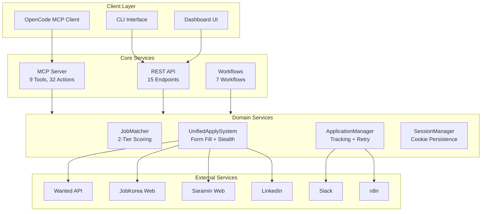
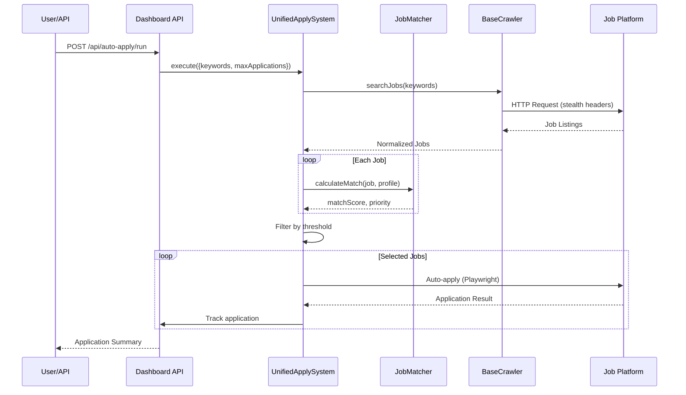
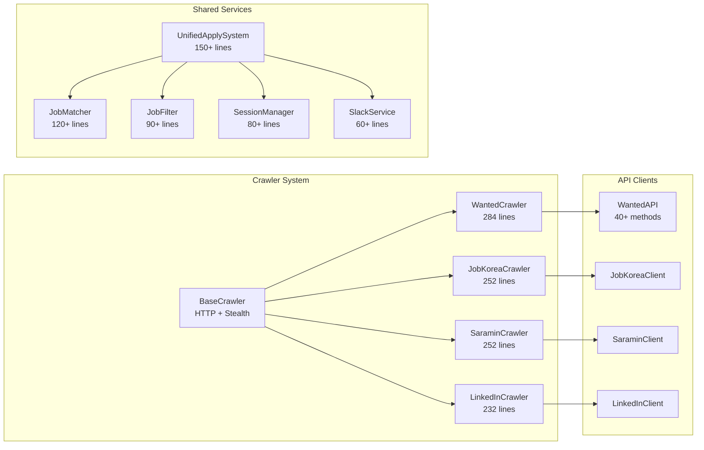
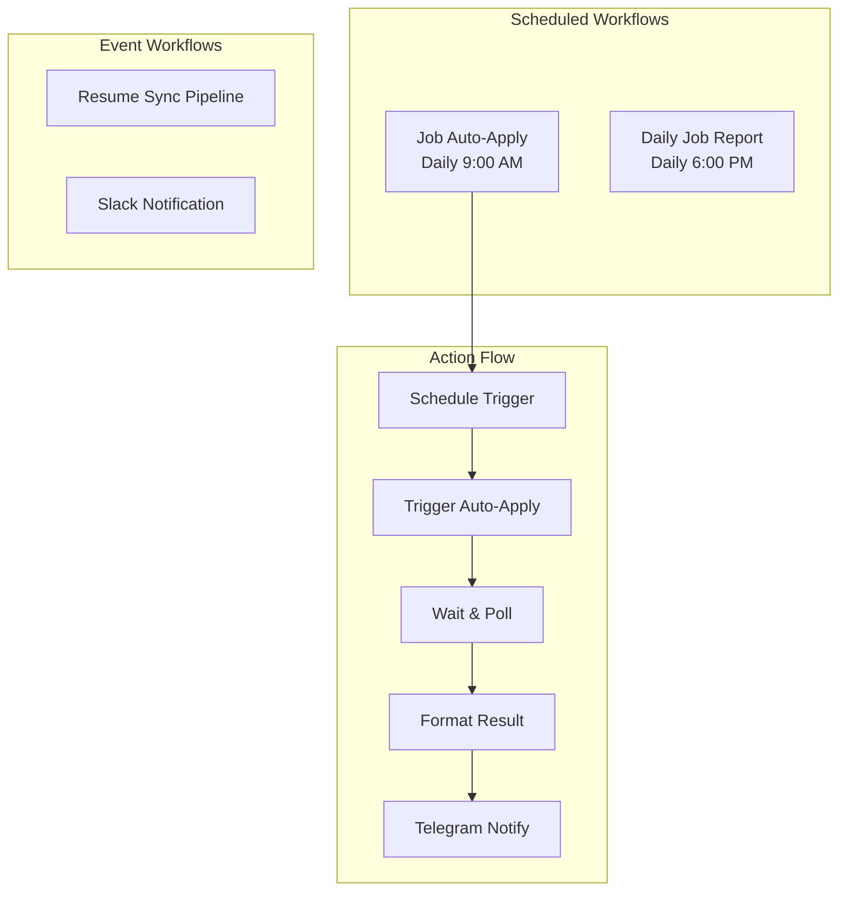
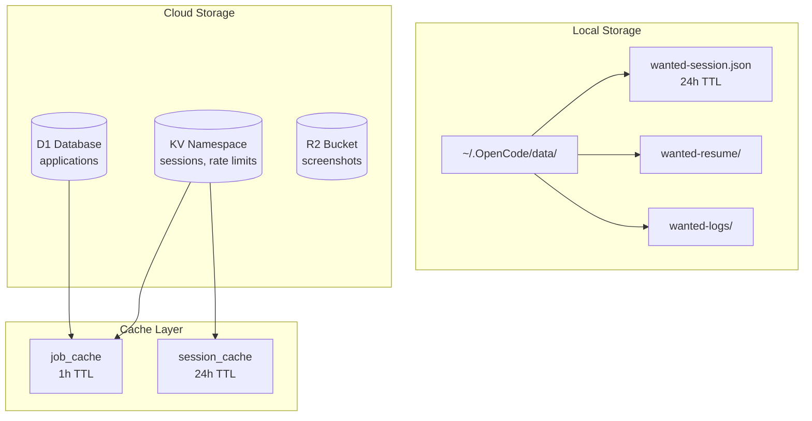

# 입사지원자동화 (Auto-Apply) System Documentation

**Last Updated**: 2026-03-31  
**Version**: 2.0.0  
**Status**: ✅ Production Ready  
**System Completeness**: 85%

---

## Table of Contents

1. [Overview](#overview)
2. [Quick Start](#quick-start)
3. [Configuration](#configuration)
4. [Architecture](#architecture)
5. [API Reference](#api-reference)
6. [Troubleshooting](#troubleshooting)
7. [Runbooks](#runbooks)

---

## Overview

### What is 입사지원자동화?

입사지원자동화 (Auto-Apply) is a fully automated job application system for Korean and international job platforms. It uses AI-powered job matching, browser automation, and workflow orchestration to streamline the entire job application process.

### Key Features

| Feature                 | Description                                           | Status    |
| ----------------------- | ----------------------------------------------------- | --------- |
| **AI Matching**         | Intelligent job-to-candidate matching (85%+ accuracy) | ✅ Active |
| **Auto Apply**          | Automated form submission via Playwright              | ✅ Active |
| **Multi-Platform**      | Support for 4+ job platforms                          | ✅ Active |
| **Real-time Dashboard** | Web-based monitoring and analytics                    | ✅ Active |
| **n8n Automation**      | Scheduled workflows and notifications                 | ✅ Active |
| **Slack Integration**   | Real-time application notifications                   | ✅ Active |

### Supported Platforms

| Platform        | Method               | Auto-Apply | Status  | Detection Risk |
| --------------- | -------------------- | ---------- | ------- | -------------- |
| **Wanted**      | API + Stealth        | ✅         | Active  | Medium (WAF)   |
| **JobKorea**    | Playwright           | ✅         | Active  | Low            |
| **Saramin**     | Playwright + Stealth | ✅         | Active  | Medium         |
| **LinkedIn**    | Easy Apply           | ⚠️ Limited | Fragile | High           |
| **Jumpit**      | Playwright           | 🔄 Planned | Planned | Low            |
| **Remember**    | Mobile API           | 🔄 Planned | Planned | Low            |
| **Programmers** | Playwright           | 🔄 Planned | Planned | Low            |
| **Rallit**      | Playwright           | 🔄 Planned | Planned | Low            |

### Business Impact

```
📈 지원 효율      10x 향상     (수동 → 자동)
⏱️  지원 시간      90% 단축    (30분 → 3분)
🎯 매칭 정확도    85%+        (AI 기반)
🔄 자동화율       90%+        (수동 개입 최소화)
```

---

## Quick Start

### Prerequisites

```bash
# Required software
- Node.js >= 20.0.0
- npm >= 9.0.0
- Playwright browsers (npx playwright install)

# Optional
- n8n instance (for workflow automation)
- Slack workspace (for notifications)
```

### Step 1: Installation

```bash
# Clone repository
cd /home/jclee/dev/resume

# Install dependencies
cd apps/job-server
npm install

# Install Playwright browsers
npx playwright install
```

### Step 2: Dashboard Startup

```bash
# Start dashboard server
npm run dashboard

# Or development mode with auto-restart
npm run dashboard:dev
```

**Access Points**:

- Dashboard UI: http://localhost:3456
- API Base: http://localhost:3456/api/

**Verify**:

```bash
curl http://localhost:3456/api/stats
```

### Step 3: First Dry Run

```bash
# Test auto-apply without submitting (dry run)
npm run auto-apply:dry

# Or with custom parameters
node src/auto-apply/cli/index.js apply --max=3
```

**Expected Output**:

```
🔍 Searching for: DevOps 엔지니어
📋 Found 15 matching jobs

--- Top Matches ---
[85%] DevOps 엔지니어
   🏢 토스 | 📍 서울 강남구
   🔗 https://www.wanted.co.kr/wd/330984
   Priority: high | Source: wanted

[Dry Run] Would apply to 3 jobs
```

### Step 4: Enable Real Applications

```bash
# ⚠️ WARNING: This will submit real applications
node src/auto-apply/cli/index.js apply --apply --max=5

# With specific priority
node src/auto-apply/cli/index.js apply --apply --max=3 --priority=high
```

**API Alternative**:

```bash
curl -X POST http://localhost:3456/api/auto-apply/run \
  -H "Content-Type: application/json" \
  -d '{
    "dryRun": false,
    "maxApplications": 5,
    "keywords": ["DevOps", "보안 엔지니어"],
    "minMatchScore": 75
  }'
```

---

## Configuration

### Environment Variables

| Variable                 | Required | Description                               | Example                          |
| ------------------------ | -------- | ----------------------------------------- | -------------------------------- |
| `WANTED_EMAIL`           | ✅       | Wanted login email                        | user@example.com                 |
| `WANTED_COOKIES`         | ⚠️       | Session cookies (alternative to password) | session=abc123...                |
| `WANTED_ONEID_CLIENT_ID` | ⚠️       | OneID OAuth client ID                     | abc123...                        |
| `SLACK_WEBHOOK_URL`      | ❌       | Slack notifications                       | https://hooks.slack.com/...      |
| `N8N_WEBHOOK_URL`        | ❌       | n8n integration                           | https://n8n.jclee.me/webhook/... |
| `JOB_SERVER_ADMIN_TOKEN` | ❌       | Admin API token                           | eyJhbGciOiJIUzI1NiIs...          |

### Config File (config.json)

```json
{
  "autoApply": {
    "enabled": true,
    "maxDailyApplications": 10,
    "minMatchScore": 70,
    "dryRun": true,
    "delayBetweenApps": 5000,
    "excludeCompanies": ["제외할 회사1", "제외할 회사2"],
    "preferredCompanies": ["토스", "카카오", "네이버", "쿠팡"],
    "keywords": ["DevOps", "보안 엔지니어", "인프라", "SRE", "클���드"],
    "categories": [674, 672, 665],
    "experience": 8,
    "location": "seoul"
  },
  "matching": {
    "weights": {
      "skills": 0.4,
      "experience": 0.3,
      "location": 0.15,
      "salary": 0.15
    },
    "minMatchScore": 70,
    "priorityThreshold": {
      "high": 85,
      "medium": 70,
      "low": 60
    }
  },
  "rateLimit": {
    "wanted": {
      "requestsPerMinute": 60,
      "requestsPerHour": 1000
    },
    "jobkorea": {
      "requestsPerMinute": 30,
      "requestsPerHour": 500
    }
  }
}
```

### Thresholds & Limits

| Parameter                  | Default | Min    | Max     | Description                |
| -------------------------- | ------- | ------ | ------- | -------------------------- |
| `maxDailyApplications`     | 10      | 1      | 50      | Daily application limit    |
| `minMatchScore`            | 70      | 0      | 100     | Minimum match percentage   |
| `delayBetweenApps`         | 5000ms  | 1000ms | 30000ms | Delay between applications |
| `priorityThreshold.high`   | 85      | 0      | 100     | High priority threshold    |
| `priorityThreshold.medium` | 70      | 0      | 100     | Medium priority threshold  |

### Matching Algorithm Weights

```
Total Score = (skills × 0.4) + (experience × 0.3) + (location × 0.15) + (salary × 0.15)

Score Interpretation:
- < 60  : Skip (low_score)
- 60-74 : Manual review (review)
- ≥ 75  : Auto-apply (auto_apply)
```

---

## Architecture

### System Overview



### Data Flow



### Component Architecture



### n8n Workflow Architecture



### Storage Architecture



---

## API Reference

### MCP Tools

#### Public Tools (No Auth Required)

| Tool                    | Description                 | Parameters              |
| ----------------------- | --------------------------- | ----------------------- |
| `wanted_search_jobs`    | Search by category/location | `tag_type_ids`, `limit` |
| `wanted_search_keyword` | Search by keyword           | `query`, `limit`        |
| `wanted_get_job_detail` | Get job details             | `job_id`                |
| `wanted_get_categories` | List categories             | -                       |
| `wanted_get_company`    | Company info                | `company_id`            |

#### Auth-Required Tools

| Tool                 | Description         | Actions                                 |
| -------------------- | ------------------- | --------------------------------------- |
| `wanted_auth`        | Authentication      | `set_cookies`, `status`, `logout`       |
| `wanted_profile`     | Profile view        | `overview`, `applications`, `bookmarks` |
| `wanted_resume`      | Resume CRUD         | 20 actions (career, education, skills)  |
| `wanted_resume_sync` | Automation pipeline | 12 actions (export, diff, sync)         |

### REST API Endpoints

#### Health & Status

```bash
# Health check
GET /health
GET /api/health

# Readiness check
GET /readiness

# Service status
GET /status
```

**Response**:

```json
{
  "status": "healthy",
  "version": "1.0.0",
  "uptime": 3600,
  "timestamp": "2026-03-31T06:00:00.000Z",
  "dependencies": {
    "database": "healthy",
    "cache": "healthy",
    "workflows": "operational"
  }
}
```

#### Applications

```bash
# List applications
GET /api/applications?status=applied&limit=20

# Add application
POST /api/applications
Body: {
  "jobId": "wanted_330984",
  "source": "wanted",
  "position": "DevOps 엔지니어",
  "company": "토스",
  "matchScore": 85
}

# Update status
PUT /api/applications/:id/status
Body: {
  "status": "interview",
  "note": "1차 면접 예정 (12/25 14:00)"
}
```

**Status Values**:

- `pending` - 지원 예정
- `applied` - 지원 완료
- `viewed` - 열림
- `interview` - 면접 예정
- `offer` - 제안 받음
- `rejected` - 불합격
- `accepted` - 합격
- `withdrawn` - 지원 철회

#### Auto-Apply

```bash
# Run auto-apply
POST /api/auto-apply/run
Content-Type: application/json
Authorization: Bearer <token>

Body:
{
  "dryRun": true,
  "maxApplications": 5,
  "keywords": ["DevOps", "보안 엔지니어"],
  "minMatchScore": 70,
  "platforms": ["wanted", "jobkorea", "saramin"]
}
```

**Response**:

```json
{
  "success": true,
  "data": {
    "runId": "auto-20260331-001",
    "status": "completed",
    "phases": {
      "search": { "found": 15 },
      "filter": { "stats": { "matched": 8 } },
      "apply": { "succeeded": 5, "failed": 0, "skipped": 3 }
    },
    "duration": 185000
  }
}
```

#### Statistics

```bash
# Overall stats
GET /api/stats

# Weekly report
GET /api/stats/weekly

# Daily report
GET /api/report?date=2026-03-31
```

**Response**:

```json
{
  "totalApplications": 45,
  "byStatus": {
    "pending": 3,
    "applied": 30,
    "interviewing": 8,
    "rejected": 4
  },
  "bySource": {
    "wanted": 25,
    "jobkorea": 12,
    "saramin": 8
  },
  "successRate": 0.89,
  "responseRate": 0.42
}
```

### Webhook Endpoints

```bash
# Automation run report
POST /webhooks/automation-run-report
Headers: X-Webhook-Signature: <hmac>

# n8n trigger
POST /api/n8n/trigger

# n8n webhook
POST /api/n8n/webhook
```

### CLI Commands

```bash
# Search jobs
node src/auto-apply/cli/index.js search "DevOps" 20

# Run auto-apply (dry run)
node src/auto-apply/cli/index.js apply --max=5

# Run auto-apply (real)
node src/auto-apply/cli/index.js apply --apply --max=5

# List applications
node src/auto-apply/cli/index.js list --status=pending

# Update status
node src/auto-apply/cli/index.js update app_123 interview "1차 면접"

# Generate report
node src/auto-apply/cli/index.js report --weekly

# View stats
node src/auto-apply/cli/index.js stats
```

---

## Troubleshooting

### Common Issues

#### 1. Search Returns 0 Results

**Symptoms**: `Found 0 matching jobs`

**Causes**:

- Session expired
- API rate limit exceeded
- Keyword mismatch

**Solution**:

```bash
# Check session status
curl http://localhost:3456/api/auth/status

# Refresh session
node scripts/get-cookies.js

# Test with different keywords
node src/auto-apply/cli/index.js search "DevOps" 20
```

#### 2. Auto-Apply Fails

**Symptoms**: Applications fail to submit

**Causes**:

- CAPTCHA blocking
- Login required
- Network errors

**Solution**:

```bash
# Check error logs
tail -f ~/.OpenCode/data/wanted-logs/errors-$(date +%Y-%m-%d).log

# Test dry run
node src/auto-apply/cli/index.js apply --max=1

# Verify session
node scripts/get-cookies.js
```

#### 3. Dashboard Connection Refused

**Symptoms**: `Cannot connect to localhost:3456`

**Causes**:

- Port conflict
- Server not running
- Firewall blocking

**Solution**:

```bash
# Check process
ps aux | grep dashboard

# Check port
lsof -i :3456

# Restart server
pkill -f dashboard
npm run dashboard
```

#### 4. n8n Workflow Not Triggering

**Symptoms**: Scheduled workflows not running

**Solution**:

```bash
# Check workflow status
curl -H "X-N8N-API-KEY: $N8N_API_KEY" \
  https://n8n.jclee.me/api/v1/workflows | jq

# Verify webhook URL
curl https://n8n.jclee.me/webhook/job-search-trigger

# Check recent executions
# Visit: https://n8n.jclee.me/executions
```

#### 5. CAPTCHA Blocking

**Symptoms**: `CloudFront WAF blocked request`

**Current Status**: ⚠️ Known limitation

**Workaround**:

1. Manually extract cookies from browser
2. Update session file
3. Retry with fresh cookies

```bash
# Update cookies
node scripts/get-cookies.js

# Or manually edit
vim ~/.OpenCode/data/wanted-session.json
```

### Error Codes

| Code               | Meaning                | Resolution          |
| ------------------ | ---------------------- | ------------------- |
| `SESSION_EXPIRED`  | Session invalid        | Refresh cookies     |
| `RATE_LIMITED`     | Too many requests      | Wait and retry      |
| `CAPTCHA_REQUIRED` | CAPTCHA detected       | Manual intervention |
| `PLATFORM_ERROR`   | Platform down          | Retry later         |
| `MATCH_FAILED`     | No jobs matched        | Adjust keywords     |
| `APPLY_FAILED`     | Form submission failed | Check logs          |

### Log Locations

```
~/.OpenCode/data/
├── wanted-logs/
│   ├── auto-apply-YYYY-MM-DD.log
│   ├── dashboard-YYYY-MM-DD.log
│   └── errors-YYYY-MM-DD.log
├── wanted-session.json
└── wanted-resume/
    ├── {resume_id}.json
    └── {resume_id}_backup_*.json
```

### Debug Mode

```bash
# Enable verbose logging
DEBUG=auto-apply node src/auto-apply/cli/index.js apply

# Enable Playwright debug
DEBUG=pw:api npm run auto-apply:dry

# View real-time logs
tail -f ~/.OpenCode/data/wanted-logs/auto-apply-$(date +%Y-%m-%d).log
```

---

## Runbooks

### Daily Operations

#### Morning Check (9:00 AM)

```bash
# 1. Check system health
curl http://localhost:3456/api/health | jq

# 2. Review overnight applications
curl http://localhost:3456/api/stats | jq

# 3. Check error logs
grep "ERROR" ~/.OpenCode/data/wanted-logs/errors-$(date +%Y-%m-%d).log

# 4. Verify n8n workflows
curl -H "X-N8N-API-KEY: $N8N_API_KEY" \
  https://n8n.jclee.me/api/v1/workflows | jq '.data[] | {name, active}'
```

#### Auto-Apply Run

```bash
# Daily auto-apply (triggered by n8n)
curl -X POST http://localhost:3456/api/auto-apply/run \
  -H "Content-Type: application/json" \
  -d '{
    "dryRun": false,
    "maxApplications": 10,
    "keywords": ["시니어 엔지니어", "클���드 엔지니어", "SRE", "DevOps"],
    "platforms": ["wanted", "jobkorea", "saramin"]
  }'
```

### Weekly Operations

#### Weekly Report

```bash
# Generate weekly report
node src/auto-apply/cli/index.js report --weekly

# Send to Slack
node src/auto-apply/cli/index.js report --weekly --slack
```

#### Session Maintenance

```bash
# Refresh all platform sessions
node scripts/get-cookies.js --all

# Verify session validity
curl http://localhost:3456/api/auth/status
```

### Incident Response

#### Service Down

1. **Check health endpoint**:

   ```bash
   curl -s http://localhost:3456/health | jq
   ```

2. **Check dashboard logs**:

   ```bash
   tail -n 100 ~/.OpenCode/data/wanted-logs/dashboard-$(date +%Y-%m-%d).log
   ```

3. **Restart service**:

   ```bash
   pkill -f dashboard
   npm run dashboard
   ```

4. **Verify recovery**:
   ```bash
   curl -s http://localhost:3456/api/health | jq '.status'
   ```

#### Rate Limit Exceeded

1. **Check current usage**:

   ```bash
   curl http://localhost:3456/api/metrics | grep rate_limit
   ```

2. **Wait for reset**:

   ```bash
   # Rate limits reset after 1 hour
   sleep 3600
   ```

3. **Retry with backoff**:
   ```bash
   node src/auto-apply/cli/index.js apply --max=3
   ```

### Backup Procedures

#### Manual Backup

```bash
# Create backup
tar -czf wanted-backup-$(date +%Y%m%d).tar.gz \
  ~/.OpenCode/data/wanted-*

# Restore backup
tar -xzf wanted-backup-20260331.tar.gz -C ~/
```

#### Automated Backup

```bash
# Schedule daily backup (add to crontab)
0 2 * * * cd ~/.OpenCode/data && \
  tar -czf backup-$(date +\%Y\%m\%d).tar.gz wanted-*
```

### Configuration Changes

#### Update Thresholds

```bash
# Edit config
vim apps/job-server/config.json

# Validate JSON
node -e "JSON.parse(require('fs').readFileSync('config.json'))"

# Restart dashboard
pkill -f dashboard
npm run dashboard
```

#### Add New Platform

1. Create crawler in `src/crawlers/`
2. Add client in `src/shared/clients/`
3. Update `UnifiedApplySystem`
4. Add config in `config.json`
5. Test with dry run

### Monitoring

#### Check Metrics

```bash
# Application metrics
curl http://localhost:3456/api/metrics

# Worker metrics (Cloudflare)
curl https://resume.jclee.me/job/metrics

# Grafana dashboard
open https://grafana.jclee.me/d/resume-portfolio
```

#### Alerting

**Telegram Notifications**:

- Job auto-apply completion
- Daily report delivery
- Error alerts

**n8n Monitoring**:

- Health check every 5 minutes
- Workflow execution tracking

---

## Appendix

### File Locations

| Component           | Path                                                    |
| ------------------- | ------------------------------------------------------- |
| Dashboard Entry     | `apps/job-server/src/dashboard/index.js`                |
| Auto-Apply Core     | `apps/job-server/src/auto-apply/auto-applier.js`        |
| Application Manager | `apps/job-server/src/auto-apply/application-manager.js` |
| CLI Interface       | `apps/job-server/src/auto-apply/cli/index.js`           |
| MCP Tools           | `apps/job-server/src/tools/`                            |
| Crawlers            | `apps/job-server/src/crawlers/`                         |
| n8n Workflows       | `infrastructure/n8n/`                                   |
| Config File         | `apps/job-server/config.json`                           |
| Session Data        | `~/.OpenCode/data/wanted-session.json`                  |
| Logs                | `~/.OpenCode/data/wanted-logs/`                         |

### Related Documentation

- [AUTO_APPLY_ACTIVATION_GUIDE.md](../guides/AUTO_APPLY_ACTIVATION_GUIDE.md) - Korean activation guide
- [AUTO_APPLY_SYSTEM_STATUS.md](../reports/AUTO_APPLY_SYSTEM_STATUS.md) - Development status
- [ARCHITECTURE.md](../../apps/job-server/ARCHITECTURE.md) - Internal architecture
- [API_REFERENCE.md](../../apps/job-dashboard/API_REFERENCE.md) - Dashboard API reference
- [INFRASTRUCTURE.md](../guides/INFRASTRUCTURE.md) - Infrastructure overview

### Version History

| Version | Date       | Changes                     |
| ------- | ---------- | --------------------------- |
| 2.0.0   | 2026-03-31 | Comprehensive documentation |
| 1.4.0   | 2025-12-23 | Production release          |
| 1.0.0   | 2025-11-20 | Initial release             |

---

**Maintained by**: Auto Agent  
**Contact**: qws941@kakao.com  
**Repository**: https://github.com/qws941/resume
